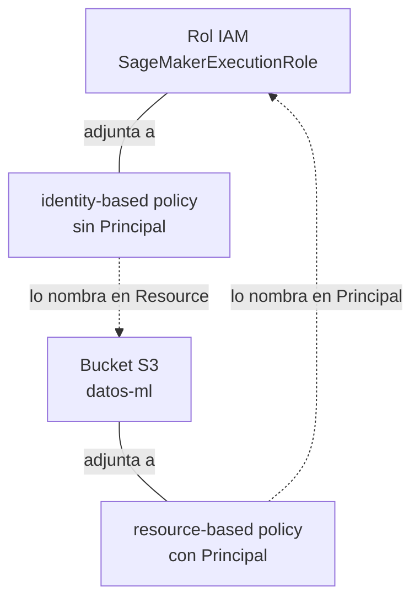
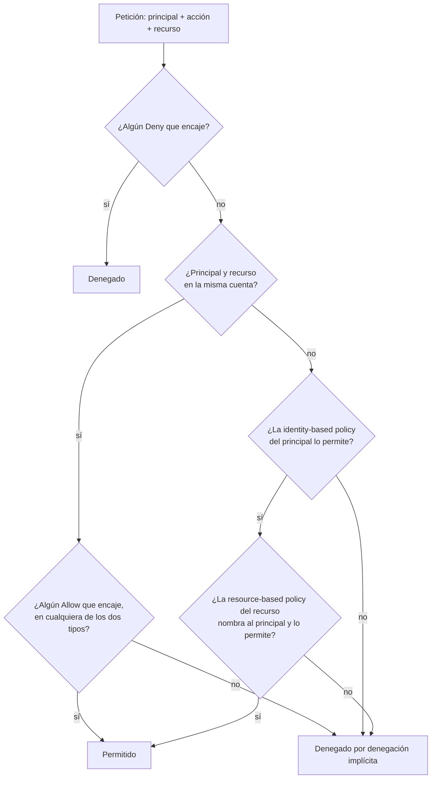

# Recursos, ARN, principals, acciones y policies en AWS

Hay cinco palabras que aparecen en casi todos los mensajes de error de AWS, en
casi todas las preguntas del MLA-C01 y en la primera línea de casi toda
documentación: _recurso_, _ARN_, _principal_, _acción_ y _policy_. Son cinco
piezas de un único mecanismo, y el mecanismo se entiende de una sentada si se
recorren en ese orden, porque cada una se define con las anteriores. El
objetivo de la nota es que al terminarla el mensaje de error más común de la
plataforma, `AccessDenied`, deje de ser un muro opaco y pase a ser una frase
con sujeto, verbo y complemento.

## 1. Un recurso es algo que un servicio creó y que tu cuenta posee

Un **recurso** es una entidad concreta que vive dentro de un servicio de AWS,
que fue creada en algún momento, que pertenece a una cuenta y que se puede
nombrar, listar, modificar y destruir por separado de las demás. Un _bucket_ de
S3 es un recurso. Una instancia de EC2 es un recurso. Un _training job_ de
SageMaker es un recurso. Un modelo registrado, un _endpoint_ de inferencia y
cada uno de los objetos que forman un dataset también lo son.

La definición se apoya en tres palabras que conviene desmontar antes de seguir,
porque son el suelo sobre el que está construido todo lo demás.

**Un servicio.** AWS no es un producto: es un catálogo de unos doscientos
productos independientes que comparten facturación, autenticación y poco más.
S3 guarda archivos, EC2 alquila máquinas virtuales, SageMaker entrena y sirve
modelos de machine learning. Cada uno de ellos tiene su propio equipo, su
propio ritmo de versiones y, lo que aquí importa, **su propia API HTTP**: un
conjunto cerrado de operaciones con nombre, cada una con sus parámetros y su
respuesta. Todo lo que ocurre en AWS ocurre porque alguien llamó a una
operación de la API de algún servicio. Cuando abres la **consola** —la interfaz
web de AWS, `console.aws.amazon.com`, donde se hacen clics— no estás haciendo
otra cosa: la consola es un cliente más que traduce tus clics en llamadas a
esas mismas APIs. Esta observación parece trivial y no lo es; es la razón de
que lo que aprendas aquí sirva igual desde la web que desde un script.

Cada servicio tiene además un nombre corto e invariable —S3 es `s3`, EC2 es
`ec2`, SageMaker es `sagemaker`— que es como se le nombra en cualquier sitio
donde haga falta identificarlo por escrito.

**Una cuenta.** Una **cuenta de AWS** es la unidad de propiedad y de
facturación: un contenedor con un identificador numérico de doce dígitos, por
ejemplo `123456789012`. Todo recurso pertenece a exactamente una cuenta, y esa
cuenta es la que paga por él. Una empresa suele tener varias cuentas —una para
desarrollo, otra para producción, otra para el equipo de datos— precisamente
porque la cuenta es la frontera dura: por defecto, nada de una cuenta es
visible desde otra.

**Una región.** AWS opera centros de datos agrupados en **regiones**
geográficas, cada una con un código: `us-east-1` (Virginia del Norte),
`us-west-2` (Oregón), `eu-west-1` (Irlanda), `eu-central-1` (Fráncfort). La
mayoría de los servicios son **regionales**, y esto tiene una consecuencia que
sorprende la primera vez: un recurso creado en `us-east-1` sencillamente no
existe para el mismo servicio en `eu-west-1`. Si entrenas un modelo en Irlanda
y luego buscas el _training job_ con la región de la consola puesta en
Virginia, la lista sale vacía y no hay ningún error: estás preguntando en otro
sitio. Unos pocos servicios son **globales**: no tienen regiones en absoluto, y
sus recursos existen por igual para toda la cuenta.

### Tipos de recurso

Cada servicio no define «recursos» a secas, sino **tipos de recurso**, y esa
lista es fija y está documentada. S3 tiene dos que importan: `bucket` —un
contenedor con nombre, la caja donde se guardan los archivos— y `object` —cada
archivo concreto dentro de un _bucket_, identificado por su _key_, que es la
ruta completa dentro de la caja—. SageMaker tiene bastantes más:
`training-job`, `processing-job`, `model`, `endpoint-config`, `endpoint`,
`notebook-instance`, `domain`. EC2 tiene `instance`, `volume`, `security-group`
y una lista larga.

La granularidad de recursos determina el nivel al que muchas capacidades de AWS,
especialmente autorización IAM, pueden dirigirse explícitamente. En S3, un objeto es un
recurso independiente del bucket, por lo que podemos identificar y autorizar operaciones
sobre un objeto concreto dentro de un dataset formado por millones de objetos.

### Qué no es un recurso

Una llamada a la API no es un recurso: es un evento, ocurre y se acaba. El
contenido de un objeto de S3 tampoco lo es; el recurso es el objeto, y sus
_bytes_ son su contenido. Una región no es un recurso, ni una cuenta: son
coordenadas, no cosas.

La distinción se vuelve concreta en cuanto uno mira una tarea de machine
learning típica. Los datos crudos en S3 son miles de objetos, cada uno un
recurso. El trabajo que los procesa es un `processing-job`, un recurso, que
nace, corre y muere dejando más objetos detrás. El entrenamiento es un
`training-job`, otro recurso, que deja un artefacto de modelo —de nuevo, un
objeto en S3—. El despliegue produce un `model`, un `endpoint-config` y un
`endpoint`, tres recursos distintos aunque coloquialmente se hable de «subir el
modelo». Y esa multiplicidad no es burocracia: el `endpoint` es el único de los
tres que cuesta dinero mientras existe, y el único que hay que acordarse de
apagar.

## 2. El ARN, el nombre completo de un recurso

Llamar a un _bucket_ `datos-ml` basta mientras uno esté dentro de S3, dentro de
una sola cuenta y hablando con una sola persona. En cuanto se sale de ahí, el
nombre se vuelve ambiguo: no dice de qué servicio es, ni de qué cuenta, ni de
qué región. Dos cuentas distintas pueden tener sendos _training jobs_ llamados
`xgb-churn`, y son recursos completamente diferentes. AWS necesita, y usa en
todas partes, un nombre que no dependa del contexto.

Ese nombre es el **ARN**, _Amazon Resource Name_. Es una cadena de texto con
campos separados por dos puntos, y adopta una de estas tres formas:

```
arn:partition:service:region:account-id:resource-id
arn:partition:service:region:account-id:resource-type/resource-id
arn:partition:service:region:account-id:resource-type:resource-id
```

El primer campo es siempre la palabra literal `arn`, que es cómo se reconoce la
cadena a simple vista.

La **partición** es un grupo grande de regiones que forma un universo cerrado.
Solo hay tres valores: `aws` para las regiones comerciales normales, `aws-cn`
para China y `aws-us-gov` para GovCloud, la nube aislada para organismos del
gobierno estadounidense. Cada cuenta pertenece a una sola partición, y en la
práctica el campo vale `aws` siempre; existe para que los ARN no colisionen
entre universos que no se hablan entre sí.

El **service** es el nombre corto del servicio de la sección anterior: `s3`,
`ec2`, `sagemaker`. La **region** es el código de región, y el **account-id**
son los doce dígitos de la cuenta propietaria, sin guiones.

El último campo identifica el recurso dentro de su servicio, y es donde
aparecen las tres variantes. A veces es solo un identificador; a veces es el
tipo de recurso y el identificador separados por una barra; a veces separados
por dos puntos. **No hay regla que prediga cuál usa cada servicio**: es
histórico, cada equipo decidió por su cuenta, y lo único razonable es
consultarlo. Lo que sí es regular es que dentro de un mismo servicio la forma
no cambia.

Algunos ARN reales:

```
arn:aws:s3:::datos-ml
arn:aws:s3:::datos-ml/crudos/2026/train.parquet
arn:aws:sagemaker:us-east-1:123456789012:training-job/xgb-churn-2026-09-14
arn:aws:sagemaker:us-east-1:123456789012:model/xgb-churn-v3
arn:aws:sagemaker:us-east-1:123456789012:endpoint/churn-prod
arn:aws:ec2:us-east-1:123456789012:instance/i-0abc123def4567890
```

Los dos primeros llaman la atención: tienen tres pares de dos puntos seguidos,
`s3:::`, porque los campos de región y de cuenta están **vacíos**. No es un
error tipográfico ni una abreviatura. Los nombres de _bucket_ de S3 son únicos
en todo el mundo, a través de todas las cuentas de AWS y de todas las regiones:
si alguien ya tiene un _bucket_ llamado `datos`, nadie más puede crear otro con
ese nombre, y por eso mucha gente antepone el nombre de su empresa. Esa
unicidad global es exactamente lo que hace innecesarios los dos campos: dado el
nombre, el _bucket_ ya está determinado. El principio es general: **un campo se
queda vacío cuando no aporta información para identificar el recurso**.

La otra cosa que merece atención es la pareja

```
arn:aws:s3:::datos-ml
arn:aws:s3:::datos-ml/*
```

que se parecen mucho y **designan cosas distintas**. El primero es el _bucket_:
un recurso de tipo `bucket`. El segundo, con la barra y el asterisco, designa
todos los objetos que hay dentro: recursos de tipo `object`. La caja no son las
cosas que hay en la caja. Es la confusión más productiva de errores de toda la
plataforma, y conviene fijarla ahora: el contenedor y su contenido son recursos
de tipos distintos y se nombran con ARN distintos.

El asterisco de ese ejemplo es un **comodín**, y funciona en cualquier parte de
un ARN: `*` sustituye a cualquier secuencia de caracteres y `?` a un carácter
suelto. Así, `arn:aws:sagemaker:us-east-1:123456789012:training-job/xgb-*`
designa todos los _training jobs_ de esa cuenta y esa región cuyo nombre
empiece por `xgb-`, que es una forma económica de hablar de una familia entera
de recursos que aún no existen: el comodín se evalúa cuando se usa, no cuando
se escribe.

En la práctica casi nunca se escribe un ARN de memoria. Las APIs los devuelven
al crear un recurso —la respuesta a «crea este _training job_» incluye su ARN—,
la consola los muestra en la página de detalle de cada recurso, y de ahí se
copian. Lo que sí hay que saber leer es un ARN ajeno, porque un ARN cuenta de
un vistazo en qué servicio, en qué cuenta y en qué región está lo que sea que
estás mirando.

## 3. El principal, quien hace la llamada

Si toda operación en AWS es una llamada a la API de un servicio, toda llamada
tiene un autor. El **principal** es ese autor: la entidad autenticada en cuyo
nombre se hace la petición. Es el sujeto de la frase.

Que el principal esté _autenticado_ es parte de la definición. AWS no atiende
llamadas anónimas salvo en casos muy concretos y deliberados; lo normal es que
cada petición llegue firmada y que el servicio, antes de mirar nada más,
resuelva quién la firmó. Esa resolución es un problema distinto —y anterior— al
de decidir si se le deja hacer lo que pide, y esta nota trata del segundo.

El servicio que guarda las identidades de una cuenta se llama **IAM**, de _AWS
Identity and Access Management_. IAM es uno de los pocos servicios **globales**
de los que hablaba la sección 1: no tiene regiones, y una identidad creada en
IAM existe igual para todas las regiones de la cuenta. Su nombre corto es
`iam`.

### Los tipos de principal

**El usuario raíz.** Cuando se abre una cuenta de AWS se abre con una
identidad: la dirección de correo y la contraseña con las que uno se registró.
Ese es el **usuario raíz** (_root user_), y es la única identidad que puede
hacer absolutamente todo en la cuenta sin excepción, incluido cerrarla. La
recomendación universal —y la respuesta correcta en el examen siempre que
aparezca— es activarle un segundo factor de autenticación, guardar las
credenciales, y no volver a usarlo para el trabajo diario.

**El usuario IAM.** Un **usuario IAM** es una identidad permanente dentro de
una cuenta, con nombre propio, pensada para una persona o para un programa que
vive fuera de AWS. Tiene credenciales de larga duración: una contraseña para
entrar por la consola, y opcionalmente un par de claves de acceso para llamar a
las APIs desde fuera. «De larga duración» significa que valen hasta que alguien
las revoque, y esa es a la vez su comodidad y su problema: una clave filtrada
sigue sirviendo indefinidamente.

**El grupo.** Un **grupo IAM** es una bolsa de usuarios. Existe para no repetir
la misma configuración en cincuenta sitios. Y aquí un detalle que el examen
aprovecha: **un grupo no es un principal**. Nadie llama nunca a una API «como
el grupo de analistas»; las llamadas las hacen los usuarios que están dentro.
El grupo es un mecanismo de agrupación administrativa, no una identidad.

**El rol IAM.** Un **rol** es una identidad de la cuenta, con nombre propio
igual que un usuario, pero **sin credenciales permanentes y sin dueño fijo**.
No pertenece a nadie: existe suelto, y distintas entidades lo **asumen**
temporalmente cuando necesitan actuar con esa identidad. Mientras dura la
asunción, quien lo asumió deja de hablar en su propio nombre y habla en nombre
del rol.

Esta idea es la que más cuesta de AWS y la que más rinde. Su utilidad se ve
mejor al revés, preguntando qué pasa sin ella. Un _training job_ de SageMaker
tiene que leer tus datos de S3 y escribir el artefacto del modelo de vuelta:
corre en una máquina que AWS levanta y destruye por ti, a la que tú no entras.
¿Con qué identidad lee y escribe? La única alternativa a los roles sería que tú
le entregaras a SageMaker unas claves de acceso de un usuario IAM, es decir,
que copiaras credenciales de larga duración a un sitio que no controlas para
que las guarde durante meses. El rol elimina ese intercambio: tú declaras un
rol, SageMaker lo asume durante el tiempo que dura el trabajo y recibe
credenciales que caducan solas. Ese rol concreto —el que SageMaker asume para
trabajar por ti— se llama por convención **execution role**, y es la pieza que
aparece en prácticamente todo lo que se hace con SageMaker.

> **Caja negra.** El mecanismo de asunción —quién puede asumir un rol, cómo se
> pide, qué credenciales temporales se reciben y cuánto duran— tiene su propia
> maquinaria, y aquí solo se usa su contrato: _un rol es una identidad que otra
> entidad puede pasar a encarnar durante un rato_. El cómo es el tema de
> [[Roles de IAM, STS y credenciales temporales]].

**El service principal.** A veces quien llama no es una persona ni una
identidad de tu cuenta, sino **un servicio de AWS actuando como tal**. Estos
principals no se nombran con ARN sino con una cadena con forma de nombre de
dominio: `sagemaker.amazonaws.com`, `s3.amazonaws.com`, `lambda.amazonaws.com`.
No son identidades tuyas y no viven en tu cuenta; son la forma que tiene AWS de
decir «el servicio SageMaker, el producto, con independencia de la cuenta».

**Las identidades federadas.** Una organización que ya tiene su propio
directorio de usuarios —un proveedor de identidad corporativo, o un proveedor
público— puede dejar que sus usuarios actúen en AWS sin crear un usuario IAM
para cada uno. El detalle de cómo se establece esa confianza pertenece a
[[Federación de identidades en AWS]]; lo que importa aquí es que producen
principals igual de legítimos que los demás.

**El principal anónimo.** Existe, se escribe `*` y significa «cualquiera,
incluido quien no se ha autenticado». Es lo que hay detrás de un _bucket_ de S3
que sirve una web pública, y es también la causa de casi todas las noticias
sobre datos expuestos en S3.

### Los principals también son recursos

Un usuario IAM y un rol IAM son cosas que existen dentro de un servicio, que
alguien creó, que pertenecen a una cuenta y que se pueden nombrar, listar,
modificar y destruir por separado. Por la definición de la sección 1, **son
recursos**, y como todo recurso tienen ARN:

```
arn:aws:iam::123456789012:user/ana
arn:aws:iam::123456789012:role/SageMakerExecutionRole
```

Ahí se ve en acto lo de la sección 2. El campo de región está vacío porque IAM
es global, de modo que el código de región no aportaría nada para identificar a
Ana. El de cuenta, en cambio, está lleno, porque los nombres de usuario solo
son únicos dentro de una cuenta: puede haber una `ana` en cada cuenta de la
empresa y son personas distintas.

Que una identidad sea a la vez un principal y un recurso no es un juego de
palabras: significa que puede aparecer como sujeto de una llamada y también
como objeto de otra. Cuando Ana lee un archivo, es el principal. Cuando alguien
la borra, es el recurso.

## 4. La acción, qué se pide hacer

Una **acción** es una de las operaciones que un servicio sabe hacer, nombrada
en el formato fijo `prefijo-del-servicio:NombreDeLaAccion`:

```
s3:GetObject
s3:PutObject
s3:ListBucket
sagemaker:CreateTrainingJob
sagemaker:DescribeTrainingJob
sagemaker:InvokeEndpoint
ec2:StartInstances
iam:CreateRole
```

El prefijo es el nombre corto del servicio de la sección 1, y el nombre de la
acción está en _PascalCase_. Los nombres **no distinguen mayúsculas de
minúsculas**: `iam:ListAccessKeys` y `IAM:listaccesskeys` designan lo mismo.

Lo decisivo es que **el catálogo de acciones de cada servicio es fijo, cerrado
y está documentado**. No se inventan acciones; se eligen de la lista. La lista
vive en la _Service Authorization Reference_ de AWS, que tiene una página por
servicio con todas sus acciones, todos sus tipos de recurso y sus ARN. Es la
página que conviene tener a mano y la fuente de verdad cuando uno duda de si
una acción se llama `DescribeTrainingJob` o `GetTrainingJob`.

Se pueden escribir varias acciones como un array, y admiten comodines con la
misma semántica que en los ARN. `s3:*` son todas las acciones de S3;
`sagemaker:Describe*` son todas las que empiezan por `Describe`; el comodín
puede ir incrustado en medio, y `iam:*AccessKey*` captura `CreateAccessKey`,
`DeleteAccessKey`, `ListAccessKeys` y `UpdateAccessKey` de una vez.

### Las acciones son los nombres de las operaciones de la API

Una acción no es una etiqueta inventada para este mecanismo: **es el nombre de
una operación real de la API del servicio**. `sagemaker:CreateTrainingJob`
nombra la operación `CreateTrainingJob` de la API de SageMaker, la misma que se
ejecuta cuando pulsas el botón de entrenar en la consola. Esta correspondencia
es lo que conecta el vocabulario de esta nota con el trabajo diario, y para
verla hacen falta dos herramientas que todavía no han aparecido.

**La AWS CLI** es un programa de línea de comandos, `aws`, que se instala en tu
máquina y cuya única función es traducir subcomandos en llamadas a las APIs de
AWS. Su forma es siempre `aws <servicio> <operación> --parámetros`, con el
nombre de la operación en minúsculas y con guiones.

**boto3** es la biblioteca oficial de AWS para Python. Se usa creando un
_client_ para un servicio y llamando a sus métodos, que son los nombres de las
operaciones en _snake_case_.

Ambas hablan con la misma API que usa la consola, de modo que la misma
operación tiene cuatro escrituras que solo difieren en la convención
tipográfica:

| Acción IAM                      | Operación de la API   | AWS CLI                               | boto3                            |
| ------------------------------- | --------------------- | ------------------------------------- | -------------------------------- |
| `s3:GetObject`                  | `GetObject`           | `aws s3api get-object`                | `client.get_object()`            |
| `sagemaker:CreateTrainingJob`   | `CreateTrainingJob`   | `aws sagemaker create-training-job`   | `client.create_training_job()`   |
| `sagemaker:DescribeTrainingJob` | `DescribeTrainingJob` | `aws sagemaker describe-training-job` | `client.describe_training_job()` |

La primera fila rompe la forma `aws <servicio> <operación>` que acabo de
enunciar, y conviene saber por qué: la CLI expone S3 dos veces. `aws s3api`
reproduce la API operación por operación, y es la que mantiene la
correspondencia exacta con los nombres de las acciones. `aws s3` es un puñado
de comandos de más alto nivel con aire de shell —`ls`, `cp`, `sync`— que por
dentro encadenan varias operaciones y por tanto no se corresponden con ninguna
acción concreta.

En Python el cliente se obtiene nombrando el servicio:

```python
import boto3

sm = boto3.client("sagemaker", region_name="us-east-1")
respuesta = sm.describe_training_job(TrainingJobName="xgb-churn-2026-09-14")
print(respuesta["TrainingJobArn"])
```

`boto3.client("sagemaker")` devuelve un objeto cuyos métodos se generan a
partir de la descripción de la API, y por eso el método existe con ese nombre
exacto sin que nadie lo haya escrito a mano. `region_name` es explícito aquí
porque SageMaker es regional y el cliente tiene que saber a qué región
preguntar; si se omite, boto3 lo busca en la configuración del entorno.
`TrainingJobArn` en la respuesta es el ARN de la sección 2: las APIs devuelven
ARN, no nombres sueltos.

Este código necesita credenciales para correr, y configurarlas es un tema
propio que vive en [[Credenciales, perfiles y configuración de la AWS CLI y
boto3]]. Aquí solo importa la correspondencia de nombres, que se puede leer sin
ejecutar nada.

La correspondencia tampoco es perfecta, y los tres sitios donde se rompe son
justo los que producen errores difíciles de diagnosticar. El primero: algunos
nombres no coinciden. La acción `s3:ListBucket` corresponde a la operación que
realmente lista objetos, `ListObjectsV2`, y quien busque una acción
`s3:ListObjectsV2` no la encontrará. El segundo: existen **acciones
_permission-only_**, que figuran en el catálogo de un servicio pero no
corresponden a ninguna operación de su API; AWS las publica en una tabla aparte
en la página de cada servicio. El tercero: el prefijo de la acción y el cliente
de la biblioteca no siempre se llaman igual. Para invocar un modelo desplegado,
la acción es `sagemaker:InvokeEndpoint`, pero el cliente de boto3 es
`boto3.client("sagemaker-runtime")` y el comando es `aws sagemaker-runtime
invoke-endpoint`, porque AWS separó la API de inferencia de la API de gestión y
solo la segunda conserva el nombre limpio. En caso de duda, manda la _Service
Authorization Reference_: lo que ahí figure es lo que hay que escribir.

### Cada acción espera un tipo de recurso concreto

Hay un último hecho sobre las acciones que cierra el hilo que quedó abierto en
la sección 2. Cada acción actúa sobre un tipo de recurso determinado, y no
sobre otro:

- `s3:ListBucket` actúa sobre un recurso de tipo `bucket`, y por tanto sobre
  `arn:aws:s3:::datos-ml`;
- `s3:GetObject` y `s3:PutObject` actúan sobre recursos de tipo `object`, y por
  tanto sobre `arn:aws:s3:::datos-ml/*`;
- `sagemaker:CreateTrainingJob` actúa sobre un `training-job`.

La caja y las cosas que hay en la caja aceptan verbos distintos. Listar es algo
que se le hace a un _bucket_; leer es algo que se le hace a un objeto. Nombrar
el ARN equivocado no produce un error de sintaxis en ninguna parte: produce un
`AccessDenied` mucho más tarde, cuando ya nadie está mirando ese archivo.

## 5. La policy, el documento que decide

Ya están los tres términos de la frase. Cada llamada a AWS es un principal que
pide una acción sobre un recurso. Falta quien conteste sí o no.

Una **policy** es un documento JSON que AWS evalúa para decidir si una llamada
concreta se permite o se deniega. No es código: no se ejecuta, no tiene orden,
no tiene bucles. Es una declaración que el servicio consulta cada vez, en cada
petición, antes de hacer nada.

La regla de partida es que **todo está denegado**. Una identidad recién creada
en una cuenta no puede hacer absolutamente nada: ni listar un _bucket_, ni ver
sus propios datos, ni averiguar cómo se llama. A esa negativa por defecto se la
llama **denegación implícita**, y es implícita porque nadie la escribió: es lo
que ocurre cuando ninguna policy dice lo contrario. La única excepción es el
usuario raíz de la sección 3, que no se rige por este mecanismo.

Un documento completo y válido:

```json
{
  "Version": "2012-10-17",
  "Statement": [
    {
      "Sid": "ListarElBucketDeDatos",
      "Effect": "Allow",
      "Action": "s3:ListBucket",
      "Resource": "arn:aws:s3:::datos-ml"
    },
    {
      "Sid": "LeerLosDatosCrudos",
      "Effect": "Allow",
      "Action": ["s3:GetObject"],
      "Resource": "arn:aws:s3:::datos-ml/crudos/*"
    }
  ]
}
```

`"Version": "2012-10-17"` es el primer sitio donde AWS traiciona una
expectativa razonable. **No es la versión de este documento.** Es la versión
del _lenguaje_ en que está escrito, y solo admite dos valores: `2012-10-17`, el
actual, y `2008-10-17`, el antiguo, que solo aparece en documentos viejos y que
no debe usarse porque le faltan características del lenguaje. El campo es
técnicamente opcional, pero omitirlo equivale a quedarse en el comportamiento
antiguo, así que en la práctica se escribe siempre y siempre con el mismo
valor. Conviene fijar la fecha en la memoria tal cual, porque es literalmente
la misma cadena en todas las policies del planeta.

`"Statement"` es lo único obligatorio, y contiene un array de **statements**.
Cada _statement_ es una regla autónoma y se evalúa por separado; el orden en
que están escritos no significa nada, y el conjunto se comporta como un
conjunto, no como una secuencia. Un documento con un solo _statement_ puede
escribir el objeto directamente en lugar del array, pero usar siempre el array
ahorra tener que reescribirlo al añadir el segundo.

`"Sid"` es una etiqueta opcional, texto libre, que existe únicamente para que
un humano sepa qué pretendía ese _statement_. No cambia nada del
comportamiento. Vale la pena escribirlos: un documento de doce reglas sin
etiquetas es ilegible seis meses después.

`"Effect"` es obligatorio y solo admite `"Allow"` o `"Deny"`, escritos
exactamente así. Es el veredicto que propone el _statement_ cuando encaja.

`"Action"` y `"Resource"` son la acción de la sección 4 y el ARN de la sección 2. Ambos aceptan un valor suelto o un array, y ambos aceptan comodines.

Y aquí está el motivo de que este documento tenga **dos** _statements_ para lo
que coloquialmente es «leer los datos». El primero concede `s3:ListBucket`
sobre `arn:aws:s3:::datos-ml`, sin barra; el segundo concede `s3:GetObject`
sobre `arn:aws:s3:::datos-ml/crudos/*`, con barra. Es exactamente la
correspondencia entre verbos y tipos de recurso de la sección anterior: listar
se le hace al _bucket_, leer se le hace a los objetos, y como cada acción
espera un tipo de recurso distinto, cada una necesita su propio ARN y por tanto
su propio _statement_.

Merece la pena ver qué se rompe al equivocarse, porque los dos fallos son
silenciosos y opuestos. Si se escribe `"Resource": "arn:aws:s3:::datos-ml"`
junto a `s3:GetObject`, el _statement_ no encaja nunca con ninguna lectura real
—las lecturas son sobre objetos, no sobre el _bucket_— y toda descarga muere
con `AccessDenied`, sin ninguna pista de que el problema esté en una barra. Si
se escribe `"Resource": "arn:aws:s3:::datos-ml/*"` junto a `s3:ListBucket`, lo
que falla es el listado: un `aws s3 ls` que vuelve vacío o un error al recorrer
el contenido del _bucket_, mientras que descargar un archivo cuyo nombre ya se
conoce sigue funcionando perfectamente. Ese segundo caso es el peor de los dos,
porque produce un sistema que funciona a medias y una hipótesis equivocada
sobre la causa.

### La condición

Un _statement_ puede además exigir que se cumplan condiciones sobre el contexto
de la petición, y no solo sobre quién, qué y sobre qué:

```json
{
  "Sid": "LeerSoloDesdeLaRedDeLaOficina",
  "Effect": "Allow",
  "Action": "s3:GetObject",
  "Resource": "arn:aws:s3:::datos-ml/crudos/*",
  "Condition": {
    "IpAddress": {
      "aws:SourceIp": "203.0.113.0/24"
    }
  }
}
```

`"Condition"` es opcional y su estructura es un operador, una **clave de
condición** y un valor. `IpAddress` es el operador, que sabe comparar
direcciones contra un rango en notación CIDR. `aws:SourceIp` es una clave de
condición global —el prefijo `aws:` indica que la ofrecen todos los servicios,
frente a las claves propias de cada uno— y su valor es la dirección desde la
que llega la petición. El _statement_ completo dice: permite leer estos
objetos, pero solo si la llamada viene de esa red.

El efecto de una condición que no se cumple no es denegar: es **no encajar**.
El _statement_ deja de aplicar, y entonces el resultado depende de lo que digan
los demás. Esta distinción entre «este _statement_ no aplica» y «este
_statement_ deniega» es el origen de la mitad de las confusiones al leer una
policy ajena. El catálogo de operadores y claves es grande y da para su propia
nota: [[Condition keys en policies de IAM]].

### Los elementos negados

Existen `NotAction` y `NotResource`, que invierten la correspondencia:
`"NotAction": "s3:DeleteObject"` encaja con **todas** las acciones excepto esa.
Son legítimos y ocasionalmente la única forma limpia de expresar algo, pero
razonar con ellos es mucho más difícil de lo que parece, sobre todo combinados
con `Deny`, y un documento que los usa suele poder reescribirse sin ellos.
Conviene reconocerlos al leerlos y pensárselo dos veces antes de escribirlos.

### El elemento que falta

Vuelve a mirar el documento completo de más arriba. Dice qué se puede hacer
—`s3:ListBucket`, `s3:GetObject`— y sobre qué —dos ARN—. No dice **quién**.

No es un descuido del ejemplo. Existe un elemento `Principal`, cuyo trabajo es
justamente nombrar a los principals de la sección 3 a los que se refiere el
_statement_, y ese documento no lo lleva. Esa ausencia es deliberada y es
también el criterio que parte en dos todas las policies de AWS, porque hay
exactamente dos maneras de responder a la pregunta de quién, y de eso trata el
resto de la nota.

## 6. Dos sitios donde puede vivir el mismo permiso

Una policy no flota en el vacío: está **adjunta** a algo. Y hay dos cosas a las
que se puede adjuntar, que dan lugar a los dos tipos.

Una **identity-based policy** se adjunta a una identidad de IAM: un usuario, un
grupo o un rol. La pregunta de quién ya está contestada por el sitio donde
cuelga el documento —el principal es aquello a lo que está pegado—, y por eso
**el elemento `Principal` no se escribe, y de hecho no se admite**. El
documento de la sección anterior es exactamente esto: adjunto al rol
`SageMakerExecutionRole`, dice que _ese rol_ puede listar el _bucket_ y leer
los objetos. Adjunto a la usuaria `ana`, diría lo mismo de Ana. El mismo texto,
distinto sujeto, según de dónde cuelgue.

Una **resource-based policy** se adjunta al recurso. Ahora lo que está
determinado por el sitio es el objeto de la frase, y lo que falta es el sujeto:
**el elemento `Principal` es obligatorio**. Esta es la forma que toma el mismo
permiso escrito desde el otro lado, como _bucket policy_ de S3:

```json
{
  "Version": "2012-10-17",
  "Statement": [
    {
      "Sid": "AccesoDelRolDeEntrenamiento",
      "Effect": "Allow",
      "Principal": {
        "AWS": "arn:aws:iam::123456789012:role/SageMakerExecutionRole"
      },
      "Action": ["s3:ListBucket", "s3:GetObject"],
      "Resource": ["arn:aws:s3:::datos-ml", "arn:aws:s3:::datos-ml/crudos/*"]
    }
  ]
}
```

`"Principal"` no es una cadena suelta sino un objeto con una clave que dice de
qué clase de principal se habla, porque los tipos de la sección 3 se nombran de
formas distintas. La clave `"AWS"` introduce identidades de IAM por su ARN
—usuarios, roles, o una cuenta entera—; la clave `"Service"` introduce service
principals, que como se vio no tienen ARN sino nombre de dominio; la clave
`"Federated"` introduce proveedores de identidad externos. Se admiten arrays
para nombrar varios. Un valor merece aviso: `"Principal": "*"` es el principal
anónimo, es decir, todo internet. Y existe `NotPrincipal`, que invierte la
correspondencia igual que los elementos negados de la sección anterior y que
merece la misma cautela.

Dos detalles que el examen aprovecha. El primero: **los comodines no funcionan
dentro de un ARN de principal**. `"AWS": "arn:aws:iam::123456789012:role/*"` no
significa «todos los roles de esa cuenta»; hay que nombrarlos o nombrar la
cuenta entera. El asterisco solo vale por sí mismo, como principal anónimo. El
segundo: `"AWS": "arn:aws:iam::123456789012:root"` **no** designa al usuario
raíz de esa cuenta, pese a lo que dice la cadena. Designa a la cuenta entera, y
equivale a escribir `"AWS": "123456789012"`. Su significado real es delegar:
«confío en esa cuenta, que decida ella internamente a quién deja usar esto».

Y nota una ausencia: en esta policy sigue habiendo `Resource`, porque una
_bucket policy_ de S3 tiene que distinguir entre el _bucket_ y sus objetos. En
otros sitios, cuando el recurso no tiene partes, el elemento desaparece.

### Los dos documentos apuntan uno al otro



**Lectura.** El dibujo se cierra sobre sí mismo, y esa circularidad es el
contenido. Las líneas continuas dicen dónde vive cada documento; las punteadas,
a qué apunta. La _identity-based policy_ cuelga del rol y nombra el _bucket_ en
su `Resource`; la _resource-based policy_ cuelga del _bucket_ y nombra el rol
en su `Principal`. Son la misma flecha recorrida en los dos sentidos, y por eso
cada tipo omite el elemento que su punto de anclaje ya determina. Quien tiene
esta figura en la cabeza no vuelve a dudar de si un documento lleva
`Principal`: lo lleva si y solo si no cuelga de una identidad.

### Qué servicios tienen resource-based policies

No todos. La lista es corta y hay que conocerla, porque determina si un
problema se puede resolver desde el lado del recurso o solo desde el lado de la
identidad. La soportan S3, donde se llaman _bucket policies_; KMS, el servicio
de claves de cifrado, donde se llaman _key policies_ y además son obligatorias
porque una clave sin ellas no la puede usar nadie; las colas de mensajes de SQS
y los temas de notificaciones de SNS; las funciones de Lambda, el servicio de
ejecución de código sin servidor; los repositorios de imágenes de contenedor de
ECR; los secretos de Secrets Manager; y las APIs publicadas con API Gateway.
IAM la soporta en un solo caso, que se ve enseguida.

**SageMaker no las soporta.** Ni los _training jobs_, ni los modelos, ni los
_endpoints_ tienen policy propia. La consecuencia es directa y es exactamente
lo que el MLA-C01 espera que sepas: todo el control de acceso sobre recursos de
SageMaker se escribe desde el lado de la identidad, y por eso el _execution
role_ concentra tanta importancia. Cuando una pregunta plantee «cómo restringir
quién puede invocar este _endpoint_», la respuesta nunca será una policy
adjunta al _endpoint_, porque no existe tal cosa.

### Managed e inline

Las _identity-based policies_ vienen en tres sabores. Una **AWS managed
policy** es un documento que mantiene AWS, con nombre reconocible, que se puede
adjuntar a cualquier identidad de cualquier cuenta:
`AmazonSageMakerFullAccess`, `AmazonS3ReadOnlyAccess`. Su ARN tiene una forma
que ya se puede leer entera:

```
arn:aws:iam::aws:policy/AmazonSageMakerFullAccess
```

donde el campo de cuenta, que en la sección 3 llevaba doce dígitos, lleva la
palabra `aws`: el documento no pertenece a ninguna cuenta de cliente, sino a
AWS. Son cómodas para empezar y sistemáticamente demasiado amplias para
producción, y el examen tiende a castigarlas cuando el enunciado menciona
mínimo privilegio.

Una **customer managed policy** es un documento propio de tu cuenta, con su ARN
—`arn:aws:iam::123456789012:policy/LecturaDatosML`—, que se escribe una vez y
se adjunta a varias identidades. Es lo que se usa en serio. Una **inline
policy** vive incrustada dentro de una sola identidad, no se puede reutilizar y
desaparece cuando esa identidad se borra; sirve para excepciones que
deliberadamente no deben propagarse.

Las _resource-based policies_ no tienen esta distinción: son **siempre
inline**. No existe una _bucket policy_ reutilizable que se adjunte a varios
_buckets_; cada recurso lleva la suya.

### La trust policy

Queda el caso de IAM, y es el más importante de todos para machine learning. Un
rol es a la vez una identidad y un recurso, y por eso lleva **dos** documentos
que hacen cosas distintas. La _identity-based policy_ del rol dice qué puede
hacer quien lo haya asumido. La otra, su _resource-based policy_, se llama
**trust policy** y dice **quién puede asumirlo**. Un rol sin _trust policy_ es
inservible: nadie puede encarnarlo.

Esta es la _trust policy_ de un _execution role_ de SageMaker, que es el
documento que más veces vas a ver en todo el temario:

```json
{
  "Version": "2012-10-17",
  "Statement": [
    {
      "Effect": "Allow",
      "Principal": {
        "Service": "sagemaker.amazonaws.com"
      },
      "Action": "sts:AssumeRole"
    }
  ]
}
```

Se lee entera con lo que ya hay. `"Principal": {"Service": ...}` es el service
principal de la sección 3: no una identidad tuya, sino el servicio SageMaker
como producto. `"Action": "sts:AssumeRole"` es una acción con la forma de la
sección 4, cuyo prefijo `sts` nombra a AWS Security Token Service, el servicio
que emite las credenciales temporales con las que se materializa una asunción
de rol; el detalle está en la caja negra de la sección 3. Y falta `Resource`,
porque el recurso es el propio rol del que cuelga el documento.

El documento entero dice, por tanto: _el servicio SageMaker puede encarnar este
rol_. Es lo que hace que un _training job_ pueda leer tus datos sin que tú le
hayas dado ninguna credencial. Si esta policy no existe o nombra al servicio
equivocado, la creación del _training job_ falla en el acto con un error sobre
el rol, y es uno de los primeros errores que encuentra todo el mundo.

### Cómo se combinan: la lógica de evaluación

Ya hay dos sitios donde puede vivir un permiso, y por tanto la pregunta
inevitable: si ambos hablan del mismo caso, ¿cuál manda?

Tres reglas resuelven casi todo.

**La denegación implícita.** Lo que no está permitido por ninguna policy está
denegado. Es el punto de partida de la sección 5.

**El permiso explícito.** Un `"Effect": "Allow"` que encaje con la petición
—principal, acción, recurso y condiciones— levanta esa denegación por defecto.

**La denegación explícita gana siempre.** Un `"Effect": "Deny"` que encaje
derrota a cualquier número de `Allow`, vengan de donde vengan, sin excepción y
sin orden que valga. Un `Deny` no se puede compensar añadiendo permisos en otro
sitio: solo se puede quitar.

Sobre esa base, lo que cambia es si el principal y el recurso están en la misma
cuenta o no.

**Dentro de una misma cuenta, los dos tipos se suman.** Basta con que **uno**
de los dos permita la acción. Si la _identity-based policy_ del rol concede
`s3:GetObject` sobre el _bucket_, funciona aunque el _bucket_ no tenga policy
alguna. Si es la _bucket policy_ la que nombra al rol y le concede la lectura,
funciona aunque el rol no tenga nada escrito sobre S3. Son una unión, no una
intersección.

**Entre cuentas distintas hacen falta las dos.** Si el rol vive en la cuenta A
y el _bucket_ en la cuenta B, la petición solo se permite si la _identity-based
policy_ del rol en A la permite **y además** la _resource-based policy_ del
_bucket_ en B nombra a ese rol y la permite. Las dos evaluaciones tienen que
devolver `Allow`. Tiene sentido si se piensa en términos de soberanía: ninguna
cuenta puede concederse a sí misma acceso a los recursos de otra, y ninguna
cuenta puede obligar a sus usuarios a acceder a recursos ajenos sin saberlo.

De aquí se sigue un corolario que aparece continuamente en escenarios de
examen. Si un servicio **no** soporta _resource-based policies_, no hay forma
de conceder acceso directo entre cuentas a sus recursos, porque falta la mitad
obligatoria. Para SageMaker, que es justamente ese caso, el acceso entre
cuentas se resuelve con roles: la cuenta B publica un rol cuya _trust policy_
confía en la cuenta A, y quien viene de A asume ese rol y actúa **dentro** de
B, con lo que la petición deja de ser entre cuentas.



**Lectura.** El primer nodo es el único que se evalúa siempre antes que nada:
cualquier `Deny` que encaje corta el recorrido ahí mismo, y por eso un `Deny`
es una herramienta tan contundente y tan peligrosa. Pasado ese filtro, la
bifurcación de la cuenta separa los dos regímenes. A la izquierda, dentro de
una cuenta, un solo `Allow` en cualquiera de los dos documentos basta y el
recorrido termina. A la derecha, entre cuentas, hay dos puertas en serie y
ambas tienen que abrirse; fallar cualquiera lleva al mismo sitio que no tener
nada escrito. Nota que los tres caminos que terminan en denegación implícita
son indistinguibles desde fuera: el `AccessDenied` que recibe el cliente es el
mismo, y averiguar por cuál de los tres se llegó es precisamente el trabajo de
depurar permisos en AWS.

Esta imagen es deliberadamente incompleta: hay más tipos de documento que
pueden recortar el resultado aunque todo lo anterior diga que sí, y viven en
[[SCPs, permissions boundaries y session policies]]. Ninguno de ellos concede
nada; todos limitan. Para lo que cubre esta nota, el diagrama es exacto.

### Cuándo usar cada uno

La decisión, planteada como la plantea el examen, se resuelve casi siempre
preguntando desde qué lado es natural enunciar la regla.

La _identity-based policy_ es el caso por defecto y el que hay que elegir
cuando la pregunta es «qué puede hacer esta identidad». Es la única opción
cuando el servicio no soporta el otro tipo —SageMaker, y por tanto casi todo el
temario de MLA-C01—, y es la forma natural de conceder acceso a muchos recursos
distintos a la vez: un rol que necesita leer S3, escribir logs y publicar
métricas necesita un documento, no tres documentos adjuntos a tres sitios.

La _resource-based policy_ se elige cuando la pregunta es «quién puede tocar
esto», y en cuatro situaciones concretas se vuelve obligatoria o claramente
superior. Primera, el acceso entre cuentas, donde ya se vio que es la mitad
imprescindible. Segunda, cuando el principal es un service principal: un
servicio de AWS que tiene que escribir en tu _bucket_ no tiene ninguna
identidad tuya de la que colgar un documento, y la única forma de nombrarlo es
desde el recurso. Tercera, el acceso anónimo, por la misma razón. Cuarta,
cuando quieres una respuesta fiable a la pregunta «¿quién puede leer este
_bucket_?»: leer la _bucket policy_ es un solo documento, mientras que la
alternativa es auditar todas las identidades de la cuenta.

Y en el examen, un `Deny` explícito en la _resource-based policy_ es la
respuesta correcta cuando el enunciado pide una garantía que ninguna identidad
pueda saltarse, porque es el único mecanismo de esta nota que no se puede
compensar desde el otro lado.

Un resumen para repasar:

|                      | identity-based policy       | resource-based policy               |
| -------------------- | --------------------------- | ----------------------------------- |
| Se adjunta a         | usuario, grupo o rol de IAM | el recurso                          |
| `Principal`          | no se admite                | obligatorio                         |
| `Resource`           | obligatorio                 | presente si el recurso tiene partes |
| Reutilizable         | sí, como managed policy     | no, siempre inline                  |
| Dentro de una cuenta | basta una de las dos        | basta una de las dos                |
| Entre cuentas        | necesaria                   | necesaria                           |
| SageMaker            | única opción                | no existe                           |

## 7. Lo que queda fuera

Esta nota cubre el mecanismo, no su operación. Fuera quedan, por orden de
urgencia para el temario:

- [[Credenciales, perfiles y configuración de la AWS CLI y boto3]], que es lo
  que hace falta para ejecutar el fragmento de Python de la sección 4.
- [[Roles de IAM, STS y credenciales temporales]], que abre la caja negra: cómo
  se asume un rol, qué se recibe al asumirlo y cómo se le entrega un rol a un
  servicio para que trabaje por ti.
- [[Condition keys en policies de IAM]], el catálogo de operadores y claves del
  que aquí solo apareció `aws:SourceIp`.
- [[SCPs, permissions boundaries y session policies]], los documentos que
  recortan lo que la sección 6 concede.
- [[El execution role de SageMaker]], que es donde todo esto se junta en el
  único rol que vas a escribir cien veces.
