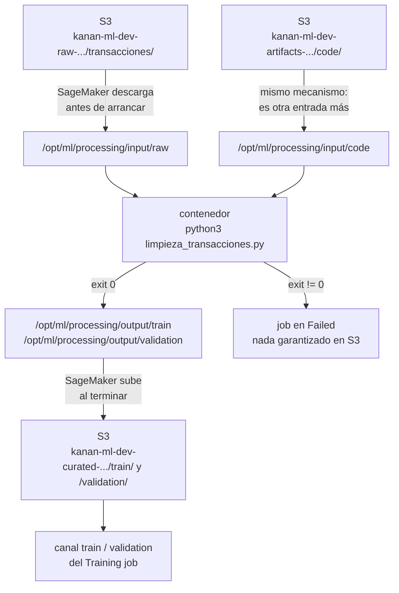
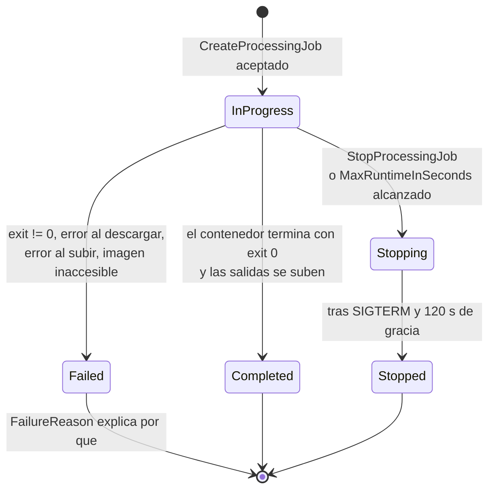

# Anatomía de un job de SageMaker

## Un job es una máquina que AWS enciende, usa y apaga sin que la veas

Un *job* de SageMaker es una petición a una API que dice, en una sola llamada: enciende
tantas máquinas de este tipo, corre esta imagen dentro de ellas, deja a su alcance estos
objetos de S3, guarda lo que produzcan en este otro sitio de S3 y apágalo todo cuando
terminen. Eso es todo lo que es. No hay un servidor que administres, no hay nada a lo que
te conectes por SSH, y no existe un botón de «ejecutar» que tengas que pulsar en el momento
correcto: la petición es el trabajo.

La petición la haces tú, con la CLI o con boto3, firmada con la identidad que te dio la
nota 1. Quien la recibe es el **plano de control** de SageMaker: el endpoint
`sagemaker.us-east-1.amazonaws.com`, que valida lo que pediste, te devuelve un ARN y se
queda con el encargo. Las máquinas que arranca después —el **plano de ejecución**— no viven
en tu cuenta de forma visible: no aparecen en tu consola de EC2, no tienen una IP que
puedas anotar y dejan de existir cuando el trabajo acaba. Su única conexión con tus datos
es el **rol de ejecución** de la nota 1, `KananSageMakerExecutionRole-dev`, que SageMaker
asume en tu nombre para leer y escribir en S3.

De ahí sale la primera consecuencia práctica, y es la que más confunde al principio:
**la llamada que crea el job no ejecuta el job**. Devuelve un ARN en menos de un segundo,
mucho antes de que ninguna máquina se haya encendido. Todo lo que ocurre después —descargar
los datos, bajar la imagen, correr tu código, subir los resultados— sucede sin que tu
proceso esté mirando, y se consulta con otra llamada distinta. Buena parte de esta nota
trata de esa asimetría: dónde miras cuando el trabajo que lanzaste no hizo lo que esperabas.

SageMaker tiene dos familias de job que usarás constantemente y que comparten esqueleto:

| Familia | Llamada | Para qué está | Qué deja al terminar |
| ------- | ------- | ------------- | -------------------- |
| Processing | `CreateProcessingJob` | correr un programa cualquiera sobre datos: limpiar, validar, convertir, evaluar | los archivos que tu programa escriba, copiados a S3 |
| Training | `CreateTrainingJob` | entrenar un modelo | un artefacto de modelo comprimido en S3, más métricas y tiempos |

La diferencia entre las dos no es de tamaño ni de potencia: es de **contrato**. Un Training
job promete devolverte un artefacto de modelo en una ruta convenida y te informa de cuánto
tiempo facturable consumió; un Processing job no promete nada sobre lo que produce salvo
copiarlo. Todo lo demás —rol, imagen, instancias, entrada, salida, límite de tiempo— es
casi idéntico, y por eso se aprenden juntos.

### Desde dónde se lanza todo esto

El código de esta nota se ejecuta desde una laptop con la CLI configurada con el perfil
`kanan-dev` de la nota 1. No hace falta nada más. Esto merece decirse explícitamente porque
la documentación y los tutoriales de AWS lanzan casi siempre los jobs desde un *notebook*
de Studio, y es fácil concluir que Studio es un requisito.

**Amazon SageMaker Studio** es el entorno de desarrollo gestionado de SageMaker: una
interfaz web con *notebooks*, editores y terminales. Para poder existir necesita un
**dominio**, que es el contenedor administrativo de Studio: agrupa los *perfiles de usuario*
del equipo, decide en qué red viven sus entornos y a qué almacenamiento compartido acceden.
Miguel y Ana, los dos ML engineers de Kanan, tienen cada uno un perfil de usuario dentro del
dominio de la cuenta `kanan-ml-dev`, y trabajan a diario ahí.

Lo único que hace falta retener de esto ahora: el dominio determina **desde dónde** corre tu
código y **con qué identidad**, no qué puedes lanzar. Desde un *notebook* de Studio, la
identidad es el rol del perfil de usuario y las credenciales ya están puestas; desde tu
laptop, la identidad es tu perfil de la CLI. La llamada a la API es exactamente la misma en
ambos casos, y también sería la misma desde una función Lambda o desde un contenedor de
CodeBuild.

Comprobar qué dominios existen en la cuenta es una llamada más:

```
aws sagemaker list-domains --profile kanan-dev --region us-east-1
```

```json
{
    "Domains": [
        {
            "DomainArn": "arn:aws:sagemaker:us-east-1:111111111111:domain/d-a1b2c3d4e5f6",
            "DomainId": "d-a1b2c3d4e5f6",
            "DomainName": "kanan-ml-dev",
            "Status": "InService",
            "CreationTime": "2026-02-11T09:14:33.000000-06:00",
            "Url": "https://d-a1b2c3d4e5f6.studio.us-east-1.sagemaker.aws"
        }
    ]
}
```

Si la lista viene vacía, no pasa nada: todo lo que sigue funciona igual. Lo que no puede
faltar es el rol de ejecución, porque es el que las máquinas del job van a usar.

---

## La imagen es el programa, y vive en un registro

Un job no ejecuta un script tuyo: ejecuta una **imagen de contenedor**. Conviene fijar los
dos términos antes de seguir, porque son el centro de todo lo demás.

Un **contenedor** es un proceso aislado que se ejecuta con su propio sistema de archivos,
sus propias bibliotecas y su propio intérprete, independientes de los de la máquina
anfitriona. Una **imagen** es el archivo del que ese sistema de archivos sale: un paquete
inmutable y versionado que contiene el sistema operativo base, las bibliotecas instaladas y
el programa que se lanza al arrancar. Encender un contenedor es desempaquetar una imagen y
ejecutar su programa de arranque.

Para SageMaker la imagen es la unidad de trabajo: es lo único que sabe ejecutar. Cuando tú
pides un Processing job con la imagen de scikit-learn, SageMaker enciende una instancia,
descarga esa imagen, arranca el contenedor y deja que su programa corra hasta que termine.
Tu código Python no es «lo que se ejecuta»: es un archivo más que el contenedor encuentra
en el disco y que el intérprete de dentro de la imagen lee.

Las imágenes no se envían dentro de la petición —serían gigabytes— sino que se guardan en un
**registro**, un servicio que almacena imágenes y las sirve por nombre y versión. El registro
de AWS es **Amazon ECR** (Elastic Container Registry). En esta nota ECR aparece solo como el
sitio de donde SageMaker baja la imagen; construir y publicar imágenes propias ahí es el tema
de [[Contenedores y hosting múltiple]].

Lo que sí tienes que saber escribir hoy es la **URI de imagen**, que es la cadena exacta con
la que se nombra una imagen dentro de ECR y el valor que vas a poner en la petición del job:

```
683313688378.dkr.ecr.us-east-1.amazonaws.com/sagemaker-xgboost:1.7-1
└──────┬─────┘     └───┬────┘                └──────┬───────┘ └─┬─┘
   cuenta AWS       región                     repositorio     tag
   propietaria     del registro                              (versión)
```

Tres cosas de esa cadena importan:

1. **La cuenta no es la tuya.** `683313688378` es una cuenta de AWS, y las imágenes
   integradas de SageMaker viven en cuentas de AWS, no en la tuya. Tú no las copias ni las
   pagas; solo las referencias.
2. **La región está dentro del nombre.** Hay una copia del registro por región, en cuentas
   distintas. La URI de `us-east-1` no sirve en `eu-west-1` y viceversa.
3. **El tag es la versión del algoritmo o del framework**, no la versión de SageMaker.

### Cómo consigues esa URI sin inventarla

Escribir esa cadena de memoria es el error más caro y más tonto de esta nota, porque el
número de cuenta cambia con la región y no hay forma de deducirlo. Hay dos maneras de
obtenerla: buscarla en las tablas de la documentación de AWS, o pedírsela a la función que
el SageMaker Python SDK tiene para eso.

Este fragmento se ejecuta desde la laptop, en un entorno con `sagemaker==3.22.1` instalado.
No hace ninguna llamada a AWS: la tabla de cuentas y regiones viene dentro del paquete.

```python
from sagemaker.core.image_uris import retrieve

imagen_xgboost = retrieve(
    framework="xgboost",
    region="us-east-1",
    version="1.7-1",
    image_scope="training",
)

imagen_sklearn = retrieve(
    framework="sklearn",
    region="us-east-1",
    version="1.2-1",
    image_scope="training",
    instance_type="ml.m5.xlarge",
)

print(imagen_xgboost)
print(imagen_sklearn)
```

```
683313688378.dkr.ecr.us-east-1.amazonaws.com/sagemaker-xgboost:1.7-1
683313688378.dkr.ecr.us-east-1.amazonaws.com/sagemaker-scikit-learn:1.2-1-cpu-py3
```

Glosa:

- `framework` es el nombre corto del algoritmo o de la biblioteca (`xgboost`, `sklearn`,
  `pytorch`, `tensorflow`…). `version` es el tag; cada framework acepta un conjunto cerrado
  de versiones y si pides una que no existe la función falla con la lista de las válidas.
- `image_scope` distingue la imagen de entrenamiento de la de inferencia, que son
  **imágenes distintas** aunque compartan nombre de framework. Para scikit-learn no existe
  un scope `processing`: la imagen de entrenamiento es también la que se usa en Processing
  jobs, y pedir `image_scope="processing"` termina en `ValueError: Unsupported image scope:
  processing`.
- `instance_type` solo hace falta cuando el framework tiene variantes según el hardware.
  Para scikit-learn decide el sufijo `-cpu-py3`; para XGBoost se ignora, y el SDK lo dice
  con un `INFO  Ignoring unnecessary instance type: None`.
- La función no consulta ECR ni comprueba que la imagen exista: compone la cadena con una
  tabla local. Si la tabla es vieja, la URI que te devuelve es vieja.

El mismo `retrieve` con otra región devuelve otra cuenta, y ahí se ve por qué no se puede
memorizar:

```python
print(retrieve(framework="xgboost", region="eu-west-1", version="1.7-1", image_scope="training"))
```

```
141502667606.dkr.ecr.eu-west-1.amazonaws.com/sagemaker-xgboost:1.7-1
```

Kanan opera en `us-east-1` por la restricción regulatoria, así que la segunda URI no debería
aparecer nunca en su código. Cuando aparece —copiada de un tutorial, heredada de un script
de otra región— el job falla al arrancar, y el mensaje no dice «región equivocada».

> **Caja negra de esta nota.** La imagen `sagemaker-xgboost:1.7-1` es el algoritmo XGBoost
> empaquetado por AWS. Su contrato, y lo único que necesitas creer aquí: lee los archivos
> CSV **sin encabezado y con la etiqueta en la primera columna** que le lleguen como datos de
> entrenamiento, y al terminar deja el modelo entrenado en el sitio donde SageMaker lo
> recoge. Por qué ese formato, qué hiperparámetros acepta y cuándo conviene usarla es
> [[Algoritmos integrados]]. Aquí es un programa opaco que sirve para ver la mecánica de un
> Training job.

---

## Lo que el contenedor ve: el contrato `/opt/ml`

El contenedor que SageMaker arranca no habla con S3. Dentro de él no hay credenciales de
AWS, no hay SDK configurado y tu código no llama a `get_object`. Lo que hay es un sistema de
archivos local con rutas convenidas, y **SageMaker copia los objetos de S3 a esas rutas
antes de arrancar tu programa, y copia de vuelta lo que encuentre en ellas cuando tu
programa termina**.

Ese contrato es lo que hace que el mismo contenedor funcione con datos de cualquier bucket
sin saber nada de AWS, y es también el origen de casi todos los fallos silenciosos:
tu script escribe en un directorio que no está en la lista y el job termina «bien» sin
dejar nada en S3.

Las rutas están fijadas por SageMaker y todas cuelgan de `/opt/ml`. Para un **Processing
job**:

| Ruta dentro del contenedor | Quién la llena | Cuándo |
| -------------------------- | -------------- | ------ |
| `/opt/ml/processing/input/<nombre>` | SageMaker, con los objetos de la entrada que declaraste con ese nombre | antes de arrancar tu programa |
| `/opt/ml/processing/output/<nombre>` | tu programa | durante la ejecución |
| `/opt/ml/config/processingjobconfig.json` | SageMaker, con la petición completa del job | antes de arrancar |
| `/opt/ml/config/resourceconfig.json` | SageMaker, con los nombres de las máquinas del clúster | antes de arrancar |

El nombre `<nombre>` no es fijo: lo eliges tú en la petición, entrada por entrada. Es decir, la
ruta `/opt/ml/processing/input/raw` existe porque tú declaraste una entrada llamada `raw`
apuntando a esa ruta, no porque SageMaker la conozca. La convención `input/<nombre>` y
`output/<nombre>` es una costumbre de AWS, cómoda y universal, no una obligación del servicio.

Para un **Training job** la lista es distinta y sí tiene rutas con significado propio:

| Ruta dentro del contenedor | Quién la llena | Qué significa |
| -------------------------- | -------------- | ------------- |
| `/opt/ml/input/data/<canal>` | SageMaker, con los objetos del canal `<canal>` | los datos de entrada |
| `/opt/ml/input/config/hyperparameters.json` | SageMaker | los hiperparámetros que mandaste, como cadenas |
| `/opt/ml/input/config/inputdataconfig.json` | SageMaker | la descripción de los canales |
| `/opt/ml/input/config/resourceconfig.json` | SageMaker | los nombres de las máquinas del clúster |
| `/opt/ml/model` | tu programa | **lo que haya aquí al terminar se empaqueta y se sube como el artefacto del modelo** |
| `/opt/ml/output/data` | tu programa | se empaqueta y se sube aparte, como salida auxiliar |
| `/opt/ml/output/failure` | tu programa, solo si falla | su contenido se convierte en el motivo del fallo |

Un **canal** es un grupo de objetos de S3 con nombre. El nombre lo inventas tú
(`train`, `validation`, `test` son los habituales) y determina el subdirectorio donde
aparecen los datos. La imagen de XGBoost espera un canal llamado exactamente `train`; eso es
parte de su contrato, no del de SageMaker.

Tres detalles del lado de salida que el examen usa como distractores:

- Lo que dejes en `/opt/ml/model` se sube **comprimido en un solo objeto**, no archivo por
  archivo, y por convención se llama `model.tar.gz`. Lo que dejes en `/opt/ml/output/data` se
  sube igual pero en otro objeto, por costumbre `output.tar.gz`.
- `/opt/ml/output/failure` es un archivo, no un directorio, y solo se lee si el job falla.
  SageMaker toma sus **primeros 1024 caracteres** y los usa como el motivo de fallo que
  devuelve la consulta de estado del job. Los contenedores de AWS ya lo escriben por ti.
- Un Processing job no tiene equivalente de `/opt/ml/model`: para SageMaker, todas sus
  salidas son iguales.

El viaje completo, con el camino de error incluido:



El diagrama dice algo que conviene subrayar: **el script también entra por una ruta de
entrada**. No hay un mecanismo especial para el código. Tu `.py` se sube a S3 como cualquier
otro objeto y se declara como una entrada más, y lo que lo convierte en «el programa» es que
la petición le dice al contenedor que lo ejecute.

---

## `CreateProcessingJob` campo por campo: limpiar el CSV de transacciones

El primer paso del caso de fraude de Kanan: las transacciones crudas llegan a
`s3://kanan-ml-dev-raw-us-east-1/fraude/2026/transacciones/` como CSV con encabezado, con
duplicados, con nulos y con dos columnas que son PII —número de tarjeta y nombre del
titular— que no pueden llegar al entrenamiento. Hay que dejar en el bucket curado dos
archivos listos para entrenar.

### El programa

Este archivo se llama `limpieza_transacciones.py` y vive en la laptop. Se va a ejecutar
dentro del contenedor de scikit-learn, que trae pandas instalado.

```python
import pathlib

import pandas as pd

ENTRADA = pathlib.Path("/opt/ml/processing/input/raw")
SALIDA_TRAIN = pathlib.Path("/opt/ml/processing/output/train")
SALIDA_VALID = pathlib.Path("/opt/ml/processing/output/validation")

COLUMNAS = ["es_fraude", "monto", "hora_del_dia", "distancia_km", "num_tx_1h"]
PII = ["numero_tarjeta", "nombre_titular"]

archivos = sorted(ENTRADA.glob("*.csv"))
print(f"archivos de entrada: {[a.name for a in archivos]}", flush=True)
if not archivos:
    raise SystemExit(f"no hay CSV en {ENTRADA}")

df = pd.concat((pd.read_csv(a) for a in archivos), ignore_index=True)
print(f"filas leidas: {len(df)}", flush=True)

df = df.drop_duplicates(subset="id_transaccion")
df = df.dropna(subset=["monto", "es_fraude"])
df = df.drop(columns=PII, errors="ignore")
df = df[COLUMNAS]
print(f"filas despues de limpiar: {len(df)}", flush=True)

corte = int(len(df) * 0.8)
SALIDA_TRAIN.mkdir(parents=True, exist_ok=True)
SALIDA_VALID.mkdir(parents=True, exist_ok=True)
df.iloc[:corte].to_csv(SALIDA_TRAIN / "train.csv", index=False, header=False)
df.iloc[corte:].to_csv(SALIDA_VALID / "validation.csv", index=False, header=False)
print(f"escritas {corte} filas de train y {len(df) - corte} de validation", flush=True)
```

Glosa de lo que no es pandas:

- Las tres rutas son literales fijos. No hay variables de entorno con la ruta de entrada, ni
  argumentos: el script y la petición se ponen de acuerdo fuera del código, y si no coinciden
  el job falla con un `FileNotFoundError` o, peor, termina bien sin escribir nada.
- `raise SystemExit(...)` termina el proceso con código distinto de cero. Eso es lo que
  convierte «no encontré datos» en un job fallido en lugar de un job exitoso que no produjo
  nada: SageMaker juzga el resultado por el código de salida del contenedor, y es la única
  forma que tiene tu programa de avisar.
- `mkdir(parents=True, exist_ok=True)` hace falta porque SageMaker crea los directorios de
  salida declarados en la petición, pero depender de ello es frágil: si el directorio no
  existe, `to_csv` falla.
- `header=False` y `es_fraude` como primera columna de `COLUMNAS` no son estilo: es el
  contrato de la caja negra de XGBoost. Este script existe para alimentar a ese contenedor.
- `flush=True` en cada `print` fuerza el vaciado del búfer de salida. Sin él, la salida del
  script puede quedarse en memoria y llegar a los logs toda de golpe al final —o no llegar,
  si el proceso muere—. La alternativa equivalente es la variable de entorno
  `PYTHONUNBUFFERED=1`, que pondremos en la petición.

El script se sube a S3 como un objeto más:

```
aws s3 cp limpieza_transacciones.py \
  s3://kanan-ml-dev-artifacts-us-east-1/code/limpieza_transacciones.py \
  --profile kanan-dev
```

### La petición

Esta es la petición completa, en un archivo `job-limpieza.json` en la laptop. La leemos
entera y luego campo por campo.

```json
{
  "ProcessingJobName": "kanan-limpieza-tx-20260920-1812",
  "RoleArn": "arn:aws:iam::111111111111:role/KananSageMakerExecutionRole-dev",
  "AppSpecification": {
    "ImageUri": "683313688378.dkr.ecr.us-east-1.amazonaws.com/sagemaker-scikit-learn:1.2-1-cpu-py3",
    "ContainerEntrypoint": ["python3", "/opt/ml/processing/input/code/limpieza_transacciones.py"]
  },
  "ProcessingResources": {
    "ClusterConfig": {
      "InstanceType": "ml.m5.xlarge",
      "InstanceCount": 1,
      "VolumeSizeInGB": 30,
      "VolumeKmsKeyId": "arn:aws:kms:us-east-1:111111111111:key/3f1c9e02-kanan-ml-dev"
    }
  },
  "ProcessingInputs": [
    {
      "InputName": "raw",
      "S3Input": {
        "S3Uri": "s3://kanan-ml-dev-raw-us-east-1/fraude/2026/transacciones/",
        "LocalPath": "/opt/ml/processing/input/raw",
        "S3DataType": "S3Prefix",
        "S3InputMode": "File",
        "S3DataDistributionType": "FullyReplicated"
      }
    },
    {
      "InputName": "code",
      "S3Input": {
        "S3Uri": "s3://kanan-ml-dev-artifacts-us-east-1/code/limpieza_transacciones.py",
        "LocalPath": "/opt/ml/processing/input/code",
        "S3DataType": "S3Prefix",
        "S3InputMode": "File",
        "S3DataDistributionType": "FullyReplicated"
      }
    }
  ],
  "ProcessingOutputConfig": {
    "Outputs": [
      {
        "OutputName": "train",
        "S3Output": {
          "S3Uri": "s3://kanan-ml-dev-curated-us-east-1/fraude/2026/train/",
          "LocalPath": "/opt/ml/processing/output/train",
          "S3UploadMode": "EndOfJob"
        }
      },
      {
        "OutputName": "validation",
        "S3Output": {
          "S3Uri": "s3://kanan-ml-dev-curated-us-east-1/fraude/2026/validation/",
          "LocalPath": "/opt/ml/processing/output/validation",
          "S3UploadMode": "EndOfJob"
        }
      }
    ],
    "KmsKeyId": "arn:aws:kms:us-east-1:111111111111:key/3f1c9e02-kanan-ml-dev"
  },
  "StoppingCondition": {
    "MaxRuntimeInSeconds": 3600
  },
  "Environment": {
    "PYTHONUNBUFFERED": "1"
  }
}
```

Campo por campo:

**`ProcessingJobName`** — obligatorio, único en la cuenta y la región, entre 1 y 63
caracteres alfanuméricos y guiones. No se reutiliza: los nombres de jobs terminados siguen
ocupados para siempre. De ahí la costumbre de pegarle una marca de tiempo. Es también el
nombre con el que buscarás sus logs, así que un prefijo legible (`kanan-limpieza-tx`) vale
más que un UUID.

**`RoleArn`** — obligatorio. El rol de ejecución de la nota 1. **Las instancias del job
asumen este rol**, y todos los accesos a S3 —leer el CSV crudo, leer el script, escribir la
salida— los hace él, no tú. Que tú puedas leer el bucket es irrelevante. Para poder entregar
el rol necesitas `iam:PassRole` sobre él, que ya está en `KananMLEngineerS3-dev`.

**`AppSpecification.ImageUri`** — obligatorio. La URI de la sección anterior.

**`AppSpecification.ContainerEntrypoint`** — la orden que se ejecuta al arrancar el
contenedor, como lista de argumentos ya partida (no una cadena de shell). Sustituye al
programa de arranque que la imagen trae por defecto. Aquí es donde el `.py` que copiamos
como entrada se convierte en el programa. Existe también `ContainerArguments`, que añade
argumentos sin tocar el programa de arranque. Ambas listas admiten hasta 100 elementos.

**`ProcessingResources.ClusterConfig`** — obligatorio. `InstanceType` es un tipo de la
familia `ml.` de SageMaker (`ml.m5.xlarge`, `ml.c5.4xlarge`…), que no es lo mismo que el
tipo de EC2 con el mismo nombre ni comparte cuota con él. `InstanceCount` va de 1 a 100.
`VolumeSizeInGB` **es obligatorio** —de 1 a 16384— y es el disco que se adjunta a cada
instancia: si tus datos de entrada no caben ahí, el job falla al descargar, no al procesar.
`VolumeKmsKeyId` cifra ese disco con la llave de Kanan; la mecánica de KMS es
[[Protección de datos]].

**`ProcessingInputs`** — hasta 10 entradas. En cada una:

- `InputName` es libre y sirve para identificarla en `DescribeProcessingJob`.
- `S3Uri` apunta a un prefijo o a un objeto concreto; `S3DataType` dice cuál de los dos
  (`S3Prefix` o `ManifestFile`). Con `S3Prefix`, SageMaker descarga **todo** lo que cuelgue
  del prefijo, así que un prefijo demasiado ancho es tiempo y disco desperdiciados.
- `LocalPath` es la ruta del contrato `/opt/ml` donde aparecerán esos objetos.
- `S3InputMode` vale `File` o `Pipe`. `File` significa: copia todos los objetos al disco
  antes de arrancar el contenedor. Es lo que quieres aquí y lo que este script asume. La
  alternativa y sus consecuencias son [[Almacenamiento y formatos]].
- `S3DataDistributionType` decide qué ve cada instancia cuando hay más de una:
  `FullyReplicated` le da a cada una una copia completa; `ShardedByS3Key` reparte los
  objetos entre ellas. Con `InstanceCount: 1` da igual, pero es el campo que hace o rompe un
  Processing job paralelo: un script que agrega totales y corre con `ShardedByS3Key` produce
  resultados parciales sin avisar.

**`ProcessingOutputConfig.Outputs`** — hasta 10 salidas, cada una con su `LocalPath` y su
destino en S3. `S3UploadMode` tiene dos valores y la distinción sí se pregunta:

| `S3UploadMode` | Cuándo sube | Cuándo lo quieres |
| -------------- | ----------- | ----------------- |
| `EndOfJob` | al terminar el contenedor, y **solo si terminó bien** | resultados que no sirven de nada a medias, como estos CSV |
| `Continuous` | mientras el contenedor corre, a medida que se escriben | salidas que quieres ver aunque el job falle después, o jobs largos cuyo progreso se inspecciona |

`KmsKeyId` cifra los objetos que se escriban en S3, y aquí no es opcional para Kanan: el
bucket curado guarda datos de clientes.

**`StoppingCondition.MaxRuntimeInSeconds`** — el límite de reloj del job. No es obligatorio
y su valor por defecto es **un día**. Cuando se alcanza, SageMaker manda `SIGTERM` al
contenedor y, según documenta AWS para este campo, espera **120 segundos** antes de matarlo,
que es la ventana en la que un programa puede guardar lo que lleve hecho. Ponerlo siempre, y
ajustado, es la defensa más barata contra un bucle infinito facturado a horas de instancia;
qué estado deja en el job y por qué eso importa está en la sección siguiente.

**`Environment`** — hasta 100 variables de entorno, todas cadenas, que se inyectan en el
contenedor. Aquí lleva `PYTHONUNBUFFERED` para que los logs salgan al momento. No es sitio
para secretos: aparece tal cual en `DescribeProcessingJob`, que puede leer cualquiera con
permiso de lectura sobre el job.

Quedan fuera, y se nombran solo para que no te sorprendan en la respuesta del `describe`:
`NetworkConfig` (aislamiento de red y VPC, [[Red]]), `ExperimentConfig`
([[Experimentos y Model Registry]]) y `Tags`.

### Lanzarla

Con la CLI, desde la laptop:

```
aws sagemaker create-processing-job \
  --cli-input-json file://job-limpieza.json \
  --profile kanan-dev --region us-east-1
```

```json
{
    "ProcessingJobArn": "arn:aws:sagemaker:us-east-1:111111111111:processing-job/kanan-limpieza-tx-20260920-1812"
}
```

Eso es todo lo que devuelve, y lo devuelve de inmediato. No hay estado, no hay logs, no hay
resultado: solo la confirmación de que la petición se aceptó.

`--cli-input-json` merece una nota: toma el JSON tal cual y lo manda como cuerpo de la
llamada, con los mismos nombres de campo que la API. Es la forma de tener la petición
versionada en el repositorio, revisable en un *pull request* y reutilizable entre entornos.
La alternativa, pasar cada campo como bandera (`--processing-job-name`, `--app-specification
ImageUri=...`), es legible solo para peticiones triviales.

La misma petición desde boto3, que es lo que usarás en cuanto el nombre del job tenga que
calcularse:

```python
import datetime as dt
import json

import boto3

sesion = boto3.Session(profile_name="kanan-dev", region_name="us-east-1")
sm = sesion.client("sagemaker")

with open("job-limpieza.json") as f:
    peticion = json.load(f)

marca = dt.datetime.now(dt.timezone.utc).strftime("%Y%m%d-%H%M%S")
peticion["ProcessingJobName"] = f"kanan-limpieza-tx-{marca}"

respuesta = sm.create_processing_job(**peticion)
print(respuesta["ProcessingJobArn"])
```

Glosa:

- Los nombres de los campos de la petición son **idénticos** en la CLI y en boto3, porque
  ambos son envoltorios finos sobre la misma API. Esto es lo que permite prototipar con un
  JSON y pasarlo a Python sin traducir nada: `create_processing_job(**peticion)` con el
  mismo diccionario.
- `Session(profile_name=...)` fija la identidad de la nota 1. Sin `region_name`, boto3 usa
  la región del perfil; si el perfil no la tiene, la llamada falla con `NoRegionError`.
- El nombre calculado en el momento evita el choque por nombre repetido, que es el error más
  frecuente al relanzar un job tras corregir el script.

---

## De `create` a `Completed`: estados, `describe` y espera

El ARN que te devolvió `create` no dice nada del resultado. El estado vive en otra llamada,
`DescribeProcessingJob`, y toma exactamente cinco valores:



Dos lecturas del diagrama que el examen aprovecha:

- **`Stopped` no es `Failed`.** Un job que te comiste el presupuesto y cortó por tiempo
  aparece como `Stopped`, igual que uno que tú paraste a mano. Si tu automatización trata
  «no Failed» como éxito, ese job pasa.
- **`Failed` no distingue dónde falló.** Un error de permisos al descargar, un
  `KeyError` en tu pandas y un disco lleno al subir producen el mismo estado. Lo que los
  distingue es `FailureReason`.

La consulta mínima, filtrando con `--query` para no leer la petición entera de vuelta:

```
aws sagemaker describe-processing-job \
  --processing-job-name kanan-limpieza-tx-20260920-1812 \
  --query "{estado:ProcessingJobStatus, motivo:FailureReason, mensaje:ExitMessage, inicio:ProcessingStartTime, fin:ProcessingEndTime}" \
  --profile kanan-dev --region us-east-1
```

```json
{
    "estado": "Completed",
    "motivo": null,
    "mensaje": null,
    "inicio": "2026-09-20T18:13:47.000000-06:00",
    "fin": "2026-09-20T18:17:02.000000-06:00"
}
```

Los dos campos de diagnóstico:

- **`FailureReason`** es el motivo del fallo, y es lo primero que se mira cuando el estado es
  `Failed`. Para un Training job sale de los primeros 1024 caracteres de
  `/opt/ml/output/failure`, o lo escribe SageMaker cuando el fallo ocurrió fuera de tu código
  (descarga, imagen, cuota).
- **`ExitMessage`** es específico de Processing y trae el final de la salida de error del
  contenedor. Es útil cuando tu script murió con una excepción de Python: ahí verás el
  `SystemExit` con tu mensaje.

`ProcessingStartTime` no es el instante del `create`: es el instante en que el contenedor
empezó a correr. Entre uno y otro hay minutos de encendido, descarga de imagen y descarga de
datos que también se facturan. En jobs de tres minutos, ese preámbulo suele ser la mitad del
gasto, y es el argumento contra partir un pipeline en veinte Processing jobs diminutos.

### Esperar sin escribir un bucle

Un `while` con `sleep` consultando el estado funciona, pero boto3 ya trae esa lógica en los
*waiters* de la nota 1:

```python
import botocore.exceptions

espera = sm.get_waiter("processing_job_completed_or_stopped")

try:
    espera.wait(
        ProcessingJobName=nombre,
        WaiterConfig={"Delay": 30, "MaxAttempts": 40},
    )
    print("terminado bien")
except botocore.exceptions.WaiterError as error:
    detalle = sm.describe_processing_job(ProcessingJobName=nombre)
    print("estado:", detalle["ProcessingJobStatus"])
    print("motivo:", detalle.get("FailureReason"))
    print("mensaje:", detalle.get("ExitMessage"))
```

Glosa:

- Los dos waiters que te importan se llaman `processing_job_completed_or_stopped` y
  `training_job_completed_or_stopped`. Sus valores por defecto no son iguales: el de
  Processing consulta cada 60 s hasta 60 veces (una hora), y el de Training cada 120 s hasta
  180 veces (seis horas). Un Training job largo agota el waiter aunque el job siga vivo, y
  ahí `WaiterConfig` deja de ser un adorno.
- **El waiter trata `Failed` como fracaso de la espera**, no como final legítimo: lanza
  `WaiterError`. Por eso el `except` no es opcional, y por eso dentro de él hay que volver a
  llamar al `describe`: la excepción te dice que dejó de esperar, no por qué falló el job.
- `Stopped` se considera éxito de la espera —el nombre lo dice: *completed or stopped*—, así
  que un job cortado por `MaxRuntimeInSeconds` sale por el camino del `try`. Si eso importa,
  hay que leer el estado después.

Para detener un job a mano:

```
aws sagemaker stop-processing-job --processing-job-name kanan-limpieza-tx-20260920-1812 \
  --profile kanan-dev --region us-east-1
```

La llamada vuelve enseguida y el job pasa a `Stopping`. No es instantáneo: el contenedor
recibe una señal de terminación y dispone de una ventana de gracia para cerrar antes de que
lo maten. Esa ventana es la oportunidad de guardar algo; si tu código la ignora, se pierden
las salidas en modo `EndOfJob`.

---

## Leer los logs: grupo, *stream* y el nombre `algo-1`

Todo lo que el contenedor escribe en la salida estándar y en la de error va a **CloudWatch
Logs**, el servicio de registro de AWS. No hay que configurarlo: SageMaker lo hace por ti, y
es el único sitio donde vas a ver los `print` de tu script.

CloudWatch Logs organiza los mensajes en dos niveles. Un **grupo de logs** es el contenedor
administrativo —tiene retención y permisos propios— y SageMaker usa uno por tipo de job,
compartido por toda la cuenta y la región:

| Tipo de job | Grupo de logs | *Stream* |
| ----------- | ------------- | -------- |
| Processing | `/aws/sagemaker/ProcessingJobs` | `[nombre-del-job]/[hostname]-[epoch]` |
| Training | `/aws/sagemaker/TrainingJobs` | `[nombre-del-job]/algo-[n]-[epoch]` |

Un ***stream*** es la secuencia de mensajes de **una** máquina de **un** job. El `n` de
`algo-1` es el número de instancia dentro del clúster: con `InstanceCount: 3` hay
`algo-1`, `algo-2` y `algo-3`, y los mensajes de cada una van por separado. El sufijo es la
marca de tiempo en segundos desde 1970, que no puedes predecir; por eso las consultas se
hacen por **prefijo**, que es el nombre del job seguido de `/`. Aquí se paga el haber puesto
un nombre de job legible.

Desde la laptop, siguiendo el job en vivo:

```
aws logs tail /aws/sagemaker/ProcessingJobs \
  --log-stream-name-prefix kanan-limpieza-tx-20260920-1812 \
  --since 1h --follow --format short \
  --profile kanan-dev --region us-east-1
```

```
2026-09-20T18:13:51 archivos de entrada: ['transacciones-2026-09-19.csv', 'transacciones-2026-09-20.csv']
2026-09-20T18:14:02 filas leidas: 4812337
2026-09-20T18:15:44 filas despues de limpiar: 4796110
2026-09-20T18:16:58 escritas 3836888 filas de train y 959222 de validation
```

Glosa de las banderas:

- El grupo va como argumento posicional, sin bandera.
- `--log-stream-name-prefix` filtra por prefijo de *stream*; es incompatible con
  `--log-stream-names`, que exige nombres exactos.
- `--since` acepta duraciones relativas (`5m`, `1h`, `2d`) o una marca ISO 8601. Sin ella,
  `tail` solo trae los últimos diez minutos, lo que hace parecer vacío un job de ayer.
- `--follow` deja el comando abierto imprimiendo lo nuevo; `--format short` quita el nombre
  del *stream* de cada línea, que sobra cuando hay una sola instancia.

Desde Python, cuando lo que quieres no es mirar sino procesar —buscar una excepción, contar
advertencias, adjuntar el log a una alerta—:

```python
logs = sesion.client("logs")
paginas = logs.get_paginator("filter_log_events").paginate(
    logGroupName="/aws/sagemaker/ProcessingJobs",
    logStreamNamePrefix=f"{nombre}/",
)

for pagina in paginas:
    for evento in pagina.get("events", []):
        print(evento["message"].rstrip())
```

Glosa:

- `filter_log_events` busca en varios *streams* a la vez dentro de un grupo, que es
  exactamente lo que hace falta cuando el job tuvo tres instancias. `get_log_events`, en
  cambio, exige el nombre exacto de un *stream*.
- El `pagina.get("events", [])` no es prudencia decorativa: como se vio en la nota 1, las
  páginas sin resultados **no traen la clave**, y un `pagina["events"]` directo revienta con
  `KeyError` en cuanto el job todavía no ha escrito nada.
- Los logs tardan en aparecer: un job que falló al descargar los datos puede no haber
  escrito jamás un *stream*, porque el contenedor nunca llegó a arrancar. Eso no es un fallo
  de CloudWatch, y es la señal más útil que existe para separar «mi código falló» de «el job
  falló antes de mi código». Cuando no hay *stream*, la respuesta está en `FailureReason`.

---

## El mismo esqueleto en entrenamiento: `CreateTrainingJob`

Con los CSV curados en S3, el Training job de XGBoost es la misma idea con otros nombres de
campo. Merece la pena verlos en paralelo, porque el examen los mezcla a propósito:

| Concepto | Processing | Training |
| -------- | ---------- | -------- |
| Imagen | `AppSpecification.ImageUri` | `AlgorithmSpecification.TrainingImage` |
| Máquinas | `ProcessingResources.ClusterConfig` | `ResourceConfig` |
| Entradas | `ProcessingInputs[]` (hasta 10) | `InputDataConfig[]`, canales |
| Salidas | `ProcessingOutputConfig.Outputs[]` (hasta 10) | `OutputDataConfig` (uno solo) |
| Límite de tiempo | `StoppingCondition` | `StoppingCondition` |
| Parámetros del programa | `Environment`, `ContainerArguments` | `HyperParameters`, `Environment` |

La petición, en `job-entrenamiento.json`:

```json
{
  "TrainingJobName": "kanan-fraude-xgb-20260920-1930",
  "RoleArn": "arn:aws:iam::111111111111:role/KananSageMakerExecutionRole-dev",
  "AlgorithmSpecification": {
    "TrainingImage": "683313688378.dkr.ecr.us-east-1.amazonaws.com/sagemaker-xgboost:1.7-1",
    "TrainingInputMode": "File"
  },
  "InputDataConfig": [
    {
      "ChannelName": "train",
      "ContentType": "text/csv",
      "DataSource": {
        "S3DataSource": {
          "S3DataType": "S3Prefix",
          "S3Uri": "s3://kanan-ml-dev-curated-us-east-1/fraude/2026/train/",
          "S3DataDistributionType": "FullyReplicated"
        }
      }
    },
    {
      "ChannelName": "validation",
      "ContentType": "text/csv",
      "DataSource": {
        "S3DataSource": {
          "S3DataType": "S3Prefix",
          "S3Uri": "s3://kanan-ml-dev-curated-us-east-1/fraude/2026/validation/",
          "S3DataDistributionType": "FullyReplicated"
        }
      }
    }
  ],
  "OutputDataConfig": {
    "S3OutputPath": "s3://kanan-ml-dev-artifacts-us-east-1/fraude/2026/modelos/",
    "KmsKeyId": "arn:aws:kms:us-east-1:111111111111:key/3f1c9e02-kanan-ml-dev"
  },
  "ResourceConfig": {
    "InstanceType": "ml.m5.xlarge",
    "InstanceCount": 1,
    "VolumeSizeInGB": 30
  },
  "HyperParameters": {
    "objective": "binary:logistic",
    "num_round": "100",
    "scale_pos_weight": "120"
  },
  "StoppingCondition": {
    "MaxRuntimeInSeconds": 7200
  }
}
```

Lo que es nuevo respecto a Processing:

**`AlgorithmSpecification.TrainingInputMode`** — **obligatorio**, sin valor por defecto, y
es el campo que más peticiones rechaza la primera vez. `File` significa lo mismo que en
Processing: todo al disco antes de arrancar. Los otros dos valores son
[[Almacenamiento y formatos]].

**`InputDataConfig`** — la lista de canales. `ChannelName` es el nombre que decide el
subdirectorio `/opt/ml/input/data/<canal>`, y los que ves aquí, `train` y `validation`, los
exige la caja negra de XGBoost, no SageMaker. `ContentType` se le pasa al contenedor tal
cual para que sepa cómo leer los archivos; SageMaker no lo valida ni convierte nada.

**`OutputDataConfig.S3OutputPath`** — obligatorio, y a diferencia de Processing no hay
`LocalPath`: las rutas de salida del entrenamiento son fijas por contrato. Lo que quedó en
`/opt/ml/model` acaba en
`s3://<S3OutputPath>/<TrainingJobName>/output/model.tar.gz`. Que SageMaker meta el nombre
del job en medio es lo que impide que dos entrenamientos se pisen el artefacto, y por eso el
`S3OutputPath` se comparte entre jobs sin problema.

**`HyperParameters`** — un mapa de **cadena a cadena**. Los valores numéricos van
entrecomillados; `"num_round": 100` sin comillas es un error de validación, no una
conversión automática. El contenido de este mapa llega al contenedor en
`/opt/ml/input/config/hyperparameters.json` y su significado es asunto del algoritmo:
qué valores acepta XGBoost es [[Algoritmos integrados]].

Se lanza igual que el otro, y devuelve lo mismo de poco:

```
aws sagemaker create-training-job --cli-input-json file://job-entrenamiento.json \
  --profile kanan-dev --region us-east-1
```

```json
{
    "TrainingJobArn": "arn:aws:sagemaker:us-east-1:111111111111:training-job/kanan-fraude-xgb-20260920-1930"
}
```

### Lo que el `describe` de entrenamiento tiene de más

`DescribeTrainingJob` devuelve los mismos `TrainingJobStatus` y `FailureReason`, pero añade
tres cosas que no existen en Processing y que son material de examen:

```
aws sagemaker describe-training-job --training-job-name kanan-fraude-xgb-20260920-1930 \
  --query "{estado:TrainingJobStatus, fase:SecondaryStatus, artefacto:ModelArtifacts.S3ModelArtifacts, entrenamiento:TrainingTimeInSeconds, facturado:BillableTimeInSeconds}" \
  --profile kanan-dev --region us-east-1
```

```json
{
    "estado": "Completed",
    "fase": "Completed",
    "artefacto": "s3://kanan-ml-dev-artifacts-us-east-1/fraude/2026/modelos/kanan-fraude-xgb-20260920-1930/output/model.tar.gz",
    "entrenamiento": 268,
    "facturado": 268
}
```

- **`SecondaryStatus`** es la fase dentro de `InProgress`, y es lo que convierte un «lleva
  ocho minutos y no pasa nada» en un diagnóstico. Los valores que verás en la práctica, en
  orden: `Starting` (pidiendo máquinas), `Downloading` (bajando datos e imagen), `Training`
  (tu contenedor corriendo), `Uploading` (subiendo el artefacto), `Completed`. El histórico
  completo, con la hora de cada transición, viene en `SecondaryStatusTransitions`. Un job
  atascado en `Starting` no tiene un problema de código.
- **`ModelArtifacts.S3ModelArtifacts`** es la ruta exacta del artefacto. Léela de aquí en
  vez de construirla a mano: es la forma de no acoplar el resto del pipeline a la convención
  de nombres.
- **`TrainingTimeInSeconds` frente a `BillableTimeInSeconds`.** El primero es el tiempo que
  las instancias estuvieron encendidas para el entrenamiento; el segundo, lo que te cobran.
  Aquí coinciden. Que puedan no coincidir es el tema de [[Entrenar más rápido y barato]].

---

## Qué te ahorra el SDK y qué te oculta

Todo lo anterior son peticiones a la API. El **SageMaker Python SDK** es una biblioteca
aparte —`pip install sagemaker`, hoy en 3.22.1— que construye esas peticiones por ti desde
objetos de Python. No es un servicio ni una credencial distinta: por debajo llama a boto3 con
tu misma sesión.

El mismo entrenamiento de la sección anterior, con el SDK:

```python
from sagemaker.train.model_trainer import ModelTrainer
from sagemaker.train.configs import Compute, InputData, OutputDataConfig, StoppingCondition

entrenador = ModelTrainer(
    training_image="683313688378.dkr.ecr.us-east-1.amazonaws.com/sagemaker-xgboost:1.7-1",
    role="arn:aws:iam::111111111111:role/KananSageMakerExecutionRole-dev",
    base_job_name="kanan-fraude-xgb",
    compute=Compute(
        instance_type="ml.m5.xlarge",
        instance_count=1,
        volume_size_in_gb=30,
    ),
    stopping_condition=StoppingCondition(max_runtime_in_seconds=7200),
    hyperparameters={
        "objective": "binary:logistic",
        "num_round": "100",
        "scale_pos_weight": "120",
    },
    output_data_config=OutputDataConfig(
        s3_output_path="s3://kanan-ml-dev-artifacts-us-east-1/fraude/2026/modelos/",
        kms_key_id="arn:aws:kms:us-east-1:111111111111:key/3f1c9e02-kanan-ml-dev",
    ),
)

entrenador.train(
    input_data_config=[
        InputData(
            channel_name="train",
            data_source="s3://kanan-ml-dev-curated-us-east-1/fraude/2026/train/",
            content_type="text/csv",
        ),
        InputData(
            channel_name="validation",
            data_source="s3://kanan-ml-dev-curated-us-east-1/fraude/2026/validation/",
            content_type="text/csv",
        ),
    ],
    wait=True,
    logs=True,
)
```

Glosa:

- `ModelTrainer` es la clase de entrenamiento del SDK v3. Los nombres de sus campos son los
  de la API en `snake_case`, y las clases de `sagemaker.train.configs` son los objetos
  anidados de la petición: `Compute` es `ResourceConfig`, `StoppingCondition` es
  `StoppingCondition`, `InputData` es un `Channel` simplificado.
- **No hay `TrainingJobName`, y no es un olvido**: el SDK genera un nombre único a partir de
  `base_job_name` cada vez que llamas a `train()`. Ese es el primer trabajo que te quita de
  encima, y por eso relanzar con el SDK nunca choca por nombre repetido.
- **No hay `TrainingInputMode`** porque el campo tiene valor por defecto `File` en la clase.
  El SDK rellena obligatorios de la API con defaults suyos: cómodo, y a la vez la razón de
  que una petición del SDK y una escrita a mano no se parezcan campo por campo.
- `compute=Compute(volume_size_in_gb=30)` podría omitirse: el default de la clase es 30 GB.
- `train(wait=True, logs=True)` bloquea hasta que el job termina e imprime los logs del
  contenedor mientras tanto. Eso es el waiter y el `tail` de las dos secciones anteriores,
  juntos y sin escribirlos. Con `wait=False` vuelve de inmediato, como `create_training_job`.
- `train(dry_run=True)` hace toda la validación —configuración, resolución de entradas,
  hiperparámetros— **sin crear el job**. Es la forma barata de comprobar una petición antes
  de gastar instancias.

Lo que el SDK hace por ti, además: si le das una ruta local en vez de una URI de S3, sube el
archivo al *bucket* por defecto de la sesión (`sagemaker-<región>-<cuenta>`) bajo un prefijo
derivado del nombre del job; y si no le das `output_data_config`, inventa una ruta en ese
mismo *bucket*. Es cómodo y es exactamente lo que **no** quieres en Kanan, donde el destino
de los datos está regulado: un artefacto de modelo en un *bucket* que nadie declaró es una
conversación con el responsable de cumplimiento.

### Cuándo cada uno

| Situación | Herramienta | Por qué |
| --------- | ----------- | ------- |
| Exploración en un *notebook*, iterar sobre un entrenamiento | SDK | menos código, nombres automáticos, logs en vivo |
| Lambda que dispara un job al llegar datos | boto3 | el SDK es una dependencia grande; la petición ya está decidida |
| La petición vive en el repositorio y se revisa en un *pull request* | CLI con `--cli-input-json` | el JSON es el artefacto revisable; no hay Python en medio |
| Automatización en otro lenguaje, o un servicio que llama a la API | boto3 / API | el SDK es solo Python |
| Reproducir exactamente lo que se mandó para depurar | boto3 | ves el diccionario que sale por el cable |
| Subir código local y empaquetarlo con el job | SDK | lo hace solo; a mano son dos pasos y un prefijo que inventar |

La regla corta: **el SDK decide cosas por ti, y boto3 no decide nada**. En exploración,
decidir por ti es lo que quieres. En producción, cada decisión implícita es una diferencia
entre entornos que alguien tendrá que descubrir a las tres de la mañana.

> **Aviso de versión (verificado 2026-09-20, `sagemaker` 3.22.1).** El material de estudio de
> MLA-C01 y casi toda la documentación escrita antes de 2025 usan el vocabulario de la v2 del
> SDK: `sagemaker.estimator.Estimator` y su método `fit()` para entrenar, `sagemaker.processing.
> ScriptProcessor` o `SKLearnProcessor` y su `run()` para Processing. En la v3 esos módulos
> **se eliminaron**: importarlos falla con `ModuleNotFoundError: sagemaker.estimator was removed
> in the SageMaker Python SDK v3. Use ModelTrainer`. El entrenamiento pasó a `ModelTrainer`
> (`sagemaker.train.model_trainer`) y las clases de Processing viven ahora en
> `sagemaker.core.processing` (`Processor`, `ScriptProcessor`, `FrameworkProcessor`). En el
> examen, si una pregunta habla de `Estimator.fit()`, se refiere a esta misma mecánica:
> una petición `CreateTrainingJob` construida por el SDK. La capa de boto3 y de la CLI que
> ocupa el resto de esta nota **no cambió**, y esa es la razón de haberla aprendido primero.

---

## Los cuatro errores que verás primero

Todos los fallos de un job caen en dos momentos, y confundirlos es perder media hora mirando
el sitio equivocado:

- **En la llamada.** La API rechaza la petición y tu proceso recibe una excepción. No se
  enciende ninguna máquina, no hay logs y no hay job que describir.
- **Durante el job.** La llamada fue bien, el ARN existe, y el fallo aparece minutos después
  en `FailureReason`, con o sin logs según lo lejos que llegara.

### `ValidationException`: la petición está mal escrita

Llega en la llamada. Campo obligatorio ausente, valor fuera de rango, tipo equivocado. Los
dos casos más comunes en un Training job son omitir `TrainingInputMode` y mandar un
hiperparámetro numérico sin comillas:

```python
import botocore.exceptions

try:
    sm.create_training_job(**peticion)
except botocore.exceptions.ClientError as error:
    print(error.response["Error"]["Code"])
    print(error.response["Error"]["Message"])
```

```
ValidationException
1 validation error detected: Value null at 'algorithmSpecification.trainingInputMode' failed to satisfy constraint: Member must not be null
```

El mensaje nombra el campo en la ruta de la petición. Se arregla en el JSON, no en AWS.

Variante con nombre propio: relanzar un job con un nombre que ya se usó devuelve el código
`ResourceInUse`, no `ValidationException`. Por eso los nombres llevan marca de tiempo.

### `ResourceLimitExceeded`: no es un problema de permisos

También llega en la llamada, y es el que más se confunde con otra cosa porque suena a error
de cuenta. Es una **cuota de servicio**: cada cuenta tiene un número máximo de instancias de
cada tipo `ml.` para cada uso, y los usos son independientes entre sí. La forma del mensaje:

```
An error occurred (ResourceLimitExceeded) when calling the CreateProcessingJob operation:
The account-level service limit 'ml.m5.4xlarge for processing job usage' is 0 Instances,
with current utilization of 0 Instances and a request delta of 2 Instances.
Please use AWS Service Quotas to request an increase for this quota.
```

Lo que hay que leer ahí:

- **El nombre de la cuota lleva el uso dentro**: `ml.m5.4xlarge for processing job usage` no
  es la misma cuota que `ml.m5.4xlarge for training job usage` ni que `... for endpoint
  usage`. Tener sitio para entrenar no da sitio para procesar.
- **`is 0 Instances`** es lo normal en una cuenta nueva para los tipos grandes: la cuota por
  defecto de muchos tipos es cero. No es un castigo ni un error: hay que pedirla.
- Se consulta y se pide por Service Quotas. Desde la CLI, primero el código del servicio y
  después sus cuotas:

```
aws service-quotas list-services \
  --query "Services[?contains(ServiceName, 'SageMaker')]" \
  --profile kanan-dev --region us-east-1

aws service-quotas list-service-quotas \
  --service-code <el-que-devolvio-el-comando-anterior> \
  --query "Quotas[?contains(QuotaName, 'processing job usage')].[QuotaName, Value]" \
  --output table --profile kanan-dev --region us-east-1
```

Las cuotas son **por cuenta y por región**. El mismo código que funciona en `us-east-1`
puede fallar en otra región con una cuenta idéntica.

### `AccessDenied`: dos errores distintos con el mismo nombre

Aquí está la trampa que la nota 1 preparó. Hay dos `AccessDenied` posibles y ocurren en
momentos distintos:

**El primero es tuyo y llega en la llamada.** Te falta permiso para crear el job, o —más
frecuente— para entregar el rol:

```
An error occurred (AccessDeniedException) when calling the CreateProcessingJob operation:
User: arn:aws:iam::111111111111:user/miguel.reyes is not authorized to perform:
iam:PassRole on resource: arn:aws:iam::111111111111:role/KananSageMakerExecutionRole-dev
```

Se arregla en **tu** política de identidad, con `iam:PassRole` y su condición
`iam:PassedToService`.

**El segundo es del rol de ejecución y llega en `FailureReason`.** La llamada fue bien, el
job existe, y falla al intentar leer o escribir en S3:

```
ClientError: Data download failed:Unable to download object
s3://kanan-ml-dev-raw-us-east-1/fraude/2026/transacciones/transacciones-2026-09-20.csv
(AccessDenied: Access Denied)
```

Se arregla en la política del **rol de ejecución**, o en la *bucket policy*, según lo que
diga la coletilla del mensaje que aprendiste en la nota 1. Señal de reconocimiento rápido: si
el fallo está en `FailureReason` y no hay ningún *stream* de logs, el contenedor nunca
arrancó y el problema es de datos o de imagen, no de tu código. Recuerda además que el
prefijo `fraude/2026/*` de la política de Kanan es literal: un archivo en `fraude/2025/` da
este mismo error con permisos «correctos».

### Imagen de otra región: el error que no dice «región»

Copias una URI de un tutorial y la petición se acepta sin más —SageMaker no valida que la
imagen exista al crear el job—. Minutos después, el job está en `Failed` con un
`FailureReason` que habla de no poder descargar la imagen del registro, y no hay logs porque
el contenedor no llegó a existir.

La causa casi siempre es una de estas tres, y se diagnostican mirando la URI:

1. La cuenta y la región de la URI no son las de tu job
   (`141502667606.dkr.ecr.eu-west-1...` en un job de `us-east-1`).
2. El tag no existe para ese framework: `sagemaker-xgboost:1.8-1` cuando las versiones
   disponibles son `1.7-1` y `3.0-5`.
3. La imagen es de inferencia y el job es de entrenamiento, o al revés: son repositorios
   distintos.

La prevención es la de la segunda sección: no escribir la URI a mano. Con `retrieve` los tres
errores se convierten en una excepción local e inmediata en vez de un job fallido diez
minutos después.

### Tabla de diagnóstico

| Síntoma | Dónde aparece | Qué tocar |
| ------- | ------------- | --------- |
| `ValidationException` con nombre de campo | excepción de la llamada | el JSON de la petición |
| `ResourceInUse` | excepción de la llamada | el nombre del job |
| `ResourceLimitExceeded` | excepción de la llamada | Service Quotas, cuota del tipo y del uso |
| `AccessDeniedException` con `iam:PassRole` | excepción de la llamada | tu política de identidad |
| `Failed`, `FailureReason` con `AccessDenied` sobre S3 | `describe-*` | política del rol de ejecución o *bucket policy* |
| `Failed`, `FailureReason` sobre la imagen, sin logs | `describe-*` | la URI de imagen |
| `Failed`, `FailureReason` con excepción de Python | `describe-*` + CloudWatch Logs | tu script |
| `Completed` pero S3 vacío | `describe-*` dice `Completed` | la ruta donde escribe tu script vs. `LocalPath` |
| `Stopped` inesperado | `describe-*` | `MaxRuntimeInSeconds` |
| Atascado en `Starting` muchos minutos | `SecondaryStatus` | capacidad del tipo de instancia; no es tu código |

---

## Diccionario de nombres

| Nombre | Qué es en realidad |
| ------ | ------------------ |
| `algo-1` | la primera (y con una sola instancia, única) máquina del clúster del job; da nombre al *stream* de logs |
| `/opt/ml` | raíz del contrato de rutas entre SageMaker y el contenedor; no tiene nada que ver con «machine learning» como carpeta de proyecto |
| `model.tar.gz` | el empaquetado de `/opt/ml/model`; no es un formato de modelo, es un tar comprimido |
| `image_scope` | para qué sirve la imagen (`training`, `inference`), no su tamaño ni su alcance de red |
| `S3Prefix` | «el `S3Uri` es un prefijo, descárgalo entero», no «usa este prefijo como filtro» |
| `EndOfJob` | sube las salidas al final **y solo si el job terminó bien** |
| `ml.m5.xlarge` | tipo de instancia de SageMaker; comparte nombre con el de EC2, no comparte cuota |

---

## Preguntas de práctica

### 1 (media, opción múltiple)

Un ingeniero lanza `create-processing-job` desde la CLI y el comando devuelve un
`ProcessingJobArn` en menos de un segundo. ¿Qué se puede afirmar con certeza en ese momento?

A. El contenedor ya está corriendo en al menos una instancia.
B. Los datos de entrada ya se copiaron desde S3 al volumen del job.
C. La petición pasó la validación de la API y el job quedó registrado.
D. El job terminó correctamente porque no se devolvió ningún error.

**Respuesta: C.** `create-*` es asíncrono: valida y registra la petición, y devuelve el ARN
antes de que exista máquina alguna. A y B describen cosas que ocurren minutos después, ya en
estado `InProgress` (fase `Starting` y luego `Downloading` en entrenamiento). D confunde el
éxito de la llamada con el éxito del job, que es precisamente la asimetría que obliga a
consultar `DescribeProcessingJob`.

### 2 (media, respuesta múltiple: elige 2)

Un Processing job termina en estado `Completed`, pero el prefijo de S3 de salida está vacío.
¿Cuáles son causas plausibles?

A. El script escribió en un directorio distinto del `LocalPath` declarado en la salida.
B. El rol de ejecución no tenía permiso de escritura sobre el bucket de destino.
C. `S3UploadMode` era `EndOfJob` y el contenedor terminó con código distinto de cero.
D. El `MaxRuntimeInSeconds` era demasiado bajo.
E. El script no creó el directorio de salida y no escribió ningún archivo, pero terminó con
código 0.

**Respuesta: A y E.** Ambas producen exactamente el síntoma: SageMaker sube lo que encuentre
en el `LocalPath` declarado, y si ahí no hay nada, sube nada y el job es un éxito. B habría
dejado el job en `Failed` con `AccessDenied` en `FailureReason` al intentar subir. C es
contradictoria: un código de salida distinto de cero deja el job en `Failed`, no en
`Completed`. D dejaría el job en `Stopped`.

### 3 (media, emparejamiento)

Empareja cada ruta del contenedor con lo que SageMaker hace con ella en un Training job.

| Ruta | | Comportamiento |
| ---- |-| -------------- |
| 1. `/opt/ml/input/data/train` | | a. se empaqueta y se sube como el artefacto del modelo |
| 2. `/opt/ml/model` | | b. SageMaker la llena antes de arrancar el contenedor |
| 3. `/opt/ml/output/failure` | | c. se empaqueta y se sube como salida auxiliar |
| 4. `/opt/ml/output/data` | | d. sus primeros 1024 caracteres acaban en `FailureReason` |

**Respuesta: 1-b, 2-a, 3-d, 4-c.** La asimetría a recordar: de entrada, SageMaker copia
S3 → disco; de salida, disco → S3, pero solo desde las tres rutas convenidas, y `model` y
`output/data` van a objetos comprimidos distintos.

### 4 (media, opción múltiple)

El equipo quiere que la petición de un Training job viva en el repositorio, se revise en
cada *pull request* y se ejecute igual en `dev` y en `prod`. ¿Qué modalidad encaja mejor?

A. El SageMaker Python SDK con `ModelTrainer`, porque genera nombres únicos.
B. La CLI con `--cli-input-json` apuntando a un archivo JSON versionado.
C. La consola de SageMaker, exportando la configuración después.
D. boto3 dentro de un *notebook* de Studio, ejecutado a mano por un ingeniero.

**Respuesta: B.** El artefacto revisable es el JSON, con los mismos nombres de campo que la
API y sin lógica que lo modifique. A es cómodo pero rellena obligatorios con defaults del
SDK, de modo que lo revisado no es lo enviado. C no produce un artefacto versionable. D
depende de una ejecución manual y de un entorno concreto.

### 5 (media, ordenamiento)

Ordena las fases de un Training job tal como aparecen en `SecondaryStatus`.

1. `Training`
2. `Downloading`
3. `Uploading`
4. `Starting`
5. `Completed`

**Respuesta: 4 → 2 → 1 → 3 → 5.** `Starting` es la solicitud y el arranque de instancias;
`Downloading`, la bajada de imagen y datos; `Training`, el contenedor ejecutando;
`Uploading`, la subida del artefacto. Un job detenido mucho tiempo en `Starting` señala
capacidad o cuota, nunca un error del código.

### 6 (alta, opción múltiple)

Un job de entrenamiento se crea sin error y minutos después aparece como `Failed`. El
`FailureReason` menciona que no se pudo descargar la imagen desde el registro. En CloudWatch
Logs no existe ningún *stream* con el nombre del job. La misma petición funcionaba en otra
cuenta del equipo la semana pasada. ¿Cuál es la explicación más probable?

A. El rol de ejecución perdió el permiso `s3:GetObject` sobre el bucket curado.
B. La URI de imagen corresponde a otra región que la del job.
C. El `VolumeSizeInGB` es insuficiente para los datos de entrada.
D. Se agotó `MaxRuntimeInSeconds` durante la descarga.

**Respuesta: B.** La ausencia total de *stream* indica que el contenedor nunca arrancó, y el
motivo apunta al registro: la cuenta y la región van dentro de la URI, y una copiada de otra
región se acepta en la petición y falla al bajarla. A daría un `AccessDenied` sobre un objeto
de S3, no sobre la imagen. C fallaría en la descarga de datos, con otro mensaje. D dejaría el
job en `Stopped`.

### 7 (alta, respuesta múltiple: elige 2)

Un Processing job de limpieza se ejecuta con `InstanceCount: 3` y
`S3DataDistributionType: FullyReplicated`. El script calcula el número total de
transacciones duplicadas y escribe un CSV de resumen en `/opt/ml/processing/output/resumen`,
declarado como salida hacia un único prefijo de S3. ¿Qué dos afirmaciones son correctas?

A. Cada instancia procesa un tercio de los objetos, así que el conteo sale dividido entre 3.
B. Cada instancia procesa el conjunto completo, así que el conteo se calcula tres veces.
C. Las tres instancias escriben archivos con el mismo nombre hacia el mismo prefijo de S3.
D. SageMaker consolida automáticamente las salidas de las tres instancias en un solo archivo.
E. Cambiar a `ShardedByS3Key` haría que el conteo global fuera incorrecto sin ningún error.

**Respuesta: B y E.** `FullyReplicated` entrega a cada instancia una copia completa de los
objetos, de modo que el trabajo se triplica en lugar de repartirse. A describe
`ShardedByS3Key`, que es justamente lo que E señala como peligroso: con datos repartidos, un
cálculo global produce resultados parciales y el job termina en `Completed`. C es verosímil
pero incompleta como afirmación de examen —el problema del nombre repetido es real, aunque
depende de cómo nombre el script sus archivos—, y D es falsa: SageMaker copia, no consolida.

### 8 (alta, opción múltiple)

Una función Lambda lanza un Training job cada vez que llegan datos nuevos. El equipo debate
si usar el SageMaker Python SDK o boto3. ¿Cuál es el argumento técnico decisivo a favor de
boto3 en este escenario?

A. boto3 es la única forma de fijar `TrainingInputMode`.
B. El SDK no permite especificar un `OutputDataConfig` con una llave de KMS.
C. El SDK añade una dependencia grande al paquete de la función y decide por ti valores que
   el entorno debería fijar explícitamente.
D. boto3 espera a que el job termine, y el SDK no.

**Respuesta: C.** En un entorno de ejecución efímero y con la petición ya decidida, el valor
del SDK —nombres automáticos, subida de código, espera con logs— no se aprovecha, y sus
defaults implícitos (bucket por defecto, rutas inventadas) son un riesgo de cumplimiento en
Kanan. A y B son falsas: ambos permiten las dos cosas. D está al revés: `train(wait=True)` es
del SDK, y esperar dentro de una Lambda sería un error de diseño aparte.

### 9 y 10 (alta, mini caso de estudio)

> Ana prepara el pipeline nocturno de Kanan. El Processing job de limpieza se lanza a las
> 02:00 con `MaxRuntimeInSeconds: 3600`, `S3UploadMode: EndOfJob` e `InstanceType:
> ml.m5.4xlarge`. El Training job se lanza después. Una noche, el reporte de la mañana dice
> que el modelo no se actualizó. Ana consulta el Processing job y ve
> `ProcessingJobStatus: Stopped`, sin `FailureReason`. El bucket curado conserva los CSV de
> la noche anterior, intactos. En CloudWatch Logs hay un *stream* con las primeras líneas del
> script y nada después de las 03:00.

**9. ¿Qué ocurrió?**

A. El rol de ejecución perdió permisos a mitad del job.
B. El job alcanzó su límite de tiempo y SageMaker lo detuvo; al usar `EndOfJob` no se subió
   ninguna salida y los datos viejos quedaron sin tocar.
C. Alguien llamó a `StopProcessingJob` manualmente; es la única causa de `Stopped`.
D. El Training job posterior sobreescribió las salidas del Processing job.

**Respuesta: B.** `Stopped` sin `FailureReason` y un log que se corta exactamente una hora
después del arranque es la firma de `MaxRuntimeInSeconds`. Con `EndOfJob`, las salidas solo
se suben si el contenedor termina, así que S3 conserva lo anterior: el pipeline «no falló»,
simplemente no produjo nada nuevo. C es falso: la parada manual es una causa de `Stopped`,
no la única. D no tiene mecanismo: el Training job solo lee de ese prefijo.

**10. Ana quiere que la próxima vez el fallo sea evidente y que el trabajo perdido sea
menor. ¿Qué dos cambios lo consiguen?**

A. Cambiar `S3UploadMode` a `Continuous` para conservar lo ya escrito.
B. Hacer que la automatización compruebe `ProcessingJobStatus == "Completed"` en vez de
   «no es `Failed`».
C. Quitar `StoppingCondition` para que el job pueda correr lo que necesite.
D. Sustituir el waiter por `train(wait=True)` del SDK.
E. Subir `InstanceCount` a 3 manteniendo `FullyReplicated`.

**Respuesta: A y B.** `Continuous` sube los archivos a medida que se escriben, de modo que un
corte por tiempo no borra el trabajo hecho, y comprobar `Completed` explícitamente convierte
un `Stopped` silencioso en una alerta —el waiter, que trata `Stopped` como éxito de la
espera, no basta—. C elimina el único freno contra un job colgado, que además se factura por
hora de instancia. D no aplica: el SDK espera igual y su waiter interno tiene el mismo
problema de interpretación. E triplica el costo sin repartir el trabajo, porque
`FullyReplicated` da a cada instancia una copia completa.

---

## Punteros abiertos

- `Pipe` y `FastFile` como alternativas a `File`, y los formatos que hacen rápida la lectura
  → [[Almacenamiento y formatos]]
- Entrenar con tu propio script dentro de un contenedor de framework → [[Script mode]]
- `MaxWaitTimeInSeconds`, instancias interrumpibles y reutilización de clúster →
  [[Entrenar más rápido y barato]]
- Qué es XGBoost como algoritmo integrado, qué canales y qué hiperparámetros acepta →
  [[Algoritmos integrados]]
- Construir y publicar tu propia imagen en ECR → [[Contenedores y hosting múltiple]]
- Llaves de KMS, cifrado en reposo y en tránsito → [[Protección de datos]]
- `NetworkConfig`, VPC y aislamiento de red → [[Red]]
- Encadenar estos dos jobs sin orquestarlos a mano → [[Orquestación]]
- Métricas de CloudWatch del job, más allá de los logs → [[Observabilidad]]
