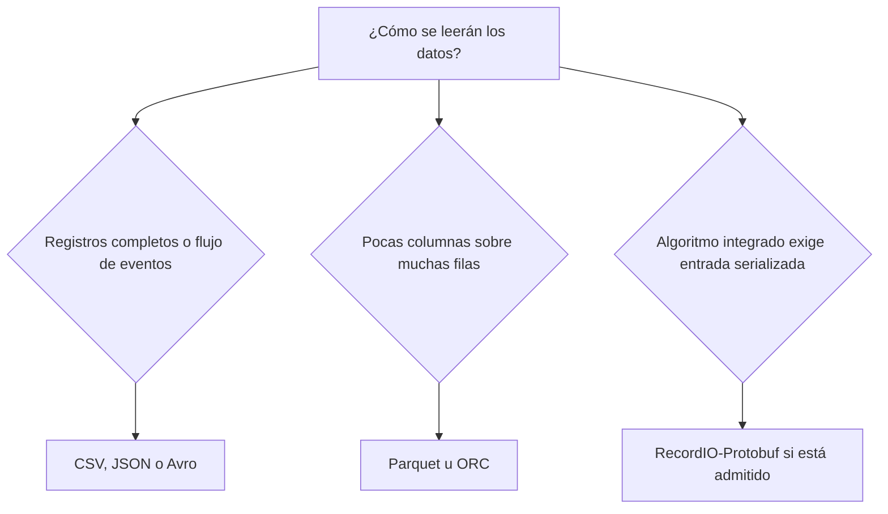
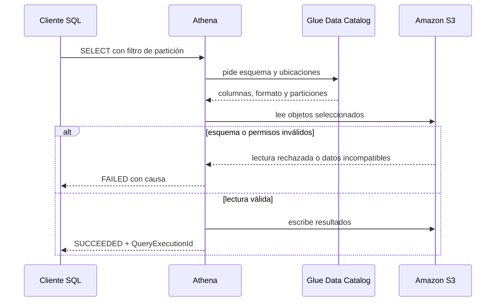

# 04. Formatos, organización y consulta de datos para ML

El formato correcto no se elige preguntando cuál comprime más, sino qué hará el siguiente consumidor con los datos. Un archivo puede ser excelente para intercambiar unas cuantas filas con una persona y desastroso para una consulta que lee tres columnas entre cientos; otro puede acelerar el entrenamiento de un algoritmo concreto de SageMaker y resultar inútil como tabla consultable por SQL. El patrón de lectura manda.

Este bloque construye una sola arquitectura de principio a fin: una empresa recibe extractos diarios de clientes en S3, conserva una copia fiel de lo recibido, produce datos tipados y compactos para análisis, calcula una tabla de características para un modelo de abandono y permite consultar cada capa sin descargarla. Sobre ese caso se explican los formatos, los esquemas, la compresión, las particiones, Glue Data Catalog, Athena, Redshift y Lake Formation.

## 1. La decisión central: optimizar para la lectura que realmente ocurrirá

Un **patrón de consumo** es la forma recurrente en que una aplicación lee los datos. Antes de elegir un formato deben contestarse estas preguntas:

1. ¿El consumidor lee registros completos o unas pocas columnas?
2. ¿Los datos llegan uno por uno, en lotes pequeños o en grandes lotes?
3. ¿El consumidor necesita inspeccionarlos a mano?
4. ¿Hay campos anidados o cada observación es una fila plana?
5. ¿El esquema debe viajar con los datos?
6. ¿La carga favorece latencia por registro, rendimiento agregado o consultas SQL exploratorias?
7. ¿El servicio que consumirá el archivo admite realmente ese formato y ese `ContentType`?

La última pregunta evita un error común: que un formato sea bueno en abstracto no significa que el algoritmo o servicio elegido sepa leerlo. Parquet es una magnífica representación analítica, pero varios algoritmos integrados de SageMaker esperan `text/csv` o `application/x-recordio-protobuf`; el canal de entrenamiento no acepta mágicamente todo lo que Athena consulta.

### 1.1 Dos familias que explican casi toda la elección

En un formato **orientado a filas**, los valores de una observación se guardan juntos. Si una aplicación necesita reconstruir el registro completo de un cliente, la lectura es natural: encuentra la fila y obtiene todas sus variables. CSV, JSON y Avro favorecen este patrón, aunque difieren mucho en tipos, estructura y eficiencia.

En un formato **orientado a columnas**, los valores de la misma columna se agrupan. Si una consulta requiere `edad`, `saldo` y `abandono` entre 150 columnas, el motor puede evitar leer las otras 147. Parquet y ORC favorecen este patrón. Además, valores parecidos quedan juntos y suelen comprimirse mejor.



**Lectura.** La bifurcación no afirma que cada familia tenga un solo uso. Indica qué acceso favorece su organización física. La tercera rama es una excepción gobernada por el contrato del consumidor: si el algoritmo integrado exige RecordIO-Protobuf, esa compatibilidad pesa más que la conveniencia de consultar el archivo con SQL.

## 2. Seis formatos y el trabajo para el que sirven

| Formato | Organización | Esquema | Fortalezas | Costos y límites | Uso razonable en ML |
|---|---|---|---|---|---|
| CSV | Filas, texto delimitado | Externo o implícito | Universal, legible, fácil de exportar | Tipos ambiguos, escape delicado, pobre para datos anidados, lee columnas innecesarias | Intercambio, muestras pequeñas, entrada de ciertos algoritmos integrados |
| JSON | Registros de texto con pares nombre-valor | Normalmente externo; cada registro conserva nombres | Flexible, anidado, adecuado para eventos | Verboso, repite nombres, tipos y estructuras pueden variar | Ingesta de eventos, logs, respuestas de API, copia cruda |
| Avro | Filas binarias por registros | Incluido en el contenedor y definido con JSON | Compacto, tipos explícitos, evolución de esquema, bueno para intercambio entre productores y consumidores | No ofrece la misma poda de columnas que un formato columnar | Eventos serializados, intercambio entre sistemas y procesamiento por filas |
| Parquet | Columnas, con grupos de filas y metadatos | Incluido en el archivo | Poda de columnas, compresión, estadísticas para saltar bloques, ecosistema analítico amplio | Mala elección para escrituras diminutas y lectura humana directa | Datos depurados, tablas de características, análisis y preparación de entrenamiento |
| ORC | Columnas, con *stripes* | Incluido en el archivo | Compresión e índices internos eficientes; tipos complejos | Menor ubicuidad que Parquet en algunos ecosistemas de ciencia de datos | Analítica en entornos centrados en Hive; alternativa válida a Parquet |
| RecordIO-Protobuf | Secuencia binaria de registros enmarcados | Contrato Protobuf esperado por el lector | Lectura secuencial eficiente, representación densa o dispersa, compatible con varios algoritmos integrados | No es un formato general de lago analítico; poca inspección manual | Canal de entrenamiento de algoritmos de SageMaker que lo admiten |

La tabla sirve para decidir, no para coronar un ganador. Un lago razonable puede conservar JSON crudo, producir Parquet depurado y generar RecordIO-Protobuf para un trabajo de entrenamiento particular. Duplicar representaciones con propósitos distintos no es necesariamente desperdicio: es separar contratos de consumo.

### 2.1 CSV: el mínimo común denominador

**CSV** (*Comma-Separated Values*) representa cada observación como una línea y separa campos mediante un delimitador. Lo produce casi cualquier sistema tabular; aparece como un objeto de texto en S3; el lector lo abre con una biblioteca o un algoritmo que conozca el delimitador y las reglas de comillas.

```csv
customer_id,snapshot_date,tenure_months,monthly_charge,churned
10492,2026-09-20,18,799.90,0
20411,2026-09-20,2,1099.50,1
```

El archivo parece inequívoco, pero no lo es. `10492` puede ser un entero o un identificador textual; `2026-09-20` puede ser una fecha o una cadena; una celda vacía puede significar dato ausente o cadena vacía. El archivo no resuelve esas decisiones: el esquema externo debe hacerlo.

CSV encaja cuando la interoperabilidad pesa más que el rendimiento, cuando un humano necesita inspeccionar una muestra o cuando el consumidor lo exige. Para entrenamiento con ciertos algoritmos integrados de SageMaker, AWS exige además detalles propios del algoritmo. En el contrato común de varios algoritmos integrados, el CSV no lleva encabezado y la variable objetivo ocupa la primera columna. Ese contrato no se extrapola a todo entrenamiento personalizado: un contenedor propio puede leer lo que su código implemente.

Los fallos típicos son silenciosos:

- una coma dentro de una descripción desplaza columnas si no se encierra y escapa correctamente;
- un encabezado tratado como observación introduce basura;
- `NA`, una celda vacía y `null` se interpretan de modo distinto según el lector;
- la inferencia lee `customer_id` como número y elimina ceros iniciales;
- un cambio de orden de columnas no es detectable por posición.

### 2.2 JSON: conservar la forma de los eventos

**JSON** (*JavaScript Object Notation*) representa cada registro mediante nombres y valores. Lo suele producir una API o una aplicación que emite eventos; aparece en S3 como texto; un consumidor reconstruye los campos por nombre, no solamente por posición.

Para análisis por lotes se prefiere con frecuencia **JSON Lines**: un objeto JSON completo por línea. Esta forma permite que un lector procese registros sucesivos sin cargar un arreglo gigantesco.

```json
{"customer_id":"10492","event_ts":"2026-09-20T10:14:22Z","event_type":"support_call","attributes":{"duration_seconds":481,"resolved":true}}
{"customer_id":"20411","event_ts":"2026-09-20T10:16:03Z","event_type":"payment_failed","attributes":{"attempt":2,"reason":"insufficient_funds"}}
```

`attributes` muestra la ventaja y el peligro. Cada tipo de evento puede guardar detalles propios sin forzar una tabla plana desde la ingesta. A cambio, dos productores pueden usar `duration_seconds`, `durationSeconds` y `duration` para el mismo concepto. JSON tolera esa deriva; no la corrige.

Athena puede consultar JSON mediante un *SerDe*, abreviatura de *serializer/deserializer*: una biblioteca que traduce bytes del archivo a filas y columnas para el motor SQL. El SerDe debe concordar con la forma real del documento. Un archivo con un arreglo JSON enorme no equivale a JSON Lines y puede necesitar otra preparación.

### 2.3 Avro: registros binarios con contrato explícito

**Apache Avro** guarda registros por filas en forma binaria. Un archivo contenedor Avro incluye el esquema que describe nombres y tipos. Lo produce normalmente una canalización que ya conoce el contrato del evento; aparece en almacenamiento como un archivo binario; el consumidor lee el esquema y deserializa cada registro.

Un esquema reducido podría expresar lo siguiente:

```json
{
  "type": "record",
  "name": "CustomerEvent",
  "fields": [
    {"name": "customer_id", "type": "string"},
    {"name": "event_ts", "type": "long"},
    {"name": "event_type", "type": "string"},
    {"name": "amount", "type": ["null", "double"], "default": null}
  ]
}
```

`{"type":"record"}` declara que cada unidad tiene campos nombrados. `event_ts` usa `long`; el significado temporal debe formar parte del contrato —por ejemplo, milisegundos desde el inicio de 1970— porque el entero por sí solo no lo dice. `amount` acepta `null` o `double` y define `null` como valor predeterminado, lo que permite que lectores compatibles procesen registros antiguos que no tenían ese campo.

La **evolución de esquema** es la capacidad de cambiar el contrato sin inutilizar todos los datos previos. Añadir un campo opcional con valor predeterminado suele ser compatible; renombrar o cambiar arbitrariamente un tipo puede no serlo. “Avro soporta evolución” no significa “cualquier cambio funciona”. La compatibilidad depende de la relación entre el esquema escritor y el esquema lector.

Avro resulta natural cuando se intercambian eventos tipados y se consumen registros completos. Para consultas que recorren miles de millones de filas pero seleccionan cuatro columnas, Parquet u ORC suelen adecuarse mejor.

### 2.4 Parquet: la representación habitual de la capa analítica

**Apache Parquet** organiza datos por columnas dentro de **grupos de filas** (*row groups*). Un trabajo por lotes lo produce después de limpiar y tipar datos; se almacena como objetos binarios en S3; Athena, Glue, Redshift Spectrum y bibliotecas de procesamiento pueden leer únicamente las columnas y grupos pertinentes.

Un grupo de filas conserva muchas observaciones, pero sus columnas se almacenan por separado. El archivo mantiene metadatos como tipos y, según el escritor, estadísticas de mínimo y máximo para bloques internos. Si una consulta filtra `monthly_charge > 5000` y un bloque tiene máximo 1400, el motor puede omitirlo. Esta omisión se denomina **predicate pushdown**: el filtro se empuja hacia la lectura para no materializar datos que serán descartados.

Parquet favorece tres reducciones distintas:

1. **Poda de particiones:** no se visitan ubicaciones de S3 excluidas por el filtro.
2. **Poda de columnas:** no se leen columnas ajenas al `SELECT` y al filtro.
3. **Salto de bloques:** las estadísticas internas permiten ignorar grupos incompatibles con el predicado.

Son mecanismos diferentes. Particionar por fecha no reemplaza el formato columnar; elegir Parquet no reemplaza una partición coherente.

### 2.5 ORC: columnar, con afinidad histórica por Hive

**ORC** (*Optimized Row Columnar*) también almacena por columnas. Su unidad grande de organización se llama *stripe*; dentro de ella mantiene datos, índices y estadísticas. Lo produce un motor compatible, se guarda en S3 y se consume con Athena u otros motores analíticos.

ORC y Parquet comparten las ventajas importantes para el examen: lectura selectiva de columnas, buena compresión, tipos complejos y capacidad de saltar bloques. La documentación de Athena presenta ambos como formatos adecuados para analítica distribuida. Parquet suele ser la elección conservadora cuando el conjunto alimentará herramientas variadas de ciencia de datos; ORC resulta especialmente razonable en un entorno ya centrado en Hive. Si el rendimiento importa, se mide con los datos y consultas reales: el nombre del formato no sustituye una prueba.

### 2.6 RecordIO-Protobuf: entrada especializada para entrenamiento

**RecordIO** delimita una secuencia de registros binarios para que el lector sepa dónde termina uno y empieza el siguiente. **Protocol Buffers** o **Protobuf** es una serialización binaria regida por un esquema: el escritor codifica campos y tipos que un lector compatible reconstruye. En SageMaker, la variante habitual `application/x-recordio-protobuf` coloca las características y, si corresponde, etiquetas en mensajes Protobuf. El productor es una etapa de preparación específica para el algoritmo; el archivo aparece en el prefix de entrada del trabajo; el contenedor de entrenamiento lo deserializa.

La documentación de SageMaker indica que distintos algoritmos integrados —entre ellos Linear Learner, K-Means, PCA y Random Cut Forest— admiten `application/x-recordio-protobuf`. Esto no autoriza a asumir que todos lo admiten: se consulta la tabla del algoritmo concreto.

RecordIO-Protobuf puede representar vectores densos y dispersos con tipos numéricos definidos. También puede combinarse con el modo `Pipe`, donde el trabajo transmite datos desde S3 en vez de copiar primero todo el conjunto al volumen de la instancia. La ventaja se encuentra en el camino de entrenamiento. Athena no lo convierte por ello en una tabla analítica cómoda.

La regla práctica es contundente:

- Parquet para conservar y consultar una tabla de características.
- RecordIO-Protobuf como derivado reproducible si el algoritmo elegido se beneficia o lo exige.
- No destruir la tabla Parquet después de serializarla: RecordIO es un artefacto de consumo, no la fuente maestra del conjunto depurado.

## 3. El esquema es un contrato, no una adivinanza del crawler

Un **esquema** asigna nombres, tipos y estructura a los campos. Su papel es impedir que los mismos bytes reciban interpretaciones incompatibles. Lo define el productor o el dueño del conjunto; aparece dentro de ciertos formatos y también como metadatos en el catálogo; el consumidor lo usa para reconstruir valores y validar operaciones.

| Formato | Dónde vive principalmente el esquema | Consecuencia |
|---|---|---|
| CSV | En configuración externa, documentación o catálogo | El archivo por sí mismo no distingue texto, fecha, entero o decimal |
| JSON | Suele imponerse externamente; cada registro conserva nombres | Flexibilidad alta, pero deriva posible entre registros |
| Avro | En el archivo contenedor y en el contrato del productor | El lector conoce nombres y tipos; evolución gobernada por compatibilidad |
| Parquet | En metadatos del archivo | El motor descubre tipos y puede usar estadísticas físicas |
| ORC | En metadatos del archivo | El motor descubre tipos, índices y estadísticas |
| RecordIO-Protobuf | En el contrato Protobuf que conoce el algoritmo | El archivo depende de un lector compatible con ese contrato |

### 3.1 Esquema al escribir y esquema al leer

**Schema-on-write** significa que los datos se validan o transforman contra un esquema antes de incorporarse a la representación de consumo. Una tabla interna de un almacén analítico es el ejemplo típico: una fila incompatible se rechaza o se convierte durante la carga.

**Schema-on-read** significa que los objetos permanecen en S3 y la interpretación se aplica cuando un motor los lee. Una tabla externa de Athena no mueve el archivo: declara cómo interpretarlo. Esto permite conservar datos crudos, pero traslada parte del riesgo a la lectura. Si ayer `monthly_charge` era decimal y hoy un productor manda `"unknown"`, el objeto puede existir perfectamente en S3 y fallar al consultarse o producir `NULL` según la conversión utilizada.

Un lago sano usa ambos enfoques en capas diferentes:

- la capa cruda tolera el formato recibido y preserva evidencia;
- la capa depurada aplica tipos, reglas de nulidad y deduplicación;
- la tabla de características fija columnas y semántica para entrenamiento.

### 3.2 Inferencia no equivale a validación

Un **crawler de AWS Glue** recorre una fuente, clasifica archivos, infiere esquemas y crea o actualiza tablas y particiones en Glue Data Catalog. Lo ejecuta Glue con un rol; el resultado aparece como metadatos; el lector revisa la tabla creada y decide si la inferencia representa el contrato real.

El crawler ahorra trabajo durante exploración y en fuentes numerosas de estructura estable. No posee conocimiento del negocio. Si una muestra contiene únicamente `0` y `1`, puede inferir un entero donde el equipo quería un booleano; si un identificador parece numérico, no sabe que deben conservarse ceros iniciales. En una tabla crítica y estable suele ser mejor definir el esquema de manera explícita y usar automatización controlada para registrar particiones.

| Situación | Decisión razonable |
|---|---|
| Descubrimiento inicial de cientos de prefixes desconocidos | Crawler, seguido de revisión |
| Tabla de características usada para entrenamientos reproducibles | Esquema explícito y cambios versionados |
| Nuevas particiones diarias con forma idéntica | Registro automatizado o proyección de particiones |
| Datos crudos con productores que cambian sin aviso | Crawler puede detectar cambios, pero se requieren alertas y validación |

## 4. Compresión: menos bytes, pero con una unidad de paralelismo

La **compresión** codifica los mismos datos con menos bytes. La aplica el escritor; aparece como propiedad del archivo o de bloques internos; el lector la revierte antes de entregar valores. En S3 reduce almacenamiento y transferencia. En Athena suele reducir costo y tiempo porque el servicio factura y procesa bytes leídos en su forma comprimida antes de descomprimirlos.

Hay dos casos que no deben mezclarse.

### 4.1 Compresión de un archivo de texto completo

`events.json.gz` es JSON comprimido con GZIP. La relación de compresión puede ser buena, pero GZIP normalmente obliga a comenzar desde el inicio del flujo. Un archivo enorme no puede dividirse libremente entre muchos lectores. Diez archivos razonables pueden alimentar varios trabajadores; un único archivo gigantesco puede limitar el paralelismo.

Esto no convierte a “muchos archivos” en una virtud sin límite. Cada objeto exige listados, solicitudes, apertura y planificación. Miles de archivos diminutos cambian tiempo de cómputo útil por administración.

### 4.2 Compresión interna de un formato columnar

Parquet y ORC dividen el archivo en unidades internas y comprimen columnas o bloques. El motor conserva puntos de división y metadatos, de modo que varios lectores pueden trabajar sobre partes distintas y omitir columnas. Un **códec** es el algoritmo concreto que comprime y descomprime esos bloques. Snappy favorece velocidad; GZIP favorece una reducción mayor a costa de CPU; Zstandard suele ofrecer un equilibrio competitivo. La compatibilidad del motor y el perfil de consulta gobiernan la elección.

Para este caso se usará **Parquet con Snappy**. No es un mandamiento universal: es un punto de partida interoperable y rápido para consultas frecuentes. Si el almacenamiento dominara el costo y la CPU de lectura sobrara, tendría sentido medir Zstandard o GZIP con la misma tabla.

## 5. Particionar significa asignar ubicaciones, no cortar el archivo al azar

Una **partición** de una tabla externa asocia valores de una o más claves con una ubicación que contiene los archivos correspondientes. La define el dueño de la tabla; aparece como metadato en Glue Data Catalog y como convención de prefixes en S3; Athena la usa para excluir ubicaciones antes de leer objetos.

En un esquema de estilo Hive, los valores se hacen visibles en la key:

```text
s3://empresa-ml-prod/curated/churn/snapshot_date=2026-09-18/part-00000.parquet
s3://empresa-ml-prod/curated/churn/snapshot_date=2026-09-19/part-00000.parquet
s3://empresa-ml-prod/curated/churn/snapshot_date=2026-09-20/part-00000.parquet
```

`snapshot_date=2026-09-20` no es una carpeta real de S3. Es parte de la key y, además, expresa una relación que el catálogo puede registrar: los objetos bajo ese prefix pertenecen a la partición cuyo `snapshot_date` vale `2026-09-20`.

Con esta consulta, Athena puede leer únicamente una ubicación:

```sql
SELECT customer_id, tenure_months, monthly_charge, churned
FROM ml_lake.churn_curated
WHERE snapshot_date = '2026-09-20';
```

Sin el `WHERE`, el motor debe considerar todas las fechas. Con un filtro sobre una columna que no es clave de partición, todavía puede aprovechar Parquet, pero primero debe abrir archivos de todas las particiones seleccionadas.

### 5.1 Elegir claves desde las consultas frecuentes

Una clave de partición sirve cuando aparece repetidamente en filtros y cada valor reúne una cantidad sustancial de datos. Fecha de captura, región o fuente pueden funcionar. `customer_id` casi nunca funciona: millones de clientes crearían millones de ubicaciones diminutas y metadatos desproporcionados.

Particionar demasiado fino produce el **problema de archivos pequeños**:

- más listados de S3;
- más solicitudes `GET`;
- más tiempo de planificación;
- menos datos útiles por tarea;
- más particiones en el catálogo;
- peor compresión porque cada archivo contiene pocas filas.

Si las consultas normales abarcan días completos, particionar por hora para satisfacer una consulta excepcional es mala optimización. Una partición diaria con datos ordenados por `event_ts` dentro de Parquet puede servir mejor al conjunto de cargas.

### 5.2 Registro, reparación y proyección

Crear el prefix no registra automáticamente una partición tradicional en Glue Data Catalog. Hay tres rutas principales:

1. `ALTER TABLE ADD PARTITION` registra una ubicación concreta y explícita.
2. Un crawler descubre prefixes y actualiza metadatos.
3. La **proyección de particiones** guarda reglas en las propiedades de la tabla; Athena calcula ubicaciones posibles en memoria sin almacenar cada partición.

`MSCK REPAIR TABLE` descubre particiones con forma `clave=valor`, pero no debe convertirse en reflejo operativo. Recorre jerarquías, puede tardar, añade particiones y no elimina las obsoletas. Para una canalización diaria conocida, registrar la partición producida es más preciso.

La proyección conviene cuando los valores siguen reglas predecibles y existen muchas particiones. Puede empeorar una tabla dispersa: si las reglas describen miles de combinaciones inexistentes, Athena realiza listados para lugares vacíos.

## 6. Tamaño de archivo: suficientes unidades para paralelismo, suficientes filas por unidad

No existe un tamaño universal decretado para todo archivo de ML. “64 MiB”, “128 MiB” o “512 MiB” sin contexto son números huérfanos. El tamaño útil depende del formato, la compresión, el número de columnas, el motor, la concurrencia y el patrón de consulta.

La documentación de Athena indica valores predeterminados internos de aproximadamente 128 MB para grupos de filas Parquet y 64 MB para *stripes* ORC. Esos valores describen unidades internas predeterminadas; no obligan a que cada objeto completo mida exactamente eso.

Como punto de partida para una capa Parquet analítica, archivos de cientos de MiB —por ejemplo, 128 a 512 MiB— suelen equilibrar paralelismo y administración. No es un límite de AWS. Se valida midiendo:

- tiempo de planificación;
- bytes leídos;
- cantidad de archivos abiertos;
- duración de las consultas representativas;
- capacidad de los trabajos que producen y consumen el conjunto.

Un archivo de 4 KiB desperdicia más tiempo en localizarse y abrirse que en procesarse. Un único archivo de varios TiB reduce las unidades independientes de trabajo y hace torpes las reescrituras. La salida correcta queda entre ambos extremos y cambia con la carga.

Para entrenamiento distribuido también se necesita un número suficiente de fragmentos. Si ocho instancias deben consumir datos y existe un único objeto indivisible, el almacenamiento limita la distribución. Tampoco conviene fabricar millones de fragmentos. El número de archivos debe permitir alimentar trabajadores sin ahogarlos en coordinación.

## 7. Lago de datos y almacén analítico: conservan cosas distintas

Un **lago de datos** es una organización de objetos que conserva datos en varias etapas y formatos, con almacenamiento desacoplado de los motores que los procesan. En este bloque el lago vive en S3. Los productores escriben objetos; los metadatos describen conjuntos; Athena, Glue, Redshift Spectrum o trabajos de ML los consumen.

Un **almacén analítico** (*data warehouse*) presenta datos estructurados para SQL recurrente, uniones, agregaciones y consumo de inteligencia de negocio. Amazon Redshift cumple este papel. Sus tablas internas utilizan almacenamiento y ejecución administrados por Redshift; también puede consultar datos externos de S3 mediante Redshift Spectrum.

| Necesidad | Lago en S3 | Redshift |
|---|---|---|
| Conservar datos crudos y variados | Natural | No es su función principal |
| Separar almacenamiento de motores | Sí | Las tablas internas pertenecen al almacén, aunque Spectrum consulta S3 |
| Consulta ocasional sin infraestructura permanente | Athena sobre el lago | Menos natural si no existe ya una carga de almacén |
| Muchas consultas SQL repetidas, uniones y paneles | Posible, pero no siempre óptimo | Papel principal del servicio |
| Compartir los mismos archivos con entrenamiento | Natural | Puede exportar o alimentar procesos, pero no sustituye el conjunto en S3 |
| Consultar S3 junto con tablas del almacén | Athena no consulta tablas internas de Redshift por defecto | Redshift Spectrum enlaza ambos mundos |

La arquitectura no tiene que elegir uno y quemar el otro. Un equipo puede conservar la fuente depurada en S3, explorarla con Athena y cargar agregados de negocio a Redshift. Si ya existe Redshift, Spectrum permite unir tablas internas con tablas externas de S3 sin copiar todo el lago.

## 8. Glue Data Catalog: el mapa; S3: el territorio

**AWS Glue Data Catalog** es un repositorio regional de metadatos. Su papel es dar nombres y esquemas estables a conjuntos cuyos bytes viven en otro lugar. Lo pueblan definiciones manuales, crawlers o trabajos; aparece como bases de datos, tablas y particiones; Athena, Glue y Redshift Spectrum consultan esos metadatos.

Una tabla del catálogo contiene, entre otras cosas:

- nombre y base de datos lógica;
- columnas y tipos;
- ubicación en S3;
- formato de entrada y salida;
- biblioteca SerDe cuando corresponde;
- claves de partición y ubicaciones de cada partición;
- propiedades adicionales.

No contiene las filas. Borrar una tabla externa del catálogo elimina el mapa, no necesariamente los objetos de S3. Borrar objetos de S3 deja un mapa que apunta al vacío. Esta separación explica muchos errores de examen.

## 9. Athena: SQL que lee objetos mediante metadatos

**Amazon Athena** ejecuta SQL sin administrar un clúster para la consulta. El usuario envía una sentencia; Athena consulta el catálogo para localizar y decodificar los objetos; lee S3; y escribe el resultado de la ejecución en una ubicación de S3 configurada para resultados.



**Lectura.** El cliente no consulta “a S3 con SQL” de forma directa. Athena necesita la interpretación del catálogo, acceso a los objetos de entrada y una ubicación donde dejar resultados. El `QueryExecutionId` identifica una ejecución asíncrona: recibirlo no significa que la consulta ya terminó.

Athena resulta adecuado para exploración, controles de calidad, preparación ligera y consultas ocasionales. Su costo depende principalmente de datos escaneados en el modelo bajo demanda; por eso Parquet, compresión, poda de columnas y filtros de partición son decisiones económicas además de técnicas.

## 10. Redshift y Redshift Spectrum en esta arquitectura

**Amazon Redshift** es el almacén analítico administrado. Su papel aparece cuando el equipo necesita rendimiento SQL recurrente, concurrencia de usuarios, integración con paneles y un modelo más estable de tablas analíticas. Los datos pueden cargarse en tablas internas optimizadas por Redshift.

**Redshift Spectrum** permite que Redshift consulte archivos estructurados o semiestructurados en S3 sin cargarlos primero en tablas internas. Un esquema externo de Redshift referencia una base de datos del catálogo; un rol asociado autoriza leer metadatos y objetos; las consultas usan nombres externos junto con tablas internas.

```sql
CREATE EXTERNAL SCHEMA lake_ml
FROM DATA CATALOG
DATABASE 'ml_lake'
IAM_ROLE 'arn:aws:iam::111111111111:role/RedshiftSpectrumRole'
REGION 'us-east-1';
```

`FROM DATA CATALOG` indica que las definiciones externas proceden del catálogo. `DATABASE 'ml_lake'` selecciona la base lógica que también puede ver Athena. `IAM_ROLE` no es el usuario que ejecuta SQL: es el rol que Redshift asume para consultar el catálogo y S3. `REGION` señala dónde vive el catálogo.

Después, una consulta puede referirse a `lake_ml.churn_curated`. Spectrum no convierte esos objetos en tablas internas. Los datos principales permanecen en S3 y buena parte del procesamiento se ejecuta en la capa de Spectrum.

## 11. Lake Formation: gobierno central sobre catálogo y datos

**AWS Lake Formation** gobierna acceso a datos de un lago y a sus metadatos. El administrador registra ubicaciones y concede permisos; las reglas aparecen sobre recursos del Data Catalog y datos subyacentes; servicios integrados como Athena, Glue y Redshift Spectrum las aplican.

IAM y Lake Formation no son sustitutos intercambiables. En un recurso gobernado, una solicitud debe superar las comprobaciones pertinentes de ambos modelos:

- IAM autoriza llamadas a APIs y el uso de recursos de AWS;
- Lake Formation concede privilegios de estilo base de datos, como `SELECT` o `DESCRIBE`, sobre bases, tablas, columnas, filas o celdas gobernadas;
- el acceso efectivo a S3 se coordina mediante la integración de Lake Formation y los servicios consumidores.

El valor aparece cuando una bucket policy y decenas de identity policies ya no expresan bien preguntas como “científicos de datos pueden consultar todas las características salvo las columnas sensibles” o “el equipo regional ve únicamente sus filas”. Para un laboratorio pequeño con dos tablas, Lake Formation puede ser más administración de la necesaria; para un lago compartido entre cuentas y equipos, centraliza permisos y auditoría.

Una trampa frecuente es conceder `s3:GetObject` y asumir que Athena podrá consultar una tabla gobernada. Puede seguir faltando `SELECT` en Lake Formation o acceso a los metadatos. La trampa inversa también existe: un `GRANT SELECT` no autoriza por sí solo todas las llamadas de API que la identidad necesita.

## 12. Caso completo: datos de abandono organizados en S3 y consultados con Athena

### 12.1 Qué produce cada actor

El CRM exporta diariamente un CSV. El equipo de plataforma deposita una copia inmutable en la capa `raw`. Athena interpreta esa copia mediante una tabla externa. Una consulta CTAS —`CREATE TABLE AS SELECT`— tipa, filtra y convierte los registros a Parquet en `curated`. Un proceso posterior calcula características y escribe otra tabla Parquet en `features`. Los trabajos de entrenamiento leen una captura concreta de `features`.

```text
s3://empresa-ml-prod/
├── raw/
│   └── source=crm/entity=churn/ingest_date=2026-09-20/churn.csv
├── curated/
│   └── churn/snapshot_date=2026-09-20/part-00000.parquet
├── features/
│   └── churn_v3/snapshot_date=2026-09-20/part-00000.parquet
└── athena-results/
    └── ...
```

Los componentes `source=crm` y `entity=churn` organizan la capa cruda, pero no se declaran necesariamente como particiones de la tabla porque cada tabla ya apunta a una fuente y entidad concretas. `ingest_date` sí cambia en cada entrega. En la capa depurada, `snapshot_date` expresa la fecha lógica de la fotografía utilizada por análisis y entrenamiento.

La salida de Athena se separa de los datos de negocio. Si se mezclara dentro del prefix de una tabla, un crawler o una consulta recursiva podría interpretar resultados de consultas como si fueran entradas. Esa clase de desastre es ridícula, perfectamente evitable y sorprendentemente común.

### 12.2 Subir el extracto crudo

El operador se encuentra en una terminal autenticada mediante el perfil SSO `empresa-dev`. El bucket ya existe y el rol posee permiso para escribir únicamente bajo `raw/source=crm/`.

```bash
aws s3 cp data/churn_2026-09-20.csv \
  s3://empresa-ml-prod/raw/source=crm/entity=churn/ingest_date=2026-09-20/churn.csv \
  --content-type text/csv \
  --metadata schema-version=v1,producer=crm \
  --profile empresa-dev \
  --region us-east-1
```

`aws s3 cp` crea el objeto bajo la key completa. `--content-type text/csv` deja metadatos HTTP útiles para herramientas, pero no crea un esquema. `--metadata` conserva dos pares informativos en el objeto; Glue no convierte automáticamente esos pares en columnas. `--profile` selecciona credenciales configuradas, sin incrustarlas en el comando.

Si se cambia `ingest_date` en la key pero el archivo contiene otra entrega, la partición mentirá. La organización física también es dato y debe validarse.

### 12.3 Crear la base lógica del catálogo

```bash
aws glue create-database \
  --database-input '{"Name":"ml_lake","Description":"Tablas externas del lago de ML"}' \
  --profile empresa-dev \
  --region us-east-1
```

La base `ml_lake` agrupa tablas del catálogo. No inicia un servidor, no crea una base con almacenamiento propio y no mueve objetos. Si ya existe, Glue devuelve `AlreadyExistsException`; una automatización debe consultar primero o tratar ese resultado como estado esperado.

### 12.4 Declarar explícitamente el CSV crudo

La tabla usa `string` en campos susceptibles de suciedad. El tipado fuerte se aplicará al producir la capa depurada, donde los errores pueden aislarse en vez de impedir toda exploración del archivo recibido.

```sql
CREATE EXTERNAL TABLE IF NOT EXISTS ml_lake.churn_raw (
    customer_id string,
    tenure_months string,
    monthly_charge string,
    support_calls_90d string,
    churned string,
    exported_at string
)
PARTITIONED BY (ingest_date string)
ROW FORMAT SERDE 'org.apache.hadoop.hive.serde2.OpenCSVSerde'
WITH SERDEPROPERTIES (
    'separatorChar' = ',',
    'quoteChar' = '"',
    'escapeChar' = '\\'
)
STORED AS TEXTFILE
LOCATION 's3://empresa-ml-prod/raw/source=crm/entity=churn/'
TBLPROPERTIES ('skip.header.line.count'='1');
```

`CREATE EXTERNAL TABLE` crea metadatos y declara que las filas viven fuera de Athena. Las seis columnas siguen el orden físico del CSV. `PARTITIONED BY` agrega `ingest_date` como columna virtual obtenida de la ubicación, no del contenido de cada línea. `OpenCSVSerde` procesa delimitadores, comillas y escapes. `LOCATION` apunta al prefix raíz común. `skip.header.line.count` impide tratar el encabezado como una observación.

La elección de `string` para `monthly_charge` es deliberada en `raw`: una fila con `unknown` podrá detectarse mediante SQL. Declararla `double` aquí puede convertir la consulta inicial en una pelea con el parser antes de haber localizado la fila defectuosa.

### 12.5 Registrar la entrega concreta

```sql
ALTER TABLE ml_lake.churn_raw
ADD IF NOT EXISTS PARTITION (ingest_date='2026-09-20')
LOCATION 's3://empresa-ml-prod/raw/source=crm/entity=churn/ingest_date=2026-09-20/';
```

La sentencia agrega al catálogo la relación entre el valor `2026-09-20` y su prefix. `IF NOT EXISTS` hace repetible la operación: volver a ejecutarla no crea una segunda partición. No verifica que el objeto sea correcto; únicamente registra dónde buscar.

### 12.6 Ejecutar el DDL con AWS CLI

Athena recibe consultas de forma asíncrona. **DDL** (*Data Definition Language*) designa aquí las sentencias SQL que crean o modifican definiciones, como `CREATE TABLE`. Un **grupo de trabajo de Athena** (*workgroup*) reúne ejecuciones bajo una misma configuración y puede imponer ubicación de resultados y controles de uso. El siguiente comando supone que `sql/create_churn_raw.sql` contiene el DDL anterior y que el *workgroup* `ml-engineering` ya existe. Se proporciona además una salida explícita para que el ejemplo sea autocontenido.

```bash
aws athena start-query-execution \
  --query-string file://sql/create_churn_raw.sql \
  --query-execution-context Database=ml_lake,Catalog=AwsDataCatalog \
  --result-configuration OutputLocation=s3://empresa-ml-prod/athena-results/ \
  --work-group ml-engineering \
  --profile empresa-dev \
  --region us-east-1
```

`file://` hace que AWS CLI lea la sentencia desde un archivo local. `Catalog=AwsDataCatalog` selecciona el catálogo integrado. `OutputLocation` indica dónde guardar resultados y metadatos de ejecución; la configuración forzada del *workgroup* puede reemplazar este valor. La respuesta contiene `QueryExecutionId`, no las filas ni la garantía de éxito.

Para inspeccionar el estado:

```bash
aws athena get-query-execution \
  --query-execution-id 7c3f1f4e-1111-2222-3333-abcdef123456 \
  --query 'QueryExecution.{State:Status.State,Reason:Status.StateChangeReason,Bytes:Statistics.DataScannedInBytes}' \
  --output table \
  --profile empresa-dev \
  --region us-east-1
```

`--query` usa JMESPath, un lenguaje para seleccionar y reorganizar campos de una respuesta JSON. `StateChangeReason` es crucial cuando el estado es `FAILED`; omitirlo produce el diagnóstico técnico equivalente a “no jaló”. `DataScannedInBytes` permite comparar físicamente dos diseños que devuelven el mismo resultado.

### 12.7 Convertir la entrega a Parquet con CTAS

La capa depurada debe rechazar identificadores vacíos y convertir tipos. La consulta escribe un conjunto nuevo; no modifica el CSV.

```sql
CREATE TABLE ml_lake.churn_curated
WITH (
    format = 'PARQUET',
    parquet_compression = 'SNAPPY',
    external_location = 's3://empresa-ml-prod/curated/churn/',
    partitioned_by = ARRAY['snapshot_date']
)
AS
SELECT
    customer_id,
    TRY_CAST(tenure_months AS integer) AS tenure_months,
    TRY_CAST(monthly_charge AS double) AS monthly_charge,
    TRY_CAST(support_calls_90d AS integer) AS support_calls_90d,
    TRY_CAST(churned AS integer) AS churned,
    FROM_ISO8601_TIMESTAMP(exported_at) AS exported_at,
    ingest_date AS snapshot_date
FROM ml_lake.churn_raw
WHERE ingest_date = '2026-09-20'
  AND customer_id IS NOT NULL
  AND customer_id <> '';
```

`format='PARQUET'` define la representación escrita. `parquet_compression='SNAPPY'` elige el códec dentro de Parquet. `external_location` es el destino de los nuevos objetos. `partitioned_by` declara que `snapshot_date` será la clave; en CTAS la columna de partición se coloca al final del `SELECT`.

`TRY_CAST` devuelve `NULL` cuando un texto no puede convertirse, lo que permite terminar la transformación y después contar fallos. Un `CAST` ordinario puede abortar la consulta ante el primer valor incompatible. Esta tolerancia no debe esconder datos dañados: la siguiente consulta verifica el resultado.

```sql
SELECT
    COUNT(*) AS rows_total,
    SUM(CASE WHEN monthly_charge IS NULL THEN 1 ELSE 0 END) AS invalid_charge_rows,
    SUM(CASE WHEN churned NOT IN (0, 1) OR churned IS NULL THEN 1 ELSE 0 END) AS invalid_label_rows
FROM ml_lake.churn_curated
WHERE snapshot_date = '2026-09-20';
```

La transformación y la validación son dos acciones distintas. CTAS produce; la consulta posterior decide si la salida cumple el contrato. Si hay filas inválidas, una canalización seria no promueve esa captura a entrenamiento.

> **Advertencia operativa.** CTAS exige que el destino no contenga restos incompatibles de una ejecución anterior. Un fallo puede dejar objetos aunque la tabla no quede creada como se esperaba. La automatización debe usar ubicaciones versionadas o limpiar únicamente un destino de ejecución que haya resuelto de forma segura.

### 12.8 Consultar y esperar desde boto3

El siguiente programa lo ejecuta una máquina del equipo o un entorno de desarrollo con un perfil SSO ya configurado. Envía una consulta, espera un estado terminal, informa bytes escaneados y pagina los resultados. No contiene claves de acceso.

```python
import time

import boto3


REGION = "us-east-1"
PROFILE = "empresa-dev"
DATABASE = "ml_lake"
WORKGROUP = "ml-engineering"
OUTPUT = "s3://empresa-ml-prod/athena-results/"

SQL = """
SELECT customer_id, tenure_months, monthly_charge, churned
FROM churn_curated
WHERE snapshot_date = '2026-09-20'
  AND monthly_charge >= 1000
ORDER BY monthly_charge DESC
LIMIT 100
"""

session = boto3.Session(profile_name=PROFILE, region_name=REGION)
athena = session.client("athena")

started = athena.start_query_execution(
    QueryString=SQL,
    QueryExecutionContext={"Database": DATABASE, "Catalog": "AwsDataCatalog"},
    ResultConfiguration={"OutputLocation": OUTPUT},
    WorkGroup=WORKGROUP,
)
query_id = started["QueryExecutionId"]

while True:
    execution = athena.get_query_execution(QueryExecutionId=query_id)[
        "QueryExecution"
    ]
    state = execution["Status"]["State"]

    if state == "SUCCEEDED":
        break
    if state in {"FAILED", "CANCELLED"}:
        reason = execution["Status"].get("StateChangeReason", "sin detalle")
        raise RuntimeError(f"Athena terminó en {state}: {reason}")

    time.sleep(2)

bytes_scanned = execution["Statistics"]["DataScannedInBytes"]
print(f"query_id={query_id} bytes_scanned={bytes_scanned}")

paginator = athena.get_paginator("get_query_results")
first_row = True

for page in paginator.paginate(QueryExecutionId=query_id):
    for row in page["ResultSet"]["Rows"]:
        values = [cell.get("VarCharValue") for cell in row["Data"]]
        if first_row:
            print("columnas:", values)
            first_row = False
        else:
            print(values)
```

`boto3.Session(profile_name=PROFILE, region_name=REGION)` crea una sesión con el mismo perfil configurado para AWS CLI; si la sesión SSO expiró, se renueva con el flujo de inicio de sesión antes de ejecutar el script. `start_query_execution` devuelve inmediatamente un identificador. `QueryExecutionContext` evita depender de una base predeterminada. `ResultConfiguration` señala el prefix de resultados, aunque el *workgroup* puede imponer otro.

El bucle consulta `get_query_execution` cada dos segundos. Solamente `SUCCEEDED` permite pedir filas. `FAILED` y `CANCELLED` son terminales y deben detener el flujo con `StateChangeReason`; continuar paginando ocultaría el error original.

`DataScannedInBytes` mide los bytes leídos por la ejecución y permite comprobar el efecto de particiones y formatos. El paginador de `get_query_results` sigue los tokens de continuación. En la primera página, Athena devuelve una fila de encabezados; `first_row` la separa de los datos.

Tres perturbaciones útiles:

- **Eliminar el filtro `snapshot_date`:** la consulta puede seguir siendo correcta, pero leerá más particiones y normalmente más bytes.
- **Cambiar la ubicación de resultados por el prefix de la tabla:** las salidas pueden contaminar el conjunto consultado.
- **Tratar `QueryExecutionId` como éxito:** el código intentará consumir una ejecución todavía `RUNNING` o ya `FAILED`.
- **Usar `get_query_results` sin paginador:** solamente se procesa la primera página y el recorte parece un conjunto completo.

### 12.9 Inspeccionar lo que el catálogo cree

Cuando una consulta falla por una columna o ubicación inesperada, conviene observar metadatos antes de culpar a S3.

```python
import boto3


session = boto3.Session(profile_name="empresa-dev", region_name="us-east-1")
glue = session.client("glue")

table = glue.get_table(DatabaseName="ml_lake", Name="churn_curated")["Table"]

print("location:", table["StorageDescriptor"]["Location"])
print("columns:")
for column in table["StorageDescriptor"]["Columns"]:
    print(f"  {column['Name']}: {column['Type']}")

print("partition keys:")
for key in table.get("PartitionKeys", []):
    print(f"  {key['Name']}: {key['Type']}")

paginator = glue.get_paginator("get_partitions")
for page in paginator.paginate(
    DatabaseName="ml_lake",
    TableName="churn_curated",
    Expression="snapshot_date='2026-09-20'",
):
    for partition in page["Partitions"]:
        print(partition["Values"], partition["StorageDescriptor"]["Location"])
```

`get_table` recupera la definición, no los datos. Las columnas físicas están en `StorageDescriptor.Columns`; las claves virtuales están en `PartitionKeys`. Confundir ambas listas lleva a creer que `snapshot_date` debe existir dentro del Parquet.

El paginador de `get_partitions` evita suponer que todas las particiones caben en una respuesta. `Expression` filtra metadatos en el servicio. La salida permite comprobar que el valor y la ubicación coinciden con la captura esperada.

### 12.10 Permisos mínimos por papel

El detalle exacto depende de ARN, cifrado y gobierno, pero el recorrido obliga a distinguir acciones:

| Actor | Necesita, en esencia | Por qué |
|---|---|---|
| Productor del CSV | escribir en el prefix `raw` | Deposita la entrega y nada más |
| Rol que ejecuta Athena | iniciar/consultar ejecuciones, leer metadatos, listar bucket, leer objetos de entrada y escribir resultados | Athena coordina catálogo, entrada y salida |
| Proceso de CTAS | lo anterior más escritura en `curated` | Materializa nuevos objetos |
| Rol de Redshift Spectrum | leer el catálogo y los prefixes externos | Redshift actúa en nombre de ese rol |
| Usuario sobre tabla gobernada | APIs permitidas por IAM y privilegios de Lake Formation | Debe superar ambas capas aplicables |

Si los objetos usan una clave KMS administrada por el cliente, los roles también necesitan las acciones KMS pertinentes y la key policy debe permitirlas. `s3:GetObject` sobre un ciphertext sin permiso de descifrado no produce datos legibles.

## 13. Cómo elegir sin memorizar una tabla muerta

### 13.1 Decisión por patrón

| Escenario | Elección inicial | Razón dominante |
|---|---|---|
| Un proveedor entrega 20 MB mensuales y analistas lo inspeccionan | CSV crudo; convertir a Parquet si crece el análisis | Interoperabilidad primero |
| Una API emite eventos heterogéneos con campos anidados | JSON Lines crudo | Conserva forma y nombres del evento |
| Productores y consumidores intercambian eventos tipados | Avro | Contrato binario y evolución controlada |
| Athena explora cientos de GB y selecciona pocas columnas | Parquet particionado y comprimido | Menos columnas y bloques leídos |
| Plataforma ya centrada en Hive y mide mejor resultado con ORC | ORC | Alineación con el ecosistema y rendimiento medido |
| Linear Learner integrado consumirá un gran conjunto mediante Pipe mode | RecordIO-Protobuf si el algoritmo y configuración lo admiten | Contrato de entrenamiento y flujo secuencial |

### 13.2 Antipatrones y su corrección

**“Todo en CSV porque todo lo abre.”** También todo lo escanea. Conserva CSV donde la interoperabilidad importe y deriva Parquet para analítica repetida.

**“Particionar por cada columna que aparece en un `WHERE`.”** Una clave de cardinalidad alta puede crear millones de prefixes. Se particiona para consultas frecuentes y con volumen suficiente por valor.

**“Un crawler garantiza el esquema.”** Un crawler infiere metadatos a partir de evidencia; el equipo define el contrato de negocio.

**“Comprimir siempre al máximo.”** La compresión usa CPU y puede reducir divisibilidad. Se optimiza tiempo y costo total, no el tamaño como deporte olímpico.

**“Parquet es el formato de entrenamiento de SageMaker.”** Puede ser la fuente analítica de la preparación, pero el canal final depende del contenedor o algoritmo. Hay que consultar formatos admitidos.

**“Glue almacena las tablas.”** Glue Data Catalog almacena definiciones. S3 conserva los objetos; Redshift conserva sus tablas internas.

**“Lake Formation reemplaza IAM.”** Lake Formation añade gobierno de datos. Las llamadas siguen necesitando permisos IAM y, en recursos gobernados, privilegios de Lake Formation.

## 14. Diagnóstico rápido

### Athena lee cero filas

1. Comprobar que la tabla apunta al prefix correcto.
2. Comprobar que existe una partición registrada para el filtro.
3. Comparar `Partition.Values` con la ubicación de S3.
4. Verificar que el SerDe corresponde al formato real.
5. Revisar que archivos y datos de tablas distintas no compartan una jerarquía ambigua.

### Athena falla al convertir columnas

1. Consultar la capa cruda como `string`.
2. Localizar valores incompatibles con `TRY_CAST`.
3. Determinar si es suciedad de datos o cambio legítimo de contrato.
4. Corregir el productor o versionar el esquema; no maquillar todo como texto en la capa depurada.

### La consulta correcta es lenta y cara

1. Leer `DataScannedInBytes`.
2. Confirmar que el filtro usa claves de partición.
3. Evitar `SELECT *` si se necesitan pocas columnas.
4. Convertir texto a Parquet u ORC.
5. Compactar archivos diminutos.
6. Revisar si la partición es demasiado fina o demasiado gruesa.
7. Usar `EXPLAIN` para verificar qué particiones planea leer Athena.

### El rol puede leer S3, pero la consulta recibe acceso denegado

1. Verificar permisos para ejecutar Athena y usar el *workgroup*.
2. Verificar lectura de Glue Data Catalog.
3. Verificar escritura en la ubicación de resultados.
4. Verificar KMS si los objetos o resultados usan SSE-KMS.
5. Si Lake Formation gobierna la tabla, verificar `DESCRIBE` y `SELECT` según el caso.

## 15. Lo que hay que recordar para MLA-C01

1. El patrón de consumo decide el formato.
2. CSV y JSON son legibles y flexibles, pero costosos para analítica masiva.
3. Avro es binario, orientado a registros y lleva un esquema; encaja en intercambio de eventos.
4. Parquet y ORC son columnares: reducen lectura de columnas, comprimen bien y conservan metadatos útiles.
5. RecordIO-Protobuf es una entrada especializada de varios algoritmos integrados de SageMaker; no sustituye una tabla analítica.
6. Una partición asigna valores a ubicaciones y permite podar prefixes antes de leer archivos.
7. Demasiadas particiones y objetos pequeños degradan planificación, solicitudes y compresión.
8. Glue Data Catalog almacena metadatos; un crawler infiere, no garantiza, un contrato.
9. Athena consulta S3 mediante metadatos y escribe resultados en S3; la ejecución es asíncrona.
10. Redshift es un almacén analítico; Spectrum consulta tablas externas en S3.
11. Lake Formation añade permisos finos y gobierno central, coordinado con IAM.
12. Formato, compresión, partición y tamaño se optimizan juntos; ninguno arregla por sí solo un diseño malo.

# Preguntas de práctica

## Dificultad media

### 1. Conversión para reducir datos escaneados

Una empresa guarda 800 GB de extractos CSV en S3. Los científicos consultan semanalmente cinco columnas de un total de 120 y filtran por `snapshot_date`. Las consultas de Athena son lentas y escanean gran parte del conjunto. ¿Qué cambio ofrece la mejora más directa?

A. Comprimir cada CSV completo con GZIP y conservar una sola key por año.  
B. Convertir a Parquet, comprimir y particionar por `snapshot_date`.  
C. Copiar los CSV a EBS antes de ejecutar Athena.  
D. Crear un crawler cada vez que se ejecuta una consulta.

### 2. Función del catálogo

Un ingeniero elimina por error una tabla externa de Glue Data Catalog. Los objetos Parquet continúan en S3. ¿Cuál afirmación es correcta?

A. Glue elimina automáticamente los objetos porque la tabla era su propietaria.  
B. Los datos permanecen; puede reconstruirse la definición que apunta a su ubicación.  
C. Athena conserva una copia completa de la tabla y no se afecta.  
D. Redshift adopta automáticamente los objetos huérfanos.

### 3. JSON de eventos

Una aplicación emite eventos con campos comunes y un objeto `attributes` distinto según el tipo de evento. El equipo necesita conservar fielmente la ingesta antes de normalizarla. ¿Qué formato inicial es más razonable?

A. JSON Lines.  
B. CSV sin comillas.  
C. RecordIO-Protobuf sin definir un lector.  
D. Una tabla interna de Redshift como única copia.

### 4. Consulta asíncrona

Un script llama `start_query_execution` y recibe un `QueryExecutionId`. Inmediatamente intenta tratar ese identificador como el resultado SQL. ¿Qué debe hacer?

A. Decodificar el UUID porque contiene las filas.  
B. Esperar un estado terminal con `get_query_execution` y, si tiene éxito, paginar `get_query_results`.  
C. Buscar el identificador en Glue Data Catalog.  
D. Ejecutar un crawler sobre el prefix de resultados.

### 5. Papel de Redshift Spectrum

Una empresa ya tiene tablas de ventas en Redshift y una tabla de características Parquet en S3, catalogada en Glue. Quiere unirlas con SQL sin cargar previamente toda la tabla de S3. ¿Qué componente corresponde?

A. Redshift Spectrum con un esquema externo.  
B. S3 Glacier Flexible Retrieval.  
C. Glue crawler como motor de consulta.  
D. RecordIO en Pipe mode.

## Dificultad alta

### 6. Partición excesiva

Un conjunto Parquet de 2 TB está particionado por `snapshot_date` y `customer_id`. La mayoría de las combinaciones contiene un archivo de 20 KiB. Las consultas filtran por fecha y calculan agregados de todos los clientes. ¿Cuál es la corrección más adecuada?

A. Mantener ambas claves y comprimir cada archivo con GZIP.  
B. Eliminar la partición por `customer_id`, compactar por fecha y conservar `customer_id` como columna.  
C. Añadir también `model_version` como clave de partición.  
D. Convertir todo a JSON para reducir metadatos.

### 7. Formato analítico frente a formato de entrenamiento

Un equipo conserva una tabla de características en Parquet y usará Linear Learner integrado con una configuración que admite RecordIO-Protobuf. También necesita consultas ad hoc en Athena. ¿Qué diseño es más sólido?

A. Sustituir definitivamente Parquet por RecordIO-Protobuf para que exista una sola copia.  
B. Conservar Parquet como tabla analítica y generar RecordIO-Protobuf versionado como artefacto de entrada reproducible.  
C. Convertir Parquet a CSV con encabezado, porque todos los algoritmos de SageMaker exigen encabezados.  
D. Registrar RecordIO-Protobuf con un crawler y usarlo como tabla principal de Athena.

### 8. Permisos con Lake Formation

Un rol tiene `s3:GetObject` sobre el prefix y permisos para llamar a Athena, pero una tabla gobernada por Lake Formation devuelve acceso denegado. Otro rol consulta la misma tabla. ¿Cuál es la explicación más probable?

A. Parquet solamente puede consultarse desde Redshift.  
B. Al primer rol le falta un privilegio de Lake Formation, como `SELECT`, o acceso de catálogo aplicable.  
C. Athena exige que el rol sea usuario IAM y no rol.  
D. El objeto debe hacerse público.

### 9. Crawler y deriva de esquema

Un crawler infiere `customer_id` como `bigint` porque las primeras entregas contienen solamente dígitos. Un mes después llegan identificadores como `MX-0017`. El identificador es una clave nominal, no una cantidad. ¿Qué decisión previene mejor el problema?

A. Ejecutar el crawler con más frecuencia y aceptar cualquier tipo inferido.  
B. Definir explícitamente `customer_id` como `string` en la tabla gobernada y validar las entregas.  
C. Convertir los identificadores nuevos a cero.  
D. Particionar por `customer_id` para que cada tipo tenga su prefix.

### 10. Diagnóstico de costo sin cambiar el resultado

Dos consultas devuelven exactamente las mismas 100 filas. La primera usa `SELECT *` sobre CSV no particionado; la segunda selecciona cuatro columnas de Parquet y filtra una partición diaria. ¿Qué evidencia demuestra mejor la mejora física en Athena?

A. Que ambas tienen el mismo número de filas.  
B. Que el `QueryExecutionId` de la segunda es más corto.  
C. Que `DataScannedInBytes` y la duración de la segunda son menores bajo condiciones comparables.  
D. Que Glue muestra más columnas para la primera.

# Soluciones razonadas

## 1. B

Parquet permite leer únicamente las columnas necesarias y la partición por `snapshot_date` evita visitar fechas excluidas. Compresión reduce todavía más los bytes. La opción A puede reducir tamaño, pero un gran GZIP de texto conserva lectura por filas y limita división del archivo. EBS no es la fuente que Athena consulta y un crawler no optimiza el formato.

## 2. B

La tabla externa es metadato: esquema, formato y ubicación. Los objetos permanecen en S3 y pueden volver a catalogarse. Athena no mantiene una copia completa ni Redshift reclama objetos automáticamente. La recuperación exige conocer el esquema y las ubicaciones correctas.

## 3. A

JSON Lines conserva nombres, estructura anidada y un registro por línea, una forma apropiada para ingesta de eventos. CSV aplana mal estructuras variables. RecordIO requiere un contrato y consumidor específicos. Una tabla interna de Redshift como única copia sacrifica la preservación flexible de la entrada.

## 4. B

`start_query_execution` inicia trabajo asíncrono. El script debe consultar el estado, manejar `FAILED` y `CANCELLED`, y solamente después paginar filas. El identificador referencia una ejecución; no codifica el resultado.

## 5. A

Redshift Spectrum permite crear un esquema externo que referencia el catálogo y consultar archivos en S3 desde SQL de Redshift. Un crawler descubre metadatos, pero no ejecuta uniones. Glacier y RecordIO resuelven problemas distintos.

## 6. B

Las consultas agregan todos los clientes, de modo que `customer_id` no poda datos útiles y fragmenta cada fecha en objetos minúsculos. Particionar por fecha, compactar y mantener el identificador como columna reduce metadatos y solicitudes. Añadir claves agrava el problema; cambiar a JSON elimina ventajas columnares.

## 7. B

Los dos formatos atienden consumidores distintos. Parquet sostiene consultas y preparación; RecordIO-Protobuf atiende el contrato del algoritmo. Si el derivado incluye versión de datos y transformación, puede regenerarse y auditarse. Reemplazar la fuente analítica por RecordIO dificulta consultas sin aportar una ventaja general.

## 8. B

En una tabla gobernada no basta con leer bytes. El rol debe superar IAM y los privilegios aplicables de Lake Formation sobre metadatos y datos. Hacer público el objeto sería una barbaridad de seguridad y no corrige correctamente el modelo de autorización.

## 9. B

El significado del campo determina el tipo. Un identificador nominal debe ser `string`, incluso cuando una muestra inicial parezca numérica. Un crawler infiere a partir de observaciones; no conoce semántica. La validación explícita detecta productores que rompen el contrato.

## 10. C

Las filas de salida no miden trabajo de entrada. `DataScannedInBytes` muestra cuánto leyó Athena y la duración refleja el efecto operativo bajo condiciones comparables. Parquet más poda de columnas y partición debería reducir ambos; el identificador de ejecución y la cantidad de columnas catalogadas no prueban eficiencia.

# Referencias oficiales consultadas

- [Athena: formatos y SerDes admitidos](https://docs.aws.amazon.com/athena/latest/ug/supported-serdes.html)
- [Athena: uso de formatos columnares](https://docs.aws.amazon.com/athena/latest/ug/columnar-storage.html)
- [Athena: particiones](https://docs.aws.amazon.com/athena/latest/ug/partitions.html)
- [Athena: optimización de datos, compresión y archivos pequeños](https://docs.aws.amazon.com/athena/latest/ug/performance-tuning-data-optimization-techniques.html)
- [Athena: CTAS](https://docs.aws.amazon.com/athena/latest/ug/ctas.html)
- [AWS Glue: descubrimiento y Data Catalog](https://docs.aws.amazon.com/glue/latest/dg/catalog-and-crawler.html)
- [SageMaker: formatos comunes de entrenamiento y RecordIO](https://docs.aws.amazon.com/sagemaker/latest/dg/cdf-training.html)
- [Redshift Spectrum](https://docs.aws.amazon.com/redshift/latest/dg/c-using-spectrum.html)
- [Redshift Spectrum: esquemas externos](https://docs.aws.amazon.com/redshift/latest/dg/c-spectrum-external-schemas.html)
- [Lake Formation: descripción y controles](https://docs.aws.amazon.com/lake-formation/latest/dg/what-is-lake-formation.html)
- [Lake Formation: relación entre permisos de IAM y Lake Formation](https://docs.aws.amazon.com/lake-formation/latest/dg/lf-permissions-overview.html)

> **Supuesto de ejecución.** Los ejemplos se revisaron contra las interfaces documentadas, pero no se ejecutaron contra una cuenta real porque requieren buckets, roles, claves KMS, *workgroups* y datos propios. Sustituye nombres, cuenta, región y prefixes; prueba primero en un entorno de laboratorio.
