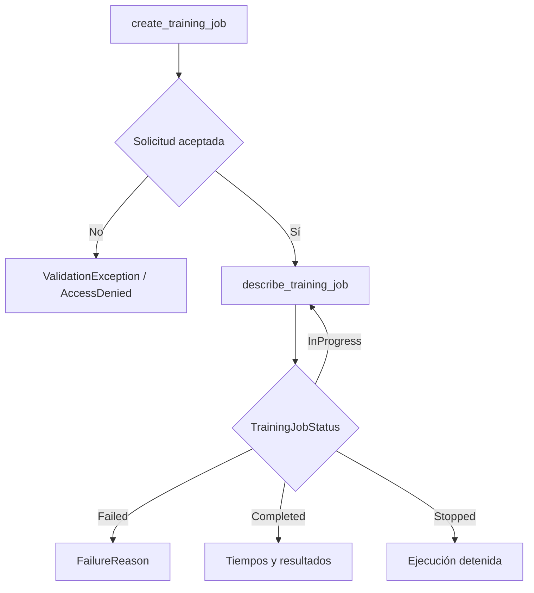

# Nota 3 — Almacenamiento y formatos de datos para entrenar en AWS

Los datos de entrenamiento necesitan un lugar donde conservarse, una representación que permita leer lo necesario y una forma de llegar al programa que entrena. En Kanan, S3 será el lugar persistente del histórico; el formato y la entrega al contenedor se elegirán según las lecturas del programa. **Guardar barato, leer pocos bytes y empezar pronto son objetivos distintos.**

El histórico ocupa aproximadamente **500 GB almacenados**. No suponemos que esa cifra coincida con su tamaño descomprimido ni con la memoria que necesitaría una tabla completa. Los experimentos consultan repetidamente algunas columnas y periodos. Todos los recursos del caso están en `us-east-1`, cuenta de desarrollo `111111111111`.

**Alcance y recursos.** Se dan por conocidas las notas 1–2. El glosario suministrado solo contiene la secuencia: sus tablas de términos y recursos están vacías. Por eso cada ejemplo declara qué debe existir; los nombres siguientes son convenciones del caso, no recursos cuya existencia se haya comprobado en tu cuenta. Los identificadores que se soliciten mediante variables deben sustituirse por los reales.

**Estado de las interfaces.** La documentación actual llama al servicio *Amazon SageMaker AI* y ya muestra interfaces del SDK v3. Esta nota conserva el alcance MLA-C01 y fija el SDK v2.245.0 para el ejemplo de alto nivel; no mezcla sus importaciones con las de v3. Las configuraciones principales se muestran en la API de SageMaker mediante boto3 y CLI. [1][2]

## 1. Una copia persistente y un espacio de trabajo no cumplen la misma función

El almacenamiento de **objetos** conserva unidades completas identificadas por una clave: así trabaja S3. El de **bloques** entrega a una máquina un dispositivo parecido a un disco; el sistema operativo organiza sus bloques. El de **archivos** expone directorios y archivos que las aplicaciones abren por ruta, y puede compartirse entre máquinas.

En un job, el origen persistente conserva el conjunto después del entrenamiento. El espacio de trabajo de la máquina contiene lo necesario durante la ejecución. Que el contenedor vea una ruta no demuestra que todo su contenido esté ya copiado en el disco de la máquina.

Antes de dimensionar, separa cuatro magnitudes:

| Magnitud | Pregunta operativa |
|---|---|
| Capacidad | ¿Cuántos bytes caben? |
| Latencia | ¿Cuánto tarda en responder una lectura? |
| Rendimiento de transferencia, o *throughput* | ¿Cuántos bytes por segundo se sostienen? |
| Número de solicitudes | ¿Cuántas operaciones hay que iniciar para obtener esos bytes? |

Un millón de archivos pequeños puede tardar más en abrirse que unos miles de archivos grandes con el mismo total de bytes. Un disco enorme puede seguir transfiriendo lentamente. La capacidad no compra automáticamente rendimiento.

Para los ejemplos locales, una máquina EC2 de preparación en `us-east-1` contiene un extracto diario autorizado, con su disco cifrado. Los ejemplos de control —configurar transferencias, describir recursos o lanzar jobs— se ejecutan desde una laptop con el perfil `kanan-dev`. El perfil identifica al operador; el rol de ejecución del job identifica a SageMaker. No son la misma identidad.

## 2. Leer columnas y fechas sin reconstruir los 500 GB

### 2.1 Qué organiza un formato y qué significa tener esquema

Un **formato** establece cómo se representan los valores y cómo se recuperan sus límites y tipos. Un **esquema** declara la estructura esperada, por ejemplo `monto_centavos: entero de 64 bits`. El productor lo fija y el lector lo usa para interpretar o comprobar los datos. Tener un esquema no prueba que cada monto corresponda a una transacción verdadera.

Un formato **por filas** mantiene próximos los valores de un registro. Uno **columnar** agrupa físicamente valores de la misma columna dentro de bloques de filas. Si necesitas cuatro columnas de cuarenta, un lector columnar puede evitar leer las restantes. No significa que cada archivo contenga una única columna.

La **compresión** reduce la representación física a cambio de trabajo para codificarla y decodificarla. El algoritmo que realiza esa operación se denomina *codec*. Snappy prioriza una decodificación rápida; Gzip y Zstandard ofrecen otros compromisos entre tamaño y CPU. El resultado depende de los datos: ninguna razón de compresión se presume.

Los **metadatos** describen los datos: por ejemplo, sus tipos, tamaños o estadísticas.

| Formato | Organización y esquema | Cuándo ayuda en Kanan | Limitación decisiva |
|---|---|---|---|
| CSV | Texto por filas; separadores y reglas de comillas. Los tipos suelen declararse fuera del archivo. | Intercambio sencillo y entradas compatibles con muchos lectores. | Leer pocas columnas todavía exige recorrer la estructura del texto; tipos, nulos y cabeceras deben acordarse. |
| JSON | Texto con objetos, listas y valores; puede tener estructura anidada. No exige un esquema tabular uniforme. | Conservar transacciones con campos opcionales o anidados. | Repite nombres de campos; un gran documento no es necesariamente fácil de dividir. |
| JSON Lines | Un valor JSON completo por línea. | Procesar registros sucesivos sin reconstruir un único documento gigante. | No convierte el contenido en columnar ni garantiza tipos consistentes entre líneas. |
| Parquet | Columnar, binario, con esquema y metadatos. | Histórico tabular y selección reiterada de variables. | El lector del entrenamiento debe soportarlo; organizar mal los archivos puede arruinar la ventaja. |
| ORC | Columnar, binario, con esquema, estadísticas y grupos físicos de datos. | Analítica columnar cuando el entorno que produce y consume datos ya usa ORC. | No gana automáticamente a Parquet; importa la compatibilidad del conjunto de herramientas. |
| Avro | En su archivo contenedor, registros binarios por filas y esquema incluido. | Intercambio de registros completos y cambios controlados de esquema. | Leer un pequeño subconjunto de columnas no es su principal ventaja. |

Parquet y ORC son candidatos naturales para este histórico. Elegimos **Parquet por su lectura columnar y la compatibilidad del lector que usaremos**, no porque todo dataset de ML deba ser Parquet. Si un programa necesita recorrer todas las variables de cada registro, la ventaja de saltarse columnas disminuye. [3][4][5]

La evolución de esquema en Avro permite que productor y consumidor resuelvan ciertas diferencias compatibles, por ejemplo un campo nuevo con valor predeterminado adecuado. No significa que cualquier cambio de tipos sea válido. JSON tampoco es «sin tipos»: sus valores tienen tipos; lo que puede faltar es un contrato común entre registros.

### 2.2 Particiones, grupos de filas y lectura selectiva

Para que una consulta sobre septiembre no abra todo el histórico, Kanan separa archivos por fecha. Ese **particionamiento** divide el conjunto en subconjuntos físicos según valores de una columna. En una ruta como `fecha=2026-09-20/`, el valor puede deducirse del nombre del directorio sin repetirse dentro de cada archivo. Usaremos esa convención de directorios, conocida como particionamiento *Hive*, sin necesitar otro servicio.

Dentro de Parquet, un **grupo de filas** contiene un bloque de registros organizado por columnas. Sus estadísticas pueden permitir descartar grupos cuyo intervalo de valores no satisface un filtro. Se llama **poda** a evitar leer una partición o grupo que no puede contribuir al resultado. La selección de columnas se denomina **proyección**; el intento de aplicar filtros cerca de la lectura física se conoce como *predicate pushdown*.

Hay tres ahorros distintos: no abrir fechas irrelevantes; no leer columnas irrelevantes; no leer grupos descartables por sus estadísticas. **Un filtro no garantiza el tercero**: si todos los grupos mezclan fechas o valores muy amplios, sus estadísticas quizá no excluyan ninguno.

Para Kanan conviene empezar con particiones diarias y varios archivos por día cuando el volumen lo justifique. Particionar por `id_transaccion` produciría muchísimas particiones diminutas. Por otro lado, un archivo único de 500 GB reduce las unidades disponibles para repartir trabajo. El tamaño se ajusta midiendo; «256 MB siempre» sería una receta sin diagnóstico.

### 2.3 Convertir un extracto por lotes con tipos explícitos

**Escena.** El data engineer dejó `raw/transacciones-2026-09-20.csv` en la EC2 de preparación. Contiene solo ese día, una cabecera y las columnas indicadas abajo. El ejemplo lo convierte a archivos Parquet dentro de `curated/fecha=2026-09-20/`. Se ejecuta como usuario del sistema operativo con acceso a esos archivos; no hace llamadas a AWS. Se requiere Python y PyArrow de las versiones del frontmatter. No hay números de tarjeta ni nombres en este extracto.

En las unidades de capacidad, GB y MB son decimales; GiB y MiB son binarios: un MiB equivale a 2²⁰ bytes. PyArrow es la biblioteca de Python de Apache Arrow; proporciona lectores y estructuras tabulares tipadas. Su **lote de registros**, `RecordBatch`, permite procesar una porción de la tabla. Primero se instala en el entorno Python de la máquina de preparación:

```bash
python -m pip install "pyarrow==20.0.0"
```

Este comando instala el lector/escritor; no convierte datos. Guarda el siguiente bloque como `convertir_dia.py` y ejecútalo en el directorio que contiene `raw/`:

```python
from pathlib import Path
import pyarrow as pa
import pyarrow.csv as csv
import pyarrow.dataset as ds

schema = pa.schema([
    ("id_transaccion", pa.string()),
    ("es_fraude", pa.int8()),
    ("monto_centavos", pa.int64()),
    ("hora_del_dia", pa.int8()),
    ("distancia_km", pa.float32()),
    ("num_tx_1h", pa.int32()),
])
destino = Path("curated/fecha=2026-09-20")
destino.parent.mkdir(parents=True, exist_ok=True)

reader = csv.open_csv(
    "raw/transacciones-2026-09-20.csv",
    read_options=csv.ReadOptions(block_size=8 * 1024**2),
    convert_options=csv.ConvertOptions(
        column_types=schema,
        include_columns=schema.names,
    ),
)
formato = ds.ParquetFileFormat()
ds.write_dataset(
    reader,
    base_dir=str(destino),
    format=formato,
    file_options=formato.make_write_options(compression="snappy"),
    basename_template="part-{i}.parquet",
    max_rows_per_file=1_000_000,
    min_rows_per_group=128_000,
    max_rows_per_group=128_000,
    existing_data_behavior="error",
)
print("Archivos escritos:", len(list(destino.glob("*.parquet"))))
```

`pa.schema` fija tipos antes de leer: evita que las primeras filas induzcan un tipo incompatible con las siguientes. Guardar importes en centavos enteros evita introducir redondeos binarios al representar moneda en este ejemplo.

`open_csv` devuelve un lector incremental; `block_size` controla bloques de lectura de aproximadamente 8 MiB, no el tamaño final de los archivos ni toda la memoria del proceso. `include_columns` conserva únicamente las seis columnas autorizadas y falla si falta alguna. No comprueba reglas como que `es_fraude` pertenezca a `{0,1}`.

`ParquetFileFormat` elige el escritor; `make_write_options` aplica Snappy dentro de Parquet. `write_dataset` consume los lotes y genera varios archivos. El millón es un **límite de filas por archivo**, no de bytes. Los 128 000 registros por grupo son una elección inicial; la biblioteca acumula lotes para escribir esos grupos, salvo el grupo final. El consumo de memoria no se limita estrictamente a los 8 MiB del lector. [3][6]

`existing_data_behavior="error"` evita mezclar silenciosamente una ejecución nueva con archivos existentes. Un directorio no vacío provoca un error; el lector debe elegir un destino nuevo para otra versión del conjunto. El cierre de cada archivo completa sus metadatos.

**Resultado esperado:** uno o más `part-*.parquet` y una confirmación del número escrito. Un campo numérico con texto inválido produce una excepción de conversión de Arrow; un valor `es_fraude=2` puede convertirse correctamente y seguir siendo inválido para el contrato de negocio. Eso separa compatibilidad de tipos de calidad de datos. Si el CSV contiene varias fechas, la ruta del ejemplo sería falsa: hay que particionar usando la fecha real, no cambiarle el nombre al conjunto.

### 2.4 Leer tres columnas de una fecha

**Escena.** En la misma EC2 y con la misma identidad local, `curated/` contiene las particiones producidas para varios días. Kanan quiere contar las operaciones nocturnas de un día y leer sus importes y etiquetas. El código usa PyArrow, sin servicios de consulta externos.

```python
import pyarrow.dataset as ds

datos = ds.dataset("curated", format="parquet", partitioning="hive")
scanner = datos.scanner(
    columns=["monto_centavos", "es_fraude", "hora_del_dia"],
    filter=(ds.field("fecha") == "2026-09-20")
           & (ds.field("hora_del_dia") < 6),
    batch_size=65_536,
)
filas = sum(batch.num_rows for batch in scanner.to_batches())
print("Operaciones seleccionadas:", filas)
```

`dataset` describe un conjunto de archivos, sin cargar toda la tabla. `partitioning="hive"` interpreta `fecha=...` como una columna de partición. `scanner` prepara una lectura con proyección y filtro; las expresiones con `ds.field` representan condiciones para el lector, no una tabla ya materializada. `&` combina condiciones y requiere esos paréntesis.

`to_batches` ejecuta la lectura por lotes; `batch_size` fija un máximo de filas por lote devuelto, no su tamaño en bytes. La suma cuenta filas sin acumular todas en RAM. **El resultado es un entero dependiente del extracto**, no una cifra predeterminada. `to_table()` sobre el conjunto completo, en cambio, intentaría materializar toda la selección; no se usa aquí. [4]

Un lector columnar no vuelve automáticamente incremental al algoritmo: si después el código concatena todos los lotes para entrenar, reaparece el problema de memoria. La representación, la lectura y la rutina de entrenamiento deben ser compatibles.

### 2.5 RecordIO-protobuf: registros binarios para un consumidor concreto

Algunos algoritmos integrados de SageMaker reciben vectores y etiquetas en **RecordIO-protobuf**. Un algoritmo integrado es una implementación que AWS entrega en una imagen ya preparada; aquí solo interesa su contrato de entrada. Su elección y entrenamiento pertenecen a [[11 Algoritmos integrados]].

**Protocol Buffers**, o *protobuf*, codifica mensajes binarios según un esquema. **RecordIO** envuelve esos mensajes delimitando registros dentro de una secuencia de bytes. La combinación permite que el consumidor reconozca cada observación y decodifique sus valores sin analizar texto CSV. El productor debe serializar datos según el esquema esperado; SageMaker no adivina cómo convertir un Parquet cualquiera.

La cadena `application/x-recordio-protobuf` es un **tipo de contenido**: una etiqueta que informa al consumidor sobre la representación. No transforma bytes. Escribirla sobre un CSV no produce RecordIO, igual que renombrar una foto como `.zip` no la comprime.

No es un formato universal ni equivale a «cualquier archivo protobuf». Su ventaja depende del algoritmo y del patrón de lectura. Conserva el histórico reutilizable en el formato que convenga y produce una representación específica cuando lo exija el consumidor. [7]

### 2.6 «Validado» depende de qué se comprobó

La guía menciona formatos validados y no validados sin proporcionar una clasificación universal de extensiones. Para tomar decisiones, pregunta **qué contrato se verificó**:

1. **Sintaxis:** ¿se puede interpretar el CSV, JSON o archivo binario?
2. **Estructura y tipos:** ¿existen las columnas y tienen tipos compatibles?
3. **Contrato del consumidor:** ¿posición de la etiqueta, cabeceras y representación son las que espera el programa?

Un CSV puede haber pasado esas comprobaciones; un Parquet puede contener datos incompatibles con el entrenamiento. Validar formato tampoco prueba ausencia de duplicados, errores de etiqueta o valores imposibles: [[6 Preparación y calidad]]. El esquema explícito del ejemplo solo resuelve una parte de la validación estructural.

## 3. S3: organizar objetos y moverlos sin confundir los cuellos de botella

### 3.1 Prefijos con significado y concurrencia suficiente

En S3, una **clave** identifica el objeto dentro del bucket. Un **prefijo** es el comienzo de una clave; los `/` ayudan a organizar nombres, pero no crean directorios físicos. Usaremos el bucket `kanan-ml-dev-curated-us-east-1` y claves como `fraude/v1/train/fecha=2026-09-20/part-0.parquet`. `v1` nombra una versión lógica del dataset que el equipo no sobrescribe durante un experimento.

AWS publica al menos **3 500 solicitudes de escritura o borrado y 5 500 de lectura por segundo y prefijo particionado**. Son tasas de solicitudes, no MB/s ni un techo absoluto por bucket. S3 escala y puede devolver temporalmente `503 Slow Down`; repartir carga y reintentar con espera creciente ayuda. No hace falta anteponer hashes por costumbre a todas las claves. [8]

Una aplicación con una única lectura lenta no gana nada multiplicando prefijos vacíos. Importan también tamaño de objeto, lecturas concurrentes, capacidad de red y capacidad del consumidor. Organiza primero por el patrón útil —fechas— y mide antes de añadir complejidad.

### 3.2 Publicar archivos con `sync`

Kanan exige claves propias. **AWS Key Management Service (KMS)** administra claves de cifrado; una clave administrada por el cliente permite a Kanan controlar su política y ciclo de vida. **SSE-KMS** significa que S3 cifra del lado del servicio usando KMS. El ARN de una clave identifica el recurso: no contiene su material secreto. Aquí usamos una clave ya existente y permisos ya preparados; su administración corresponde a [[9 Protección de datos]].

**Escena.** El operador ya comprobó `curated/` en la EC2 de preparación. Para estos comandos la máquina dispone del perfil `kanan-dev`, autorizado para listar el bucket, escribir el prefijo y usar la clave. El bucket existe en `us-east-1`, tiene cifrado predeterminado con una clave de Kanan y bloquea acceso público. La variable `KANAN_KMS_KEY_ARN` contiene el ARN real de esa clave; no se incluyen credenciales en el código.

```bash
aws s3 sync ./curated/ \
  s3://kanan-ml-dev-curated-us-east-1/fraude/v1/train/ \
  --exclude "*" --include "*.parquet" \
  --sse aws:kms --sse-kms-key-id "$KANAN_KMS_KEY_ARN" \
  --dryrun --profile kanan-dev --region us-east-1
```

`sync` compara origen y destino y transfiere lo que considera nuevo o modificado. No es vigilancia continua ni una transacción del conjunto entero. Los filtros se aplican en orden: primero se excluye todo y luego se incluyen los Parquet. `--dryrun` imprime acciones previstas sin subir archivos; tras revisar origen y destino, ejecuta **el mismo comando sin `--dryrun`**. `--sse` y `--sse-kms-key-id` solicitan el cifrado de los objetos que se escriban. [9]

No se usa `--delete`: ese argumento borraría objetos del destino ausentes en el origen, sujeto a los filtros. Una carpeta local parcial no debe borrar días históricos. Cambiar únicamente los argumentos de cifrado o metadatos tampoco obliga a `sync` a reescribir objetos que considere sin cambios.

**Resultado:** mensajes `upload: ...` y los archivos del día bajo el prefijo elegido. El job debe empezar después de finalizar la publicación; podría leer un conjunto incompleto si se lanza a mitad de `sync`. `AccessDenied` puede deberse al bucket, al rol o a KMS, aunque las credenciales sean válidas.

### 3.3 Subir un objeto grande por partes

Una **carga multipartes** divide un objeto en partes que pueden subirse en paralelo y reintentarse por separado. Al completarse, S3 lo presenta como un solo objeto. No equivale a dividir el dataset en varios archivos: las partes son un mecanismo de transferencia.

**Escena.** En esa misma máquina, el operador sube un Parquet ya generado. Existe el bucket y la clave anterior. boto3 usa el perfil `kanan-dev`. Este ejemplo es una alternativa programática a la publicación anterior para un objeto concreto; no hay que ejecutar ambos para duplicar trabajo.

```python
import os
import boto3
from boto3.s3.transfer import TransferConfig

session = boto3.Session(profile_name="kanan-dev", region_name="us-east-1")
s3 = session.client("s3")
transfer = TransferConfig(
    multipart_threshold=64 * 1024**2,
    multipart_chunksize=64 * 1024**2,
    max_concurrency=8,
    preferred_transfer_client="classic",
)
s3.upload_file(
    "curated/fecha=2026-09-20/part-0.parquet",
    "kanan-ml-dev-curated-us-east-1",
    "fraude/v1/train/fecha=2026-09-20/part-0.parquet",
    ExtraArgs={
        "ServerSideEncryption": "aws:kms",
        "SSEKMSKeyId": os.environ["KANAN_KMS_KEY_ARN"],
    },
    Config=transfer,
)
print("Objeto subido")
```

`TransferConfig` pertenece al módulo de transferencias de S3 porque configura al cliente que realiza la subida. El umbral activa multipartes según tamaño; el tamaño de parte controla cada fragmento; `max_concurrency` limita las solicitudes concurrentes del gestor clásico, que se fija expresamente con `preferred_transfer_client`. Los 64 MiB y ocho operaciones son elecciones de prueba, no límites del servicio. [10]

`upload_file` maneja lectura, partes y reintentos; vuelve cuando termina o falla. No construye una copia completa en RAM. `ExtraArgs` fija propiedades del objeto, mientras que `Config` cambia cómo se transfiere. Si el archivo de prueba es pequeño, no habrá multipartes aunque se haya configurado.

Más concurrencia puede saturar la red o agravar limitaciones de KMS. Las subidas multipartes abandonadas pueden dejar partes facturables: debe existir una regla de limpieza de cargas incompletas, acordada con el responsable del bucket. La carga multipartes no cifra por sí misma.

### 3.4 Transfer Acceleration: distancia de red, no lectura columnar

**S3 Transfer Acceleration** ofrece un punto de acceso acelerado para que clientes geográficamente lejanos entren a la red de AWS a través de ubicaciones de borde. Conviene evaluarlo cuando grandes transferencias por Internet desde instalaciones remotas son el cuello de botella; tiene coste adicional y su mejora se mide. [11]

No convierte CSV a Parquet ni elimina esperas del disco. Para leer desde cómputo en `us-east-1` hacia S3 en la misma región no es la primera herramienta que se necesita. Tampoco sustituye a multipartes: atacan problemas distintos y pueden combinarse.

En Kanan hay una restricción adicional: los datos de clientes no pueden salir de la región elegida. El bucket regional por sí solo no demuestra que una ruta global cumpla ese requisito. **El flujo del caso usa acceso regional; cualquier prueba de aceleración se haría con datos sintéticos y una evaluación explícita de la ruta permitida.** No se habilita aceleración para el histórico de clientes como optimización automática.

### 3.5 Clases de almacenamiento: atención a recuperar antes de entrenar

La **clase de almacenamiento** es una propiedad del objeto que cambia costes y características de acceso. Para estos experimentos, el histórico activo permanece en Standard. Archivar datos no altera su formato, pero puede alterar radicalmente cuándo vuelven a estar disponibles. [12]

| Clase | Acceso y recuperación | Uso razonable en este caso |
|---|---|---|
| Standard | Lectura inmediata; sin cargo de recuperación por GB propio de las clases de acceso infrecuente. | Conjunto que se relee para entrenar. |
| Intelligent-Tiering | Ajusta niveles según acceso; los niveles opcionales de archivo requieren recuperación. | Acceso incierto, evaluando monitorización y niveles habilitados. |
| Standard-IA / One Zone-IA | Lectura inmediata, con cargo por recuperación; la segunda conserva los datos en una sola zona. | Copias poco consultadas; One Zone-IA solo si es aceptable recrearlas tras pérdida de zona. |
| Glacier Instant Retrieval | Lectura inmediata, con cargo de recuperación. | Archivo consultado excepcionalmente que debe estar disponible de inmediato. |
| Glacier Flexible Retrieval | Hay que restaurar; demora de minutos a horas según modalidad. | Histórico que admite espera antes de volver a entrenar. |
| Glacier Deep Archive | Hay que restaurar; demora de horas. | Retención prolongada con acceso excepcional. |

Las duraciones mínimas facturables son 30 días en IA, 90 en Glacier Instant/Flexible y 180 en Deep Archive. Borrar o transicionar antes puede generar cargos por el periodo restante; no es una prohibición de borrado. [12]

**Escena.** Desde la laptop, `kanan-dev` debe recuperar un objeto conocido en Glacier Flexible Retrieval; existe el permiso `s3:RestoreObject`. La clave del objeto se recibe en `KANAN_ARCHIVE_KEY` y pertenece al bucket histórico, también cifrado por Kanan.

```bash
aws s3api restore-object \
  --bucket kanan-ml-dev-raw-us-east-1 --key "$KANAN_ARCHIVE_KEY" \
  --restore-request '{"Days":7,"GlacierJobParameters":{"Tier":"Standard"}}' \
  --profile kanan-dev --region us-east-1

aws s3api head-object \
  --bucket kanan-ml-dev-raw-us-east-1 --key "$KANAN_ARCHIVE_KEY" \
  --query '{Clase:StorageClass,Restauracion:Restore}' \
  --profile kanan-dev --region us-east-1
```

`Days:7` mantiene disponible temporalmente la copia restaurada; `Tier` selecciona la modalidad de recuperación. El segundo comando consulta su estado: hay que esperar hasta que `Restore` indique `ongoing-request="false"`. Aceptar la solicitud no significa haber terminado. La clase original sigue siendo de archivo; no se convierte permanentemente en Standard. [13]

Un intento de lectura prematuro puede producir `InvalidObjectState`. No arranques una máquina de entrenamiento para que espere una restauración que podías iniciar antes.

## 4. EBS, EFS y las dos familias de FSx que importan aquí

### 4.1 EBS: capacidad, IOPS y transferencia se dimensionan por separado

**Amazon Elastic Block Store (EBS)** proporciona volúmenes de bloques para EC2 en una zona de disponibilidad. Un volumen se crea y adjunta a la máquina; el sistema operativo puede montar en él un sistema de archivos. **Montar** significa hacer accesible su contenido bajo una ruta. Por ejemplo, el equipo prepara `/mnt/kanan-datos/` para los extractos. No se introduce aquí la administración del sistema operativo.

Una **IOPS** es una operación de entrada/salida por segundo. Leer miles de bloques pequeños exige muchas IOPS; leer bloques grandes secuencialmente puede agotar antes el throughput. Aproximadamente:

$$
\text{bytes/s efectivos}\leq\min(\text{IOPS}\times\text{bytes por operación},\ \text{límite del volumen},\ \text{límite de la instancia}).
$$

Las unidades deben ser compatibles en esa comparación. La latencia, la concurrencia y el patrón de lectura pueden reducir aún más el resultado.

| Opción EBS | Qué permite elegir | Cuándo tiene sentido |
|---|---|---|
| gp3, disco de estado sólido de propósito general | Capacidad y rendimiento configurable; incluye una base de 3 000 IOPS y 125 MiB/s. | Preparación de datos y muchas cargas generales; primer candidato si satisface la medición. |
| io2, disco de estado sólido de IOPS aprovisionadas | IOPS contratadas para cargas exigentes, con características de durabilidad y latencia apropiadas para aplicaciones críticas. | Acceso intensivo a bloques pequeños o requisitos de latencia que justifiquen su coste. |

*Provisioned IOPS* significa IOPS aprovisionadas. Aunque io2 pertenece a esa familia comercial, **gp3 también permite aumentar IOPS**. «Necesito más IOPS» no implica automáticamente «debo elegir io2». [14]

**Escena.** Desde la laptop, `kanan-dev` administra el volumen de datos de la EC2 de preparación. El volumen ya existe, está cifrado con una clave de Kanan y su ID real está en `KANAN_VOLUME_ID`. La medición justificó pedir 6 000 IOPS y 250 MiB/s; estos valores son del ejemplo.

```bash
aws ec2 describe-volumes --volume-ids "$KANAN_VOLUME_ID" \
  --query 'Volumes[0].{Tipo:VolumeType,GiB:Size,IOPS:Iops,MiBs:Throughput}' \
  --profile kanan-dev --region us-east-1

aws ec2 modify-volume --volume-id "$KANAN_VOLUME_ID" \
  --volume-type gp3 --iops 6000 --throughput 250 \
  --profile kanan-dev --region us-east-1

aws ec2 describe-volumes-modifications --volume-ids "$KANAN_VOLUME_ID" \
  --query 'VolumesModifications[0].{Estado:ModificationState,Progreso:Progress}' \
  --profile kanan-dev --region us-east-1
```

`describe-volumes` muestra la configuración actual; `modify-volume` solicita cambiarla y modifica la facturación. No se aumenta capacidad ni se cambia la clave. `describe-volumes-modifications` permite comprobar la transición hasta completarse. Un cambio aceptado no es una medición de rendimiento. Si la instancia limita la transferencia, provisionar más en el volumen puede no ayudar. [15]

**Esto administra una EC2 propia.** El `ResourceConfig` de un training job expone tamaño y clave del volumen, pero no campos `VolumeType="gp3"` o `Iops=6000`. No traslades parámetros de EC2 a SageMaker. Algunas familias de entrenamiento tienen almacenamiento local propio y reglas diferentes; aquí se usa una instancia sin ese almacenamiento para poder elegir la clave del volumen. [16]

Si hay datos en un volumen EBS o sistema de archivos ya montado en `/mnt/kanan-datos/`, el `aws s3 sync` de la sección anterior puede usar esa ruta como origen. No se entrega un ID `vol-...` como fuente de canal del job. Las copias de seguridad del volumen tampoco son una exportación de filas lista para entrenar.

### 4.2 EFS, Lustre y ONTAP: compartir no significa rendir igual

**Amazon Elastic File System (EFS)** ofrece un sistema de archivos compartido para aplicaciones que trabajan con rutas. El equipo lo crea, copia allí los datos y varias máquinas pueden acceder al mismo contenido. **FSx** es una familia de servicios de sistemas de archivos administrados; el apellido determina qué tecnología y capacidades se reciben.

**NFS y SMB** son protocolos para acceder a archivos a través de la red; **iSCSI** presenta almacenamiento de bloques mediante una conexión de red. Se nombran para reconocer los escenarios de ONTAP, no para configurarlos. [17][18]

| Servicio | Problema que resuelve en ML | Ventaja | Coste o limitación |
|---|---|---|---|
| EFS | Preparación y entrenamiento necesitan acceder al mismo árbol de archivos ya compartido. | Evita mantener copias independientes por aplicación; crecimiento administrado. | Rendimiento y configuración deben ajustarse; compartir archivos no garantiza lecturas locales rápidas. |
| FSx for Lustre | Muchos entrenamientos reutilizan datos y exigen acceso paralelo o aleatorio intenso. | Sistema de archivos paralelo de alto rendimiento; puede vincularse con S3. | Hay que mantener el sistema y su capacidad/rendimiento; la primera lectura puede pagar la carga desde S3. |
| FSx for NetApp ONTAP | Kanan ya utiliza almacenamiento NetApp y necesita conservar sus integraciones y funciones de administración. | Acceso por protocolos de archivos NFS/SMB y de bloques iSCSI; copias instantáneas y otras funciones de ONTAP. | Requiere comprobar la integración: no todas las familias de FSx se conectan igual al entrenamiento. |

Al **vincular Lustre con S3**, una asociación relaciona un prefijo del bucket con una ruta del sistema de archivos. Importar nombres y metadatos puede hacer visibles archivos cuyos contenidos se traen después, al primer acceso. Por eso un montaje rápido no demuestra que el conjunto esté ya cargado. Se puede precargar cuando la primera ejecución deba evitar esa espera. La importación/exportación de cambios depende de la asociación y de su configuración; no es sincronización bidireccional mágica de todo lo que exista. [19]

Para Kanan, EFS gana si los datos ya están ahí y cumple el rendimiento; Lustre se evalúa si la reutilización o el acceso aleatorio amortizan mantenerlo; ONTAP responde a necesidades existentes de almacenamiento empresarial. Ninguno se elige solo porque el conjunto mida 500 GB.

## 5. El modo de entrada decide cuándo y cómo puede leer el contenedor

Un **canal**, recordatorio de la nota 2, es una entrada con nombre, como `train`. Su **fuente** responde dónde están los datos; su **modo de entrada** responde cómo se presentan al programa. Para S3, los modos son `File`, `FastFile` y `Pipe`. EFS y Lustre se presentan montando sus archivos. [1]

### 5.1 File, FastFile y Pipe: contrato de lectura

**File** descarga los objetos asignados a la instancia antes de que empiece el programa. Para el canal `train`, el lector abre archivos bajo `/opt/ml/input/data/train/`. El coste inicial compra acceso local durante el entrenamiento.

**FastFile** presenta los objetos de S3 como archivos de solo lectura y trae contenido bajo demanda. El programa puede abrir rutas y leer sin esperar la descarga completa. Permite acceso aleatorio, pero lecturas secuenciales suelen ser más favorables. No promete latencia de disco local ni elimina la transferencia de los bytes que sí se consumen.

**Pipe** entrega una secuencia de bytes mediante una tubería con nombre del sistema operativo, o **FIFO**, «primero en entrar, primero en salir». El productor escribe y un consumidor lee en orden. El lector no dispone de las mismas operaciones que sobre un archivo: no puede volver arbitrariamente a una posición ya consumida. Su código debe soportar ese contrato.

| Entrada | Antes de leer el primer lote | Espacio local para datos de entrada | Exigencia del programa |
|---|---|---|---|
| S3 + File | Descarga previa de lo asignado a la instancia. | Debe caber esa descarga, además del trabajo temporal. | Lectura de archivos locales. |
| S3 + FastFile | Preparación e identificación de archivos, sin descargar todo. | No necesita alojar todo el dataset por adelantado. | Lectura compatible con archivos de solo lectura; medir accesos aleatorios. |
| S3 + Pipe | Inicio del flujo de bytes. | No necesita alojar todo el dataset por adelantado. | Consumir secuencia por FIFO; formato y lector compatibles. |
| EFS o Lustre | Montaje; en Lustre puede haber carga posterior desde S3. | Los archivos fuente no se copian íntegros al disco del job. | Lectura del árbol montado; conectividad preparada. |

**Todos necesitan espacio para lo que el programa escriba:** archivos temporales, artefactos y, cuando existan, estados intermedios guardados para reanudar el entrenamiento —*checkpoints*—. Streaming de entrada no significa «disco cero». [1][16][20]

### 5.2 Qué ocurriría con los 500 GB de Kanan

Con File, un lector que selecciona tres columnas de un Parquet **no evita que SageMaker descargue antes ese objeto completo**. Ahorra lectura y decodificación local, pero no esa descarga inicial. Con FastFile, los accesos del lector pueden evitar traer todo el objeto, aunque el ahorro depende de sus solicitudes y de cómo se sirvan los datos; no se promete una proporción exacta.

El lector Parquet habitual necesita consultar metadatos del final del archivo y acceder a rangos. Por ello, entregar Parquet a una FIFO no lo vuelve compatible automáticamente. Materializar el flujo en un archivo podría permitir leerlo después, pero reconstruiría precisamente la descarga y el uso de disco que se intentaban evitar.

Para experimentar, Kanan comenzará comparando File y FastFile sobre el **mismo conjunto y lector**, con el mismo cómputo. Si File tarda más en arrancar pero luego reutiliza localmente los datos muchas veces, puede compensar. Si el programa usa solo una parte, FastFile puede evitar descarga inútil. Si las lecturas aleatorias o la reutilización entre jobs justifican Lustre, se compara incluyendo preparación y coste del sistema. Es una decisión para medir, no un vencedor universal. [21]

El tiempo de descarga aproximado es volumen transferido dividido por throughput efectivo. Por ejemplo, transferir 500 GB decimales a 250 MB/s constantes tomaría unos 2 000 segundos, sin otros costes. **Es aritmética ilustrativa, no un rendimiento prometido por AWS.**

Para File, dimensiona por instancia:

$$
D_{\rm disco}\geq D_{\rm entrada\ local}+D_{\rm temporales}+D_{\rm artefactos}+D_{\rm margen}.
$$

Si el código descomprime o materializa copias adicionales, deben incluirse. El volumen aprovisionado y la RAM son presupuestos diferentes: disponer de 700 GB de disco no permite cargar 500 GB en 32 GB de RAM.

Cuando hay varias instancias, `FullyReplicated` entrega a cada una el conjunto completo del canal; `ShardedByS3Key` distribuye **objetos** entre ellas. Este último no parte automáticamente un único objeto gigante ni garantiza igual cantidad de bytes por máquina. Tampoco vuelve distribuido a un algoritmo que no lo es. [2]

### 5.3 Preparar una solicitud comparable sin inventar otra imagen de entrenamiento

> **Dependencia externa única — [[23 Red]].** Cuando se necesita acceder a sistemas de archivos, el equipo entrega la conectividad ya comprobada y el bloque `VpcConfig` correspondiente. La configuración de red del job base, incluidos sus campos de aislamiento y cifrado entre máquinas, se conserva sin reinterpretarla. Los sistemas están en `us-east-1`, cifrados con claves de Kanan y con permisos de lectura; para Lustre, el cómputo está en su misma zona.

**Escena.** Desde la laptop, `kanan-dev` puede describir y crear jobs, y pasar `KananSageMakerExecutionRole-dev`. Existe un job exitoso de la nota 2 cuyo nombre real está en `KANAN_BASE_JOB`. Debe ser un entrenamiento ordinario de una instancia `ml.m5.xlarge`, con canales `train` y, si hace falta, `validation`, y con imagen que **ya lea Parquet mediante rutas**. Sus dependencias y demás entradas siguen disponibles. La creación de ese contenedor pertenece a [[20 Contenedores y hosting múltiple]].

No sirve como base una imagen que solo acepte CSV. Este prerrequisito permite estudiar entrega sin inventar un algoritmo, una URI de imagen o un archivo inexistente. El prefijo publicado está completo; contiene únicamente archivos de entrenamiento compatibles. El rol puede leerlos y descifrarlos. `KANAN_KMS_KEY_ARN` identifica la clave permitida para el volumen y las salidas.

El código siguiente escribe **una solicitud completa derivada de ese job**, todavía sin lanzarla. Requiere boto3 y botocore del frontmatter. El resultado se guarda como `training-fastfile.json`:

```python
import copy
import json
import os
from datetime import datetime, timezone
from pathlib import Path
import boto3

session = boto3.Session(profile_name="kanan-dev", region_name="us-east-1")
sm = session.client("sagemaker")
base = sm.describe_training_job(TrainingJobName=os.environ["KANAN_BASE_JOB"])
campos = [
    "RoleArn", "AlgorithmSpecification", "InputDataConfig",
    "HyperParameters", "Environment", "StoppingCondition",
    "EnableNetworkIsolation", "EnableInterContainerTrafficEncryption", "VpcConfig",
]
request = {k: copy.deepcopy(base[k]) for k in campos if k in base}
request["TrainingJobName"] = "kanan-fraude-fastfile-" + datetime.now(
    timezone.utc
).strftime("%Y%m%d-%H%M%S")
request["ResourceConfig"] = {
    "InstanceType": "ml.m5.xlarge",
    "InstanceCount": 1,
    "VolumeSizeInGB": 100,
    "VolumeKmsKeyId": os.environ["KANAN_KMS_KEY_ARN"],
}
request["OutputDataConfig"] = {
    "S3OutputPath": "s3://kanan-ml-dev-artifacts-us-east-1/fraude/",
    "KmsKeyId": os.environ["KANAN_KMS_KEY_ARN"],
}
canales = request["InputDataConfig"]
posicion = next(i for i, c in enumerate(canales) if c["ChannelName"] == "train")
canales[posicion] = {
    "ChannelName": "train",
    "InputMode": "FastFile",
    "DataSource": {
        "S3DataSource": {
            "S3DataType": "S3Prefix",
            "S3Uri": "s3://kanan-ml-dev-curated-us-east-1/fraude/v1/train/",
            "S3DataDistributionType": "FullyReplicated",
        }
    },
}
Path("training-fastfile.json").write_text(json.dumps(request, indent=2))
print(request["TrainingJobName"])
```

`describe_training_job` recupera la configuración real. La lista `campos` excluye estados, tiempos y resultados que no son parámetros de creación. `deepcopy` permite cambiar canales sin modificar el objeto original. Se conservan imagen, parámetros y entradas auxiliares; este ejemplo no pretende clonar todas las variantes posibles de entrenamiento.

`ResourceConfig` elige una instancia modesta para comprobar carga; **no afirma que baste para entrenar el modelo final sobre 500 GB**. Los 100 GB requieren que los canales restantes y temporales quepan. `VolumeKmsKeyId` cifra el disco con la clave de Kanan; `OutputDataConfig.KmsKeyId` se refiere a las salidas en S3. El cifrado de la entrada ya estaba configurado en su bucket. [16]

`next(...)` localiza el canal llamado `train`; si no existe, falla en vez de modificar otro. Reemplazar el canal completo evita heredar opciones incompatibles. `InputMode` por canal prevalece sobre `AlgorithmSpecification.TrainingInputMode`, que permanece como valor general para los demás canales. `S3Prefix` toma los objetos bajo esa ubicación; la barra final evita la ambigüedad de prefijos parciales en FastFile. No se añade `ContentType` porque el lector de esta imagen identifica Parquet por sus archivos; si una imagen exige ese campo, debe usarse el valor documentado por ella. [20][22]

El operador revisa el JSON y lo lanza desde la misma laptop:

```bash
aws sagemaker create-training-job \
  --cli-input-json file://training-fastfile.json \
  --profile kanan-dev --region us-east-1
```

`file://` indica a la CLI que lea un archivo local de parámetros. El resultado tiene un `TrainingJobArn`; como en la nota 2, acredita aceptación, no terminación. Para comparar con File, genera otra solicitud con nombre distinto, cambia el `InputMode` de `train` a `File` y dimensiona su volumen con la desigualdad anterior. No ejecutes ambos simultáneamente si esa concurrencia contaminaría la comparación.

En boto3, la misma solicitud se enviaría con `sm.create_training_job(**request)`; no hay motivo para duplicar todo el ejemplo. Si se trabaja con el SDK v2, su objeto equivalente para describir la entrada es:

```python
from sagemaker.inputs import TrainingInput

entrada = TrainingInput(
    s3_data="s3://kanan-ml-dev-curated-us-east-1/fraude/v1/train/",
    s3_data_type="S3Prefix",
    distribution="FullyReplicated",
    input_mode="FastFile",
)
print(entrada.config)
```

Este bloque se ejecuta en el entorno del operador con `sagemaker==2.245.0`; no necesita credenciales para construir el objeto. `TrainingInput` empaqueta los mismos campos, y `config` deja inspeccionarlos. **Construir la entrada no sube archivos ni lanza cómputo.** No se introduce aquí otra abstracción para definir el entrenamiento. [2]

### 5.4 Pipe exige un lector adecuado, no un cambio cosmético

Si Kanan usa una imagen cuyo lector ya soporta Pipe y CSV sin cabecera, la configuración de `train` puede declarar `InputMode="Pipe"` y `ContentType="text/csv"`, apuntando al prefijo que contiene **ese CSV**, no los Parquet anteriores. Cada archivo debe respetar el mismo contrato y terminar correctamente sus registros; Pipe no añade separadores de filas que falten.

El programa lee `/opt/ml/input/data/train_0` para la primera época y la siguiente tubería para la siguiente época. Debe cerrar la anterior y esperar la existencia de la siguiente si todavía no se creó. Un solo proceso lee cada tubería; repartir trabajo entre varios lectores requiere diseño del consumidor. Estos son requisitos de compatibilidad, no un lector nuevo que debas desarrollar en esta nota. [20]

Si los objetos CSV están comprimidos con Gzip, `CompressionType="Gzip"` solicita la descompresión admitida por Pipe. Esa opción del canal no significa «este Parquet usa Snappy»: la compresión interna de Parquet la gestiona su lector. `RecordWrapperType="RecordIO"` puede envolver cada objeto en un registro; **no serializa sus columnas al esquema protobuf**. [22]

### 5.5 EFS y Lustre como fuentes de canal

**Escena.** Desde la laptop, `kanan-dev` tiene permisos de consulta sobre un Lustre existente; su ID está en `KANAN_FSX_ID`. Hay una asociación con el histórico de S3. Se necesitan su nombre de montaje y la ruta de la asociación, no una ruta inventada a partir del nombre del bucket:

```bash
aws fsx describe-file-systems --file-system-ids "$KANAN_FSX_ID" \
  --query 'FileSystems[0].{Id:FileSystemId,Montaje:LustreConfiguration.MountName}' \
  --profile kanan-dev --region us-east-1

aws fsx describe-data-repository-associations \
  --filters "Name=file-system-id,Values=$KANAN_FSX_ID" \
  --query 'Associations[].{Ruta:FileSystemPath,S3:DataRepositoryPath}' \
  --profile kanan-dev --region us-east-1
```

`MountName` identifica la raíz exportada por Lustre. `FileSystemPath` y `DataRepositoryPath` muestran la correspondencia con S3. Si devuelve nombre `abc12345`, ruta `/datasets` y una asociación que contiene `fraude/v1/train/`, la ruta del canal sería `/abc12345/datasets/fraude/v1/train/`. Debe confirmarse con **los valores devueltos**, porque el prefijo de S3 de la asociación puede ser más profundo. [19]

Con EFS existente, el equipo entrega su ID y una ruta real, por ejemplo `/fraude/v1/train`; los datos deben estar copiados allí. En cualquiera de los dos casos, el operador ejecuta este bloque local para producir la fuente, después de definir las variables con valores reales:

```python
import os

tipo = os.environ["KANAN_FS_TYPE"]
if tipo not in {"EFS", "FSxLustre"}:
    raise ValueError("La fuente del canal debe ser EFS o FSxLustre")
canal_fs = {
    "ChannelName": "train",
    "InputMode": "File",
    "DataSource": {"FileSystemDataSource": {
        "FileSystemId": os.environ["KANAN_FS_ID"],
        "FileSystemType": tipo,
        "DirectoryPath": os.environ["KANAN_FS_DIRECTORY"],
        "FileSystemAccessMode": "ro",
    }},
}
print(canal_fs)
```

`FileSystemDataSource` sustituye a `S3DataSource`. `DirectoryPath` es la ruta fuente; SageMaker la monta para el canal. `ro` solicita solo lectura. **Aquí `File` no ordena copiar íntegramente EFS/Lustre al volumen del job**: la fuente es un sistema de archivos. Para usarlo, reemplaza `train` en la solicitud por `canal_fs`, utiliza un nombre de job nuevo y la conectividad preparada que corresponda a ese sistema. [23]

El cifrado de EFS o Lustre se configura en el sistema existente; `VolumeKmsKeyId` del job no lo reconfigura. `FileSystemType="FSxONTAP"` no es válido en esta API. ONTAP puede ser origen de datos que se copien a S3 o se consuman mediante otras integraciones, pero no se presenta como una opción nativa equivalente de este campo.

## 6. Extraer de RDS y DynamoDB sin sobrecargar la fuente

### 6.1 RDS: exportación de instantánea o resultado de consulta

**Amazon Relational Database Service (RDS)** administra bases relacionales; Kanan conserva transacciones en PostgreSQL. Una **instantánea**, o *snapshot*, representa el estado de la base en un momento. Su exportación a S3 extrae datos en Parquet comprimido sin ejecutar la lectura masiva sobre la base activa. Se pueden seleccionar bases, esquemas o tablas; no equivale a un `SELECT` con cualquier filtro de filas. La disponibilidad depende del motor, versión y región. [24]

**Escena.** Desde la laptop, `kanan-dev` inicia una exportación de una instantánea PostgreSQL disponible cuyo ARN está en `KANAN_RDS_SNAPSHOT_ARN`. Existen el bucket `kanan-ml-dev-raw-us-east-1` y `KananRDSExportRole-dev`: este rol confía en `export.rds.amazonaws.com` y tiene acceso al destino. El operador puede pasarlo y usar la clave de Kanan; su política permite las operaciones requeridas por la exportación, entre ellas `kms:CreateGrant` y `kms:DescribeKey`. Esos permisos se preparan antes; cambiar un argumento no los concede.

```bash
aws rds start-export-task \
  --export-task-identifier kanan-fraude-historico-20260921 \
  --source-arn "$KANAN_RDS_SNAPSHOT_ARN" \
  --s3-bucket-name kanan-ml-dev-raw-us-east-1 \
  --s3-prefix rds/fraude/2026-09-21 \
  --export-only kanan.public.transacciones \
  --iam-role-arn arn:aws:iam::111111111111:role/KananRDSExportRole-dev \
  --kms-key-id "$KANAN_KMS_KEY_ARN" \
  --profile kanan-dev --region us-east-1

aws rds describe-export-tasks \
  --export-task-identifier kanan-fraude-historico-20260921 \
  --query 'ExportTasks[0].{Estado:Status,Progreso:PercentProgress,Fallo:FailureCause}' \
  --profile kanan-dev --region us-east-1
```

`export-only` selecciona la tabla `transacciones`, del esquema `public`, en la base `kanan`. `iam-role-arn` es el rol asumido por el exportador; el perfil sigue siendo la identidad que solicita la operación. La exportación es asíncrona: se consulta hasta `COMPLETE`; un ARN o identificador devuelto no acredita archivos listos. Repetir el nombre para una nueva exportación puede producir `ExportTaskAlreadyExistsFault`. Permisos de rol o clave deficientes pueden producir errores como `IamRoleMissingPermissionsFault` o `KMSKeyNotAccessibleFault`. [25]

El Parquet exportado sigue siendo **datos de origen**: no se presupone que las columnas, permisos de difusión y selección temporal sean ya los del entrenamiento. La exportación tampoco es una copia restaurable directamente como una instancia RDS.

Para extraer solo las transacciones recientes, puede convenir una consulta. RDS PostgreSQL ofrece la extensión `aws_s3`, un conjunto de funciones que puede ejecutar una consulta y escribir su resultado en S3. **Escena:** un usuario de base con permiso de lectura ejecuta SQL desde una conexión ya operativa; el administrador instaló la extensión y asoció un rol de exportación a la instancia. El bucket tiene cifrado predeterminado con la clave de Kanan y el rol tiene acceso. No se incorporan contraseñas al SQL:

```sql
SELECT * FROM aws_s3.query_export_to_s3(
    'SELECT id_transaccion, es_fraude, monto_centavos
     FROM public.transacciones
     WHERE fecha >= DATE ''2026-09-20''
       AND fecha < DATE ''2026-09-21''',
    aws_commons.create_s3_uri(
        'kanan-ml-dev-raw-us-east-1',
        'rds/consultas/2026-09-20/transacciones.csv',
        'us-east-1'
    ),
    options := 'format csv, header true'
);
```

`query_export_to_s3` recibe SQL como texto; las comillas duplicadas conservan los literales de fecha. `create_s3_uri` construye el destino con bucket, clave y región. `options` solicita CSV con cabecera. La función devuelve información de filas, archivos y bytes exportados; no devuelve el histórico a la laptop. **La consulta sí consume recursos de la base**: que la escritura en S3 sea nativa no elimina el coste de leer PostgreSQL. [26]

### 6.2 DynamoDB: exportar la tabla o consultar claves concretas

**Amazon DynamoDB** conserva elementos identificados por claves en tablas administradas. Kanan guarda allí perfiles de cliente. **PITR**, recuperación a un instante, mantiene puntos de recuperación que permiten reconstruir el estado dentro de su ventana configurada. La exportación nativa a S3 utiliza esa capacidad y exige que esté habilitada. No consume la capacidad de lectura de la tabla activa. [27]

**Escena.** Desde la laptop, `kanan-dev` puede exportar la tabla `kanan-clientes`, consultar el estado y escribir el destino usando KMS. La tabla tiene PITR habilitado y el bucket existe. No hace falta cargar perfiles en la memoria del operador:

```python
import os
import uuid
import boto3

session = boto3.Session(profile_name="kanan-dev", region_name="us-east-1")
ddb = session.client("dynamodb")
token = str(uuid.uuid4())
respuesta = ddb.export_table_to_point_in_time(
    TableArn="arn:aws:dynamodb:us-east-1:111111111111:table/kanan-clientes",
    ClientToken=token,
    S3Bucket="kanan-ml-dev-raw-us-east-1",
    S3Prefix="dynamodb/clientes/2026-09-21",
    S3SseAlgorithm="KMS",
    S3SseKmsKeyId=os.environ["KANAN_KMS_KEY_ARN"],
    ExportFormat="DYNAMODB_JSON",
    ExportType="FULL_EXPORT",
)
export_arn = respuesta["ExportDescription"]["ExportArn"]
print(export_arn)
estado = ddb.describe_export(ExportArn=export_arn)["ExportDescription"]
print(estado["ExportStatus"], estado.get("FailureMessage"))
```

`ClientToken` identifica esta solicitud para reintentos idempotentes: reutilizar el token y los mismos parámetros evita duplicar esa petición dentro de su periodo de validez. Ejecutar todo el script otra vez genera otro token; no debe confundirse con reintentar la llamada. Al omitir `ExportTime`, se usa el último instante disponible según el servicio. Para exigir un corte concreto se proporciona un instante admitido por PITR. [28]

La llamada final solo consulta una vez; puede imprimir `IN_PROGRESS`. Conserva el ARN y repite la consulta hasta `COMPLETED` o `FAILED` antes de consumir archivos. `PointInTimeRecoveryUnavailableException` indica que la recuperación requerida no está disponible.

**La salida no es Parquet.** DynamoDB JSON conserva tipos de atributos explícitos; la otra representación admitida es Amazon Ion, un formato de datos con tipos más ricos. No se presume que ninguno sea una tabla directamente entrenable. La conversión posterior a escala pertenece a [[5 Catálogo y transformación a escala]]. Consultas y servicios de catálogo: [[5 Catálogo y transformación a escala|Glue y Athena]].

Para pocos clientes identificados por clave, una consulta selectiva evita exportar todo. `Query` recupera elementos mediante una condición de clave; `Scan` recorre la tabla y puede consumir capacidad de lectura importante. Un filtro aplicado después de leer no convierte un `Scan` en una extracción barata. Para el histórico completo sin impactar lecturas operativas, la exportación suele ser el candidato apropiado; también tiene coste propio.

## 7. Si los archivos siguen en las instalaciones de Kanan

**AWS DataSync** ejecuta transferencias administradas entre ubicaciones de almacenamiento. Se utiliza cuando el equipo debe mover o sincronizar archivos de un servidor local hacia S3, EFS o un sistema compatible de FSx, con seguimiento del trabajo. En el caso, sirve para una migración inicial y copias posteriores del histórico. También tiene otros escenarios, pero aquí solo interesa la llegada desde instalaciones propias. [29]

**AWS Storage Gateway** integra aplicaciones locales con almacenamiento en AWS. Su modalidad **S3 File Gateway** presenta un recurso compartido de archivos por NFS o SMB y mantiene una copia local de datos de uso reciente —una caché—, mientras escribe objetos en S3. Encaja si la aplicación debe seguir trabajando con archivos compartidos y conservar ese modo de acceso. [30]

La decisión práctica: **mover un conjunto existente → evaluar DataSync; mantener una aplicación local trabajando con un recurso compartido respaldado por S3 → evaluar File Gateway**. Son servicios que se configuran; ninguno es un modo de entrada de SageMaker ni sustituye la elección de formato. Si todo el histórico ya está en S3, introducirlos solo para entrenar añade trabajo.

## 8. Diagnosticar el tramo lento y calcular el coste completo

Antes de ampliar almacenamiento, identifica el fallo. Un job puede ser aceptado y fallar después; un programa puede entrenar correctamente y pasar la mayoría del tiempo esperando datos.

| Síntoma o error | Causa que comprobar primero | Corrección dirigida |
|---|---|---|
| `AccessDenied` al leer S3 | Rol de ejecución, prefijo autorizado, clave KMS y estado de esta. | Corregir la autorización del componente que lee; no cambiar formato. |
| `InvalidObjectState` | Objeto de archivo sin restauración completada. | Restaurar y esperar antes del job. |
| `503 Slow Down` o errores de limitación de solicitudes | Ráfagas de solicitudes y concurrencia, también hacia KMS. | Reintentos con espera creciente; ajustar carga y organización. |
| `No space left on device` | Datos descargados, descompresión o temporales llenan el volumen. | Medir todos los componentes; aumentar espacio o cambiar la entrega si el lector lo admite. |
| Proceso terminado por falta de memoria | El programa materializa demasiados datos en RAM. | Lectura/procesamiento por lotes o instancia adecuada; disco extra no aporta RAM. |
| Arranque largo con File | Descarga completa y muchos objetos pequeños. | Consolidar archivos, seleccionar un prefijo más acotado o probar FastFile. |
| Lectura irregular con FastFile | Accesos aleatorios pequeños, apertura de muchos archivos o consumidor mal adaptado. | Medir rangos y patrón; comparar acceso local o Lustre. |
| Fallo al montar EFS/Lustre | Conectividad preparada incorrecta, ruta o permisos de archivos. | Comprobar contrato de red, ID y ruta; no añadir permisos de S3 al azar. |
| `ValidationException` / `ParamValidationError` | Campos incompatibles o forma incorrecta de la solicitud; el segundo puede generarlo el cliente antes de enviarla. | Revisar fuente, modo y nombres de campos contra la API. |
| `ResourceLimitExceeded` | Cuota insuficiente para el recurso solicitado. | Revisar cuota/tamaño/concurrencia; no es sinónimo de disco lleno. |

**Escena.** Desde la laptop, `KANAN_TRAIN_JOB` contiene el nombre devuelto al preparar el job; `kanan-dev` puede describirlo:

```bash
aws sagemaker describe-training-job \
  --training-job-name "$KANAN_TRAIN_JOB" \
  --query '{Estado:TrainingJobStatus,Fase:SecondaryStatus,Fallo:FailureReason,Historial:SecondaryStatusTransitions}' \
  --profile kanan-dev --region us-east-1
```

La consulta recoge estado, fase, motivo y transiciones con tiempos. Permite localizar espera previa o fallo; no calcula por sí misma el throughput del lector. Para comparar, registra además tiempo hasta primer lote, tiempo del programa, bytes transferidos cuando se puedan medir y duración facturable. Conserva iguales datos, cómputo y programa.



La lectura del diagrama distingue el rechazo inmediato de `create_training_job` del fallo posterior recogido por `describe_training_job`. La vuelta a la consulta representa comprobaciones espaciadas, no un bucle sin espera. Solo una ejecución terminada y resultados revisados permiten evaluar la comparación completa.

Un presupuesto útil es:

$$
C_{\rm total}=C_{\rm almacenamiento}+C_{\rm solicitudes/recuperación}
+C_{\rm transferencia}+C_{\rm cómputo\ facturable}+C_{\rm sistema\ compartido}.
$$

El último término solo existe si mantienes ese sistema. Evita contar dos veces la misma factura. Una clase más barata por GB puede encarecer las relecturas; un arranque rápido puede terminar en un entrenamiento más lento. Para comparar File y FastFile mide de extremo a extremo; para Lustre separa primera carga de relecturas y distribuye el coste fijo entre los jobs que realmente lo usan.

### Los nombres de configuración que no deben confundirse

| Campo | Qué controla |
|---|---|
| `S3Uri` / `DirectoryPath` | Ubicación fuente de los datos. |
| `InputMode` | Forma de entrega de un canal. |
| `ContentType` | Etiqueta del formato; no convierte los bytes. |
| `CompressionType` | Descompresión admitida en Pipe; no el codec interno de Parquet. |
| `RecordWrapperType` | Envoltura de objetos como registros; no conversión de columnas a protobuf. |
| `VolumeSizeInGB` | Capacidad local del job; no RAM ni capacidad del origen. |

## 9. Diez decisiones de práctica

Las preguntas usan exclusivamente los contratos introducidos en esta nota y los prerrequisitos declarados. Los resultados numéricos del caso final son **mediciones hipotéticas para razonar**, no tarifas ni garantías de AWS.

### 1. Histórico columnar — media, una respuesta

Kanan consulta diariamente seis columnas de una tabla de cuarenta, filtrando por fecha. El lector admite Parquet. ¿Qué organización es más adecuada como punto de partida?

A. Un CSV único comprimido con Gzip que contiene todo el histórico.
B. Parquet particionado por fecha, con archivos de tamaño suficiente para evitar fragmentación excesiva.
C. JSON Lines con un archivo por transacción.
D. Avro particionado por identificador único de transacción.

**Respuesta: B.** Permite proyección y poda temporal. **A** obliga a recorrer texto y dificulta lecturas parciales. **C** añade gran cantidad de aperturas y no es columnar. **D** conserva registros completos, pero crea particiones de cardinalidad extrema sin servir al filtro por fecha.

### 2. Archivo que debe leerse inmediatamente — media, una respuesta

Un conjunto se consulta excepcionalmente. Se desea una clase orientada a archivo, con recuperación de los objetos en milisegundos y se aceptan cargos de recuperación. ¿Cuál encaja?

A. Glacier Instant Retrieval.
B. Glacier Flexible Retrieval con una restauración estándar cuando comience el job.
C. Glacier Deep Archive.
D. Standard-IA, porque es la única clase con recuperación inmediata.

**Respuesta: A.** Ofrece acceso inmediato en una clase de archivo. **B** exige restauración y espera. **C** también exige restauración y no satisface esa latencia. **D** tiene acceso inmediato, pero su afirmación de exclusividad es falsa y no responde tan precisamente a la clase de archivo pedida.

### 3. Dataset mayor que el disco — media, elige DOS

El contenedor necesita abrir archivos de solo lectura y consultar posiciones dentro de ellos. El dataset de S3 no cabe completo en el disco local. ¿Qué dos afirmaciones deben orientar la decisión?

A. FastFile es un candidato porque no exige descargar el conjunto completo por adelantado.
B. Pipe conserva todas las operaciones de un archivo ordinario.
C. Todavía hay que dimensionar espacio para temporales y salidas.
D. FastFile convierte automáticamente el formato al que admita el programa.
E. Aumentar el tamaño de EBS aumenta la RAM del contenedor.

**Respuestas: A y C.** FastFile puede resolver la materialización previa, y el trabajo local sigue necesitando disco. **B** confunde FIFO con archivo de acceso aleatorio. **D** atribuye una transformación de formato al transporte. **E** mezcla memoria y almacenamiento.

### 4. Escoger almacenamiento — media, emparejamiento

Asigna cada necesidad a una opción, usándolas una vez: **EBS gp3, EFS, FSx for Lustre, FSx for NetApp ONTAP, S3**.

| Necesidad | Opción |
|---|---|
| a. Disco de una EC2 de preparación cuyo rendimiento medido cabe en propósito general. | ? |
| b. Aplicaciones ya comparten un árbol de archivos y el entrenamiento debe leerlo. | ? |
| c. Lecturas paralelas intensivas y reutilización justifican un sistema vinculado a S3. | ? |
| d. Mantener compatibilidad y funciones de un entorno NetApp existente. | ? |
| e. Conservar el histórico como objetos independientes del ciclo de vida de los jobs. | ? |

**Solución:** a→gp3; b→EFS; c→Lustre; d→ONTAP; e→S3. gp3 es bloque para una máquina; no sustituye por sí solo al árbol compartido. EFS cubre compartir sin exigir las características de Lustre. Lustre atiende el rendimiento paralelo del escenario, no la compatibilidad NetApp. ONTAP responde a esa compatibilidad, sin convertirse en `FSxLustre`. S3 conserva objetos y no es un volumen de bloques adjunto.

### 5. Recuperar para entrenar — media, ordenamiento

Un dataset está en Glacier Flexible Retrieval. El contenedor y sus permisos ya están comprobados. Ordena:

A. Lanzar el entrenamiento.
B. Solicitar restauración de los objetos.
C. Verificar que todos los objetos requeridos terminaron de restaurarse y la ventana cubre el consumo.
D. Identificar exactamente qué objetos del conjunto están archivados.

**Orden: D → B → C → A.** Primero se fija el conjunto; luego se recupera y se comprueba disponibilidad. Lanzar **A** antes de **C** puede generar lecturas fallidas o cómputo desperdiciado. **B** por sí solo confirma solicitud, no finalización. Restaurar antes de **D** arriesga omisiones o recuperación innecesaria.

### 6. Demasiados objetos — alta, una respuesta

El histórico está dividido en millones de Parquet diminutos. File tarda mucho en preparar la entrada; la EC2 y S3 están en la misma región. Se buscan menos esperas y costes de solicitudes sin cambiar las variables del modelo. ¿Qué intervención está mejor justificada?

A. Activar Transfer Acceleration antes de investigar el patrón de archivos.
B. Consolidar los archivos en unidades mayores manteniendo particiones útiles y medir después File frente a FastFile.
C. Pasar a Pipe sin cambiar el lector Parquet.
D. Incrementar únicamente la capacidad del volumen local.

**Respuesta: B.** Ataca la multiplicidad de objetos y permite comparar entrega con datos equivalentes. **A** trata distancia geográfica, no el cuello observado. **C** rompe el contrato del lector. **D** aporta capacidad; no demuestra una reducción de las aperturas o solicitudes.

### 7. Extraer sin competir con las consultas operativas — alta, elige DOS

Se necesita el histórico completo de PostgreSQL y la tabla completa de perfiles de DynamoDB. Se acepta un corte temporal anterior al instante actual; la prioridad es evitar lecturas masivas sobre las fuentes activas. ¿Qué dos mecanismos corresponden?

A. Exportar una instantánea compatible de RDS a S3.
B. Ejecutar un `Scan` completo y repetido de DynamoDB con filtro.
C. Exportar DynamoDB a S3 con PITR disponible.
D. Hacer un `SELECT` completo sobre PostgreSQL cada vez que arranca un job.
E. Elegir io2 para el volumen del entrenamiento y dejar las extracciones como están.

**Respuestas: A y C.** Las exportaciones desacoplan esas extracciones de las lecturas masivas sobre las tablas activas. **B** sigue leyendo elementos y consume capacidad aunque filtre. **D** repite carga sobre PostgreSQL. **E** cambia el destino de cómputo, no cómo se extraen las fuentes.

### 8. Un modo correcto con una fuente incorrecta — alta, una respuesta

El equipo dispone de datos en FSx for NetApp ONTAP y prepara un canal con `FileSystemType="FSxONTAP"`, `InputMode="File"` y permisos suficientes. La solicitud no es válida. ¿Qué corrige el diseño?

A. Cambiar exclusivamente `InputMode` a `FastFile`.
B. Cambiar exclusivamente el nombre de canal a `training`.
C. Publicar los datos en S3 y usar `S3DataSource`, o trasladarlos a una fuente de archivos admitida si se justifica.
D. Conceder acceso total a S3 manteniendo la misma fuente.

**Respuesta: C.** Los tipos de sistema admitidos por ese campo son EFS y FSxLustre. **A** no añade soporte para ONTAP. **B** cambia un identificador lógico, no el tipo aceptado. **D** no hace válida una enumeración inexistente y amplía permisos sin resolver la causa.

### Caso compartido: dos comparaciones de Kanan

La misma imagen, instancia y selección de datos producen estas mediciones. Las duraciones incluyen el tiempo de cómputo facturable que interesa comparar; no hay diferencias relevantes en los demás cargos para la primera pregunta. El volumen de File tiene capacidad suficiente.

| Configuración | Preparación | Programa de entrenamiento | Total |
|---|---:|---:|---:|
| S3 + File | 35 min | 65 min | 100 min |
| S3 + FastFile | 3 min | 125 min | 128 min |

### 9. Arrancar antes no garantiza pagar menos — alta, una respuesta

Si el único objetivo de esta comparación es reducir el coste de cómputo de esta ejecución, ¿qué conclusión está respaldada?

A. FastFile gana porque su preparación tarda menos.
B. File gana en esta medición, aunque tarda más en empezar el programa.
C. File gana para cualquier dataset futuro.
D. Los modos deben costar lo mismo porque leen el mismo conjunto lógico.

**Respuesta: B.** Con igual tarifa y las condiciones dadas, 100 minutos cuestan menos que 128. **A** ignora los 125 minutos posteriores. **C** generaliza una medición particular. **D** confunde datos lógicos equivalentes con igual trabajo físico y duración.

### 10. Reutilización y primera carga — alta, elige DOS

El equipo repetirá muchos jobs con el mismo histórico y detectó accesos aleatorios intensivos. Propone Lustre vinculado a S3. ¿Qué dos comprobaciones necesita antes de afirmar que reducirá el coste total?

A. Medir por separado primera carga y ejecuciones con datos ya cargados.
B. Suponer que montar rápidamente significa que todos los bytes están residentes.
C. Incluir el coste y tiempo de mantener/preparar Lustre y el número real de reutilizaciones.
D. Suponer que la asociación exporta todos los cambios en ambas direcciones sin configuración.
E. Eliminar el presupuesto de temporales del job porque la fuente es externa.

**Respuestas: A y C.** Separan acceso inicial de reutilización y permiten amortizar costes reales. **B** ignora la carga bajo demanda. **D** presupone una sincronización que depende de configuración. **E** elimina una necesidad local que no desaparece al cambiar la fuente.

## Referencias y comprobación de los ejemplos

Las fuentes se consultaron para verificar contratos y nombres de API; las elecciones de tamaños y los casos de Kanan son propuestas didácticas, no recomendaciones universales. La guía adjunta es la autoridad del alcance MLA-C01, versión 1.0, páginas 3, 5 y 7. La conversión y la lectura se ejecutaron con 1 030 000 registros sintéticos: se conservaron todos, se produjeron dos archivos y el filtro devolvió las 257 502 filas esperadas. También se comprobó el rechazo del destino existente, la exclusión de una columna ajena al esquema y el límite de filas por grupo. La sintaxis Python/Bash y la forma de las solicitudes de SageMaker se revisaron localmente. No se ejecutaron transferencias, exportaciones ni jobs contra una cuenta AWS; la autorización efectiva y el rendimiento requieren los recursos reales.

1. [SageMaker: fuentes y modos de entrada](https://docs.aws.amazon.com/sagemaker/latest/dg/model-access-training-data.html).
2. [SageMaker SDK 2.245.0: TrainingInput y FileSystemInput](https://sagemaker.readthedocs.io/en/v2.245.0/api/utility/inputs.html).
3. [Arrow 20: lectura de CSV](https://arrow.apache.org/docs/20.0/python/csv.html).
4. [Arrow: datasets, proyección y filtros](https://arrow.apache.org/docs/python/dataset.html).
5. Especificaciones de [Apache Avro](https://avro.apache.org/docs/1.12.0/specification/), [Apache Parquet](https://parquet.apache.org/docs/file-format/) y [Apache ORC](https://orc.apache.org/docs/).
6. [Arrow 20: write_dataset](https://arrow.apache.org/docs/20.0/python/generated/pyarrow.dataset.write_dataset.html).
7. [SageMaker: formatos de entrenamiento y RecordIO-protobuf](https://docs.aws.amazon.com/sagemaker/latest/dg/cdf-training.html).
8. [S3: rendimiento por prefijo y escalamiento](https://docs.aws.amazon.com/AmazonS3/latest/userguide/optimizing-performance.html).
9. [AWS CLI: s3 sync](https://docs.aws.amazon.com/cli/latest/reference/s3/sync.html).
10. [boto3: gestor y configuración de transferencias S3](https://boto3.amazonaws.com/v1/documentation/api/latest/reference/customizations/s3.html).
11. [S3: Transfer Acceleration](https://docs.aws.amazon.com/AmazonS3/latest/userguide/transfer-acceleration.html).
12. [S3: clases de almacenamiento](https://docs.aws.amazon.com/AmazonS3/latest/userguide/storage-class-intro.html).
13. [AWS CLI: restore-object](https://docs.aws.amazon.com/cli/latest/reference/s3api/restore-object.html).
14. EBS: [propósito general](https://docs.aws.amazon.com/ebs/latest/userguide/general-purpose.html) e [IOPS aprovisionadas](https://docs.aws.amazon.com/ebs/latest/userguide/provisioned-iops.html).
15. [AWS CLI: modify-volume](https://docs.aws.amazon.com/cli/latest/reference/ec2/modify-volume.html).
16. [SageMaker: ResourceConfig](https://docs.aws.amazon.com/sagemaker/latest/APIReference/API_ResourceConfig.html).
17. [EFS como fuente de entrenamiento](https://docs.aws.amazon.com/sagemaker/latest/dg/model-access-training-data-best-practices.html).
18. [FSx for NetApp ONTAP](https://docs.aws.amazon.com/fsx/latest/ONTAPGuide/what-is-fsx-ontap.html).
19. [SageMaker: canal FSx for Lustre y rutas de montaje](https://docs.aws.amazon.com/sagemaker/latest/dg/model-access-training-data-fsx.html).
20. [SageMaker: información y datos entregados al contenedor](https://docs.aws.amazon.com/sagemaker/latest/dg/your-algorithms-training-algo-running-container.html).
21. [SageMaker: elegir modo y almacenamiento](https://docs.aws.amazon.com/sagemaker/latest/dg/model-access-training-data-best-practices.html).
22. [SageMaker: Channel](https://docs.aws.amazon.com/sagemaker/latest/APIReference/API_Channel.html).
23. [SageMaker: FileSystemDataSource](https://docs.aws.amazon.com/sagemaker/latest/APIReference/API_FileSystemDataSource.html).
24. [RDS: exportar instantáneas a S3](https://docs.aws.amazon.com/AmazonRDS/latest/UserGuide/USER_ExportSnapshot.html).
25. [AWS CLI: start-export-task](https://docs.aws.amazon.com/cli/latest/reference/rds/start-export-task.html).
26. [RDS PostgreSQL: exportar consultas](https://docs.aws.amazon.com/AmazonRDS/latest/UserGuide/postgresql-s3-export-examples.html).
27. DynamoDB: [exportaciones a S3](https://docs.aws.amazon.com/amazondynamodb/latest/developerguide/S3DataExport.HowItWorks.html) y [coste de lectura de Scan](https://docs.aws.amazon.com/amazondynamodb/latest/developerguide/Scan.html).
28. [DynamoDB: ExportTableToPointInTime](https://docs.aws.amazon.com/amazondynamodb/latest/APIReference/API_ExportTableToPointInTime.html).
29. [DataSync: cómo funciona](https://docs.aws.amazon.com/datasync/latest/userguide/how-datasync-transfer-works.html).
30. [Storage Gateway: S3 File Gateway](https://docs.aws.amazon.com/filegateway/latest/files3/file-gateway-concepts.html).
