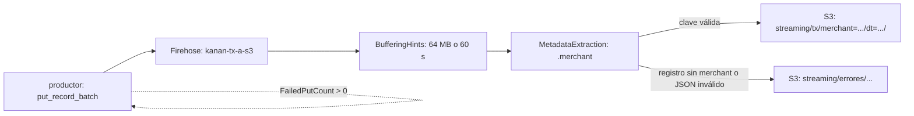
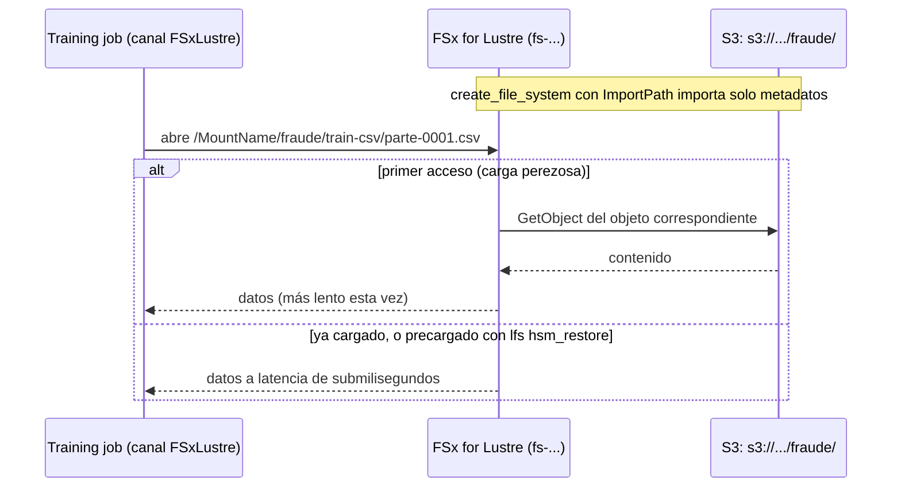

> [!info] Cómo leer esta nota
> El texto en inglés es el capítulo original, sin cambios en ninguna palabra: solo
> se le dio formato Markdown (encabezados, listas y tablas). Todo lo que está en
> español es añadido: bloques de código con su explicación, colocados justo después
> del pasaje que implementan.
>
> Todos los bloques usan el perfil `kanan-dev`, la región `us-east-1`, la cuenta
> `111111111111` y los buckets del caso Kanan (`kanan-ml-dev-raw-us-east-1`,
> `kanan-ml-dev-curated-us-east-1`, `kanan-ml-dev-artifacts-us-east-1`). Cada bloque
> es autocontenido: importa lo que usa y define sus constantes. Los roles de
> servicio que aparecen (`KananFirehoseDeliveryRole-dev`, `KananGlueJobRole-dev`,
> etc.) se suponen creados; cómo se crea un rol de servicio está en las notas de IAM.
>
> Los bloques de formatos (Parquet, Avro, RecordIO) y las funciones Lambda se
> ejecutaron en local y muestran su salida real. Los bloques que llaman a AWS no se
> ejecutaron contra una cuenta: sus operaciones y parámetros se validaron contra los
> modelos de servicio de botocore 1.43.99.

**Chapter 2**

# Data Ingestion and Storage

> THE AWS CERTIFIED MACHINE LEARNING (ML) ENGINEER ASSOCIATE EXAM OBJECTIVES COVERED IN THIS CHAPTER MAY INCLUDE, BUT ARE NOT LIMITED TO, THE FOLLOWING:

- ✔ Domain 1: Data Preparation for Machine Learning
- 1.1 Ingest and store data

## Introducing Ingestion and Storage

Data ingestion and storage are the two core elements of the Collect Data phase of the machine learning (ML) lifecycle, as shown in Figure 2.1.

_FIGURE 2.1 The ML lifecycle._

As you learned in Chapter 1, your ML solution requires data to train the selected model and generate inference. Data may come in different forms (structured, semi-structured or unstructured), from different sources, and at different times.

Ingestion is the process responsible for collecting the data for your ML solution and pushing it into AWS. You—as an AWS machine learning engineer—will need to select the best AWS data ingestion service to gather the data from different sources based on volume, velocity, and variety.

Upon collection, you will need to store the ingested data in a suitable and secure location to ensure the durability and availability requirements are met. With this approach, your ML solution will have access to the data to train your ML model when it’s needed (availability) and as long as it’s needed (durability).

## Ingesting and Storing Data

Before delving into ingestion and storage, let’s take a step back to better understand all the elements of an ML problem.

Machine learning is part of a broader discipline known as data engineering. In this context, ML is one of the three ways data is served.

Figure 2.2 illustrates the data engineering lifecycle. The first step is generation, which is focused on where the data originates from. Data can be generated by a variety of different source system such as a database, an Internet of Things (IoT) device, a streaming system, and more. A data engineer designs processes to consume data from source systems but might not be able to control them.

_FIGURE 2.2 The data engineering lifecycle._

Upon generation, data is ingested in its raw format(s) into a storage system located in AWS, where it is stored and subsequently processed. For the exam, it is necessary to ensure an appropriate data store is chosen. The choice is based on the specific use case. For example, you may want to store your raw data as object storage in an S3 bucket because your data is produced in batches, and this type of storage is relatively cheap compared to other means. Conversely, if your data was produced and consumed in near real time, you may want to store it in a streaming storage medium, such as Amazon Kinesis Data Streams.

Figure 2.3 shows a hierarchical view of storage layers in AWS. The top layer illustrates storage at a conceptual level by listing different types of storage abstractions. The middle layer describes storage at a logical level, with some of the most commonly used storage systems and types. The bottom layer lists the underlying infrastructure components that make the storage systems, and the corresponding storage abstractions, work. For each storage system, several AWS services are generally available.

_FIGURE 2.3 AWS storage systems._

For the exam it is also required that you understand how to extract the stored data and how to prepare it for your selected ML algorithm, which will be used to train your model and derive inferences. These tasks will be covered in the next chapters.

In the upcoming sections, you will learn how to choose the most appropriate data store to collect and host the data for your ML solution. The core AWS services to ingest data from different sources into AWS will be covered, as well as the main use cases that apply to them.

## Data Formats and Ingestion Techniques

There are many different data formats to efficiently ingest and store data for your ML model. By using the right data format and algorithm, you—as a machine learning engineer—can optimize performance, improve scalability, and reduce processing time.

AWS supports a variety of data formats to cater to different use cases and services. These are some of the commonly used data formats to ingest and store data in AWS:

- Comma-separated values (CSV)
- JavaScript Object Notation (JSON)
- Apache Parquet
- Apache Optimized Row Columnar (ORC)
- Apache Avro
- RecordIO

CSV is widely used to store structured data in tabular format, whereas JSON is ideal for document-based, semi-structured data.

Apache Parquet and Apache ORC are columnar data formats and are designed to optimize storage operations (read, writes) for large datasets. The values in each column are stored in contiguous memory locations, providing the following benefits:

- Column-specific compression is efficient in storage space.
- Column-specific encoding and compression techniques can be used.
- Queries that fetch specific column values do not need to read the entire row, thus improving performance.

#### El mismo millón de transacciones en cuatro formatos

Este bloque corre en local, sin cuenta de AWS: genera un millón de transacciones
sintéticas y las escribe en CSV, JSON Lines, Parquet y ORC, para ver con números
los tres beneficios del formato columnar que acaba de enumerar el texto. Necesita
`numpy`, `pandas` y `pyarrow` (probado con pandas 2.2.2 y pyarrow 20.0.0).

```python
import os

import numpy as np
import pandas as pd
import pyarrow as pa
import pyarrow.orc as orc
import pyarrow.parquet as pq

rng = np.random.default_rng(0)
n = 1_000_000
df = pd.DataFrame({
    "customer_id": rng.integers(1, 50_000, n),
    "amount": rng.gamma(2.0, 50.0, n).round(2),
    "merchant": rng.choice(["grocery", "fuel", "online", "travel"], n),
    "is_fraud": (rng.random(n) < 0.01).astype("int8"),
})

df.to_csv("tx.csv", index=False)
df.to_json("tx.jsonl", orient="records", lines=True)
df.to_parquet("tx.parquet", compression="snappy", index=False)
orc.write_table(pa.Table.from_pandas(df, preserve_index=False), "tx.orc", compression="zstd")

for f in ["tx.csv", "tx.jsonl", "tx.parquet", "tx.orc"]:
    print(f"{f:11s} {os.path.getsize(f) / 1e6:6.1f} MB")

solo_amount = pq.read_table("tx.parquet", columns=["amount"])
print(solo_amount.num_columns, "columna,", solo_amount.num_rows, "filas")

col = pq.ParquetFile("tx.parquet").metadata.row_group(0).column(2)
print(col.path_in_schema, col.compression, col.encodings)
print(col.statistics.min, col.statistics.max)
```

Salida:

```text
tx.csv        21.8 MB
tx.jsonl      69.8 MB
tx.parquet     4.7 MB
tx.orc         6.9 MB
1 columna, 1000000 filas
merchant SNAPPY ('PLAIN', 'RLE', 'RLE_DICTIONARY')
fuel travel
```

`df.to_json(..., orient="records", lines=True)` escribe _JSON Lines_: un objeto
JSON por línea, sin corchete que envuelva el archivo. Es la variante que acepta
DeepAR (Tabla 2.1) y la que usan los servicios de streaming de este capítulo,
porque un archivo así se puede partir por saltos de línea sin parsearlo entero.
Sin `lines=True`, pandas escribe un único arreglo JSON, que hay que leer completo
antes de obtener el primer registro. Los 70 MB, tres veces el CSV, salen de
repetir el nombre de cada columna en cada fila.

`to_parquet(compression="snappy")` comprime **cada columna por separado**: es el
primer beneficio de la lista. Snappy ya es el valor por defecto; lo escribo
explícito para que se vea la elección. `"gzip"` y `"zstd"` comprimen más a cambio
de más CPU al leer.

`pa.Table.from_pandas(df, preserve_index=False)` convierte el `DataFrame` a la
tabla de Arrow que pide el escritor de ORC. `preserve_index=False` evita que el
índice de pandas acabe guardado como una columna más.

`pq.read_table("tx.parquet", columns=["amount"])` es el tercer beneficio: del
disco solo se leen los bloques de `amount`. En CSV no hay equivalente real:
`pd.read_csv(usecols=["amount"])` tiene que recorrer cada fila completa para
encontrar dónde empieza y dónde acaba la columna que quieres.

`metadata.row_group(0).column(2)`: un archivo Parquet se divide en _row groups_
(bloques de filas) y, dentro de cada uno, en _column chunks_ (el tramo de una
columna dentro del bloque). La salida muestra el segundo beneficio: `merchant`,
que solo tiene cuatro valores distintos, se codificó con diccionario
(`RLE_DICTIONARY`), así que cada fila guarda un entero pequeño en vez de la
cadena. Las estadísticas `min`/`max` de cada bloque son lo que permite a un motor
de consultas saltarse bloques enteros que no pueden cumplir un `WHERE`.

Unlike Apache Parquet and Apache ORC, Apache Avro is designed to store data in a row-based format. Avro data relies on schemas. When Avro data is read, the schema used when writing it is always present. This permits each data component to be written with no per-value overheads, making serialization both fast and small. This also facilitates use with dynamic scripting languages, because data, together with its schema, is fully self-describing. When Avro data is stored in a file, its schema is stored with it as well so that files may be processed later by any program. If the program reading the data expects a different schema, this can be easily resolved, because both schemas are present.

#### Un archivo Avro que lleva su esquema dentro

Corre en local con `fastavro` (`pip install fastavro`, probado con 1.12.2). Escribe
dos transacciones con un esquema y las lee después con otro que tiene un campo
más, que es exactamente el caso del último párrafo.

```python
from fastavro import parse_schema, reader, writer

esquema_v1 = parse_schema({
    "type": "record",
    "name": "Transaccion",
    "namespace": "kanan.fraude",
    "fields": [
        {"name": "customer_id", "type": "long"},
        {"name": "amount", "type": "double"},
    ],
})

registros = [
    {"customer_id": 123, "amount": 45.9},
    {"customer_id": 456, "amount": 12.0},
]

with open("tx.avro", "wb") as f:
    writer(f, esquema_v1, registros, codec="deflate")

with open("tx.avro", "rb") as f:
    lector = reader(f)
    print(lector.writer_schema["fields"])
    print(list(lector))

esquema_v2 = parse_schema({
    "type": "record",
    "name": "Transaccion",
    "namespace": "kanan.fraude",
    "fields": [
        {"name": "customer_id", "type": "long"},
        {"name": "amount", "type": "double"},
        {"name": "channel", "type": "string", "default": "desconocido"},
    ],
})

with open("tx.avro", "rb") as f:
    print(list(reader(f, reader_schema=esquema_v2)))
```

Salida:

```text
[{'name': 'customer_id', 'type': 'long'}, {'name': 'amount', 'type': 'double'}]
[{'customer_id': 123, 'amount': 45.9}, {'customer_id': 456, 'amount': 12.0}]
[{'customer_id': 123, 'amount': 45.9, 'channel': 'desconocido'}, {'customer_id': 456, 'amount': 12.0, 'channel': 'desconocido'}]
```

El esquema es un documento JSON: un `record` con nombre, _namespace_ (espacio de
nombres, para distinguir dos `Transaccion` de equipos distintos) y una lista de
campos tipados. `parse_schema` lo valida antes de usarlo; un tipo mal escrito
falla aquí y no a mitad de la escritura.

`writer(f, esquema_v1, registros, codec="deflate")` guarda el esquema **una vez**,
en la cabecera del archivo, y después cada registro en binario sin nombres de
campo: 123 y 45.9, sin `"customer_id"` delante. Es el «no per-value overheads»
del texto, y la diferencia con JSON Lines, que repite los nombres en cada línea.

`lector.writer_schema` demuestra el «self-describing»: el lector no recibió
ningún esquema y aun así sabe qué contiene el archivo.

`reader(f, reader_schema=esquema_v2)` es la resolución de esquemas: el programa
espera un campo `channel` que el archivo no tiene, y como ambos esquemas están
presentes, Avro rellena el campo con su `default`. Si quitas `"default"` de
`channel`, la lectura falla con
`SchemaResolutionError: No default value for field channel in kanan.fraude.Transaccion`.

Last, RecordIO is a data format used primarily by Apache MXNet, a deep learning framework. The basic idea is to divide the data into individual chunks, called records, and then prepend to every record its length in bytes, followed by the data. As a result, RecordIO implements a file format for a sequence of records.

#### El formato RecordIO escrito a mano

RecordIO es poco más que la idea del párrafo anterior: una cabecera fija con la
longitud y, detrás, los bytes. Estas dos funciones escriben y leen el formato de
MXNet con la biblioteca estándar, para ver byte por byte qué hay en el archivo.

```python
import struct

MAGIC = 0xCED7230A


def escribir_recordio(ruta, cargas):
    with open(ruta, "wb") as f:
        for datos in cargas:
            f.write(struct.pack("<II", MAGIC, len(datos)))
            f.write(datos)
            f.write(b"\x00" * (-len(datos) % 4))


def leer_recordio(ruta):
    registros = []
    with open(ruta, "rb") as f:
        while True:
            cabecera = f.read(8)
            if not cabecera:
                break
            magic, longitud = struct.unpack("<II", cabecera)
            if magic != MAGIC:
                raise ValueError("cabecera inválida: archivo corrupto o desalineado")
            registros.append(f.read(longitud))
            f.read(-longitud % 4)
    return registros


escribir_recordio("tx.rec", [b"primer registro", b"otro", b"x" * 10])
print(leer_recordio("tx.rec"))

with open("tx.rec", "rb") as f:
    print(f.read(24).hex(" "))
```

Salida:

```text
[b'primer registro', b'otro', b'xxxxxxxxxx']
0a 23 d7 ce 0f 00 00 00 70 72 69 6d 65 72 20 72 65 67 69 73 74 72 6f 00
```

`struct.pack("<II", MAGIC, len(datos))` escribe dos enteros sin signo de 32 bits
en orden _little-endian_ (`<`): el número mágico y la longitud. En la salida
hexadecimal se ven así: `0a 23 d7 ce` es `0xCED7230A` con los bytes invertidos, y
`0f 00 00 00` es 15, la longitud de `"primer registro"`. El número mágico no
aporta datos: sirve para detectar que el lector perdió la alineación, y por eso
`leer_recordio` falla si no lo encuentra.

`b"\x00" * (-len(datos) % 4)` rellena con ceros hasta un múltiplo de 4 bytes; el
`00` final de la salida es ese relleno (15 bytes + 1). Gracias a la longitud en
la cabecera, un lector puede saltar registros sin leerlos y un trabajo
distribuido puede repartir el archivo por registros.

En MXNet los 3 bits altos de la longitud marcan si un registro se partió en
varios trozos; con registros de menos de 512 MB valen cero y se pueden ignorar,
como aquí. El **RecordIO-protobuf** de la Tabla 2.1 es este mismo contenedor
cuando cada carga es un mensaje _protobuf_ `Record` con el vector de
características y la etiqueta. El SDK de SageMaker v2 lo escribía con
`sagemaker.amazon.common.write_numpy_to_dense_tensor`; en el SDK v3 (3.22.1) el
módulo `sagemaker.amazon` ya no existe (`ModuleNotFoundError`), así que ese camino
no está disponible con las versiones de este vault.

A key driver in the decision of what data format to choose is the format supported by the ML algorithm you intend to use for your ML problem. This ML algorithm will be trained on your data, so ensuring compatibility between the data format and the algorithm’s requirements is crucial for optimal performance and efficiency. By aligning your data format with the algorithm’s capabilities, you can streamline the data ingestion process, reduce preprocessing overhead, and achieve more accurate and faster results in your ML workflow.

Table 2.1 lists built-in Amazon SageMaker algorithms along with their accepted data formats. Chapter 4 will cover in detail each one of these algorithms.

**TABLE 2.1 Data format support for built-in ML algorithms in Amazon SageMaker.**

| Algorithm                  | Accepted data formats              |
| -------------------------- | ---------------------------------- |
| BlazingText                | Text file (one sentence per line)  |
| DeepAR forecasting         | JSON Lines, Parquet                |
| Factorization Machines     | RecordIO-protobuf, CSV             |
| Image classification       | RecordIO, image files (.jpg, .png) |
| IP Insights                | CSV                                |
| K-means                    | RecordIO-protobuf, CSV             |
| K-nearest neighbors (k-NN) | RecordIO-protobuf, CSV             |
| Linear learner             | RecordIO-protobuf, CSV             |
| LDA                        | RecordIO-protobuf, CSV             |
| Neural topic model         | RecordIO-protobuf, CSV             |
| Object detection           | RecordIO, image files (.jpg, .png) |
| PCA                        | RecordIO-protobuf, CSV             |
| Random cut forest          | RecordIO-protobuf, CSV             |
| Semantic segmentation      | RecordIO, image files (.jpg, .png) |
| Seq2Seq                    | RecordIO-protobuf, text file       |
| XGBoost                    | CSV, LibSVM, Parquet               |

#### Declarar el formato del canal de entrenamiento

La Tabla 2.1 se vuelve concreta en un único campo: el `ContentType` de cada
canal de un _training job_. SageMaker no convierte nada: copia los objetos tal
como están en S3 y le pasa al algoritmo la cadena `ContentType` para que sepa
cómo parsearlos. Este bloque lanza XGBoost con los datos en CSV.

```python
from datetime import datetime

import boto3

session = boto3.Session(profile_name="kanan-dev", region_name="us-east-1")
sm = session.client("sagemaker")

job_name = "kanan-fraude-xgb-" + datetime.now().strftime("%Y%m%d-%H%M%S")
sm.create_training_job(
    TrainingJobName=job_name,
    RoleArn="arn:aws:iam::111111111111:role/KananSageMakerExecutionRole-dev",
    AlgorithmSpecification={
        "TrainingImage": "683313688378.dkr.ecr.us-east-1.amazonaws.com/sagemaker-xgboost:1.7-1",
        "TrainingInputMode": "File",
    },
    HyperParameters={"objective": "binary:logistic", "num_round": "100"},
    InputDataConfig=[{
        "ChannelName": "train",
        "ContentType": "text/csv",
        "DataSource": {"S3DataSource": {
            "S3DataType": "S3Prefix",
            "S3Uri": "s3://kanan-ml-dev-curated-us-east-1/fraude/train-csv/",
            "S3DataDistributionType": "FullyReplicated",
        }},
    }],
    OutputDataConfig={"S3OutputPath": "s3://kanan-ml-dev-artifacts-us-east-1/fraude/modelos/"},
    ResourceConfig={"InstanceType": "ml.m5.xlarge", "InstanceCount": 1, "VolumeSizeInGB": 30},
    StoppingCondition={"MaxRuntimeInSeconds": 3600},
)
print(sm.describe_training_job(TrainingJobName=job_name)["TrainingJobStatus"])
```

`"TrainingImage"` es la imagen del algoritmo integrado; la cuenta `683313688378`
es la que publica XGBoost en `us-east-1` y cambia por región. No hace falta
memorizarla: `from sagemaker.core import image_uris` y
`image_uris.retrieve("xgboost", region="us-east-1", version="1.7-1")` devuelve
esa misma cadena (comprobado con el SDK 3.22.1).

`"ContentType": "text/csv"` es la columna derecha de la Tabla 2.1 traducida a
cadena. Con CSV, XGBoost espera la **etiqueta en la primera columna y ningún
encabezado**; si el archivo trae encabezado, la primera fila se interpreta como
datos y el job falla al convertir texto a número. Las cadenas que usan los
algoritmos integrados:

| Formato de la Tabla 2.1                            | `ContentType` del canal           |
| -------------------------------------------------- | --------------------------------- |
| CSV con etiqueta en la primera columna             | `text/csv`                        |
| CSV sin etiqueta (k-means, PCA, Random Cut Forest) | `text/csv;label_size=0`           |
| LibSVM                                             | `text/libsvm`                     |
| Parquet                                            | `application/x-parquet`           |
| RecordIO-protobuf                                  | `application/x-recordio-protobuf` |
| Imágenes empaquetadas en RecordIO                  | `application/x-recordio`          |
| Imágenes sueltas (.jpg, .png)                      | `application/x-image`             |

`HyperParameters` va con los valores como **cadenas** (`"100"`, no `100`): la API
solo acepta un mapa de texto a texto, y un entero produce un
`ParamValidationError` antes de salir de tu máquina.

Si cambias `"text/csv"` por `"application/x-parquet"` sin cambiar los archivos,
nada lo impide al crear el job: el error aparece minutos después, cuando el
algoritmo intenta leer un CSV como Parquet y el job termina en `Failed`.

Another important driver to consider is your data access pattern. A data access pattern defines how producers and consumers interact with data to meet business needs. It involves understanding and documenting the ways data is queried, stored, and retrieved. The following are the main factors that define your data access pattern:

- **Data size.** Knowing the volume of data helps in determining effective data partitioning.
- **Data shape.** Organizing data to match query requirements can enhance speed and scalability.
- **Data velocity.** Understanding peak query loads helps in optimizing data partitioning for better I/O capacity.

Table 2.2 illustrates an example of what you should look for in a data access pattern.

**TABLE 2.2 Example of a data access pattern.**

| Field                                 | Example                                         |
| ------------------------------------- | ----------------------------------------------- |
| Data Access Pattern Name              | Find orders                                     |
| Data Access Pattern Description       | Find orders by Customer ID and Time Interval    |
| Priority                              | Medium                                          |
| Operation (Read/Write)                | Read                                            |
| Type (Single Item/Multiple Items/All) | Multiple                                        |
| Filter                                | Customer ID = 123, Time Interval = 24 hours ago |
| Sort                                  | Time descending                                 |

In essence, data access patterns help in designing efficient and scalable data ingestion solutions by aligning your organization data with access requirements.

Put differently, the way your raw data is consumed from different sources and is ingested and stored into AWS will help you determine the data format and the AWS service to use.

Table 2.3 shows how AWS services are grouped based on whether your data is structured, semi-structured, or unstructured.

**TABLE 2.3 AWS services for structured, semi-structured, and unstructured data**

**Structured data**

| Service         | Key characteristics                                                                                                                                                                         |
| --------------- | ------------------------------------------------------------------------------------------------------------------------------------------------------------------------------------------- |
| Amazon RDS      | Managed relational database service supporting multiple engines (MySQL, PostgreSQL, MariaDB, Oracle, SQL Server); handles provisioning, patching, backups, and read replicas automatically. |
| Amazon Aurora   | MySQL- and PostgreSQL-compatible relational database built for the cloud; offers higher throughput than standard MySQL/PostgreSQL, with storage that auto-scales up to 128 TB.              |
| Amazon Redshift | Fully managed data warehouse for large-scale analytics; uses columnar storage and massively parallel processing (MPP) to run complex SQL queries over petabytes of data.                    |
| Amazon S3       | Object storage that can hold structured files (e.g., CSV, Parquet); pairs with query engines like Athena or Redshift Spectrum for analysis without moving the data.                         |
| Amazon Athena   | Serverless, interactive query service that runs standard SQL directly against data in S3; no infrastructure to manage, pay only per query.                                                  |

**Semi-structured data**

| Service           | Key characteristics                                                                                                                            |
| ----------------- | ---------------------------------------------------------------------------------------------------------------------------------------------- |
| Amazon DynamoDB   | Fully managed NoSQL key-value and document database; delivers single-digit millisecond latency at any scale, with built-in horizontal scaling. |
| Amazon DocumentDB | Managed document database service, compatible with MongoDB APIs and drivers; designed for JSON-like document workloads.                        |
| Amazon Athena     | Same serverless SQL engine as above; also supports querying semi-structured formats such as JSON and Avro directly from S3.                    |
| Amazon S3         | Object storage commonly used to hold semi-structured files (JSON, XML, logs) before or alongside processing.                                   |

**Unstructured data**

| Service            | Key characteristics                                                                                                                        |
| ------------------ | ------------------------------------------------------------------------------------------------------------------------------------------ |
| Amazon S3          | Object storage for any file type (images, video, audio, text) at virtually unlimited scale; the common landing zone for unstructured data. |
| Amazon Rekognition | Computer vision service that uses deep learning to detect objects, scenes, faces, and inappropriate content in images and video.           |
| Amazon Transcribe  | Automatic speech recognition (ASR) service that converts audio into text, with support for speaker identification and custom vocabularies. |
| Amazon Comprehend  | Natural language processing (NLP) service that extracts insights from text, such as sentiment, key phrases, entities, and language.        |

As you may have noticed, Amazon S3 is the most flexible service because it can be used for all three data categories. Additionally, you can supplement Amazon S3 with Amazon Athena and query your data directly from S3 without formatting the data or managing the infrastructure.

In the next sections, we will deep dive into these services as they relate to ingestion and storage.

## Choosing AWS Ingestion Services

When it comes to ingestion services, AWS offers a broad spectrum of options. What service best fits your use case is driven by a number of factors:

- **Scalability.** Your ingestion solution must be able to support the velocity and volume of your data as it becomes available from all its data sources.
- **Resilience.** Your ingestion solution must be able to recover from failures and be able to resume seamlessly from when the failure occurred.
- **Security and compliance.** The data must be properly secured during the ingestion process so that no unauthorized actor is allowed to ever consume it while in transit or while it is stored. Moreover, the ingestion process must comply with industry-specific regulations, e.g., Payment Card Industry Data Security Standard (PCI DSS), Health Insurance Portability and Accountability Act (HIPAA), and so on. Additional considerations must be examined to ensure data is ingested and stored in accordance with data residency requirements.
- **Cost.** With the cloud pay-as-you-go delivery model, you always want to make sure cost is under control. This is even more true when dealing with streaming data, which virtually never stops. As a result, costs incurred to ingest and store data to train your ML models can quickly grow. You, as an ML engineer, need to choose an AWS ingestion service that supports the most cost-effective pricing model for your use case.
- **Flexibility.** Your ingestion solution must be able to adapt to changes. AWS services are highly customizable. Make sure you tailor your data ingestion pipelines to meet your business and technical requirements, but also consider change as an additional element to be addressed in the architecture of your solution.

Let’s start our study with AWS data ingestion services for streaming data.

### Amazon Data Firehose

Amazon Data Firehose (formerly known as Amazon Kinesis Data Firehose) is a fully managed service that allows you to collect, transform, and deliver data streams to data lakes, data warehouses, and analytics services in near real time (within seconds).

As a fully managed service, Amazon Data Firehose continuously processes the stream, automatically scales based on the volume of data available, and delivers it to its destination within seconds.

To use Amazon Data Firehose, you configure a data stream with a source, a destination, and the transformations your data needs prior to reaching its destination.

You must select the source for your data stream, such as a topic in Amazon Managed Streaming for Kafka (MSK) or a stream in Kinesis Data Streams, or you can directly write data using the Firehose Direct PUT application programming interface (API). Amazon Data Firehose is integrated into more than 20 AWS services so you can set up a data stream from sources such as Amazon CloudWatch Logs, AWS Web Application Firewall (WAF) web ACL logs, AWS Network Firewall Logs, Amazon Simple Notification Services (SNS), or AWS IoT.

You must select a destination for your stream, such as Amazon S3, Amazon OpenSearch Service, Amazon Redshift, Splunk, Snowflake, or a custom HTTP endpoint.

You can optionally specify whether you want to convert your data stream into a format such as Parquet or ORC, decompress the data, perform custom data transformations using your own AWS Lambda function, or dynamically partition input records based on attributes to deliver into different locations.

#### Un Firehose que escribe en S3 particionando por comercio

El flujo que monta este bloque, con los nombres que aparecen en el código:



Firehose acumula registros hasta que se cumple la primera de las dos condiciones
de `BufferingHints` y entonces escribe un objeto en S3. Con la partición
dinámica activada, antes de escribir extrae `merchant` de cada JSON y lo usa para
decidir la carpeta; un registro del que no puede extraerlo no se pierde, va al
prefijo de errores. La flecha punteada es el único error que ve el productor:
registros rechazados en la llamada, que debe reenviar él.

```python
import time

import boto3

session = boto3.Session(profile_name="kanan-dev", region_name="us-east-1")
firehose = session.client("firehose")

STREAM = "kanan-tx-a-s3"
firehose.create_delivery_stream(
    DeliveryStreamName=STREAM,
    DeliveryStreamType="DirectPut",
    ExtendedS3DestinationConfiguration={
        "RoleARN": "arn:aws:iam::111111111111:role/KananFirehoseDeliveryRole-dev",
        "BucketARN": "arn:aws:s3:::kanan-ml-dev-raw-us-east-1",
        "Prefix": "streaming/tx/merchant=!{partitionKeyFromQuery:merchant}/dt=!{timestamp:yyyy-MM-dd}/",
        "ErrorOutputPrefix": "streaming/errores/!{firehose:error-output-type}/dt=!{timestamp:yyyy-MM-dd}/",
        "BufferingHints": {"SizeInMBs": 64, "IntervalInSeconds": 60},
        "CompressionFormat": "GZIP",
        "DynamicPartitioningConfiguration": {"Enabled": True},
        "ProcessingConfiguration": {
            "Enabled": True,
            "Processors": [{
                "Type": "MetadataExtraction",
                "Parameters": [
                    {"ParameterName": "MetadataExtractionQuery", "ParameterValue": "{merchant: .merchant}"},
                    {"ParameterName": "JsonParsingEngine", "ParameterValue": "JQ-1.6"},
                ],
            }],
        },
    },
)

while True:
    desc = firehose.describe_delivery_stream(DeliveryStreamName=STREAM)["DeliveryStreamDescription"]
    if desc["DeliveryStreamStatus"] == "ACTIVE":
        break
    time.sleep(10)
print("listo:", desc["DeliveryStreamARN"])
```

`DeliveryStreamType="DirectPut"` elige la fuente «Firehose Direct PUT API» del
texto: los productores llaman a la API directamente. Las otras fuentes son
`"KinesisStreamAsSource"` y `"MSKAsSource"`, que piden además
`KinesisStreamSourceConfiguration` o `MSKSourceConfiguration` con el ARN del origen.

`"RoleARN"` es un rol que Firehose **asume** para escribir en el bucket: tu
usuario crea el stream, pero quien escribe en S3 es el servicio con ese rol. Si
el rol no tiene `s3:PutObject` sobre el bucket, la creación funciona igual y el
fallo aparece después, como entregas fallidas en CloudWatch.

`"Prefix"` lleva dos expresiones que Firehose sustituye en cada entrega:
`!{partitionKeyFromQuery:merchant}` es el valor que extrajo el procesador de
abajo, y `!{timestamp:yyyy-MM-dd}` la fecha de llegada. El resultado,
`merchant=online/dt=2026-09-22/`, es el estilo `clave=valor` que Glue y Athena
reconocen como particiones sin configuración extra.

`"ErrorOutputPrefix"` es obligatorio en cuanto `Prefix` usa expresiones; sin él,
`create_delivery_stream` responde con `InvalidArgumentException`.
`!{firehose:error-output-type}` separa los errores por causa (por ejemplo, fallos
de partición frente a fallos de procesamiento).

`"BufferingHints"`: el primero de los dos umbrales que se cumpla dispara la
escritura. Esto explica el «within seconds» del texto: 60 s es el retraso máximo
que añade el búfer. Con partición dinámica, el mínimo de `SizeInMBs` es 64.

`"MetadataExtractionQuery": "{merchant: .merchant}"` es una expresión de `jq`
(de ahí `"JsonParsingEngine": "JQ-1.6"`) que construye un objeto con las claves
de partición a partir de cada registro JSON.

Enviar datos a ese stream:

```python
import json

import boto3

session = boto3.Session(profile_name="kanan-dev", region_name="us-east-1")
firehose = session.client("firehose")

transacciones = [
    {"customer_id": 123, "amount": 45.9, "merchant": "online"},
    {"customer_id": 456, "amount": 12.0, "merchant": "fuel"},
]
resp = firehose.put_record_batch(
    DeliveryStreamName="kanan-tx-a-s3",
    Records=[{"Data": (json.dumps(t) + "\n").encode("utf-8")} for t in transacciones],
)
if resp["FailedPutCount"] > 0:
    fallidas = [t for t, r in zip(transacciones, resp["RequestResponses"]) if "ErrorCode" in r]
    print("reenviar:", fallidas)
```

`json.dumps(t) + "\n"`: Firehose concatena los registros tal cual en el objeto
de S3. Sin el salto de línea, el archivo resultante es `{...}{...}{...}` en una
sola línea, que ni Athena ni Glue leen como JSON Lines.

`resp["FailedPutCount"]`: `put_record_batch` **no lanza excepción** cuando fallan
algunos registros de la tanda; devuelve éxito y marca los fallidos con
`ErrorCode` en `RequestResponses`, en el mismo orden que los enviaste. Un
productor que no mira este campo pierde datos sin enterarse. Cada llamada admite
hasta 500 registros y 4 MiB.

#### Transformar registros con una función Lambda

La «custom data transformation» del texto es una función Lambda a la que
Firehose entrega lotes de registros y de la que espera los mismos registros de
vuelta. Este código es la función completa y se puede probar en local, porque
el final construye un evento con la misma forma que el que envía Firehose.

```python
import base64
import json


def lambda_handler(event, context):
    salida = []
    for registro in event["records"]:
        tx = json.loads(base64.b64decode(registro["data"]))
        if tx.get("amount") is None:
            salida.append({"recordId": registro["recordId"], "result": "Dropped", "data": registro["data"]})
            continue
        tx["merchant"] = tx.get("merchant", "").strip().lower()
        datos = base64.b64encode((json.dumps(tx) + "\n").encode("utf-8")).decode("utf-8")
        salida.append({"recordId": registro["recordId"], "result": "Ok", "data": datos})
    return {"records": salida}


evento_prueba = {"records": [
    {"recordId": "1", "data": base64.b64encode(b'{"customer_id": 1, "amount": 10.5, "merchant": " Online "}').decode()},
    {"recordId": "2", "data": base64.b64encode(b'{"customer_id": 2}').decode()},
]}
for r in lambda_handler(evento_prueba, None)["records"]:
    print(r["recordId"], r["result"], base64.b64decode(r["data"]))
```

Salida:

```text
1 Ok b'{"customer_id": 1, "amount": 10.5, "merchant": "online"}\n'
2 Dropped b'{"customer_id": 2}'
```

`base64.b64decode(registro["data"])`: Firehose entrega el contenido de cada
registro en base64 y lo espera de vuelta en base64. Devolver el JSON en claro
hace que la entrega falle y los registros acaben en el prefijo de errores.

`"recordId"` tiene que volver **idéntico**: es como Firehose empareja cada
respuesta con el registro original. Un `recordId` que falta o no coincide marca
el lote como fallido.

`"result"` admite tres valores: `"Ok"` (se entrega `data`), `"Dropped"` (se
descarta a propósito y no cuenta como error) y `"ProcessingFailed"` (va al
prefijo de errores).

La función se conecta al stream agregando otro procesador a la lista
`Processors` del bloque de creación:

```python
procesador_lambda = {
    "Type": "Lambda",
    "Parameters": [
        {"ParameterName": "LambdaArn", "ParameterValue": "arn:aws:lambda:us-east-1:111111111111:function:kanan-tx-normaliza"},
        {"ParameterName": "BufferSizeInMBs", "ParameterValue": "1"},
        {"ParameterName": "BufferIntervalInSeconds", "ParameterValue": "60"},
    ],
}
```

La conversión a Parquet que menciona el texto necesita un esquema registrado en
el catálogo de AWS Glue, así que aparece después de la sección de AWS Glue.

#### Use Cases

Typical use cases include the following:

- **Streaming into data lakes and warehouses.** You can stream data into Amazon S3, Amazon Redshift, and other destinations, converting it into formats like Parquet for analysis without building complex processing pipelines.
- **Security observability.** You can monitor network security in real time and create alerts when potential threats arise using supported security information and event management (SIEM) tools.
- **Machine learning applications.** You can enrich data streams with ML models to analyze data and predict outcomes as the data moves to its destination.

### Amazon Kinesis Data Streams

Amazon Kinesis Data Streams is another managed service to ingest and store data streams for processing, with the value-add of performing real-time data streaming as well as providing extensive integration with the AWS ecosystem of data engineering services.

Amazon Kinesis Data Streams lets you build custom, real-time applications using the Amazon Managed Service for Apache Flink or other popular frameworks like Apache Spark. You can also stream your data directly to consumer applications running on Amazon EC2 instances. Additionally, AWS Lambda can be used as a consumer to process data in near real time without the need to manage servers.

With Amazon Kinesis Data Streams, your data is put into Kinesis data streams, which ensures durability and elasticity. The delay between the time a record is put into the stream and the time it can be consumed (put-to-get delay) is typically less than one second. Put differently, a Kinesis Data Streams application can start consuming the data from the stream almost immediately after the data is added. Because Amazon Kinesis Data Streams is a managed service, you don’t need to worry about creating and running a data intake pipeline.

The elasticity of Kinesis Data Streams enables you to automatically scale the stream up or down so that you never lose data records before they expire.

#### Crear un stream y escribir en él

```python
import json

import boto3

session = boto3.Session(profile_name="kanan-dev", region_name="us-east-1")
kinesis = session.client("kinesis")

STREAM = "kanan-tx-stream"
kinesis.create_stream(StreamName=STREAM, StreamModeDetails={"StreamMode": "ON_DEMAND"})
kinesis.get_waiter("stream_exists").wait(StreamName=STREAM)

eventos = [
    {"customer_id": 123, "amount": 45.9, "merchant": "online"},
    {"customer_id": 456, "amount": 12.0, "merchant": "fuel"},
]
resp = kinesis.put_records(
    StreamName=STREAM,
    Records=[
        {"Data": json.dumps(e).encode("utf-8"), "PartitionKey": str(e["customer_id"])}
        for e in eventos
    ],
)
print("fallidos:", resp["FailedRecordCount"])
for r in resp["Records"]:
    print(r.get("ShardId"), r.get("SequenceNumber"), r.get("ErrorCode"))
```

Un stream de Kinesis se divide en _shards_: particiones con capacidad fija,
1 MB/s o 1.000 registros/s de escritura y 2 MB/s de lectura cada una.
`"StreamMode": "ON_DEMAND"` hace que AWS añada y quite shards según el tráfico:
es la elasticidad del texto sin que tú hagas nada. La alternativa,
`"PROVISIONED"`, fija el número de shards y lo cambias tú (último bloque de esta
sección).

`get_waiter("stream_exists").wait(...)`: `create_stream` vuelve en cuanto acepta
la petición, con el stream todavía en `CREATING`. Escribir en ese momento
produce `ResourceNotFoundException`; el _waiter_ consulta el estado hasta que es
`ACTIVE`.

`"PartitionKey"` decide el shard: Kinesis calcula el hash MD5 de la cadena y la
coloca en el rango de algún shard. Usar `customer_id` garantiza que todas las
transacciones de un cliente caen en el mismo shard y se leen en orden, que es lo
que necesita un detector de fraude que compara cada compra con las anteriores.
Una clave constante (por ejemplo `"tx"`) manda todo a un shard, que se satura a
1 MB/s aunque el stream tenga cien.

`resp["FailedRecordCount"]`: igual que en Firehose, `put_records` no lanza
excepción por fallos parciales. Los registros rechazados, normalmente con
`ErrorCode` `ProvisionedThroughputExceededException`, hay que reenviarlos.

#### Leer el stream desde un consumidor propio

Un consumidor lee cada shard con un _iterador_: un marcador de posición que la
API te entrega y que se renueva en cada lectura.

```python
import json
import time

import boto3

session = boto3.Session(profile_name="kanan-dev", region_name="us-east-1")
kinesis = session.client("kinesis")

STREAM = "kanan-tx-stream"
shard_id = kinesis.list_shards(StreamName=STREAM)["Shards"][0]["ShardId"]
iterador = kinesis.get_shard_iterator(
    StreamName=STREAM, ShardId=shard_id, ShardIteratorType="TRIM_HORIZON"
)["ShardIterator"]

for _ in range(10):
    lote = kinesis.get_records(ShardIterator=iterador, Limit=100)
    for r in lote["Records"]:
        print(r["SequenceNumber"], r["ApproximateArrivalTimestamp"], json.loads(r["Data"]))
    iterador = lote["NextShardIterator"]
    time.sleep(1)
```

`ShardIteratorType="TRIM_HORIZON"` empieza por el registro más antiguo que
sigue retenido; `"LATEST"` empieza por lo que llegue a partir de ahora, y
`"AT_SEQUENCE_NUMBER"` retoma desde un punto guardado, que es como un consumidor
se recupera tras caerse. El nombre es histórico: el _trim horizon_ es el borde
por donde Kinesis va recortando los registros que caducan.

`iterador = lote["NextShardIterator"]`: cada iterador sirve para una lectura y
caduca a los 5 minutos. Reusar el viejo repite los mismos registros.

`time.sleep(1)`: cada shard admite 5 llamadas `GetRecords` por segundo,
compartidas entre todos los consumidores. Un bucle sin pausa agota ese límite y
recibe `ProvisionedThroughputExceededException`.

Este bucle recorre un único shard y no guarda por dónde va. En producción ese
trabajo lo hace la Kinesis Client Library o, sin servidores, AWS Lambda.

#### Consumir el stream con AWS Lambda

Con Lambda no hay iteradores: el servicio lee los shards por ti y llama a tu
función con lotes de registros.

```python
import base64
import json


def lambda_handler(event, context):
    for registro in event["Records"]:
        tx = json.loads(base64.b64decode(registro["kinesis"]["data"]))
        if tx["amount"] > 1000:
            print("revisar:", registro["kinesis"]["partitionKey"], tx)
```

Y la conexión entre el stream y la función, que se crea una vez:

```python
import boto3

session = boto3.Session(profile_name="kanan-dev", region_name="us-east-1")
lam = session.client("lambda")

lam.create_event_source_mapping(
    EventSourceArn="arn:aws:kinesis:us-east-1:111111111111:stream/kanan-tx-stream",
    FunctionName="kanan-tx-alertas",
    StartingPosition="LATEST",
    BatchSize=100,
    MaximumBatchingWindowInSeconds=1,
)
```

`create_event_source_mapping` crea el _event source mapping_: un lector que
administra Lambda, uno por shard, y que invoca tu función. `BatchSize` y
`MaximumBatchingWindowInSeconds` hacen el papel de `BufferingHints` en Firehose:
Lambda te llama al llenarse 100 registros o al pasar 1 segundo. Si la función
lanza una excepción, Lambda reintenta **el mismo lote** y ese shard no avanza
hasta que el lote se procese o caduque; un registro malformado puede bloquear un
shard entero.

#### Modo aprovisionado, número de shards y retención

```python
import boto3

session = boto3.Session(profile_name="kanan-dev", region_name="us-east-1")
kinesis = session.client("kinesis")

STREAM = "kanan-tx-stream"
arn = kinesis.describe_stream_summary(StreamName=STREAM)["StreamDescriptionSummary"]["StreamARN"]

kinesis.update_stream_mode(StreamARN=arn, StreamModeDetails={"StreamMode": "PROVISIONED"})
kinesis.get_waiter("stream_exists").wait(StreamName=STREAM)

kinesis.update_shard_count(StreamName=STREAM, TargetShardCount=4, ScalingType="UNIFORM_SCALING")
kinesis.get_waiter("stream_exists").wait(StreamName=STREAM)

kinesis.increase_stream_retention_period(StreamName=STREAM, RetentionPeriodHours=168)
```

`update_shard_count` divide o fusiona shards hasta llegar a 4, y el stream pasa
por `UPDATING` mientras tanto; por eso el _waiter_ entre llamadas: una segunda
modificación con el stream en `UPDATING` responde `ResourceInUseException`.

`increase_stream_retention_period(..., RetentionPeriodHours=168)`: por defecto
un registro se conserva 24 horas y después caduca aunque nadie lo haya leído.
Es el «before they expire» del texto. El máximo es 8.760 horas (365 días), y la
retención extendida se cobra aparte.

#### Use Cases

Typical use cases for Amazon Kinesis Data Streams include the following:

- **Accelerated log and data feed intake and processing.** You can have producers push data directly into a stream without having to worry about your data being lost if the application server fails. Amazon Kinesis Data Streams provides accelerated data feed intake because you don’t batch the data on the servers before you submit it for intake.
- **Real-time metrics and reporting.** You can use data collected into Amazon Kinesis Data Streams for simple data analysis and reporting in real time. For example, your data-processing application can work on metrics and reporting for system and application logs as the data is streaming in, rather than wait to receive batches of data.
- **Real-time data analytics.** This combines the power of parallel processing with the value of real-time data. For example, process website clickstreams in real time, and then analyze site usability engagement using multiple different Kinesis Data Streams applications running in parallel.
- **Complex stream processing.** You can create sophisticated data streams applications that combine multiple data streams into new data streams for downstream processing.

### Amazon Managed Streaming for Apache Kafka (MSK)

If you are familiar with the Apache Kafka event streaming platform, the good news is that you can build and run applications that use Apache Kafka on AWS with limited effort and minimal administration. AWS offers Amazon MSK, which enables you to securely ingest and process streaming data in real time with a fully managed, highly available Apache Kafka service.

Amazon MSK provides the control plane to let you create, update, and delete Apache Kafka clusters. For on-demand streaming and zero-operations use cases, you can choose Amazon MSK Serverless, which automatically provisions and scales capacity while managing the partitions in your topic, so you can stream data without worrying about right-sizing or scaling clusters. With Amazon MSK serverless, you pay only for what you use.

Amazon MSK also lets you use Apache Kafka’s data plane operations, such as those for producing and consuming data.

Additionally, Amazon MSK runs open-source versions of Apache Kafka. As a result, existing applications, tooling, and plugins from partners and the Apache Kafka community are supported without requiring changes to application code.

The exam does not expect you to master every aspect of Amazon MSK. Nonetheless, you will be required to know the main components of Amazon MSK’s architecture and their intended purpose:

- **Broker nodes.** These are the worker nodes that perform the “heavy-duty” tasks, including ingesting, storing (in topic partitions), and processing your streaming data. When creating an Amazon MSK cluster, you specify how many broker nodes you want Amazon MSK to create in each Availability Zone. Some of these broker nodes are elected for you as the controller nodes and are responsible for managing the states of partitions and replicas, performing administrative tasks like reassigning partitions, and maintaining the leader-follower relationship between brokers for partitions. The minimum is one broker node per Availability Zone. Each Availability Zone has its own virtual private cloud (VPC) subnet.
- **ZooKeeper nodes.** Amazon MSK also creates the Apache ZooKeeper nodes for you. Apache ZooKeeper is an open-source server that enables highly reliable distributed coordination between the broker nodes.
- **KRaft controllers.** The Apache Kafka community developed KRaft to replace Apache ZooKeeper for metadata management in Apache Kafka clusters. In KRaft mode, cluster metadata is propagated within a group of Kafka controllers, which are part of the Kafka cluster, instead of across ZooKeeper nodes. KRaft controllers are included at no additional cost and require no additional setup or management from you.
- **Producers, consumers, and topic creators.** Amazon MSK enables you to use Apache Kafka’s data-plane operations to create topics and to produce and consume data.
- **Cluster operations.** You can use the AWS Management Console, the AWS Command Line Interface (AWS CLI), or the APIs in the SDK to perform control plane operations. For example, you can create or delete an Amazon MSK cluster, list all the clusters in an account, view the properties of a cluster, and update the number and type of brokers in a cluster.

#### Plano de control: crear un clúster MSK Serverless con boto3

El último punto de la lista separa dos planos, y el código también: con boto3
(cliente `kafka`) se crea y se describe el clúster; producir y consumir mensajes
se hace con un cliente de Kafka, en el bloque siguiente.

Un clúster de MSK vive dentro de una VPC, en subredes de varias zonas de
disponibilidad, y eso obliga a pasar identificadores de red que esta nota no
enseña a crear:

> **Caja negra.** `SUBNETS` (lista de IDs `subnet-...` privadas, una por zona de
> disponibilidad) y `SECURITY_GROUP` (un ID `sg-...`) ya existen en la VPC de
> desarrollo y permiten el tráfico entre los recursos del proyecto. Aquí solo
> importa ese contrato: los copias de la consola de VPC y los pegas. Cómo se
> diseñan es el tema de [[23 - Red]]. Los bloques de EFS, FSx y RDS de esta nota
> usan la misma caja negra.

```python
import time

import boto3

session = boto3.Session(profile_name="kanan-dev", region_name="us-east-1")
kafka = session.client("kafka")

SUBNETS = ["subnet-0aaa1111bbbb2222c", "subnet-0ddd3333eeee4444f", "subnet-0ggg5555hhhh6666i"]
SECURITY_GROUP = "sg-0123456789abcdef0"

cluster_arn = kafka.create_cluster_v2(
    ClusterName="kanan-tx-kafka",
    Serverless={
        "VpcConfigs": [{"SubnetIds": SUBNETS, "SecurityGroupIds": [SECURITY_GROUP]}],
        "ClientAuthentication": {"Sasl": {"Iam": {"Enabled": True}}},
    },
)["ClusterArn"]

while kafka.describe_cluster_v2(ClusterArn=cluster_arn)["ClusterInfo"]["State"] != "ACTIVE":
    time.sleep(30)

brokers = kafka.get_bootstrap_brokers(ClusterArn=cluster_arn)["BootstrapBrokerStringSaslIam"]
print(brokers)
```

`create_cluster_v2(..., Serverless=...)` crea la variante MSK Serverless del
texto: no se elige número ni tipo de brokers. La misma operación con
`Provisioned=...` crea un clúster con brokers que dimensionas tú (bloque
siguiente al de Kafka).

`"ClientAuthentication": {"Sasl": {"Iam": {"Enabled": True}}}`: en MSK
Serverless la única autenticación de clientes es IAM, así que los productores y
consumidores se identifican con las mismas credenciales de boto3 y sus permisos
se escriben como políticas (`kafka-cluster:WriteData`, `kafka-cluster:ReadData`).

El bucle de `describe_cluster_v2`: el cliente `kafka` no tiene _waiters_, y el
clúster tarda varios minutos en pasar de `CREATING` a `ACTIVE`.

`get_bootstrap_brokers(...)["BootstrapBrokerStringSaslIam"]` devuelve la
dirección `host:9098` a la que se conectan los clientes de Kafka. Es la única
pieza que el plano de datos necesita del plano de control.

#### Plano de datos: crear un tema, producir y consumir

Esto corre en una máquina **dentro de la VPC** del clúster (una instancia EC2 o
una Lambda en esas subredes): el clúster no tiene dirección pública. Necesita
`pip install kafka-python==3.0.11 aws-msk-iam-sasl-signer-python==1.0.2`.

```python
import json

from aws_msk_iam_sasl_signer import MSKAuthTokenProvider
from kafka import KafkaConsumer, KafkaProducer
from kafka.admin import KafkaAdminClient, NewTopic
from kafka.net.sasl.oauth import AbstractTokenProvider

REGION = "us-east-1"
BOOTSTRAP = "boot-abcd1234.c2.kafka-serverless.us-east-1.amazonaws.com:9098"


class TokenMSK(AbstractTokenProvider):
    def token(self):
        token, _ = MSKAuthTokenProvider.generate_auth_token(REGION)
        return token


conexion = {
    "bootstrap_servers": BOOTSTRAP,
    "security_protocol": "SASL_SSL",
    "sasl_mechanism": "OAUTHBEARER",
    "sasl_oauth_token_provider": TokenMSK(),
}

admin = KafkaAdminClient(**conexion)
admin.create_topics([NewTopic(name="tx", num_partitions=6)])

productor = KafkaProducer(value_serializer=lambda v: json.dumps(v).encode("utf-8"), **conexion)
productor.send("tx", key=b"123", value={"customer_id": 123, "amount": 45.9})
productor.flush()

consumidor = KafkaConsumer(
    "tx",
    group_id="kanan-fraude",
    auto_offset_reset="earliest",
    value_deserializer=lambda b: json.loads(b),
    **conexion,
)
for mensaje in consumidor:
    print(mensaje.partition, mensaje.offset, mensaje.value)
```

`class TokenMSK(AbstractTokenProvider)`: kafka-python no sabe nada de IAM. Su
mecanismo `OAUTHBEARER` le pide a un objeto un _token_ cada vez que se conecta,
y la biblioteca de AWS fabrica ese token firmando con tus credenciales de boto3.
La clase solo une las dos piezas. En kafka-python 3.x la clase **tiene que
heredar** de `AbstractTokenProvider`; el ejemplo que circula para la 2.x, con una
clase suelta que solo define `token()`, falla con
`KafkaConfigurationError: sasl_oauth_token_provider must implement kafka.net.sasl.oauth.AbstractTokenProvider`.

`NewTopic(name="tx", num_partitions=6)`: las particiones de un tema de Kafka
cumplen el papel de los shards de Kinesis, y `key=b"123"` el de `PartitionKey`:
misma clave, misma partición, orden garantizado. No paso `replication_factor`
porque MSK Serverless fija la replicación por su cuenta.

`productor.flush()`: `send` solo encola el mensaje en memoria y lo envía en
segundo plano. Sin `flush`, un script que termina justo después pierde lo que
quedaba en cola.

`group_id="kanan-fraude"`: consumidores con el mismo grupo se reparten las
particiones y Kafka recuerda por qué _offset_ (posición) va cada grupo. Un
segundo grupo con otro nombre vuelve a leer todo el tema de forma
independiente, que es lo que hace de MSK un «system of record».

#### El mismo clúster, aprovisionado y en modo KRaft

Los componentes de la lista del texto aparecen como parámetros cuando el
clúster es aprovisionado:

```python
import boto3

session = boto3.Session(profile_name="kanan-dev", region_name="us-east-1")
kafka = session.client("kafka")

SUBNETS = ["subnet-0aaa1111bbbb2222c", "subnet-0ddd3333eeee4444f", "subnet-0ggg5555hhhh6666i"]
SECURITY_GROUP = "sg-0123456789abcdef0"

kafka.create_cluster(
    ClusterName="kanan-tx-kafka-prov",
    KafkaVersion="3.7.x.kraft",
    NumberOfBrokerNodes=3,
    BrokerNodeGroupInfo={
        "InstanceType": "kafka.m5.large",
        "ClientSubnets": SUBNETS,
        "SecurityGroups": [SECURITY_GROUP],
        "StorageInfo": {"EbsStorageInfo": {"VolumeSize": 100}},
    },
    ClientAuthentication={"Sasl": {"Iam": {"Enabled": True}}},
)
print(kafka.list_clusters_v2()["ClusterInfoList"])
```

`NumberOfBrokerNodes=3` con tres subredes es un broker por zona de
disponibilidad, el mínimo que menciona el texto. El número tiene que ser
múltiplo del número de subredes; 4 brokers en 3 subredes se rechaza.

`KafkaVersion="3.7.x.kraft"`: el sufijo `.kraft` elige metadatos gestionados por
controladores KRaft en lugar de nodos ZooKeeper. Ni unos ni otros aparecen como
parámetros: MSK los crea sin que los pidas, que es lo que el texto quiere decir
con «no additional setup». Las versiones disponibles en tu región las lista
`kafka.list_kafka_versions()`.

`"StorageInfo"`: el almacenamiento de las particiones son volúmenes EBS
adjuntos a cada broker, de 100 GiB aquí.

#### Use Cases

Typical use cases for Amazon MSK include the following:

- **Ingesting, storing, processing, and delivering real-time event streams.** Amazon MSK enables you to capture and process in real time high-volume application and database events and continuously ingest them into a data lake or to a variety of supported destinations for further processing.
- **System of record for streaming data.** Amazon MSK can act as a single source of truth for the state of your data. This means that all changes to the data are captured and stored in Amazon MSK durable topics, allowing different applications to access and update the state consistently.
- **Powering your event-driven architectures on AWS.** You can leverage the versatility of Apache Kafka to develop and build modern, secure event-driven applications on AWS.

### Amazon Managed Service for Apache Flink

With Amazon Managed Service for Apache Flink (formerly known as Amazon Kinesis Data Analytics), you can leverage the Apache Flink framework to process and analyze streaming data in real time. Apache Flink is an open-source stream processing framework for stateful computations and complex analytics.

Unlike Apache Kafka, Apache Flink does not provide its own data storage system. However, it is fully integrated with various external storage systems to manage state and process data, such as Amazon S3, Amazon MSK, Amazon Kinesis Data Streams, and other data sources.

Some of the unique capabilities offered by Apache Flink are its robust support for data streaming workloads at scale, fault tolerance, and strong guarantees of exactly-once correctness. This is particularly appealing to global enterprises, which require reliable and performant infrastructure to transfer large volumes of data in the form of real-time events.

Moreover, the service offers access to Apache Flink’s expressive APIs, and through Amazon Managed Service for Apache Flink Studio, you can interactively query data streams or launch stateful applications in only a few steps. With this managed service, you can get started with Apache Flink and quickly deploy and operate your data stream processing applications.

Just like Apache MSK and most of the AWS fully managed services, there are no servers and clusters to manage, and there is no compute infrastructure to set up. You pay only for the resources you use.

#### Una consulta continua sobre el stream de Kinesis (Studio)

En un cuaderno de Managed Service for Apache Flink Studio, un párrafo que
empieza con `%flink.ssql` se ejecuta como Flink SQL. Esta consulta declara el
stream `kanan-tx-stream` como tabla y calcula, por cliente, cuántas compras hace
y cuánto gasta en ventanas de un minuto. Las opciones del conector son las del
conector `kinesis` de Flink 1.15 que usan los cuadernos Studio; en versiones
recientes de Flink algunas cambiaron de nombre, así que si el cuaderno usa otra
versión conviene contrastarlas con la documentación del conector.

```sql
%flink.ssql

CREATE TABLE tx (
  customer_id BIGINT,
  amount DOUBLE,
  merchant STRING,
  event_time TIMESTAMP(3),
  WATERMARK FOR event_time AS event_time - INTERVAL '5' SECOND
) WITH (
  'connector' = 'kinesis',
  'stream' = 'kanan-tx-stream',
  'aws.region' = 'us-east-1',
  'scan.stream.initpos' = 'LATEST',
  'format' = 'json',
  'json.timestamp-format.standard' = 'ISO-8601'
);

SELECT
  customer_id,
  TUMBLE_END(event_time, INTERVAL '1' MINUTE) AS fin_ventana,
  COUNT(*) AS n_compras,
  SUM(amount) AS gasto
FROM tx
GROUP BY customer_id, TUMBLE(event_time, INTERVAL '1' MINUTE);
```

`CREATE TABLE ... WITH ('connector' = 'kinesis', ...)` no crea nada en Kinesis ni
copia datos: declara cómo leer el stream como si fuera una tabla. Es la frase
del texto «Flink does not provide its own data storage system» vuelta código.

`WATERMARK FOR event_time AS event_time - INTERVAL '5' SECOND` le dice a Flink
cuánto retraso tolerar: una ventana que acaba a las 12:01 se cierra cuando ha
visto eventos de las 12:01:05. Sin _watermark_, una ventana definida sobre
`event_time` nunca sabe cuándo está completa y no emite resultados.

`GROUP BY ... TUMBLE(event_time, INTERVAL '1' MINUTE)` agrupa en ventanas
consecutivas de un minuto que no se solapan. A diferencia de un `GROUP BY` sobre
una tabla, la consulta no termina: emite una fila por cliente cada vez que se
cierra una ventana. Los conteos parciales de cada ventana abierta son el
«estado» del que habla el texto, y Flink los guarda en _checkpoints_ para no
perderlos si la aplicación se reinicia.

#### Desplegar una aplicación Flink empaquetada

Fuera de Studio, una aplicación Flink es un JAR (o un ZIP de PyFlink) en S3 que
el servicio ejecuta:

```python
import boto3

session = boto3.Session(profile_name="kanan-dev", region_name="us-east-1")
flink = session.client("kinesisanalyticsv2")

APP = "kanan-tx-features"
flink.create_application(
    ApplicationName=APP,
    RuntimeEnvironment="FLINK-1_20",
    ServiceExecutionRole="arn:aws:iam::111111111111:role/KananFlinkAppRole-dev",
    ApplicationConfiguration={
        "ApplicationCodeConfiguration": {
            "CodeContent": {"S3ContentLocation": {
                "BucketARN": "arn:aws:s3:::kanan-ml-dev-artifacts-us-east-1",
                "FileKey": "flink/tx-features-1.0.jar",
            }},
            "CodeContentType": "ZIPFILE",
        },
        "FlinkApplicationConfiguration": {
            "CheckpointConfiguration": {"ConfigurationType": "DEFAULT"},
            "ParallelismConfiguration": {
                "ConfigurationType": "CUSTOM",
                "Parallelism": 4,
                "ParallelismPerKPU": 1,
                "AutoScalingEnabled": True,
            },
        },
        "EnvironmentProperties": {"PropertyGroups": [{
            "PropertyGroupId": "kanan",
            "PropertyMap": {"input.stream": "kanan-tx-stream", "output.bucket": "kanan-ml-dev-curated-us-east-1"},
        }]},
    },
)
flink.start_application(ApplicationName=APP, RunConfiguration={"FlinkRunConfiguration": {"AllowNonRestoredState": False}})
```

El cliente se llama `kinesisanalyticsv2` porque el servicio se llamaba Amazon
Kinesis Data Analytics; el cambio de nombre no llegó a la API.

`"CodeContentType": "ZIPFILE"` vale también para un JAR: la otra opción,
`"PLAINTEXT"`, es para código en línea de las aplicaciones SQL antiguas.

`"CheckpointConfiguration": {"ConfigurationType": "DEFAULT"}` activa los
_checkpoints_ periódicos con los valores del servicio. De ellos depende la
garantía «exactly-once» del texto: tras un fallo, la aplicación retoma desde el
último checkpoint en lugar de reprocesar o saltarse eventos.

`"ParallelismConfiguration"`: el servicio cobra por KPU (_Kinesis Processing
Unit_, otra vez el nombre antiguo); `Parallelism` 4 con `ParallelismPerKPU` 1
son 4 KPU, y `AutoScalingEnabled` permite que el servicio suba el paralelismo
cuando la carga lo pide.

`"EnvironmentProperties"` son los parámetros que el código de la aplicación lee
al arrancar; así el mismo JAR sirve para desarrollo y producción.

#### Use Cases

Typical use cases for Amazon Managed Service for Apache Flink include the following:

- **Streaming data pipelines.** Continuously ingest, enrich, and transform data streams, loading them into destination systems for timely action (versus batch processing). Examples include data lake ingestion, ML pipelines, and streaming extract, transform, load (ETL).
- **Stream and batch analytics.** Amazon Managed Service for Apache Flink supports traditional batch queries on bounded datasets and real-time, continuous queries from unbounded, live data streams. Examples include usage metering and billing, network monitoring, feature engineering, and campaign performance.
- **Event-driven applications.** You can leverage the capabilities of Apache Flink to easily develop and maintain event-driven applications on AWS. An event-driven application is a stateful application that ingests events from one or more event streams and reacts to incoming events by triggering computations, state updates, or external actions. Examples include fraud detection, business processes monitoring, and geo-fencing.

### AWS DataSync

AWS DataSync is a data transfer and discovery service that simplifies data migration and helps you quickly, easily, and securely transfer your file or object data to, from, and between AWS storage services.

AWS DataSync achieves data discovery by using a DataSync agent to connect to your source storage system’s management interface. The agent collects information about your storage resources, including performance metrics and capacity utilization. This data is then sent to AWS DataSync Discovery, which analyzes the information and provides recommendations for migrating your data to AWS storage services. This automated process helps you understand your storage utilization and plan your migration more effectively.

With AWS DataSync, you can also transfer data between other cloud storage systems or on-premises storage systems and AWS services. In this context, cloud storage systems can include the following:

- Self-managed storage systems, such as an NFS file server in your VPC within AWS
- Storage systems or services hosted by another cloud provider
- Storage systems or services hosted on-premises in your company data center(s)

AWS DataSync supports the following storage systems:

- Network File System (NFS)
- Server Message Block (SMB)
- Hadoop Distributed File Systems (HDFS)
- Object storage (Google Cloud Storage, Azure Blob Storage, Wasabi Cloud Storage, and self-managed object storage compatible with the Amazon S3 API)

AWS DataSync supports the following AWS storage services:

- Amazon S3
- Amazon EFS
- Amazon FSx for Windows File Server
- Amazon FSx for Lustre
- Amazon FSx for OpenZFS
- Amazon FSx for NetApp ONTAP
- AWS Snowcone
- AWS Snowball Edge

By using DataSync, you can achieve the following benefits:

- **Simplify migration planning.** With automated data collection and recommendations, DataSync Discovery can minimize the time, effort, and costs associated with planning your data migrations to AWS. You can use recommendations to inform your budget planning and rerun discovery jobs to validate your assumptions as you approach your migration.
- **Automate data movement.** DataSync makes it easier to transfer data over the network between storage systems and services. DataSync automates both the management of data-transfer processes and the infrastructure required for high performance and secure data transfer.
- **Transfer data securely.** DataSync provides end-to-end security, including encryption and integrity validation, to help ensure that your data arrives securely, intact, and ready to use. DataSync accesses your AWS storage through built-in AWS security mechanisms, such as AWS Identity and Access Management (IAM) roles. It also supports VPC endpoints, giving you the option to transfer data without traversing the public Internet and further increasing the security of data copied online.
- **Move data faster.** DataSync uses a purpose-built network protocol and a parallel, multithreaded architecture to accelerate your transfers. This approach speeds up migrations, recurring data-processing workflows for analytics and ML, and data protection processes.
- **Reduce operational costs.** Move data cost-effectively with the flat, per-gigabyte pricing of DataSync. Avoid having to write and maintain custom scripts or use costly commercial transfer tools.

#### Una tarea de DataSync de un NFS local a S3

Una transferencia en DataSync son tres recursos: una _location_ de origen, una de
destino y una _task_ que las une; cada ejecución de la tarea es una _task
execution_.

```python
import time

import boto3

session = boto3.Session(profile_name="kanan-dev", region_name="us-east-1")
datasync = session.client("datasync")

origen = datasync.create_location_nfs(
    ServerHostname="nas01.kanan.local",
    Subdirectory="/exports/transacciones",
    OnPremConfig={"AgentArns": ["arn:aws:datasync:us-east-1:111111111111:agent/agent-0123456789abcdef0"]},
)["LocationArn"]

destino = datasync.create_location_s3(
    S3BucketArn="arn:aws:s3:::kanan-ml-dev-raw-us-east-1",
    Subdirectory="/onprem/transacciones",
    S3StorageClass="STANDARD",
    S3Config={"BucketAccessRoleArn": "arn:aws:iam::111111111111:role/KananDataSyncS3Role-dev"},
)["LocationArn"]

tarea = datasync.create_task(
    Name="kanan-nas-a-s3",
    SourceLocationArn=origen,
    DestinationLocationArn=destino,
    Options={"VerifyMode": "ONLY_FILES_TRANSFERRED", "TransferMode": "CHANGED"},
    Schedule={"ScheduleExpression": "cron(0 3 * * ? *)"},
)["TaskArn"]

ejecucion = datasync.start_task_execution(TaskArn=tarea)["TaskExecutionArn"]
while True:
    estado = datasync.describe_task_execution(TaskExecutionArn=ejecucion)
    if estado["Status"] in ("SUCCESS", "ERROR"):
        break
    time.sleep(30)
print(estado["Status"], estado.get("FilesTransferred"), estado.get("BytesTransferred"))
```

`"AgentArns"`: el agente del texto es una máquina virtual que instalas junto al
NAS, en tu centro de datos, y que se activa desde la consola de DataSync. La
activación te da este ARN. Sin agente, DataSync no tiene forma de leer un NFS que
no está en AWS; entre servicios de AWS no hace falta.

`"S3StorageClass": "STANDARD"`: los objetos se escriben directamente en esa
clase. Para el caso de uso «Archive cold data» del texto se pone
`"DEEP_ARCHIVE"` o `"GLACIER"`, y los archivos nunca pasan por S3 Standard.

`"BucketAccessRoleArn"`: igual que Firehose, DataSync escribe en el bucket
asumiendo un rol propio, no con tus credenciales.

`"VerifyMode": "ONLY_FILES_TRANSFERRED"` calcula sumas de verificación de lo que
copió y las compara con el origen: es la «integrity validation» del texto.
`"TransferMode": "CHANGED"` copia solo lo nuevo o modificado desde la última
ejecución, lo que hace barata una tarea programada a diario con `Schedule`.

DataSync Discovery, la otra mitad de la sección, no aparece aquí: sus operaciones
(`AddStorageSystem`, `StartDiscoveryJob`) ya no están en el modelo de la API de
botocore 1.43.99, así que no hay llamada que mostrar con las versiones de este
vault.

#### Use Cases

Typical use cases for AWS DataSync include the following:

- **Discover data.** Get visibility into your on-premises storage performance and utilization. AWS DataSync Discovery can also provide recommendations for migrating your data to AWS storage services.
- **Migrate data.** Transfer active datasets rapidly over the network into AWS storage services. DataSync includes automatic encryption and data integrity validation to help make sure your data arrives securely, intact, and ready to use.
- **Archive cold data.** Move cold data stored in on-premises storage directly to durable, highly available, and secure long-term storage classes such as S3 Glacier Flexible Retrieval and S3 Glacier Deep Archive. Doing so can free up on-premises storage capacity and shut down legacy systems.
- **Replicate data.** Copy data into any Amazon S3 storage class, choosing the most cost-effective storage class for your needs. You can also send data to Amazon EFS, FSx for Windows File Server, FSx for Lustre, or FSx for OpenZFS for a standby file system.
- **Transfer data for timely in-cloud processing.** Transfer data in or out of AWS for processing. This approach can speed up critical hybrid cloud workflows across many industries. These include ML in the life-sciences industry, video production in media and entertainment, big-data analytics in financial services, and seismic research in the oil and gas industry.

### AWS Glue

The process to prepare your data to be ready for a selection of an ML algorithm is a key step in the ML lifecycle. AWS Glue is a cloud-optimized ETL serverless service, which allows you to discover, prepare, move, and integrate data from multiple sources across your business so your data is ready for use.

AWS Glue is different from other ETL services in four important ways:

- **Serverless.** You don’t need to provision, configure, or spin up servers or manage their lifecycle.
- **Automatic schema inference.** AWS Glue comes with crawlers, which parse your datasets, discover your file types, extract the schema, and store all this metadata in a centralized catalog for later querying and analysis.
- **Automatic ETL scripts generation.** AWS Glue automatically generates the scripts you need to extract, transform, and load your data from source to target.
- **Extensive connectivity.** AWS Glue offers a wide range of connectors to integrate with various data sources. It provides built-in support for commonly used data stores such as Amazon Redshift, Amazon Aurora, Microsoft SQL Server, MySQL, MongoDB, MariaDB, and PostgreSQL. Additionally, AWS Glue allows the use of custom JDBC drivers to integrate with other data sources.

With the aforementioned benefits, AWS Glue makes data preparation simple, fast, secure, and cost-effective. Your team of ML and data engineers can leverage AWS Glue to visually create, run, and monitor ETL pipelines to load data into your data lakes and prepare your data to select an ML algorithm.

Additionally, AWS Glue is expressive and flexible, enabling the development of custom ETL scripts using popular frameworks like Spark, PySpark, Scala, and Ray (AWS Glue for Ray). This allows for tailored data processing solutions that can meet the unique needs of your ML projects, ensuring both efficiency and precision in data preparation.

#### Un crawler que infiere el esquema de lo que dejó Firehose

El crawler recorre un prefijo de S3, deduce el formato y las columnas, y deja una
**tabla** en el Glue Data Catalog: un registro con el esquema y la ubicación de
los datos, no una copia de ellos. Athena, los jobs de Glue y Firehose leen ese
registro para saber cómo interpretar los archivos.

```python
import time

import boto3

session = boto3.Session(profile_name="kanan-dev", region_name="us-east-1")
glue = session.client("glue")

glue.create_database(DatabaseInput={"Name": "kanan_raw"})
glue.create_crawler(
    Name="kanan-raw-tx",
    Role="arn:aws:iam::111111111111:role/KananGlueCrawlerRole-dev",
    DatabaseName="kanan_raw",
    Targets={"S3Targets": [{"Path": "s3://kanan-ml-dev-raw-us-east-1/streaming/tx/"}]},
    SchemaChangePolicy={"UpdateBehavior": "UPDATE_IN_DATABASE", "DeleteBehavior": "LOG"},
)

glue.start_crawler(Name="kanan-raw-tx")
time.sleep(30)
while glue.get_crawler(Name="kanan-raw-tx")["Crawler"]["State"] != "READY":
    time.sleep(15)

for tabla in glue.get_tables(DatabaseName="kanan_raw")["TableList"]:
    columnas = [(c["Name"], c["Type"]) for c in tabla["StorageDescriptor"]["Columns"]]
    particiones = [p["Name"] for p in tabla.get("PartitionKeys", [])]
    print(tabla["Name"], columnas, particiones)
```

Resultado esperado sobre la salida del Firehose de antes: una tabla `tx` con
columnas `customer_id` (`int`), `amount` (`double`) y `merchant` (`string`), y
particiones `merchant` y `dt`, deducidas de las carpetas `merchant=.../dt=.../`.

`create_database`: una base de datos del catálogo es solo un espacio de nombres
para tablas; no tiene almacenamiento ni cómputo.

`"Path": "s3://.../streaming/tx/"`: el crawler usa el nombre de la última
carpeta del prefijo como nombre de tabla (`tx`) y convierte las subcarpetas
`clave=valor` en columnas de partición.

`"UpdateBehavior": "UPDATE_IN_DATABASE"`: si en una ejecución posterior aparece
una columna nueva, el crawler la añade a la tabla. Con `"LOG"` solo lo anotaría
en CloudWatch y la tabla se quedaría como estaba.

`time.sleep(30)` antes del bucle: el crawler tarda unos segundos en pasar de
`READY` a `RUNNING`. Sin la pausa inicial, el bucle puede ver el `READY` previo al
arranque y salir antes de que el crawler haga nada.

#### El script de un job de ETL: JSON comprimido a Parquet

Este es el script que ejecuta Glue, no tu máquina: importa `awsglue`, que solo
existe dentro del entorno de Glue. Se sube a S3 y el job del bloque siguiente lo
referencia.

```python
import sys

from awsglue.context import GlueContext
from awsglue.job import Job
from awsglue.utils import getResolvedOptions
from pyspark.context import SparkContext

args = getResolvedOptions(sys.argv, ["JOB_NAME", "salida"])
glue_context = GlueContext(SparkContext.getOrCreate())
job = Job(glue_context)
job.init(args["JOB_NAME"], args)

tx = glue_context.create_dynamic_frame.from_catalog(
    database="kanan_raw", table_name="tx", transformation_ctx="leer_tx"
)
tx = tx.resolveChoice(specs=[("amount", "cast:double")])

glue_context.write_dynamic_frame.from_options(
    frame=tx,
    connection_type="s3",
    connection_options={"path": args["salida"], "partitionKeys": ["dt"]},
    format="parquet",
    transformation_ctx="escribir_parquet",
)
job.commit()
```

`getResolvedOptions(sys.argv, ["JOB_NAME", "salida"])`: Glue pasa los
argumentos del job como `--salida s3://...` en la línea de comandos; esta función
los devuelve como diccionario. Un nombre que pides aquí y no pasaste al lanzar el
job produce un error al arrancar.

`create_dynamic_frame.from_catalog`: lee usando la tabla que dejó el crawler;
el script no menciona ni rutas ni formato de entrada. Un _DynamicFrame_ es la
versión de Glue de un DataFrame de Spark que tolera columnas con tipos mezclados.

`resolveChoice(specs=[("amount", "cast:double")])`: si en unos archivos `amount`
llegó como `10` y en otros como `10.5`, el DynamicFrame guarda ambos tipos; aquí
se decide convertir todo a `double` antes de escribir Parquet, que exige un tipo
por columna.

`transformation_ctx` y `job.commit()` son los _job bookmarks_: Glue anota qué
archivos ya procesó y la siguiente ejecución lee solo los nuevos. Es la
«resilience» del texto aplicada al ETL: un job que falla a mitad de camino retoma
desde el último `commit`. Sin `transformation_ctx`, cada ejecución reprocesa todo.

#### Crear y lanzar el job

```python
import time

import boto3

session = boto3.Session(profile_name="kanan-dev", region_name="us-east-1")
glue = session.client("glue")

glue.create_job(
    Name="kanan-tx-a-parquet",
    Role="arn:aws:iam::111111111111:role/KananGlueJobRole-dev",
    Command={
        "Name": "glueetl",
        "ScriptLocation": "s3://kanan-ml-dev-artifacts-us-east-1/glue/tx_a_parquet.py",
        "PythonVersion": "3",
    },
    GlueVersion="5.0",
    WorkerType="G.1X",
    NumberOfWorkers=10,
    DefaultArguments={
        "--job-bookmark-option": "job-bookmark-enable",
        "--enable-auto-scaling": "true",
        "--salida": "s3://kanan-ml-dev-curated-us-east-1/fraude/tx-parquet/",
    },
)

run_id = glue.start_job_run(JobName="kanan-tx-a-parquet")["JobRunId"]
while True:
    run = glue.get_job_run(JobName="kanan-tx-a-parquet", RunId=run_id)["JobRun"]
    if run["JobRunState"] in ("SUCCEEDED", "FAILED", "STOPPED", "TIMEOUT", "ERROR"):
        break
    time.sleep(30)
print(run["JobRunState"], run.get("ErrorMessage"))
```

`"Name": "glueetl"` elige un job de Spark. Los otros motores del texto son
`"pythonshell"` (un único proceso de Python, para tareas pequeñas) y `"glueray"`
(AWS Glue for Ray).

`WorkerType="G.1X"`, `NumberOfWorkers=10`: cada _worker_ G.1X es un ejecutor de
Spark con 4 vCPU y 16 GB. Con `"--enable-auto-scaling": "true"`, 10 pasa a ser
el máximo: Glue usa menos cuando el volumen de datos no los necesita, que es el
«Auto Scaling» del primer caso de uso.

`"--job-bookmark-option": "job-bookmark-enable"` activa los bookmarks que el
script prepara con `transformation_ctx`. Las dos piezas hacen falta: el script
sin el argumento no guarda nada, y el argumento sin `transformation_ctx` en el
script tampoco.

#### De vuelta a Firehose: convertir a Parquet al entregar

Con una tabla en el catálogo, Firehose puede escribir Parquet directamente, que
es la opción «convert your data stream into a format such as Parquet or ORC» de
la sección de Firehose. El esquema de salida lo toma de la tabla `tx`.

```python
import boto3

session = boto3.Session(profile_name="kanan-dev", region_name="us-east-1")
firehose = session.client("firehose")

ROL = "arn:aws:iam::111111111111:role/KananFirehoseDeliveryRole-dev"
firehose.create_delivery_stream(
    DeliveryStreamName="kanan-tx-a-parquet",
    DeliveryStreamType="DirectPut",
    ExtendedS3DestinationConfiguration={
        "RoleARN": ROL,
        "BucketARN": "arn:aws:s3:::kanan-ml-dev-curated-us-east-1",
        "Prefix": "streaming/tx-parquet/dt=!{timestamp:yyyy-MM-dd}/",
        "ErrorOutputPrefix": "streaming/errores-parquet/!{firehose:error-output-type}/",
        "BufferingHints": {"SizeInMBs": 128, "IntervalInSeconds": 300},
        "CompressionFormat": "UNCOMPRESSED",
        "DataFormatConversionConfiguration": {
            "Enabled": True,
            "InputFormatConfiguration": {"Deserializer": {"OpenXJsonSerDe": {}}},
            "OutputFormatConfiguration": {"Serializer": {"ParquetSerDe": {"Compression": "SNAPPY"}}},
            "SchemaConfiguration": {
                "DatabaseName": "kanan_raw",
                "TableName": "tx",
                "Region": "us-east-1",
                "RoleARN": ROL,
                "VersionId": "LATEST",
            },
        },
    },
)
```

`"Deserializer": {"OpenXJsonSerDe": {}}`: la conversión solo acepta **JSON** como
entrada. Si el productor envía CSV, hace falta una Lambda de transformación (la de
la sección de Firehose) que convierta cada línea CSV en un objeto JSON antes de
esta etapa. Es exactamente la combinación que pregunta la _review question_ 7.

`"CompressionFormat": "UNCOMPRESSED"`: con conversión activada, la compresión la
decide el serializador (`"Compression": "SNAPPY"` dentro de Parquet), y el campo
general debe quedar sin compresión; con `"GZIP"` la creación se rechaza.

`"BufferingHints": {"SizeInMBs": 128, ...}`: la conversión exige un búfer de al
menos 64 MB. Búferes grandes producen archivos Parquet grandes, que es lo que
conviene: muchos archivos de pocos kilobytes anulan la ventaja del formato
columnar.

`"VersionId": "LATEST"`: si el crawler añade columnas a `tx`, Firehose empieza a
usar el esquema nuevo sin tocar el stream.

#### Use Cases

Typical use cases for AWS Glue include the following:

- **Complex ETL pipeline development.** Because of its Auto Scaling capability, AWS Glue is the ideal service to run data processing for ETL jobs with uneven compute demands, an unpredictable amount of data, and a large number of data sources.
- **Data discovery.** AWS Glue’s native capabilities make it easy to identify data across AWS, on premises, and on other clouds and then make it instantly available for querying and transforming.
- **Support for data processing frameworks.** With AWS Glue, you can connect to more than 70 diverse data sources, implement a variety of workload types (batch, micro-batch, and streaming), and manage your data in a centralized data catalog.
- **Simplified data engineering experience.** Using AWS Glue interactive sessions, data and ML engineers can interactively explore and prepare data using the integrated development environment (IDE) or notebook of their choice.

## Choosing AWS Storage Services

The data you will use to train your ML model will need to be persisted in its raw format using a suitable storage service. This is crucial as it ensures that your data is readily accessible and in an optimal state for preprocessing and model training. Additionally, storage is essential not only for training data but also for storing the artifacts resulting from the training process, such as model parameters, weights, and other derived data. These artifacts are vital for making accurate predictions, enabling you to deploy and operationalize your ML models effectively. Proper storage management facilitates seamless transitions between data ingestion, model training, model evaluation, and model deployment, thereby supporting the end-to-end ML lifecycle.

The following are the main factors you need to consider in selecting the appropriate storage service:

- **Durability.** Addresses the question “For how long do you need to keep your data?” Durability measures the ability of a storage service to persist data when faced with the challenges of normal operation over its lifetime.
- **Availability.** Addresses the question “How soon do you need to use your data?” Availability measures the percentage of time that the storage service is available for use, where “available for use” means that it performs its agreed function when required. Availability (also known as service availability) is a commonly used metric to quantitatively measure reliability.
- **Storage type.** Addresses the question “In which format do you need your data to be effectively used for the preparation process?” Storage types include Object, Block, File, and other specific types based on use cases.
- **Cost.** Addresses the question “How much money are you willing to spend to store your data?” Cost is one of the pillars of the Well-Architected Framework and applies to any solution you design, architect, and build in the cloud. In the next sections, we will cover the cost factor for each AWS storage service relevant to the ML lifecycle.
- **Security.** Addresses the question “What type of protection is required for your data at rest?” Security is another pillar of the Well-Architected Framework and applies to any solution you design, architect, and build in the cloud. The sensitivity of your data determines what data protection security controls are required while your data is stored, i.e., at rest.

In the upcoming sections, the main storage services offered by AWS for ML workloads will be covered. We will start with the three storage services that are natively integrated with Amazon SageMaker: Amazon S3, Amazon Elastic File System (EFS), and Amazon FSx for Lustre.

### Amazon Simple Storage Service (S3)

Amazon S3 is an object storage service that provides industry-leading durability, availability, scalability, security, and performance.

Object storage is a storage type that persists and manages data in an unstructured format called objects. As organizations embark in their digital transformation journey, their ability to store large amounts of unstructured data such as photos, videos, email, web pages, sensor data, and audio files has become a key aspect of their digital transformation.

Amazon S3 distributes this data across multiple physical devices but allows users to access the content efficiently from a unique identifier, i.e., the object’s Uniform Resource Identifier (URI).

The major benefits of object storage are the virtually unlimited scalability and the lower cost of storing large amounts of data for use cases such as data lakes, cloud native applications, analytics, log files, and ML.

Object storage also delivers greater data durability and resilience because it stores objects on multiple devices, across multiple systems, and even across multiple Availability Zones and regions. This allows for virtually unlimited scale and also improves resilience and availability of the data.

With its native integration with Amazon SageMaker, Amazon S3 is one of the most cost-effective and user-friendly storage options for ML operations in AWS. It offers a range of storage classes to suit different access patterns and budgets, making it a versatile choice for storing both training data and model artifacts. Moreover, Amazon S3’s integration with various AWS services— such as AWS Lambda, Amazon Elastic Container Services (ECS), and Amazon Elastic Kubernetes Services (EKS)—simplifies the process of building, training, and deploying ML models.

Figure 2.4 illustrates a simple workflow that highlights how Amazon S3 and Amazon SageMaker can interact with each other during the ML lifecycle.

_FIGURE 2.4 Amazon S3 use in the ML lifecycle._

#### Cómo lee SageMaker desde S3: los modos de entrada

La flecha de S3 a SageMaker de la Figura 2.4 es un canal de entrada del training
job, y el canal decide **cómo** llegan los objetos al contenedor:

```python
from datetime import datetime

import boto3

session = boto3.Session(profile_name="kanan-dev", region_name="us-east-1")
sm = session.client("sagemaker")

def canal_s3(nombre, uri, modo, distribucion):
    return {
        "ChannelName": nombre,
        "ContentType": "text/csv",
        "InputMode": modo,
        "DataSource": {"S3DataSource": {
            "S3DataType": "S3Prefix",
            "S3Uri": uri,
            "S3DataDistributionType": distribucion,
        }},
    }

sm.create_training_job(
    TrainingJobName="kanan-fraude-xgb-" + datetime.now().strftime("%Y%m%d-%H%M%S"),
    RoleArn="arn:aws:iam::111111111111:role/KananSageMakerExecutionRole-dev",
    AlgorithmSpecification={
        "TrainingImage": "683313688378.dkr.ecr.us-east-1.amazonaws.com/sagemaker-xgboost:1.7-1",
        "TrainingInputMode": "File",
    },
    HyperParameters={"objective": "binary:logistic", "num_round": "100"},
    InputDataConfig=[
        canal_s3("train", "s3://kanan-ml-dev-curated-us-east-1/fraude/train-csv/", "FastFile", "ShardedByS3Key"),
        canal_s3("validation", "s3://kanan-ml-dev-curated-us-east-1/fraude/val-csv/", "File", "FullyReplicated"),
    ],
    OutputDataConfig={"S3OutputPath": "s3://kanan-ml-dev-artifacts-us-east-1/fraude/modelos/"},
    ResourceConfig={"InstanceType": "ml.m5.xlarge", "InstanceCount": 2, "VolumeSizeInGB": 30},
    StoppingCondition={"MaxRuntimeInSeconds": 3600},
)
```

`"InputMode"` a nivel de canal sustituye al `TrainingInputMode` general para
ese canal. Los tres valores:

| Modo       | Qué ocurre antes de que empiece tu código                            | Cuándo conviene                                                                 |
| ---------- | -------------------------------------------------------------------- | ------------------------------------------------------------------------------- |
| `File`     | Se descarga el prefijo completo al disco EBS de la instancia         | Datasets pequeños o medianos; es el valor por defecto                           |
| `FastFile` | Los objetos aparecen como archivos, pero se leen de S3 al abrirlos   | Datasets grandes leídos secuencialmente; el job empieza sin esperar la descarga |
| `Pipe`     | Los datos llegan por una tubería (FIFO) que se lee una vez, en orden | Algoritmos que la soportan, como los que leen RecordIO-protobuf                 |

`"S3DataDistributionType": "ShardedByS3Key"`: con `InstanceCount` 2, cada
instancia recibe la mitad de los **objetos** del prefijo. `"FullyReplicated"`
entrega todo a todas. El reparto es por objeto, no por fila: un prefijo con un
único CSV gigante no se puede repartir, y una instancia se queda sin datos.

`"VolumeSizeInGB": 30` solo tiene que alojar los datos en modo `File`; con
`FastFile` o `Pipe` puede ser mucho menor que el dataset.

For the exam, make sure you have a good understanding of the Amazon S3 storage classes, as described in Table 2.4.

**TABLE 2.4 Amazon S3 storage classes.**

| S3 storage class                   | Description                                                                                                                                            |
| ---------------------------------- | ------------------------------------------------------------------------------------------------------------------------------------------------------ |
| S3 Standard                        | Designed for frequently accessed data                                                                                                                  |
| S3 Intelligent-Tiering             | Optimizes costs by automatically moving data between two access tiers based on changing data access patterns                                           |
| S3 Express One Zone                | High-performance, single Availability Zone storage class delivering consistent single-digit millisecond data access for latency-sensitive applications |
| S3 Standard-IA (infrequent access) | Suitable for data that is less frequently accessed but requires rapid access when needed at lower cost compared to S3 Standard                         |
| S3 One Zone-IA                     | Ideal for infrequently accessed data that doesn’t require multiple Availability Zone resilience, offering lower storage costs                          |
| S3 Glacier Instant Retrieval       | Designed for long-lived, rarely accessed data that requires immediate access, providing low retrieval times and costs                                  |
| S3 Glacier Flexible Retrieval      | Used for archival data with flexible access times ranging from minutes to hours, offering low-cost storage                                             |
| S3 Glacier Deep Archive            | Provides the lowest cost storage for long-term data archiving, with retrieval times of up to 12 hours                                                  |
| S3 Outposts                        | Brings S3 storage to your on-premises environments, ensuring consistent performance and meeting data residency requirements                            |

#### Subir objetos eligiendo la clase de almacenamiento

La clase se elige por objeto, al escribirlo:

```python
import boto3

session = boto3.Session(profile_name="kanan-dev", region_name="us-east-1")
s3 = session.client("s3")

BUCKET = "kanan-ml-dev-raw-us-east-1"

s3.put_object(
    Bucket=BUCKET,
    Key="crudo/iot/2026-09-22/lecturas-0001.json",
    Body=b'{"sensor": "t-17", "valor": 21.4}\n',
    StorageClass="STANDARD_IA",
)

with open("muestra.csv", "w") as f:
    f.write("1,45.9,online\n0,12.0,fuel\n")
s3.upload_file(
    "muestra.csv",
    BUCKET,
    "procesado/fraude/muestra.csv",
    ExtraArgs={"StorageClass": "INTELLIGENT_TIERING"},
)

print(s3.head_object(Bucket=BUCKET, Key="crudo/iot/2026-09-22/lecturas-0001.json").get("StorageClass"))
```

El equivalente en la CLI:

```bash
aws s3 cp muestra.csv s3://kanan-ml-dev-raw-us-east-1/procesado/fraude/ --storage-class INTELLIGENT_TIERING --profile kanan-dev
```

`StorageClass="STANDARD_IA"`: los nombres de la API no coinciden del todo con
los de la Tabla 2.4. S3 Glacier Flexible Retrieval es `"GLACIER"`, Glacier
Instant Retrieval es `"GLACIER_IR"`, One Zone-IA es `"ONEZONE_IA"` y Express
One Zone es `"EXPRESS_ONEZONE"`.

`s3.upload_file(...)` con `ExtraArgs`: a diferencia de `put_object`, parte los
archivos grandes en trozos que sube en paralelo (_multipart upload_), y es la
forma normal de subir datasets. El `with open(...)` previo solo crea un archivo local
de ejemplo para tener algo que subir.

`head_object(...).get("StorageClass")`: para objetos en S3 Standard la
respuesta **no trae** el campo, por eso `.get` y no `["StorageClass"]`, que
lanzaría `KeyError`.

#### Reglas de ciclo de vida: mover y borrar sin intervención

La _review question_ 2 pide datos procesados accesibles al instante durante
6 meses y datos crudos recuperables en 12 horas durante 6 años. Las reglas de
ciclo de vida lo convierten en configuración:

```python
import boto3

session = boto3.Session(profile_name="kanan-dev", region_name="us-east-1")
s3 = session.client("s3")

s3.put_bucket_lifecycle_configuration(
    Bucket="kanan-ml-dev-raw-us-east-1",
    LifecycleConfiguration={"Rules": [
        {
            "ID": "crudo-a-deep-archive-6-anios",
            "Status": "Enabled",
            "Filter": {"Prefix": "crudo/"},
            "Transitions": [{"Days": 1, "StorageClass": "DEEP_ARCHIVE"}],
            "Expiration": {"Days": 2190},
        },
        {
            "ID": "procesado-6-meses",
            "Status": "Enabled",
            "Filter": {"Prefix": "procesado/"},
            "Expiration": {"Days": 180},
        },
    ]},
)
print(s3.get_bucket_lifecycle_configuration(Bucket="kanan-ml-dev-raw-us-east-1")["Rules"])
```

`put_bucket_lifecycle_configuration` **reemplaza** toda la configuración del
bucket. Si ya había reglas y envías solo una nueva, las anteriores desaparecen
sin aviso; para añadir una regla se lee con `get_bucket_lifecycle_configuration`,
se agrega a la lista y se vuelve a escribir la lista completa.

`"Transitions": [{"Days": 1, "StorageClass": "DEEP_ARCHIVE"}]`: al día siguiente
de escribirse, el objeto pasa a Deep Archive, cuya recuperación estándar tarda
hasta 12 horas: el límite de la pregunta. `"Expiration": {"Days": 2190}` lo borra
a los seis años.

`"Filter": {"Prefix": "crudo/"}`: la regla solo afecta a las claves que empiezan
así. Con `"Filter": {}` afectaría a todo el bucket, procesados incluidos.

#### Recuperar un objeto archivado

Un objeto en Glacier Flexible Retrieval o Deep Archive no se puede leer
directamente: `get_object` responde `InvalidObjectState`. Primero se pide una
copia temporal.

```python
import boto3

session = boto3.Session(profile_name="kanan-dev", region_name="us-east-1")
s3 = session.client("s3")

BUCKET = "kanan-ml-dev-raw-us-east-1"
KEY = "crudo/iot/2026-09-22/lecturas-0001.json"

s3.restore_object(
    Bucket=BUCKET,
    Key=KEY,
    RestoreRequest={"Days": 7, "GlacierJobParameters": {"Tier": "Standard"}},
)
print(s3.head_object(Bucket=BUCKET, Key=KEY).get("Restore"))
```

`"Tier"`: en Glacier Flexible Retrieval, `"Expedited"` tarda de 1 a 5 minutos,
`"Standard"` de 3 a 5 horas y `"Bulk"` de 5 a 12 horas; en Deep Archive,
`"Standard"` tarda hasta 12 horas y `"Bulk"` hasta 48 (no admite `"Expedited"`).
Son las «flexible access times» de la Tabla 2.4.

`"Days": 7`: la copia restaurada existe durante 7 días; el objeto sigue
archivado. `head_object(...)["Restore"]` vale `ongoing-request="true"` mientras
se recupera y `ongoing-request="false", expiry-date="..."` cuando ya se puede
leer.

#### Un bucket de S3 Express One Zone

Express One Zone no es una clase que se asigne a un objeto de un bucket normal:
necesita su propio tipo de bucket, el _directory bucket_, fijado a una zona de
disponibilidad.

```python
import boto3

session = boto3.Session(profile_name="kanan-dev", region_name="us-east-1")
s3 = session.client("s3")

s3.create_bucket(
    Bucket="kanan-ml-dev-hot--use1-az4--x-s3",
    CreateBucketConfiguration={
        "Location": {"Type": "AvailabilityZone", "Name": "use1-az4"},
        "Bucket": {"Type": "Directory", "DataRedundancy": "SingleAvailabilityZone"},
    },
)
```

El nombre tiene una forma obligatoria: `nombre--idzona--x-s3`. `use1-az4` es un
_ID_ de zona, no un nombre como `us-east-1a`: los nombres se asignan distinto en
cada cuenta, los IDs no. Para bajar la latencia al mínimo de un dígito de
milisegundos, el cómputo que lee el bucket tiene que estar en esa misma zona.

#### Amazon Athena

Amazon Athena is a serverless, interactive query service that allows you to analyze data directly in Amazon S3 using standard SQL.

With Amazon Athena, you can perform SQL queries against data stored in S3. Examples include CSV, JSON, or columnar data formats such as Apache Parquet and Apache ORC.

#### Consultar con Athena la tabla que creó el crawler

Athena ejecuta SQL sobre las tablas del Glue Data Catalog: el crawler de la
sección de AWS Glue ya dejó `kanan_raw.tx` apuntando al JSON comprimido que
escribe Firehose. Una consulta es asíncrona: se lanza, se espera y se leen los
resultados, que Athena escribe como CSV en S3.

```python
import time

import boto3

session = boto3.Session(profile_name="kanan-dev", region_name="us-east-1")
athena = session.client("athena")


def ejecutar(sql):
    qid = athena.start_query_execution(
        QueryString=sql,
        QueryExecutionContext={"Database": "kanan_raw"},
        WorkGroup="primary",
        ResultConfiguration={"OutputLocation": "s3://kanan-ml-dev-artifacts-us-east-1/athena-resultados/"},
    )["QueryExecutionId"]
    while True:
        ejecucion = athena.get_query_execution(QueryExecutionId=qid)["QueryExecution"]
        if ejecucion["Status"]["State"] in ("SUCCEEDED", "FAILED", "CANCELLED"):
            break
        time.sleep(1)
    if ejecucion["Status"]["State"] != "SUCCEEDED":
        raise RuntimeError(ejecucion["Status"].get("StateChangeReason"))
    print("bytes escaneados:", ejecucion["Statistics"]["DataScannedInBytes"])
    return qid


qid = ejecutar("""
    SELECT merchant, COUNT(*) AS n, AVG(amount) AS ticket_medio
    FROM tx
    WHERE dt = '2026-09-22'
    GROUP BY merchant
""")
for fila in athena.get_query_results(QueryExecutionId=qid)["ResultSet"]["Rows"]:
    print([celda.get("VarCharValue") for celda in fila["Data"]])

ejecutar("""
    CREATE TABLE tx_parquet
    WITH (
        format = 'PARQUET',
        write_compression = 'SNAPPY',
        external_location = 's3://kanan-ml-dev-curated-us-east-1/fraude/tx-parquet-athena/',
        partitioned_by = ARRAY['dt']
    ) AS
    SELECT customer_id, amount, merchant, dt FROM tx
""")
```

`ResultConfiguration={"OutputLocation": ...}`: Athena no devuelve filas por la
conexión; las escribe en ese prefijo y `get_query_results` las lee de ahí. Sin
ubicación de resultados (ni en la llamada ni en el _workgroup_), la consulta
falla con `InvalidRequestException`.

`WHERE dt = '2026-09-22'`: `dt` es columna de partición, así que Athena solo
abre los objetos de esa carpeta. Es la razón de que Firehose escribiera
`dt=.../` en el prefijo. `DataScannedInBytes` lo muestra, y es además lo que se
cobra.

`["ResultSet"]["Rows"]`: la primera fila es el encabezado, y todos los valores
llegan como cadenas en `VarCharValue`, también los números.

`CREATE TABLE ... WITH (format = 'PARQUET', ...) AS SELECT` (_CTAS_) escribe el
resultado de la consulta como archivos Parquet en `external_location` y registra
la tabla nueva en el catálogo, en una sola sentencia. La columna de
`partitioned_by` tiene que ir **la última** en el `SELECT`; en otra posición la
sentencia falla. Repetir la primera consulta sobre `tx_parquet` escanea una
fracción de los bytes, por lo visto en el primer bloque de la nota.

#### Use Cases

Built on a resilient architecture specifically designed to persist large amounts of unstructured data, Amazon S3 is best suited for the following use cases:

- **Data lakes and ML.** A data lake is a centralized repository that allows you to store all your data in its raw format at any scale. You can use a data lake to run data processing, data analytics, ML, and high-performance computing (HPC) applications to unlock the value of your data.
- **Data backup and restore.** With Amazon S3’s robust replication and data protection capabilities, you can build applications that meet your recovery time objective (RTO), recovery point objective (RPO), and compliance requirements.
- **Data archival.** You can retain your “cold” data (infrequently accessed data that must be retained for compliance) to the Amazon S3 Glacier storage classes to lower costs, eliminate operational complexities, and meet your organization’s data archival requirements.
- **Generative artificial intelligence (AI).** At the time of writing this book, Amazon S3 stores exabytes of data for more than 350 trillion objects and averages more than 100 million requests per second. With this massive level of scalability, Amazon S3 is the ideal storage service to prepare and train your large language models (LLMs). LLMs are trained to learn statistical relationships from vast amounts of data during a self-supervised and semi-supervised training process. We will cover these concepts in the upcoming chapters.

### Amazon Elastic File System (EFS)

Amazon EFS is a serverless, fully elastic AWS file-based storage service. Its serverless feature means there is no administration required to manage, configure, and create its underlying infrastructure; AWS will perform these tasks for you.

Amazon EFS enables you to create and configure distributed file systems on AWS and mount them to a variety of AWS compute resources, including Amazon EC2 instances, Amazon EKS clusters, Amazon ECS, AWS Lambda functions, and others. No provisioning, deploying, patching, or maintenance is required.

It also supports the popular NFS versions 4.0 and 4.1 (NFSv4) protocols, resulting in seamless integration with workloads requiring NFS.

You can then share these files, optimize costs with Amazon EFS lifecycle management, and further protect your data with AWS Backup and Amazon EFS replication.

Its elastic ability means the service will scale workloads on demand to petabytes of storage and gigabytes per second of throughput out of the box. With a pay-as-you-go pricing model, you can reduce total cost of ownership (TCO) by leveraging its built-in lifecycle management feature, which is designed to intelligently move “cold” data to cost-optimized Infrequent Access and Archive EFS storage classes.

As an alternative to Amazon S3, if your training data already resides in Amazon EFS, you can easily access and use this data within Amazon SageMaker for model training. This integration streamlines the workflow, allowing you to leverage the scalable and high-performance storage capabilities of Amazon EFS while developing and deploying your ML models in Amazon SageMaker efficiently.

Figure 2.5 illustrates an example workflow that shows how Amazon EFS can be used to store training data and learning artifacts during the ML lifecycle.

_FIGURE 2.5 Amazon EFS use in the ML lifecycle._

When deciding between Amazon EFS and Amazon S3 for ML storage in AWS, it’s essential to consider their distinct benefits tailored to specific use cases. Amazon EFS offers a file system interface with strong consistency, file locking, and support for NFS protocols, making it ideal for applications requiring traditional file system semantics and fast access to training datasets. However, it is important to note that setting up Amazon EFS with Amazon SageMaker requires some DevOps work, as you need to configure an interface VPC endpoint to ensure secure connectivity. This involves creating the endpoint in your VPC, configuring security groups, and ensuring proper IAM policies are in place.

#### Crear un sistema de archivos EFS con ciclo de vida

EFS usa la misma caja negra de red que MSK (`SUBNETS`, `SECURITY_GROUP`): un
sistema de archivos es accesible a través de un _mount target_, una interfaz de
red en cada subred.

```python
import time

import boto3

session = boto3.Session(profile_name="kanan-dev", region_name="us-east-1")
efs = session.client("efs")

SUBNETS = ["subnet-0aaa1111bbbb2222c", "subnet-0ddd3333eeee4444f"]
SECURITY_GROUP = "sg-0123456789abcdef0"

fs_id = efs.create_file_system(
    CreationToken="kanan-ml-datos-compartidos",
    PerformanceMode="generalPurpose",
    ThroughputMode="elastic",
    Encrypted=True,
    Tags=[{"Key": "Name", "Value": "kanan-ml-datos"}],
)["FileSystemId"]

while efs.describe_file_systems(FileSystemId=fs_id)["FileSystems"][0]["LifeCycleState"] != "available":
    time.sleep(5)

efs.put_lifecycle_configuration(
    FileSystemId=fs_id,
    LifecyclePolicies=[
        {"TransitionToIA": "AFTER_30_DAYS"},
        {"TransitionToArchive": "AFTER_90_DAYS"},
        {"TransitionToPrimaryStorageClass": "AFTER_1_ACCESS"},
    ],
)

for subnet in SUBNETS:
    efs.create_mount_target(FileSystemId=fs_id, SubnetId=subnet, SecurityGroups=[SECURITY_GROUP])
print(fs_id)
```

`CreationToken`: si la llamada se repite (por un reintento de red, por ejemplo)
con el mismo token, EFS no crea un segundo sistema de archivos sino que responde
`FileSystemAlreadyExists`. Es una protección contra duplicados, no un nombre.

`ThroughputMode="elastic"` es el «scale ... gigabytes per second of throughput
out of the box» del texto: el rendimiento sigue a la demanda y se paga por lo
que se transfiere.

`put_lifecycle_configuration`: el _lifecycle management_ del texto. Los
archivos que nadie abre en 30 días pasan a Infrequent Access y a los 90 a
Archive. `"TransitionToPrimaryStorageClass": "AFTER_1_ACCESS"` los devuelve a la
clase estándar en cuanto alguien los vuelve a leer. Cada regla va en su propio
diccionario dentro de la lista.

`create_mount_target`: uno por subred (por zona de disponibilidad). El grupo de
seguridad tiene que admitir el puerto 2049 (NFS) desde quienes montan; si no,
el montaje se queda colgado hasta agotar el tiempo de espera, sin un error
explícito.

Montarlo desde una instancia EC2 de la misma VPC, con el paquete
`amazon-efs-utils` instalado:

```bash
sudo mkdir -p /mnt/efs
sudo mount -t efs -o tls fs-0123456789abcdef0:/ /mnt/efs
```

#### Entrenar en SageMaker leyendo de EFS

```python
from datetime import datetime

import boto3

session = boto3.Session(profile_name="kanan-dev", region_name="us-east-1")
sm = session.client("sagemaker")

SUBNETS = ["subnet-0aaa1111bbbb2222c", "subnet-0ddd3333eeee4444f"]
SECURITY_GROUP = "sg-0123456789abcdef0"

sm.create_training_job(
    TrainingJobName="kanan-fraude-xgb-efs-" + datetime.now().strftime("%Y%m%d-%H%M%S"),
    RoleArn="arn:aws:iam::111111111111:role/KananSageMakerExecutionRole-dev",
    AlgorithmSpecification={
        "TrainingImage": "683313688378.dkr.ecr.us-east-1.amazonaws.com/sagemaker-xgboost:1.7-1",
        "TrainingInputMode": "File",
    },
    HyperParameters={"objective": "binary:logistic", "num_round": "100"},
    InputDataConfig=[{
        "ChannelName": "train",
        "ContentType": "text/csv",
        "DataSource": {"FileSystemDataSource": {
            "FileSystemId": "fs-0123456789abcdef0",
            "FileSystemType": "EFS",
            "FileSystemAccessMode": "ro",
            "DirectoryPath": "/fraude/train-csv",
        }},
    }],
    VpcConfig={"SecurityGroupIds": [SECURITY_GROUP], "Subnets": SUBNETS},
    OutputDataConfig={"S3OutputPath": "s3://kanan-ml-dev-artifacts-us-east-1/fraude/modelos/"},
    ResourceConfig={"InstanceType": "ml.m5.xlarge", "InstanceCount": 1, "VolumeSizeInGB": 30},
    StoppingCondition={"MaxRuntimeInSeconds": 3600},
)
```

`"FileSystemDataSource"` sustituye a `"S3DataSource"`: el directorio se
**monta** en el contenedor, no se copia, así que no hay fase de descarga.
`"FileSystemAccessMode": "ro"` lo monta en solo lectura; el entrenamiento no
tiene por qué modificar los datos compartidos con otros equipos.

`VpcConfig` es la «DevOps work» del texto: sin él, las instancias de
entrenamiento corren fuera de tu VPC y no alcanzan el mount target, y el job
falla al montar. Con él, además, las instancias pierden la salida directa a
Internet, así que para escribir el modelo en S3 la VPC necesita un _endpoint_
de S3; eso vive dentro de la caja negra de red.

In contrast, Amazon S3 is a versatile object storage service that excels in handling large, unstructured datasets and supporting various data storage needs for your ML workloads.

Although S3 is often more cost-effective for general storage, the choice between Amazon EFS and Amazon S3 should be based on your application’s specific requirements. Amazon EFS is preferable for workloads that need quick access to training data stored in a shared file system, with strong consistency, whereas S3 is better suited for cost-effective object storage and large-scale data storage solutions.

#### Use Cases

Given its serverless, scalability, and reliability features, Amazon EFS is best suited for use cases where unpredictable amounts of file data need to be shared across multiple consumers. These include the following:

- **Data science and ML.** Amazon EFS offers the performance and consistency needed for ML and big data analytics workloads.
- **Modern application development.** Amazon EFS allows developers to share code and other files in a secure, organized way to increase DevOps agility and respond faster to customer feedback. Its highly available distributed file server capabilities allow developers to share data from their AWS containers and serverless applications with zero management required.
- **Content management systems (CMSs).** As a highly available, serverless, elastic, and distributed file server, Amazon EFS simplifies storage for modern CMS workloads, resulting in accelerated go-to-market, increased reliability, increased security, and cost reduction.

### Amazon FSx for Lustre

Amazon FSx for Lustre is a fully managed storage service providing a high-performance, scale-out file system. Built on the open-source Lustre parallel, distributed file system, this storage service is designed for compute-intensive workloads, providing submillisecond latencies, up to hundreds of gigabytes of throughput, and millions of input/output per second (IOPS), making it ideal for ML, HPC, video processing, and financial modeling. By offering scalable, secure, and durable storage, Amazon FSx for Lustre enables you to process large datasets quickly and cost-effectively.

Just like Amazon S3 and Amazon EFS, Amazon FSx for Lustre can also natively integrate with Amazon SageMaker. This integration allows you to use this storage service as a data source for your ML training jobs, significantly speeding up the training process. By eliminating the need to download data from Amazon S3 to the training instances, Amazon FSx for Lustre ensures faster startup and training times, enhancing overall efficiency. As illustrated in Figure 2.6, the training instances are unaware that the training data is being pulled from S3 because Amazon FSx for Lustre acts as an abstraction layer between the S3 bucket and the training instances, resulting in a high-performance file system interface that can be configured as a buffer cache. This highlights FSx for Lustre’s role in abstracting the data transfer process, ensuring that the training instances interact with a high-performance file system without needing to manage the data fetching from S3 directly.

_FIGURE 2.6 Amazon FSx for Lustre use in the ML lifecycle._

Amazon FSx for Lustre supports two data loading design patterns: a one-time load from S3 to Lustre, and lazy loading, which gradually loads data from S3 as it is accessed. The former is a great option when you need to quickly make a large dataset available for processing, offering superior performance at a higher initial cost due to the rapid data transfer. The latter is ideal for scenarios where you want to minimize initial data transfer and costs, as data is loaded only as it is needed, although it may result in slightly longer access times for the first use of each piece of data. This flexibility makes Amazon FSx for Lustre an excellent choice for workloads that require high throughput and low-latency access to data.

In addition to its performance benefits, Amazon FSx for Lustre supports multiple deployment options, including scratch and persistent file systems, to accommodate your ML applications’ different data processing needs. Scratch file systems are ideal for ephemeral storage and shorter-term processing, whereas persistent file systems are better suited for longer-term storage and throughput-focused workloads.

#### FSx for Lustre enlazado a S3: carga perezosa y carga completa

El recorrido de un archivo la primera vez que el entrenamiento lo abre:



Al crear el sistema de archivos con `ImportPath`, FSx lista el prefijo de S3 y
crea una entrada por objeto, pero sin copiar contenido. El primer `open` de cada
archivo dispara la copia desde S3 (el _lazy loading_ del texto); los siguientes
ya leen de Lustre. La rama inferior es la carga completa: se fuerza la copia de
todo antes de entrenar.

```python
import time

import boto3

session = boto3.Session(profile_name="kanan-dev", region_name="us-east-1")
fsx = session.client("fsx")

SUBNET = "subnet-0aaa1111bbbb2222c"
SECURITY_GROUP = "sg-0123456789abcdef0"

fs = fsx.create_file_system(
    FileSystemType="LUSTRE",
    StorageCapacity=1200,
    SubnetIds=[SUBNET],
    SecurityGroupIds=[SECURITY_GROUP],
    LustreConfiguration={
        "DeploymentType": "SCRATCH_2",
        "ImportPath": "s3://kanan-ml-dev-curated-us-east-1/fraude",
        "AutoImportPolicy": "NEW_CHANGED_DELETED",
    },
)["FileSystem"]

while True:
    fs = fsx.describe_file_systems(FileSystemIds=[fs["FileSystemId"]])["FileSystems"][0]
    if fs["Lifecycle"] in ("AVAILABLE", "FAILED"):
        break
    time.sleep(30)
print(fs["FileSystemId"], fs["DNSName"], fs["LustreConfiguration"]["MountName"])
```

`"DeploymentType": "SCRATCH_2"` es el _scratch file system_ del texto: más
barato, sin replicación de los datos; si un servidor falla, los archivos
se pierden. Aquí da igual porque el original sigue en S3. `StorageCapacity=1200`
(GiB) es el mínimo; por encima va en saltos de 2.400.

`"ImportPath"` enlaza el sistema de archivos con el prefijo de S3 y hace que el
lazy loading funcione sin configuración adicional. `"AutoImportPolicy"`
mantiene la lista de archivos sincronizada cuando aparecen o cambian objetos en
S3 después de crear el sistema.

`fs["LustreConfiguration"]["MountName"]`: una cadena corta que FSx genera y que
forma parte de la ruta de montaje. SageMaker la necesita en `DirectoryPath`.

La carga completa (_one-time load_) se hace desde un cliente que tenga montado
el sistema de archivos, pidiendo a Lustre que traiga el contenido de todo:

```bash
sudo mkdir -p /fsx
sudo mount -t lustre -o relatime,flock fs-0123456789abcdef0.fsx.us-east-1.amazonaws.com@tcp:/abcdefgh /fsx
find /fsx/train-csv -type f -print0 | xargs -0 -n 50 sudo lfs hsm_restore
```

`lfs hsm_restore` pide a Lustre que copie desde S3 el contenido de los archivos
que recibe; `xargs -n 50` los pasa de 50 en 50. Tras esto, ningún acceso del
entrenamiento paga la primera lectura.

Para un sistema persistente, el enlace con S3 se declara aparte, como una
_data repository association_:

```python
import boto3

session = boto3.Session(profile_name="kanan-dev", region_name="us-east-1")
fsx = session.client("fsx")

fs_id = fsx.create_file_system(
    FileSystemType="LUSTRE",
    StorageCapacity=1200,
    SubnetIds=["subnet-0aaa1111bbbb2222c"],
    SecurityGroupIds=["sg-0123456789abcdef0"],
    LustreConfiguration={"DeploymentType": "PERSISTENT_2", "PerUnitStorageThroughput": 250},
)["FileSystem"]["FileSystemId"]

fsx.create_data_repository_association(
    FileSystemId=fs_id,
    FileSystemPath="/fraude",
    DataRepositoryPath="s3://kanan-ml-dev-curated-us-east-1/fraude/",
    BatchImportMetaDataOnCreate=True,
    S3={
        "AutoImportPolicy": {"Events": ["NEW", "CHANGED", "DELETED"]},
        "AutoExportPolicy": {"Events": ["NEW", "CHANGED", "DELETED"]},
    },
)
```

`"PERSISTENT_2"` replica los datos dentro de la zona de disponibilidad y
sobrevive a fallos de servidor: el _persistent file system_ del texto.
`"PerUnitStorageThroughput": 250` son MB/s por cada TiB de capacidad, y es lo que
más pesa en el precio.

`create_data_repository_association` hace el papel de `ImportPath`, con dos
diferencias: se enlaza un directorio concreto (`/fraude`) y no todo el sistema,
y con `AutoExportPolicy` lo que el entrenamiento escriba ahí vuelve a S3.

El canal de entrenamiento, igual al de EFS salvo dos campos:

```python
canal_fsx = {
    "ChannelName": "train",
    "ContentType": "text/csv",
    "DataSource": {"FileSystemDataSource": {
        "FileSystemId": "fs-0123456789abcdef0",
        "FileSystemType": "FSxLustre",
        "FileSystemAccessMode": "ro",
        "DirectoryPath": "/abcdefgh/train-csv",
    }},
}
```

`"DirectoryPath"` empieza por el `MountName` (`abcdefgh` aquí) y sigue con la
ruta dentro del sistema de archivos. Poner solo `"/train-csv"` hace que el job
falle al montar. El resto del `create_training_job`, incluido `VpcConfig`, es el
del bloque de EFS.

With its robust integration capabilities (Amazon SageMaker native connectivity), expressive configurability (one-time load and lazy loading), and flexible deployment options (scratch and persistent file systems), Amazon FSx for Lustre is a powerful storage service for ML applications requiring high-performance, scalable, and low-latency data access.

So far, you have learned the three AWS storage services that offer native integration with Amazon SageMaker’s training ingestion mechanism. These are Amazon S3, Amazon EFS, and Amazon FSx for Lustre. For the exam, make sure you understand the different trade-offs between training times, performance, and costs. Each of these storage services has unique features that can impact your ML workflows. Amazon S3 is highly scalable and cost-effective, making it suitable for large datasets and long-term storage. Amazon EFS provides a simple, scalable, and fully managed file storage for use with AWS Cloud services and on-premises resources, offering shared access and flexibility. Amazon FSx for Lustre is optimized for high-performance, low-latency computing, and ML workloads, offering different data loading access patterns and deployment options.

As shown in Figure 2.7, when comparing the three storage services against training times as the only dimension, Amazon FSx for Lustre is your best option. However, if cost is a critical factor, Amazon S3 is the most economical choice, followed by Amazon EFS, which balances cost and performance effectively.

_FIGURE 2.7 Training data load times comparison._

#### Use Cases

As a fully managed service built on the Lustre high-performance file system, Amazon FSx for Lustre is best suited for the following use cases:

- **Machine learning.** With its native integration with Amazon SageMaker, FSx for Lustre is perfect for ML training jobs that require submillisecond latencies to access large datasets. By using FSx for Lustre as a data source, ML engineers and data scientists can significantly reduce the time required for model training due to the high-speed access and processing capabilities. The flexibility of loading data from Amazon S3—through either one-time loads or lazy loading—enhances the efficiency of ML workflows, making it an excellent choice for tasks that require rapid data access and high throughput.
- **High-performance computing.** Amazon FSx for Lustre is also ideal for HPC workloads that demand massive amounts of data processing power with low latency. This includes applications such as scientific research, simulations, and computational tasks like weather modeling and genomic sequencing, enabling researchers and engineers to perform complex calculations and analyses quickly and efficiently.
- **Media processing.** Amazon FSx for Lustre excels in media processing applications such as video rendering, transcoding, and editing, where substantial data throughput and low latency are critical. The high-performance characteristics of Amazon FSx for Lustre enable media professionals to process large media files efficiently, meeting the demanding requirements of production environments. This ensures faster completion of tasks and a smoother workflow, making it an excellent storage service for the media and entertainment industry.

### Amazon FSx for NetApp ONTAP

Amazon FSx for NetApp ONTAP is another fully managed AWS storage service that utilizes file as its storage type and is built on NetApp’s popular ONTAP operating system.

Amazon FSx for NetApp ONTAP delivers high-performance file storage that enables the use of ONTAP’s unified data management capabilities, including the following:

- Unified storage management that can span flash, disk, and cloud running storage area network (SAN), network attached storage (NAS), and object workloads
- Low-latency access
- Data compression
- Data deduplication
- Storage scalability

Data compression and deduplication result in cost savings by reducing the size of data that needs to be stored.

#### Un sistema ONTAP con un volumen deduplicado

```python
import boto3

session = boto3.Session(profile_name="kanan-dev", region_name="us-east-1")
fsx = session.client("fsx")

fs_id = fsx.create_file_system(
    FileSystemType="ONTAP",
    StorageCapacity=1024,
    SubnetIds=["subnet-0aaa1111bbbb2222c"],
    SecurityGroupIds=["sg-0123456789abcdef0"],
    OntapConfiguration={"DeploymentType": "SINGLE_AZ_1", "ThroughputCapacity": 128},
)["FileSystem"]["FileSystemId"]

svm_id = fsx.create_storage_virtual_machine(
    FileSystemId=fs_id, Name="kanan_svm"
)["StorageVirtualMachine"]["StorageVirtualMachineId"]

fsx.create_volume(
    VolumeType="ONTAP",
    Name="datos_ml",
    OntapConfiguration={
        "StorageVirtualMachineId": svm_id,
        "JunctionPath": "/datos_ml",
        "SizeInMegabytes": 512_000,
        "StorageEfficiencyEnabled": True,
    },
)
```

Un sistema ONTAP tiene tres niveles: el sistema de archivos (capacidad y
rendimiento), una o más _storage virtual machines_ (SVM, cada una con sus
direcciones de red y sus protocolos: NFS, SMB, iSCSI) y los volúmenes dentro de
cada SVM. Los clientes montan volúmenes, nunca el sistema de archivos
directamente.

`"StorageEfficiencyEnabled": True` activa la compresión y la deduplicación de la
lista del texto, por volumen. `"JunctionPath": "/datos_ml"` es la ruta con la que
los clientes NFS montan el volumen. Las dos creaciones previas tardan minutos;
en un script real hay que esperar a que cada recurso esté disponible antes de
crear el siguiente, igual que en los bloques de EFS y Lustre.

#### Use Cases

Typical use cases for Amazon FSx for NetApp ONTAP include the following:

- **Workload migration.** Seamlessly migrate workloads running on NetApp or other NFSs, SMB, iSCSI, and NVMe-over-TCP servers to AWS without modifying application code or how you manage data.
- **Business continuity and disaster recovery (BDCR).** Achieve secure backup, archive, and data replication from on-premises file servers or across AWS Regions.
- **High-performance database workloads.** With submillisecond latencies and scalability to up to millions of IOPS per file system, Amazon FSx for NetApp ONTAP delivers highly available shared file storage for your high-performance database workloads. Additionally, Amazon FSx for NetApp ONTAP allows you to scale out file systems by spreading customers’ workloads across multiple file servers.

### Amazon FSx for Windows File Server

Amazon FSx for Windows File Server is a fully managed service that provides highly reliable, scalable, and performant Windows-based file storage. It seamlessly integrates with your existing Windows applications and environments, offering native support for the Windows Server Message Block (SMB) protocol. This makes it an ideal solution for shared file storage in use cases such as home directories, user profiles, and enterprise applications requiring file storage. With Active Directory integration, it ensures secure access control and user management, and data deduplication features help reduce storage costs by eliminating duplicate files.

This storage service offers robust performance with SSD storage options, ensuring low-latency access to your files and high IOPS for demanding applications. Its flexible scalability allows you to easily adjust the file system size to meet your growing storage needs, making it a powerful and efficient storage solution for Windows-based environments.

#### Un FSx for Windows File Server unido al directorio

```python
import boto3

session = boto3.Session(profile_name="kanan-dev", region_name="us-east-1")
fsx = session.client("fsx")

fsx.create_file_system(
    FileSystemType="WINDOWS",
    StorageType="SSD",
    StorageCapacity=32,
    SubnetIds=["subnet-0aaa1111bbbb2222c"],
    SecurityGroupIds=["sg-0123456789abcdef0"],
    WindowsConfiguration={
        "ActiveDirectoryId": "d-1234567890",
        "DeploymentType": "SINGLE_AZ_2",
        "ThroughputCapacity": 32,
    },
)
```

`"ActiveDirectoryId"` es el ID de un directorio de AWS Managed Microsoft AD: la
«Active Directory integration» del texto. Con él, los permisos de las carpetas
compartidas son los usuarios y grupos de Windows de siempre. `"StorageType":
"SSD"` da la baja latencia del segundo párrafo; `"HDD"` abarata el
almacenamiento a cambio de ella.

La deduplicación no es un parámetro de la API: se activa desde PowerShell,
contra el punto de administración remota del sistema de archivos.

```powershell
Invoke-Command -ComputerName amznfsxabcd1234.kanan.local -ConfigurationName FSxRemoteAdmin -ScriptBlock { Enable-FSxDedup }
```

#### Use Cases

Typical use cases for Amazon FSx for Windows File Server include the following:

- **Windows file server migration.** By providing a fully managed, native Windows file system that supports the SMB protocol and Active Directory integration, Amazon FSx for Windows File Server allows organizations to seamlessly move their existing file systems to AWS without modifying their applications, ensuring a smooth transition with minimal disruption.
- **SQL Server cost savings.** Amazon FSx for Windows File Server enables high-availability deployments without requiring SQL Enterprise licensing, leading to significant cost savings. This is especially beneficial for organizations centered around SQL Server that are considering migrating to AWS.
- **Virtual desktops and application streaming.** With Amazon FSx for Windows File Server, you can store user profile data on shared, persistent storage accessible from Amazon WorkSpaces and Amazon AppStream 2.0. This storage service can simplify virtual desktop user experiences by reducing login times and improving overall productivity.

### Amazon FSx for OpenZFS

Amazon FSx for OpenZFS is a fully managed storage service that allows you to operate and scale OpenZFS file systems on AWS, combining the familiar features and performance of OpenZFS with the scalability and simplicity of AWS. It supports access from Linux, Windows, and macOS compute instances and containers via the NFS protocol (v3, v4, v4.1, and v4.2), delivering IOPS in excess of a million and submillisecond latencies, leveraging the latest AWS compute, disk, and networking technologies for high-performance workloads.

#### Un volumen OpenZFS con compresión, exportado por NFS

```python
import boto3

session = boto3.Session(profile_name="kanan-dev", region_name="us-east-1")
fsx = session.client("fsx")

fsx.create_file_system(
    FileSystemType="OPENZFS",
    StorageCapacity=64,
    SubnetIds=["subnet-0aaa1111bbbb2222c"],
    SecurityGroupIds=["sg-0123456789abcdef0"],
    OpenZFSConfiguration={
        "DeploymentType": "SINGLE_AZ_1",
        "ThroughputCapacity": 64,
        "RootVolumeConfiguration": {
            "DataCompressionType": "ZSTD",
            "NfsExports": [{"ClientConfigurations": [
                {"Clients": "10.0.0.0/16", "Options": ["rw", "crossmnt"]},
            ]}],
        },
    },
)
```

`"NfsExports"` decide quién puede montar: aquí, cualquier máquina con
dirección en `10.0.0.0/16`, con lectura y escritura. `"DataCompressionType":
"ZSTD"` comprime de forma transparente; los clientes ven archivos normales.

Desde Linux se monta con el cliente NFS del sistema, sin paquetes extra:

```bash
sudo mkdir -p /mnt/zfs
sudo mount -t nfs -o nfsvers=4.1 fs-0123456789abcdef0.fsx.us-east-1.amazonaws.com:/fsx/ /mnt/zfs
```

#### Use Cases

Typical use cases for Amazon FSx for OpenZFS include the following:

- **Workload migration.** The main use case for this storage service, as the name suggests, is migrating workloads running on ZFS (or other Linux-based file servers) to AWS without needing to modify application code or data management practices.
- **Data-intensive applications.** With the advanced features of the OpenZFS file system and the extensive NFS support, Amazon FSx for OpenZFS is best suited for developing data-intensive applications on AWS.

### Amazon Elastic Block Storage (EBS)

Amazon EBS is a high-performance AWS block storage service, which can be used as a cloud SAN.

Amazon EBS storage comes in the form of EBS volumes, which are similar to virtual disks in the cloud and can be attached to Amazon EC2 instances. EBS volumes can be solid-state drives (SSDs) or hard disk drives (HDDs). SSD-based volumes are optimized for transactional workloads involving frequent read/write operations with small I/O size, where the key performance metric is IOPS, whereas HDD-based volumes are optimized for large streaming workloads where the key performance metric is throughput.

With Amazon EBS you can also take snapshots, which are point-in-time backups of EBS volumes that can be used to restore new volumes.

#### Volúmenes, adjuntos e instantáneas

```python
import boto3

session = boto3.Session(profile_name="kanan-dev", region_name="us-east-1")
ec2 = session.client("ec2")

vol_id = ec2.create_volume(
    AvailabilityZone="us-east-1a",
    Size=500,
    VolumeType="gp3",
    Iops=6000,
    Throughput=500,
    Encrypted=True,
)["VolumeId"]
ec2.get_waiter("volume_available").wait(VolumeIds=[vol_id])

ec2.attach_volume(VolumeId=vol_id, InstanceId="i-0123456789abcdef0", Device="/dev/sdf")

snap_id = ec2.create_snapshot(VolumeId=vol_id, Description="datos de entrenamiento 2026-09-22")["SnapshotId"]
ec2.get_waiter("snapshot_completed").wait(SnapshotIds=[snap_id])

copia = ec2.create_volume(AvailabilityZone="us-east-1b", SnapshotId=snap_id, VolumeType="st1")["VolumeId"]
print(vol_id, snap_id, copia)
```

`VolumeType="gp3"` con `Iops=6000` y `Throughput=500`: un SSD de uso general
donde IOPS (operaciones por segundo) y rendimiento (MB/s) se eligen por separado
del tamaño. Es el tipo para cargas con muchas lecturas pequeñas. `"io2"` es el
SSD para IOPS muy altos y sostenidos; `"st1"` es el HDD para lecturas grandes y
secuenciales, donde manda el rendimiento, como explica el texto.

`AvailabilityZone="us-east-1a"`: un volumen existe en **una** zona y solo se
adjunta a instancias de esa misma zona. `attach_volume` con una instancia de
otra zona falla con `InvalidVolume.ZoneMismatch`. La instantánea es el camino
para cruzar de zona: se guarda en S3 de forma regional, y de ella sale el volumen
`copia` en `us-east-1b`.

`Device="/dev/sdf"` es el nombre que pides; en instancias actuales Linux lo ve
como `/dev/nvme1n1`. El volumen llega sin formato:

```bash
lsblk
sudo mkfs -t xfs /dev/nvme1n1
sudo mkdir -p /datos && sudo mount /dev/nvme1n1 /datos
```

`mkfs` borra lo que hubiera en el volumen: sobre el volumen creado desde la
instantánea no se ejecuta, solo se monta.

#### Use Cases

Typical use cases for Amazon EBS include the following:

- **Block-level storage migration.** Migrate mid-range, on-premises SAN workloads to AWS. Attach high-performance and high-availability block storage for mission-critical applications.
- **RDBMs and NoSQL workloads.** Deploy and scale your choice of databases, including SAP HANA, Oracle, Microsoft SQL Server, PostgreSQL, MySQL, Cassandra, and MongoDB.
- **Big data analytics workloads.** Easily resize clusters for big data analytics engines, such as Hadoop and Spark, and freely detach and reattach volumes.

### Amazon Relational Database Service (RDS)

Amazon RDS is a managed relational database service available in eight different engines: Amazon Aurora PostgreSQL-Compatible Edition, Amazon Aurora MySQL-Compatible Edition, RDS for PostgreSQL, RDS for MySQL, RDS for MariaDB, RDS for SQL Server, RDS for Oracle, and RDS for Db2.

Because you get to choose the database engine, the code, applications, and tools you already use today with your existing databases can be also used with Amazon RDS. For example, there is no need to refactor your SQL Server stored procedure, to recode your application (other than the means your application uses to connect to your database), or even to use another SQL editing tool.

As a managed service, Amazon RDS handles database management tasks for you, such as provisioning, patching, backup, recovery, failure detection, and repair.

Amazon RDS offers three different deployment environments, including deploying in the cloud with Amazon Aurora or Amazon RDS, deploying hybrid workloads with Amazon RDS on AWS Outposts, and deploying with privileged access with Amazon RDS Custom.

As with all AWS services, there are no up-front investments required, and you pay only for the resources you use.

#### Una base PostgreSQL en RDS y su exportación a S3 para entrenar

```python
import boto3

session = boto3.Session(profile_name="kanan-dev", region_name="us-east-1")
rds = session.client("rds")

rds.create_db_instance(
    DBInstanceIdentifier="kanan-pedidos-dev",
    Engine="postgres",
    DBInstanceClass="db.t4g.medium",
    AllocatedStorage=50,
    MasterUsername="kanan_admin",
    ManageMasterUserPassword=True,
    DBName="pedidos",
    VpcSecurityGroupIds=["sg-0123456789abcdef0"],
    DBSubnetGroupName="kanan-dev-privadas",
    BackupRetentionPeriod=7,
    StorageEncrypted=True,
    PubliclyAccessible=False,
)
rds.get_waiter("db_instance_available").wait(DBInstanceIdentifier="kanan-pedidos-dev")

instancia = rds.describe_db_instances(DBInstanceIdentifier="kanan-pedidos-dev")["DBInstances"][0]
print(instancia["Endpoint"]["Address"], instancia["MasterUserSecret"]["SecretArn"])
```

`Engine="postgres"` es una de las ocho opciones del texto; las demás se escriben
`"mysql"`, `"mariadb"`, `"oracle-ee"`, `"sqlserver-se"`, `"db2-se"`, y Aurora usa
`"aurora-postgresql"` o `"aurora-mysql"` con `create_db_cluster`.

`ManageMasterUserPassword=True`: RDS genera la contraseña y la guarda en AWS
Secrets Manager; `MasterUserSecret.SecretArn` dice dónde. La aplicación la lee de
ahí en lugar de tenerla escrita en el código.

`DBSubnetGroupName`: la lista de subredes donde RDS puede colocar la base,
otra vez dentro de la caja negra de red.

`BackupRetentionPeriod=7` es el «backup, recovery» gestionado del texto: copias
automáticas diarias durante 7 días, más la recuperación a cualquier segundo de
ese periodo.

Leer una tabla de RDS para entrenar un modelo suele hacerse sin consultar la base
en producción: se exporta una instantánea a S3, en Parquet.

```python
import boto3

session = boto3.Session(profile_name="kanan-dev", region_name="us-east-1")
rds = session.client("rds")

snap_arn = rds.create_db_snapshot(
    DBInstanceIdentifier="kanan-pedidos-dev",
    DBSnapshotIdentifier="kanan-pedidos-2026-09-22",
)["DBSnapshot"]["DBSnapshotArn"]
rds.get_waiter("db_snapshot_available").wait(DBSnapshotIdentifier="kanan-pedidos-2026-09-22")

rds.start_export_task(
    ExportTaskIdentifier="kanan-pedidos-export-2026-09-22",
    SourceArn=snap_arn,
    S3BucketName="kanan-ml-dev-raw-us-east-1",
    S3Prefix="rds/pedidos",
    IamRoleArn="arn:aws:iam::111111111111:role/KananRdsExportRole-dev",
    KmsKeyId="arn:aws:kms:us-east-1:111111111111:key/1234abcd-12ab-34cd-56ef-1234567890ab",
    ExportOnly=["pedidos.public.orders"],
)
```

`start_export_task` escribe cada tabla como Parquet bajo `S3Prefix`, sin tocar la
base en marcha. `ExportOnly` limita la exportación a la tabla `orders`, con el
formato `base.esquema.tabla`. `KmsKeyId` es obligatorio: la exportación siempre
se cifra, y aquí solo se pasa el ARN de una llave existente.

#### Use Cases

Typical use cases for Amazon RDS include the following:

- **Modern web and mobile applications.** Amazon RDS is an excellent choice to build well-architected applications, because it offers a secure storage solution with high availability, performance, and scalability with limited administration. Additionally, its pay-per-use pricing model allows you to effectively manage the cost of persisting your data in a relational database running in AWS.
- **Legacy database migration.** Migrating on-premises legacy databases to Amazon RDS is the natural choice for organizations that look to modernize their workloads during their digital transformation journey. In addition to improved scalability and reliability, cost reduction is a critical factor to consider due to a significant saving in license fees as well as the benefit of the pay-per-use pricing model.

### Amazon DynamoDB

Amazon DynamoDB is a serverless NoSQL database service with consistent single-digit-millisecond performance at any scale.

Its serverless feature means you don’t need to provision any infrastructure, or patch, manage, install, maintain, or operate any software. DynamoDB also comes with zero-downtime maintenance.

As a NoSQL database, DynamoDB is designed and built to deliver high performance, scalability, manageability, and flexibility compared to relational databases. To support a broad spectrum of use cases, with DynamoDB you can use both key-value and document data models. To help you build enterprise-grade applications, Amazon DynamoDB provides strong read consistency and ACID (atomicity, consistency, isolation, and durability) transactions support.

To achieve consistent single-digit-millisecond performance, DynamoDB is optimized for high-performance workloads and provides APIs that encourage efficient database usage. It omits features that are inefficient and nonperforming at scale: for example, JOIN operations. DynamoDB delivers consistent single-digit-millisecond performance for your applications, whether there are 100 or 100 million users.

#### El patrón de acceso de la Tabla 2.2 convertido en una tabla de DynamoDB

En DynamoDB el diseño empieza por el patrón de acceso, no por las entidades. La
Tabla 2.2 («Find orders by Customer ID and Time Interval», orden descendente por
tiempo) fija la clave: `customer_id` como clave de partición y `order_ts` como
clave de ordenación.

```python
import boto3

session = boto3.Session(profile_name="kanan-dev", region_name="us-east-1")
ddb = session.client("dynamodb")

TABLA = "kanan-orders"
ddb.create_table(
    TableName=TABLA,
    AttributeDefinitions=[
        {"AttributeName": "customer_id", "AttributeType": "S"},
        {"AttributeName": "order_ts", "AttributeType": "S"},
    ],
    KeySchema=[
        {"AttributeName": "customer_id", "KeyType": "HASH"},
        {"AttributeName": "order_ts", "KeyType": "RANGE"},
    ],
    BillingMode="PAY_PER_REQUEST",
)
ddb.get_waiter("table_exists").wait(TableName=TABLA)

ddb.put_item(TableName=TABLA, Item={
    "customer_id": {"S": "123"},
    "order_ts": {"S": "2026-09-22T10:15:00Z"},
    "amount": {"N": "45.90"},
    "status": {"S": "PAID"},
})

resp = ddb.query(
    TableName=TABLA,
    KeyConditionExpression="customer_id = :c AND order_ts >= :desde",
    ExpressionAttributeValues={":c": {"S": "123"}, ":desde": {"S": "2026-09-21T10:15:00Z"}},
    ScanIndexForward=False,
    ConsistentRead=True,
)
for item in resp["Items"]:
    print(item["order_ts"]["S"], item["amount"]["N"])
```

Cada fila de la Tabla 2.2 tiene su parámetro:

| Campo de la Tabla 2.2                | Dónde aparece en el código                          |
| ------------------------------------ | --------------------------------------------------- |
| Filter: Customer ID = 123            | `customer_id = :c` con `":c": {"S": "123"}`         |
| Filter: Time Interval = 24 hours ago | `order_ts >= :desde`, con la fecha de hace 24 horas |
| Sort: Time descending                | `ScanIndexForward=False`                            |
| Type: Multiple                       | `query` devuelve una lista de ítems                 |
| Operation: Read                      | `query`, no `put_item`                              |

`"KeyType": "HASH"` y `"RANGE"`: los nombres antiguos de la clave de partición
(decide en qué servidor vive el ítem) y la clave de ordenación (ordena los ítems
dentro de una misma partición). `order_ts` en formato ISO 8601 como cadena
ordena bien alfabéticamente, que es como compara DynamoDB las claves `"S"`.

`{"S": "123"}`, `{"N": "45.90"}`: el cliente de bajo nivel exige indicar el tipo
de cada valor, y los números viajan **como cadenas** para no perder precisión.

`BillingMode="PAY_PER_REQUEST"` es el modo bajo demanda: no se reserva
capacidad y se paga por lectura y escritura. Es la parte «serverless» del
texto.

`ConsistentRead=True` es la «strong read consistency» del texto: la lectura ve
todas las escrituras confirmadas antes. Por defecto las lecturas son
eventualmente consistentes y cuestan la mitad.

La alternativa que conviene evitar resuelve la misma pregunta así:

```python
import boto3

session = boto3.Session(profile_name="kanan-dev", region_name="us-east-1")
ddb = session.client("dynamodb")

resp = ddb.scan(
    TableName="kanan-orders",
    FilterExpression="customer_id = :c",
    ExpressionAttributeValues={":c": {"S": "123"}},
)
print(resp["Count"], resp["ScannedCount"])
```

`scan` lee **toda** la tabla y aplica el filtro después: `ScannedCount` son los
ítems leídos (y cobrados) y `Count` los que pasaron el filtro. En una tabla con
cien millones de pedidos, `Count` puede ser 3 y `ScannedCount` cien millones.
`query` con la clave va directo a la partición del cliente.

#### Una transacción ACID: registrar el pedido y descontar el saldo

```python
import boto3

session = boto3.Session(profile_name="kanan-dev", region_name="us-east-1")
ddb = session.client("dynamodb")

ddb.transact_write_items(TransactItems=[
    {"Put": {
        "TableName": "kanan-orders",
        "Item": {
            "customer_id": {"S": "123"},
            "order_ts": {"S": "2026-09-22T10:20:00Z"},
            "amount": {"N": "30.00"},
        },
        "ConditionExpression": "attribute_not_exists(order_ts)",
    }},
    {"Update": {
        "TableName": "kanan-balances",
        "Key": {"customer_id": {"S": "123"}},
        "UpdateExpression": "SET balance = balance - :m",
        "ConditionExpression": "balance >= :m",
        "ExpressionAttributeValues": {":m": {"N": "30.00"}},
    }},
])
```

`kanan-balances` es una segunda tabla, con `customer_id` como clave, que guarda el
saldo de cada cliente. Las dos escrituras, en dos tablas, se aplican juntas o no se aplica ninguna. Si
el saldo no alcanza, falla la condición del `Update`, el pedido tampoco se
escribe y la llamada lanza `TransactionCanceledException`. Es el caso de uso de
servicios financieros del texto.

#### Exportar la tabla a S3 para entrenar

```python
import boto3

session = boto3.Session(profile_name="kanan-dev", region_name="us-east-1")
ddb = session.client("dynamodb")

ddb.update_continuous_backups(
    TableName="kanan-orders",
    PointInTimeRecoverySpecification={"PointInTimeRecoveryEnabled": True},
)
arn = ddb.describe_table(TableName="kanan-orders")["Table"]["TableArn"]

export = ddb.export_table_to_point_in_time(
    TableArn=arn,
    S3Bucket="kanan-ml-dev-raw-us-east-1",
    S3Prefix="dynamodb/orders",
    ExportFormat="DYNAMODB_JSON",
)["ExportDescription"]
ddb.get_waiter("export_completed").wait(ExportArn=export["ExportArn"])
```

`export_table_to_point_in_time` copia la tabla a S3 **sin consumir capacidad de
lectura**, a diferencia de un `scan`, y por eso es la forma de sacar datos de
DynamoDB para entrenar. Exige tener activada la recuperación a un punto en el
tiempo (PITR), de ahí `update_continuous_backups`; sin ella responde
`PointInTimeRecoveryUnavailableException`. El resultado es JSON comprimido que un
crawler de Glue puede catalogar como cualquier otro prefijo.

#### Use Cases

DynamoDB is ideal for use cases that require consistent performance at any scale with minimal operational overhead, including but not limited to the following:

- **Financial service applications.** Amazon DynamoDB transactions can be used to achieve ACID across one or more tables with a single request. ACID transactions are ideal for workloads that process financial transactions or fulfill orders. Amazon DynamoDB instantly adjusts to workloads as they spike up and down, enabling you to efficiently scale your database for market conditions, such as trading hours.
- **Gaming applications.** Because of its ability to scale in and scale out, its consistent performance, and the ease of operations provided by its serverless architecture, Amazon DynamoDB can be used to efficiently persist all data element of any game platforms, such as game state, player data, session history, and leaderboards. This scalability optimizes your architecture’s efficiency whether you’re scaling out for peak traffic or scaling in when gameplay usage is low.
- **Data streaming applications.** Amazon DynamoDB is widely used by media and entertainment companies as a metadata index for content management services or to serve near-real-time sports statistics. Amazon DynamoDB is also used to perform user watchlist and bookmarking services and to process billions of daily customer events for recommendations generation. These customers benefit from DynamoDB’s scalability, performance, and resilience. DynamoDB’s built-in elasticity enables streaming media use cases that can support any levels of demand.

## Troubleshooting

Troubleshooting and debugging data ingestion and storage issues related to capacity and scalability in AWS involves several steps and best practices. Here are some key strategies you need to know for the exam:

- **Monitoring and logging.** Use CloudWatch to monitor your AWS resources and applications. Set up alarms to notify your data operations team of any anomalies in metrics such as CPU usage, memory usage, and I/O operations. Enable CloudTrail to log API calls and track changes to your AWS resources. This helps in identifying the root cause of issues.
- **Scaling and performance optimization.** Implement auto scaling for your EC2 instances and other scalable resources to automatically adjust capacity based on demand. Use read replicas and Aurora’s auto-scaling capabilities to handle increased read traffic and improve performance.
- **Data ingestion optimization.** To optimize the performance of your data pipelines, use techniques such as data partitioning, caching, and parallel processing. For real-time data ingestion, leverage Amazon MSK, Amazon Manage Service for Apache Flink, Amazon Kinesis Data Streams, or Amazon Data Firehose to handle large volumes of streaming data. Additionally, consider supplementing these services with AWS Lambda functions to process data in real time and scale automatically based on the volume of ingested data.
- **Storage management.** Use Amazon S3 for enterprise-scale object storage. Implement lifecycle policies to move data to different storage classes based on data access patterns. Monitor Amazon EBS volumes for performance and adjust volume types or sizes as needed to meet capacity and performance requirements.
- **Database optimization.** Ensure your database queries are optimized and indexes are properly configured to improve performance. Consider sharding your database to distribute the load across multiple instances. With Amazon DynamoDB, refrain from using scan operations whenever possible, due to their inefficient performance compared to other query operations.
- **Cost management.** Use AWS Cost Explorer to monitor and analyze your AWS spending. Identify areas where you can optimize costs by adjusting resource usage. Consider purchasing reserved instances or savings plans for predictable workloads to reduce costs. Leverage spot instances for elastic ephemeral workloads to minimize costs.

#### Alarmas y rastro de auditoría

```python
from datetime import datetime, timedelta, timezone

import boto3

session = boto3.Session(profile_name="kanan-dev", region_name="us-east-1")
cloudwatch = session.client("cloudwatch")
cloudtrail = session.client("cloudtrail")

cloudwatch.put_metric_alarm(
    AlarmName="kanan-tx-stream-escrituras-limitadas",
    Namespace="AWS/Kinesis",
    MetricName="WriteProvisionedThroughputExceeded",
    Dimensions=[{"Name": "StreamName", "Value": "kanan-tx-stream"}],
    Statistic="Sum",
    Period=60,
    EvaluationPeriods=5,
    Threshold=0,
    ComparisonOperator="GreaterThanThreshold",
    TreatMissingData="notBreaching",
    AlarmActions=["arn:aws:sns:us-east-1:111111111111:kanan-datos-alertas"],
)

cloudwatch.put_metric_alarm(
    AlarmName="kanan-tx-a-s3-retraso",
    Namespace="AWS/Firehose",
    MetricName="DeliveryToS3.DataFreshness",
    Dimensions=[{"Name": "DeliveryStreamName", "Value": "kanan-tx-a-s3"}],
    Statistic="Maximum",
    Period=300,
    EvaluationPeriods=1,
    Threshold=900,
    ComparisonOperator="GreaterThanThreshold",
    AlarmActions=["arn:aws:sns:us-east-1:111111111111:kanan-datos-alertas"],
)

eventos = cloudtrail.lookup_events(
    LookupAttributes=[{"AttributeKey": "EventName", "AttributeValue": "UpdateShardCount"}],
    StartTime=datetime.now(timezone.utc) - timedelta(days=7),
    EndTime=datetime.now(timezone.utc),
)["Events"]
for e in eventos:
    print(e["EventTime"], e.get("Username"), e["EventName"])
```

`WriteProvisionedThroughputExceeded` cuenta las escrituras que Kinesis rechazó
por superar la capacidad de un shard: el síntoma directo de falta de capacidad
o de una `PartitionKey` mal repartida. La alarma salta si hay rechazos durante 5
minutos seguidos. `TreatMissingData="notBreaching"`: sin tráfico no hay datos, y
eso no debe contar como alarma.

`DeliveryToS3.DataFreshness` es la edad, en segundos, del registro más antiguo
que Firehose aún no ha entregado. Si supera 900 s (15 minutos) con un búfer de
60 s, algo impide escribir en S3, casi siempre permisos del rol.

`lookup_events` busca en el historial de CloudTrail de los últimos 90 días
quién llamó a una API; aquí, quién cambió el número de shards. Es el «track
changes to your AWS resources» del texto.

#### Réplicas de lectura de Aurora con escalado automático

```python
import boto3

session = boto3.Session(profile_name="kanan-dev", region_name="us-east-1")
autoscaling = session.client("application-autoscaling")

autoscaling.register_scalable_target(
    ServiceNamespace="rds",
    ResourceId="cluster:kanan-aurora-dev",
    ScalableDimension="rds:cluster:ReadReplicaCount",
    MinCapacity=1,
    MaxCapacity=4,
)
autoscaling.put_scaling_policy(
    PolicyName="kanan-aurora-cpu-lectores",
    ServiceNamespace="rds",
    ResourceId="cluster:kanan-aurora-dev",
    ScalableDimension="rds:cluster:ReadReplicaCount",
    PolicyType="TargetTrackingScaling",
    TargetTrackingScalingPolicyConfiguration={
        "TargetValue": 60.0,
        "PredefinedMetricSpecification": {"PredefinedMetricType": "RDSReaderAverageCPUUtilization"},
        "ScaleInCooldown": 300,
        "ScaleOutCooldown": 300,
    },
)
```

El escalado de réplicas de Aurora no está en el cliente `rds` sino en
`application-autoscaling`, el servicio común de escalado de DynamoDB, ECS,
Aurora y otros. `register_scalable_target` declara qué se escala (el número de
réplicas de lectura del clúster `kanan-aurora-dev`) y entre qué límites;
`put_scaling_policy` con `"TargetTrackingScaling"` añade o quita réplicas para
mantener la CPU media de los lectores cerca del 60 %.

Para EBS, «adjust volume types or sizes» es una llamada, sin desmontar el
volumen:

```python
import boto3

session = boto3.Session(profile_name="kanan-dev", region_name="us-east-1")
ec2 = session.client("ec2")

ec2.modify_volume(VolumeId="vol-0123456789abcdef0", VolumeType="gp3", Size=1000, Iops=10000, Throughput=750)
print(ec2.describe_volumes_modifications(VolumeIds=["vol-0123456789abcdef0"])["VolumesModifications"][0]["ModificationState"])
```

Tras aumentar `Size`, el sistema de archivos dentro de la instancia sigue viendo
el tamaño antiguo hasta que se extiende (`sudo xfs_growfs -d /datos` para XFS).
Un volumen solo admite una modificación cada 6 horas.

#### Gasto por servicio con Cost Explorer

```python
import boto3

session = boto3.Session(profile_name="kanan-dev", region_name="us-east-1")
ce = session.client("ce")

resp = ce.get_cost_and_usage(
    TimePeriod={"Start": "2026-08-01", "End": "2026-09-01"},
    Granularity="MONTHLY",
    Metrics=["UnblendedCost"],
    GroupBy=[{"Type": "DIMENSION", "Key": "SERVICE"}],
)
for grupo in resp["ResultsByTime"][0]["Groups"]:
    print(grupo["Keys"][0], grupo["Metrics"]["UnblendedCost"]["Amount"])
```

`TimePeriod`: `End` es exclusivo, así que este periodo es agosto completo.
`GroupBy` por `SERVICE` separa, por ejemplo, lo que cuestan Kinesis y Firehose,
que con streaming continuo es lo primero que crece. Cada llamada a la API de
Cost Explorer se cobra, a diferencia de la consola.

By implementing these strategies, you can effectively troubleshoot and debug data ingestion and storage issues related to capacity and scalability in AWS.

## Summary

In this chapter, we covered data ingestion and data storage, which are the two key components of the collection phase of the machine learning lifecycle. With ingestion, you aggregate the data for your ML solution from different

sources and push it into AWS in its raw format. Data ingestion can occur in batches or in real time. Amazon Data Firehose, Amazon Kinesis Data Streams, Amazon MSK, and Amazon Managed Service for Apache Flink are used to ingest real-time data. AWS DataSync and AWS Glue are used to ingest batch data.

With storage, you persist the ingested data in a suitable AWS data store, where it will remain until it’s ready for processing. Storage comes in three different types: object, file, and block. Amazon S3 is used to store object data, Amazon EBS is used to store block data, and Amazon EFS and the Amazon FSx family of services are used to store file data.

The drivers to select the appropriate ingestion and storage service depend on the specifics of your use case and include scalability, resilience, security, and cost.

The chapter also covered the different data formats you need to know for the exam, which can be used to further optimize performance, improve scalability, and reduce processing time. An important factor to consider when selecting a data format to train your model is whether this format is supported by the ML algorithm you intend to use for your ML problem.

## Exam Essentials

**Know the difference between data ingestion and data storage.** Data ingestion is about aggregating data from different sources, whereas storage is about persisting data in a data store hosted in AWS.

**Understand the different data formats.** CSV is used to store structured data in tabular format, whereas JSON is used for document-based, semi-structured data. Apache Parquet and Apache ORC are columnar data formats, whereas Apache Avro is a row-based format. RecordIO is a data format used primarily by Apache MXNet, a deep learning framework.

**Understand ingestion services for streaming data.** These include Amazon Data Firehose, Amazon Kinesis Data Streams, Amazon MSK, and Amazon Streaming Service for Apache Flink. Amazon Kinesis Data Streams is more suited for real-time, custom data processing, whereas Amazon Data Firehose is ideal for efficiently loading streaming data into selected AWS data stores with minimal setup and management. Amazon MSK is best suited for managing and distributing streaming data (e.g., log aggregation, real-time analytics, and event sourcing), whereas Amazon Managed Service for Apache Flink is designed for processing and analyzing data in real time.

**Understand ingestion services for data migration/batch/ETL data.** These include AWS DataSync and AWS Glue. The former is ideal for data transfer/migration of data into AWS and the latter for ETL and development of data pipelines.

**Understand storage services for object data.** Amazon S3 is the most versatile and widely used object storage service on AWS. It provides industry-leading scalability, data availability, security, and performance. Object data contains the data itself, metadata, and a unique identifier. Object storage is accessed via APIs, making it suitable for cloud-native applications. Amazon S3 is natively supported by Amazon SageMaker as a data source for training ML models.

**Understand storage services for file data.** Amazon EFS and the Amazon FSx family of services (Amazon FSx for Lustre, for NetApp ONTAP, for Windows File Server, and for OpenZFS) are used to store data as file storage type. File storage organizes data in a hierarchical manner and is ideal to persist shared data such as data in a company directory, media storage, and content management systems. Amazon EFS and Amazon FSx for Lustre are file-based storage services natively supported by Amazon SageMaker as data sources for training ML models.

**Understand storage services for block data.** Amazon EBS is the block storage service on AWS. Block storage divides data into fixed-size blocks, each with a unique address but without metadata. Block storage delivers high performance and low latency, making it ideal for transactional workloads.

**Understand storage services natively integrated with Amazon SageMaker.** Amazon SageMaker natively integrates with Amazon S3 for object storage, and Amazon EFS and Amazon FSx for Lustre for file system storage, facilitating seamless access to data for training, learning, and efficient management of ML workflows.

## Review Questions

1. You need to store unprocessed data from IoT devices for a new machine learning pipeline. The storage solution should be a centralized and highly available repository. What AWS storage service do you choose to store the unprocessed data?
   - A. Amazon Elastic File System (EFS)
   - B. Amazon S3
   - C. Amazon DynamoDB
   - D. Amazon Relational Database Service (RDS)

2. You are designing a highly scalable data repository for your machine learning pipeline. You need immediate access to the processed data from your pipeline for 6 months. Your unprocessed data must be accessible within 12 hours and stored for 6 years. The storage solution must support SQL querying capabilities. What is the most cost-effective storage solution?
   - A. Amazon S3 and Amazon Athena
   - B. Amazon S3
   - C. Amazon DynamoDB
   - D. Amazon Redshift

3. You are using an Amazon Data Firehose delivery stream to ingest GZIP compressed data records from an on-premises application. You need to configure a solution for your data scientist to perform SQL queries against the data stream for real-time insights. What solution meets these requirements?
   - A. Amazon S3 and Amazon Athena
   - B. Amazon Managed Service for Apache Flink and a Lambda function
   - C. Amazon Managed Streaming for Apache Kafka and a Lambda function
   - D. Amazon Redshift and Amazon Athena

4. You are a machine learning engineer, and you need to process a large amount of customer data, analyze the data, and get insights so that analysts can make further decisions. To accomplish this task, you need to store the data in a data structure that can handle large volumes of data and efficiently retrieve it as fast as possible. What solution meets these requirements?
   - A. Amazon EMR with HDFS
   - B. Amazon S3 and a Lambda function
   - C. Amazon DynamoDB and a Lambda function
   - D. Amazon Redshift and Amazon Athena

5. You have been asked to redesign and reduce operational overhead and use AWS services to detect anomalies in transaction data and assign anomaly scores to malicious records. The records are streamed in real time and stored in an Amazon S3 data lake for processing and analysis. What is the most efficient solution?
   - A. Amazon Data Firehose to stream transaction data and the Amazon Managed Service for Apache Flink RANDOM_CUT_FOREST function to detect anomalies
   - B. Amazon Data Firehose to stream transaction data into Amazon S3 with the SageMaker RANDOM_CUT_FOREST function to detect anomalies
   - C. Amazon Kinesis Data Stream to stream transaction data and the Amazon Managed Service for Apache Flink RANDOM_CUT_FOREST function to detect anomalies
   - D. Amazon Kinesis Data Stream to stream transaction data into Amazon S3 with the SageMaker RANDOM_CUT_FOREST function to detect anomalies

6. You’ve been asked to improve the time to ingest and store geolocation data in Amazon Redshift to conduct near-real-time analytics. What’s the most cost-effective solution?
   - A. Amazon Kinesis Data Stream to ingest the geolocation data. Load the streaming data into the Amazon Redshift cluster using Amazon Redshift Streaming Ingestion.
   - B. Amazon Managed Streaming for Apache Kafka to ingest the geolocation data. Load the streaming data into the Amazon Redshift cluster using Amazon Redshift Spectrum.
   - C. Amazon Data Firehose to ingest the geolocation data. Load the streaming data into the Amazon Redshift cluster using Amazon Redshift Streaming Ingestion.
   - D. Amazon Managed Service for Apache Flink to ingest the geolocation data. Load the streaming data into the Amazon Redshift cluster using Amazon Redshift Streaming Ingestion.

7. You are migrating a data analysis solution to AWS. The application produces the data as CSV files in near real time. You need a solution to convert the data format to Apache Parquet before saving it to an S3 bucket. What is the most efficient solution?
   - A. Amazon Kinesis Data Streams and create a streaming AWS Glue ETL job to convert the data into Apache Parquet
   - B. Amazon Managed Streaming for Apache Kafka and a Lambda function
   - C. Amazon Data Firehose and a Lambda function
   - D. Amazon Managed Service for Apache Flink and a Lambda function

8. You are using Amazon Data Firehose to ingest data records from on premises. The records are compressed using GZIP compression. How can you efficiently perform SQL queries against the data stream to gain real-time insights and reduce the latency for queries?
   - A. Amazon Managed Service for Apache Flink and a Lambda function
   - B. Amazon Kinesis Data Streams, a Lambda function, and Amazon OpenSearch
   - C. Amazon Managed Streaming for Apache Kafka and a Lambda function
   - D. Amazon Kinesis Data Streams, a Lambda function, and Amazon Redshift

9. Your team is working on training a large-scale image recognition model that requires high throughput and low-latency access to a dataset stored in Amazon S3. Which storage service would best optimize training performance in Amazon SageMaker?
   - A. Amazon S3
   - B. Amazon EFS
   - C. Amazon FSx for Lustre
   - D. Amazon FSx for Windows File Server

10. You need a cost-effective solution for storing and frequently accessing a large amount of sensor data for an IoT analytics project in Amazon SageMaker. Which storage service should you choose?

- A. Amazon FSx for Lustre
- B. Amazon EFS
- C. Amazon S3
- D. Amazon FSx for OpenZFS

## Diccionario de nombres que aparecen en el código

| Nombre                         | Qué es en realidad                                                                     | De dónde viene el nombre                                                   |
| ------------------------------ | -------------------------------------------------------------------------------------- | -------------------------------------------------------------------------- |
| `DirectPut`                    | Fuente de un stream de Firehose en la que los productores llaman a la API directamente | —                                                                          |
| `!{partitionKeyFromQuery:...}` | Valor extraído de cada registro que Firehose sustituye en el prefijo de S3             | Sintaxis propia de Firehose para expresiones en prefijos                   |
| `ShardIterator`                | Marcador de posición de lectura en un shard, válido 5 minutos                          | —                                                                          |
| `TRIM_HORIZON`                 | Posición del registro más antiguo aún retenido en un shard                             | El «horizonte» por el que Kinesis recorta lo que caduca                    |
| `PartitionKey` / `key`         | Cadena cuyo hash decide el shard (Kinesis) o la partición (Kafka)                      | —                                                                          |
| `kinesisanalyticsv2`           | Cliente de boto3 de Managed Service for Apache Flink                                   | Nombre anterior del servicio, Kinesis Data Analytics                       |
| KPU                            | Unidad de cómputo y facturación de una aplicación Flink                                | _Kinesis Processing Unit_, del mismo nombre anterior                       |
| `transformation_ctx`           | Etiqueta que Glue usa para recordar qué datos ya procesó un paso del job               | Contexto de transformación de los _job bookmarks_                          |
| `ShardedByS3Key`               | Reparto de los objetos de un prefijo entre las instancias de un training job           | Se reparte por clave de objeto, no por fila                                |
| `FastFile`                     | Modo de entrada que presenta los objetos de S3 como archivos leídos bajo demanda       | —                                                                          |
| `MountName`                    | Cadena que FSx for Lustre genera y que forma parte de la ruta de montaje               | —                                                                          |
| `hsm_restore`                  | Orden de Lustre que trae el contenido de un archivo desde el repositorio enlazado (S3) | _Hierarchical Storage Management_                                          |
| `HASH` / `RANGE`               | Clave de partición y clave de ordenación de DynamoDB                                   | Nombres antiguos; la documentación actual usa _partition key_ y _sort key_ |
| `ScanIndexForward`             | `True` ordena ascendente por la clave de ordenación, `False` descendente               | Recorrer el índice «hacia delante»                                         |
