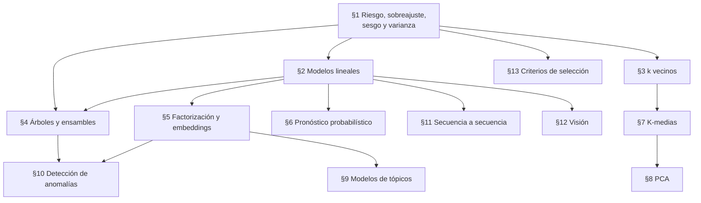

# Selección de modelos: fundamentos matemáticos de los algoritmos

## 0. Alcance de estas notas

Estas notas extraen del capítulo 4 de la guía original únicamente el material matemático, estadístico y algorítmico, y lo desarrollan con rigor. El texto de partida está organizado alrededor de productos; aquí se reorganiza alrededor de los modelos: primero el marco común (riesgo, sobreajuste, sesgo y varianza), después los modelos supervisados (lineales, de vecindad, de árboles, de factorización, de *embeddings*, de pronóstico), luego los no supervisados (agrupamiento, reducción de dimensión, modelos de tópicos, detección de anomalías), los modelos neuronales para secuencias e imágenes, y por último los criterios de selección que admiten formulación matemática.

Convenciones. Los vectores son columnas; $x^\top$ es la traspuesta; $\lVert\cdot\rVert$ es la norma euclídea salvo aviso; $\mathbf 1[A]$ es el indicador del suceso $A$; $\sigma$ denota la función logística, y la desviación estándar del ruido se escribe siempre $\sigma_\varepsilon$ para evitar la colisión. La matriz de diseño es $X\in\mathbb R^{n\times p}$ con filas $x_i^\top$. Cuando un modelo lleva intercepto, se añade a $X$ una primera columna de unos y la matriz resultante se escribe $\tilde X\in\mathbb R^{n\times(p+1)}$.

Cuando el original contiene afirmaciones imprecisas o incorrectas, se indica en una **nota de corrección** y se da la formulación correcta con su justificación.

### 0.1 Secciones descartadas

Las siguientes partes del original no contienen material matemático independiente y no se desarrollan:

- **Servicios preentrenados de visión, voz, lenguaje, chatbots y recomendación.** **Sección descartada:** el contenido es exclusivamente de AWS o infraestructura y no contiene material matemático independiente relevante. (La única excepción, las nociones de filtrado colaborativo, basado en contenido e híbrido, se conserva en la §5.1.)
- **IA generativa, modelos fundacionales y el ejemplo de generación de imágenes.** **Sección descartada:** el contenido es exclusivamente de AWS o infraestructura y no contiene material matemático independiente relevante.
- **Descripción de la plataforma de entrenamiento, formatos de entrada, contenedores, estimadores y despliegue de cada algoritmo.** **Sección descartada:** el contenido es exclusivamente de AWS o infraestructura y no contiene material matemático independiente relevante.
- **Criterios de costo, regulatorios y de recursos de infraestructura.** **Sección descartada:** el contenido es exclusivamente de AWS o infraestructura y no contiene material matemático independiente relevante. Los criterios que sí admiten formulación (complejidad computacional, compromiso entre flexibilidad e interpretabilidad) se tratan en la §13.
- **Resumen, puntos clave del examen y preguntas de repaso.** **Sección descartada:** el contenido es exclusivamente de AWS o infraestructura y no contiene material matemático independiente relevante.

### 0.2 Dependencias entre secciones

## 1. Marco común: riesgo, sobreajuste y el compromiso sesgo–varianza

### 1.1 Aprendizaje supervisado como minimización del riesgo

El original distingue la regresión (predecir un valor continuo) de la clasificación (asignar una clase). La diferencia matemática no está solo en el conjunto de valores de la respuesta, sino en la función de pérdida con que se mide el error y, por tanto, en el objeto que el modelo intenta estimar. Para verlo conviene fijar el marco.

**Definición 1.1** (Pérdida y riesgo). Sea $(X,Y)$ un vector aleatorio con valores en $\mathcal X\times\mathcal Y$ y distribución conjunta $P$, desconocida. Una *función de pérdida* es una función $L:\mathcal Y\times\mathcal Y\to[0,\infty)$ tal que $L(y,\hat y)$ mide el costo de predecir $\hat y$ cuando el valor real es $y$. El *riesgo* de un predictor medible $f:\mathcal X\to\mathcal Y$ es
$$
R(f)=\mathbb E\big[L(Y,f(X))\big],
$$
y su *riesgo empírico* sobre una muestra $\mathcal D=\{(x_i,y_i)\}_{i=1}^n$ es $\hat R_n(f)=\frac1n\sum_{i=1}^n L(y_i,f(x_i))$.

El riesgo es lo que interesa (el error esperado sobre un par nuevo), pero depende de $P$; el riesgo empírico es lo único calculable. La *minimización del riesgo empírico* sustituye uno por otro y restringe $f$ a una familia $\mathcal F$ (lineal, árboles, redes): $\hat f=\operatorname{arg\,min}_{f\in\mathcal F}\hat R_n(f)$. Todos los algoritmos supervisados de estas notas son casos de este esquema, con $\mathcal F$ y $L$ distintos.

La pérdida determina qué función es el predictor ideal. Los dos casos del original son los siguientes.

**Proposición 1.2** (Predictor óptimo con pérdida cuadrática). Sea $\mathcal Y=\mathbb R$, $L(y,\hat y)=(y-\hat y)^2$ y $\mathbb E[Y^2]<\infty$. Sea $m(x)=\mathbb E[Y\mid X=x]$. Entonces, para todo $f$ con $\mathbb E[f(X)^2]<\infty$,
$$
R(f)=\mathbb E\big[(Y-m(X))^2\big]+\mathbb E\big[(m(X)-f(X))^2\big],
$$
de modo que $m$ minimiza el riesgo, y cualquier otro minimizador coincide con $m$ casi seguramente.

*Demostración.* Se escribe $Y-f(X)=(Y-m(X))+(m(X)-f(X))$ y se desarrolla el cuadrado:
$$
R(f)=\mathbb E[(Y-m(X))^2]+2\,\mathbb E[(Y-m(X))(m(X)-f(X))]+\mathbb E[(m(X)-f(X))^2].
$$
El término cruzado se anula: condicionando en $X$, el factor $m(X)-f(X)$ es función de $X$ y sale de la esperanza condicional, luego $\mathbb E[(Y-m(X))(m(X)-f(X))\mid X]=(m(X)-f(X))\,\big(\mathbb E[Y\mid X]-m(X)\big)=0$; tomando esperanza total, el término cruzado vale $0$. Como el tercer sumando es no negativo y el primero no depende de $f$, el mínimo se alcanza exactamente cuando $\mathbb E[(m(X)-f(X))^2]=0$, es decir, $f(X)=m(X)$ casi seguramente. $\square$

**Proposición 1.3** (Clasificador de Bayes). Sea $\mathcal Y=\{1,\dots,K\}$ y $L(y,\hat y)=\mathbf 1[y\neq\hat y]$ (pérdida 0-1). Sea $\pi_k(x)=P(Y=k\mid X=x)$. El clasificador $f^*(x)\in\operatorname{arg\,max}_k\pi_k(x)$ minimiza el riesgo, que para un clasificador $f$ es la probabilidad de error $P(Y\neq f(X))$.

*Demostración.* Condicionando en $X=x$, $\mathbb E[\mathbf 1[Y\neq f(x)]\mid X=x]=1-\pi_{f(x)}(x)$. Para cada $x$, esta cantidad es mínima cuando $f(x)$ es una clase con $\pi_{f(x)}(x)$ máxima, y ese mínimo puntual es $1-\max_k\pi_k(x)$. Como $R(f)=\mathbb E\big[1-\pi_{f(X)}(X)\big]$ y el integrando de $f^*$ es menor o igual que el de cualquier $f$ en cada punto, $R(f^*)\le R(f)$. $\square$

Por tanto, en regresión con pérdida cuadrática se estima una media condicional, y en clasificación se estiman (explícita o implícitamente) probabilidades condicionales de clase para luego tomar la mayor. Esta distinción explica por qué la regresión logística (§2.2) produce probabilidades y un umbral, y por qué los árboles de clasificación y regresión usan criterios de partición distintos (§4.1).

### 1.2 Sobreajuste

El original define el sobreajuste como el fenómeno de aprender «demasiado bien» los datos de entrenamiento, incluidos el ruido y los atípicos, con mal desempeño en datos nuevos. Formalmente:

**Definición 1.4** (Error de entrenamiento, error de generalización, sobreajuste). Para $\hat f$ ajustado sobre $\mathcal D$, el *error de entrenamiento* es $\hat R_n(\hat f)$ y el *error de generalización* es $R(\hat f)=\mathbb E[L(Y,\hat f(X))\mid\mathcal D]$, con $(X,Y)$ independiente de $\mathcal D$. Se dice que un procedimiento *sobreajusta* cuando existe otro procedimiento, en general de menor complejidad, con mayor error de entrenamiento y menor error de generalización.

La definición es comparativa a propósito: un error de entrenamiento bajo no es por sí mismo un defecto; lo es cuando se paga con error de generalización. El riesgo empírico sobre los mismos datos con que se eligió $\hat f$ subestima sistemáticamente el riesgo, porque $\hat f$ se eligió precisamente para que $\hat R_n$ fuera pequeño. Por eso el error de generalización se estima sobre una muestra de prueba independiente, que es lo que hacen los ejemplos del original al separar un 20 % de los datos.

**Ejemplo 1.5** (1-vecino más cercano). Con el clasificador de un vecino (§3), cada punto de entrenamiento es su propio vecino más cercano a distancia $0$, así que, si no hay dos puntos con las mismas coordenadas y distinta etiqueta, el error de entrenamiento es $0$. Sobre las dos primeras variables de Iris (longitud y ancho del sépalo), con la partición 80/20 del original, se obtiene exactitud $0.94$ en entrenamiento y $0.67$ en prueba; con $k=3$, $0.88$ y $0.83$. El entrenamiento no llega a $1$ con $k=1$ porque en esas dos variables hay flores con coordenadas idénticas y especies distintas, redondeadas a $0.1$ cm. El procedimiento $k=1$ sobreajusta en el sentido de la Definición 1.4 respecto de $k=3$.

### 1.3 Descomposición sesgo–varianza

La descomposición siguiente es la herramienta que explica, en las secciones posteriores, el papel de $k$ en $k$ vecinos, la inestabilidad de los árboles, el efecto de promediar árboles en los bosques aleatorios y el de construirlos secuencialmente en el *boosting*.

**Teorema 1.6** (Descomposición sesgo–varianza). Sea $Y=f(x_0)+\varepsilon$ en un punto fijo $x_0$, con $\mathbb E[\varepsilon]=0$ y $\operatorname{Var}(\varepsilon)=\sigma_\varepsilon^2$. Sea $\hat f(x_0)$ un estimador construido a partir de una muestra de entrenamiento independiente de $\varepsilon$, con varianza finita. Entonces
$$
\mathbb E\big[(Y-\hat f(x_0))^2\big]=\sigma_\varepsilon^2+\big(\mathbb E\hat f(x_0)-f(x_0)\big)^2+\operatorname{Var}\big(\hat f(x_0)\big).
$$

*Demostración.* Sea $\bar f=\mathbb E\hat f(x_0)$. Se escribe
$$
Y-\hat f(x_0)=\varepsilon+\big(f(x_0)-\bar f\big)+\big(\bar f-\hat f(x_0)\big).
$$
Al elevar al cuadrado y tomar esperanza aparecen tres cuadrados y tres productos cruzados. Los cuadrados dan $\sigma_\varepsilon^2$, $(f(x_0)-\bar f)^2$ (constante) y $\operatorname{Var}(\hat f(x_0))$. Los productos cruzados se anulan: $\mathbb E[\varepsilon(f(x_0)-\bar f)]=(f(x_0)-\bar f)\mathbb E\varepsilon=0$; $\mathbb E[\varepsilon(\bar f-\hat f(x_0))]=\mathbb E\varepsilon\cdot\mathbb E[\bar f-\hat f(x_0)]=0$ por independencia; y $\mathbb E[(f(x_0)-\bar f)(\bar f-\hat f(x_0))]=(f(x_0)-\bar f)(\bar f-\bar f)=0$. $\square$

El primer término es irreducible: ningún predictor lo elimina. Los otros dos dependen del procedimiento. Los modelos flexibles (un árbol profundo, $k$ vecinos con $k=1$) tienen sesgo pequeño y varianza grande; los rígidos (una recta, $k$ grande) al revés. Casi todas las recomendaciones de uso del original («sensible al ruido», «suaviza las predicciones», «reduce el sobreajuste») son afirmaciones sobre uno de estos dos términos y se precisan en las secciones siguientes.

## 2. Modelos lineales

Los tres modelos de esta sección comparten la misma función de puntuación afín, $\eta(x)=\beta_0+\beta^\top x$, y difieren en la pérdida que se minimiza: cuadrática (regresión lineal), logarítmica (regresión logística) y bisagra o $\varepsilon$-insensible (máquinas de vectores de soporte).

### 2.1 Regresión lineal

#### Motivación

El problema que originó el método es el de ajustar una relación lineal a observaciones inconsistentes entre sí: hay más ecuaciones que incógnitas y ninguna solución exacta. A principios del siglo XIX, en la determinación de órbitas y en geodesia, se contaba con $n$ mediciones $y_i\approx\beta_0+\beta_1x_i$ con $n>2$. Exigir que la recta pase por dos puntos elegidos descarta información; promediar soluciones de subsistemas depende de qué subsistemas se escojan. Legendre (1805) propuso elegir los coeficientes que minimizan la suma de los cuadrados de las discrepancias, y Gauss (1809) lo justificó como estimador de máxima verosimilitud bajo errores normales. El criterio tiene dos propiedades que las alternativas de la época no tenían a la vez: produce una solución única (bajo una condición de rango) y esa solución se obtiene resolviendo un sistema lineal.

#### Modelo, error y residuo

**Definición 2.1** (Modelo de regresión lineal). Se observan pares $(x_i,y_i)$, $x_i\in\mathbb R^p$, $y_i\in\mathbb R$, $i=1,\dots,n$, y se supone
$$
y_i=\beta_0+\beta_1x_{i1}+\dots+\beta_px_{ip}+\varepsilon_i ,
$$
donde los $\varepsilon_i$ son variables aleatorias no observables con $\mathbb E[\varepsilon_i]=0$. En forma matricial, $y=\tilde X\beta+\varepsilon$ con $\beta=(\beta_0,\dots,\beta_p)^\top$.

> **Nota de corrección.** El original llama a $\varepsilon_i$ «el error, también llamado residuo (la diferencia entre valores reales y predichos)». Son objetos distintos. El *error* $\varepsilon_i=y_i-\tilde x_i^\top\beta$ usa el parámetro verdadero, desconocido, y no es observable. El *residuo* $e_i=y_i-\hat y_i=y_i-\tilde x_i^\top\hat\beta$ usa el parámetro estimado y sí es observable. Los residuos no heredan las propiedades de los errores: la Proposición 2.3 muestra que están ligados por $p+1$ restricciones lineales aunque los errores sean independientes.

La hipótesis $\mathbb E[\varepsilon_i]=0$ hace que $\tilde x_i^\top\beta=\mathbb E[y_i]$, es decir, que el modelo sea un modelo para la media condicional, que por la Proposición 1.2 es el objetivo natural con pérdida cuadrática.

La linealidad es en los parámetros, no en las variables. El modelo $y=\beta_0+\beta_1x+\beta_2x^2+\varepsilon$ es lineal (con la matriz de diseño de columnas $1,x,x^2$), y también lo es uno con interacciones $x_jx_k$. Esto matiza la recomendación del original de evitar la regresión lineal ante relaciones no lineales o interacciones: el modelo lineal con las columnas adecuadas las representa; lo que no hace es descubrirlas por sí mismo.

#### Mínimos cuadrados

El original indica que el modelo busca la función lineal que minimiza el error cuadrático medio,
$$
\mathrm{MSE}(\beta)=\frac1n\sum_{i=1}^n\big(y_i-\tilde x_i^\top\beta\big)^2=\frac1n\lVert y-\tilde X\beta\rVert^2 .
$$
Minimizar el MSE equivale a minimizar la suma de cuadrados residual $\mathrm{RSS}(\beta)=\lVert y-\tilde X\beta\rVert^2$, pues difieren en el factor positivo $1/n$.

**Teorema 2.2** (Ecuaciones normales). (a) $\hat\beta$ minimiza $\mathrm{RSS}$ si y solo si satisface $\tilde X^\top\tilde X\hat\beta=\tilde X^\top y$. (b) Este sistema siempre tiene solución. (c) La solución es única si y solo si $\operatorname{rango}\tilde X=p+1$, y entonces $\hat\beta=(\tilde X^\top\tilde X)^{-1}\tilde X^\top y$.

*Demostración.* (a) Supóngase $\tilde X^\top(y-\tilde X\hat\beta)=0$. Para cualquier $\beta$,
$$
y-\tilde X\beta=(y-\tilde X\hat\beta)+\tilde X(\hat\beta-\beta).
$$
El producto interno de los dos sumandos es $(\hat\beta-\beta)^\top\tilde X^\top(y-\tilde X\hat\beta)=0$, así que por el teorema de Pitágoras
$$
\mathrm{RSS}(\beta)=\mathrm{RSS}(\hat\beta)+\lVert\tilde X(\hat\beta-\beta)\rVert^2\ \ge\ \mathrm{RSS}(\hat\beta).
$$
Luego $\hat\beta$ es minimizador. Recíprocamente, $\mathrm{RSS}$ es diferenciable con gradiente $-2\tilde X^\top(y-\tilde X\beta)$, que debe anularse en cualquier minimizador.

(b) Se probará que el espacio columna de $\tilde X^\top\tilde X$ coincide con el de $\tilde X^\top$; como $\tilde X^\top y$ pertenece al segundo, el sistema tiene solución. Si $\tilde X^\top\tilde Xv=0$, entonces $0=v^\top\tilde X^\top\tilde Xv=\lVert\tilde Xv\rVert^2$, luego $\tilde Xv=0$; recíprocamente, si $\tilde Xv=0$, entonces $\tilde X^\top\tilde Xv=\tilde X^\top0=0$. Así $\ker(\tilde X^\top\tilde X)=\ker\tilde X$, y por el teorema del rango ambos operadores tienen el mismo rango. Como el espacio columna de $\tilde X^\top\tilde X$ está contenido en el de $\tilde X^\top$ (toda columna de $\tilde X^\top\tilde X$ es $\tilde X^\top$ aplicado a un vector) y ambos tienen la misma dimensión, coinciden.

(c) Por (b), $\ker(\tilde X^\top\tilde X)=\ker\tilde X$. La matriz cuadrada $\tilde X^\top\tilde X$ es invertible si y solo si su núcleo es $\{0\}$, es decir, si y solo si $\ker\tilde X=\{0\}$, lo que equivale a $\operatorname{rango}\tilde X=p+1$. Si el núcleo no es $\{0\}$ y $\hat\beta$ es solución, también lo es $\hat\beta+v$ para todo $v\in\ker\tilde X$. $\square$

El inciso (a) tiene una lectura geométrica: $\hat y=\tilde X\hat\beta$ es la proyección ortogonal de $y$ sobre el espacio columna de $\tilde X$, y el residuo $e=y-\hat y$ es ortogonal a ese espacio. En regresión simple ($p=1$), resolver el sistema $2\times2$ da las fórmulas conocidas $\hat\beta_1=S_{xy}/S_{xx}$ y $\hat\beta_0=\bar y-\hat\beta_1\bar x$, con $S_{xy}=\sum(x_i-\bar x)(y_i-\bar y)$ y $S_{xx}=\sum(x_i-\bar x)^2$.

**Proposición 2.3** (Restricciones sobre los residuos). $\tilde X^\top e=0$. En particular, si el modelo tiene intercepto, $\sum_ie_i=0$.

*Demostración.* $\tilde X^\top e=\tilde X^\top(y-\tilde X\hat\beta)=0$ es la ecuación normal. La primera coordenada de $\tilde X^\top e$ es el producto de la columna de unos con $e$, es decir, $\sum_ie_i$. $\square$

#### El MSE de entrenamiento como estimador de la varianza del error

El ejemplo del original simula $x_i\sim\mathrm U(0,2)$, $y_i=4+3x_i+\varepsilon_i$ con $\varepsilon_i\sim N(0,1)$ y $n=100$, ajusta la recta y reporta el MSE. Con la semilla del original se obtiene $\hat\beta_0=4.222$, $\hat\beta_1=2.968$ y $\mathrm{MSE}=0.992$. El valor cercano a $1$ no es casual: el MSE de entrenamiento estima $\sigma_\varepsilon^2=1$, aunque con un sesgo hacia abajo que la proposición siguiente cuantifica.

**Proposición 2.4.** Supóngase $\operatorname{rango}\tilde X=p+1$, $\tilde X$ fija, $\mathbb E\varepsilon=0$ y $\operatorname{Cov}(\varepsilon)=\sigma_\varepsilon^2I_n$. Entonces $\mathbb E[\mathrm{RSS}(\hat\beta)]=(n-p-1)\sigma_\varepsilon^2$. En consecuencia $\mathbb E[\mathrm{MSE}(\hat\beta)]=\frac{n-p-1}{n}\sigma_\varepsilon^2$ y $s^2=\mathrm{RSS}/(n-p-1)$ es insesgado.

*Demostración.* Sea $H=\tilde X(\tilde X^\top\tilde X)^{-1}\tilde X^\top$, de modo que $\hat y=Hy$ y $e=(I-H)y$. Se verifica que $H$ es simétrica y que $H^2=H$; lo mismo vale para $I-H$. Además $(I-H)\tilde X=\tilde X-\tilde X=0$, luego $e=(I-H)(\tilde X\beta+\varepsilon)=(I-H)\varepsilon$ y $\mathrm{RSS}=\varepsilon^\top(I-H)^\top(I-H)\varepsilon=\varepsilon^\top(I-H)\varepsilon$. Para una matriz fija $A$, $\mathbb E[\varepsilon^\top A\varepsilon]=\sum_{i,j}A_{ij}\mathbb E[\varepsilon_i\varepsilon_j]=\sigma_\varepsilon^2\operatorname{tr}A$. Por la propiedad cíclica de la traza, $\operatorname{tr}H=\operatorname{tr}\big((\tilde X^\top\tilde X)^{-1}\tilde X^\top\tilde X\big)=\operatorname{tr}I_{p+1}=p+1$, así que $\mathbb E[\mathrm{RSS}]=\sigma_\varepsilon^2(n-p-1)$. $\square$

En el ejemplo, $n=100$ y $p=1$, así que $\mathbb E[\mathrm{MSE}]=0.98$; el valor observado $0.992$ es compatible con esa esperanza.

#### Sensibilidad a valores atípicos

El original afirma que la regresión lineal es sensible a los atípicos. El motivo es que $\hat\beta$ es una función lineal de $y$ sin cota.

**Proposición 2.5.** Si $y_i$ se reemplaza por $y_i+\delta$, el estimador cambia en $\delta(\tilde X^\top\tilde X)^{-1}\tilde x_i$ y el valor ajustado $\hat y_i$ cambia en $\delta h_{ii}$, donde $h_{ii}=\tilde x_i^\top(\tilde X^\top\tilde X)^{-1}\tilde x_i$ es la *palanca* de la observación $i$.

*Demostración.* $\hat\beta=(\tilde X^\top\tilde X)^{-1}\tilde X^\top y$ es lineal en $y$, y $\tilde X^\top(y+\delta u_i)=\tilde X^\top y+\delta\tilde x_i$, donde $u_i$ es el $i$-ésimo vector canónico. Multiplicando por $\tilde x_i^\top$ se obtiene el cambio en $\hat y_i$. $\square$

Cuando $\tilde x_i\neq0$, el cambio en $\hat\beta$ tiende a infinito con $|\delta|$: basta una sola observación contaminada para llevar la estimación a cualquier valor. En el lenguaje de la estadística robusta, el punto de ruptura del estimador es $1/n$. Las pérdidas que crecen linealmente (valor absoluto, Huber, la pérdida $\varepsilon$-insensible de la §2.3) acotan la derivada de la pérdida y con ella la influencia de una observación aislada en la ecuación de estimación.

#### Multicolinealidad

El original define la multicolinealidad como la situación en que un predictor puede predecirse casi linealmente a partir de los demás, y dice que impide estimar los coeficientes «de forma fiable». La afirmación precisa es sobre la varianza del estimador.

**Teorema 2.6** (Factor de inflación de la varianza). Bajo las hipótesis de la Proposición 2.4, $\operatorname{Cov}(\hat\beta)=\sigma_\varepsilon^2(\tilde X^\top\tilde X)^{-1}$. Además, para $j\ge1$,
$$
\operatorname{Var}(\hat\beta_j)=\frac{\sigma_\varepsilon^2}{S_{jj}\,(1-R_j^2)},\qquad S_{jj}=\sum_{i=1}^n(x_{ij}-\bar x_j)^2,
$$
donde $R_j^2$ es el coeficiente de determinación de la regresión de la columna $x_{\cdot j}$ sobre las demás columnas de $\tilde X$ (incluido el intercepto). El factor $\mathrm{VIF}_j=1/(1-R_j^2)$ es el *factor de inflación de la varianza*.

*Demostración.* La primera fórmula: $\hat\beta=A y$ con $A=(\tilde X^\top\tilde X)^{-1}\tilde X^\top$, luego $\operatorname{Cov}(\hat\beta)=A\operatorname{Cov}(y)A^\top=\sigma_\varepsilon^2AA^\top=\sigma_\varepsilon^2(\tilde X^\top\tilde X)^{-1}$.

Para la segunda se usa el teorema de Frisch–Waugh–Lovell. Se escribe $\tilde X=[x_{\cdot j}\ Z]$, con $Z$ las demás columnas (de rango completo, pues $\tilde X$ lo es), y $M=I-Z(Z^\top Z)^{-1}Z^\top$, que es simétrica, idempotente y anula a las columnas de $Z$. Sea $r_j=Mx_{\cdot j}$ el residuo de regresar $x_{\cdot j}$ sobre $Z$. La descomposición ajustada es $y=x_{\cdot j}\hat\beta_j+Z\hat\gamma+e$ con $e$ ortogonal a $x_{\cdot j}$ y a las columnas de $Z$ (Proposición 2.3). Aplicando $M$: $My=r_j\hat\beta_j+Me$, y $Me=e$ porque $e$ es ortogonal a las columnas de $Z$. Multiplicando por $r_j^\top$:
$$
r_j^\top My=\lVert r_j\rVert^2\hat\beta_j+r_j^\top e .
$$
Por un lado, $r_j^\top e=x_{\cdot j}^\top Me=x_{\cdot j}^\top e=0$. Por otro, $r_j^\top My=x_{\cdot j}^\top M^2y=x_{\cdot j}^\top My=r_j^\top y$. Luego $\hat\beta_j=r_j^\top y/\lVert r_j\rVert^2$. Por ser $\lVert r_j\rVert>0$ (si fuera $0$, $x_{\cdot j}$ sería combinación de las columnas de $Z$ y $\tilde X$ no tendría rango completo), $\operatorname{Var}(\hat\beta_j)=\sigma_\varepsilon^2\lVert r_j\rVert^2/\lVert r_j\rVert^4=\sigma_\varepsilon^2/\lVert r_j\rVert^2$. Finalmente, como $Z$ contiene el intercepto, la suma total de cuadrados de esa regresión auxiliar es $S_{jj}$ y su suma residual es $\lVert r_j\rVert^2$, de modo que por definición $R_j^2=1-\lVert r_j\rVert^2/S_{jj}$, es decir, $\lVert r_j\rVert^2=S_{jj}(1-R_j^2)$. $\square$

Con dos predictores cuya correlación muestral es $r$, la regresión auxiliar es simple y $R_j^2=r^2$; con $r=0.99$, $\mathrm{VIF}=1/(1-0.9801)\approx50.3$, y el error estándar de cada coeficiente se multiplica por $\sqrt{50.3}\approx7.1$ respecto del caso de predictores no correlacionados. En el límite $R_j^2=1$ la columna es combinación exacta de las otras, $\tilde X$ pierde rango y, por el Teorema 2.2(c), $\beta$ deja de estar identificado. Obsérvese que la multicolinealidad no afecta a $\hat y$ ni al MSE de entrenamiento: afecta a la interpretación de coeficientes individuales.

#### Regularización

El original señala la regularización como remedio a la multicolinealidad: se añade a la pérdida una penalización por coeficientes grandes. Con penalización cuadrática ($L_2$, *ridge*) se minimiza $\lVert y-X\beta\rVert^2+\lambda\lVert\beta\rVert^2$, $\lambda>0$ (con predictores centrados y el intercepto sin penalizar). La condición de primer orden es $(X^\top X+\lambda I)\beta=X^\top y$, y la matriz es invertible sin condición de rango: para $v\neq0$, $v^\top(X^\top X+\lambda I)v=\lVert Xv\rVert^2+\lambda\lVert v\rVert^2\ge\lambda\lVert v\rVert^2>0$. La penalización restituye así la unicidad que la colinealidad exacta destruye. Con penalización $L_1$ (*lasso*), $\lambda\lVert\beta\rVert_1$, el problema sigue siendo convexo y sus soluciones tienden a tener coeficientes exactamente nulos. El análisis de ambas penalizaciones y de la elección de $\lambda$ corresponde al capítulo siguiente de la guía.

### 2.2 Regresión logística

#### Motivación: el problema de modelar una probabilidad

Sea $Y\in\{0,1\}$ y $p(x)=P(Y=1\mid X=x)$. El original presenta la respuesta binaria como «predicción correcta o incorrecta de la categoría»; lo correcto es que $Y$ indica la pertenencia a una de dos clases (en el ejemplo, ser o no *Iris virginica*), y el modelo estima la probabilidad condicional de la clase $1$.

El intento más simple, el *modelo de probabilidad lineal* $p(x)=\beta_0+\beta^\top x$, falla porque una función afín no constante en $\mathbb R^p$ no está acotada: si $\beta\neq0$, a lo largo de la recta $x=t\beta$ se tiene $\beta_0+t\lVert\beta\rVert^2\to\pm\infty$, y el modelo asigna «probabilidades» negativas o mayores que $1$. Se busca preservar dos cosas: una estructura lineal en $x$ (interpretable y estimable con las técnicas de la §2.1) y valores en $(0,1)$. La solución es modelar linealmente una transformación biyectiva $g:(0,1)\to\mathbb R$ de la probabilidad. El *logit*, $g(p)=\log\frac{p}{1-p}$, logaritmo de las *odds* (razón de probabilidades), tiene dominio $(0,1)$ e imagen $\mathbb R$; fue popularizado por Berkson en los años cuarenta como alternativa al probit en bioensayos, y es además el enlace canónico de la distribución de Bernoulli escrita como familia exponencial, $P(Y=y)=\exp\{y\log\frac p{1-p}+\log(1-p)\}$.

**Definición 2.7** (Función logística). $\sigma:\mathbb R\to\mathbb R$, $\sigma(z)=\dfrac1{1+e^{-z}}$.

**Proposición 2.8.** (i) $0<\sigma(z)<1$ para todo $z$. (ii) $\sigma'(z)=\sigma(z)(1-\sigma(z))>0$, así que $\sigma$ es estrictamente creciente. (iii) $\lim_{z\to\infty}\sigma(z)=1$ y $\lim_{z\to-\infty}\sigma(z)=0$, sin alcanzarse. (iv) $\sigma(-z)=1-\sigma(z)$. (v) $\sigma$ es una biyección de $\mathbb R$ en $(0,1)$ cuya inversa es el logit.

*Demostración.* (i) $1+e^{-z}>1$, luego su recíproco está en $(0,1)$. (ii) $\sigma'(z)=e^{-z}/(1+e^{-z})^2=\sigma(z)\cdot\frac{e^{-z}}{1+e^{-z}}$, y $\frac{e^{-z}}{1+e^{-z}}=1-\sigma(z)$. Ambos factores son positivos por (i). (iii) $e^{-z}\to0$ cuando $z\to\infty$ y $e^{-z}\to\infty$ cuando $z\to-\infty$; por (i) los límites no se alcanzan. (iv) $1-\sigma(z)=\frac{e^{-z}}{1+e^{-z}}=\frac1{e^{z}+1}=\sigma(-z)$. (v) Despejando $p=\sigma(z)$: $1/p=1+e^{-z}$, $e^{-z}=(1-p)/p$, $z=\log\frac p{1-p}$; por (ii) y (iii) y la continuidad, $\sigma$ es biyectiva sobre $(0,1)$. $\square$

La propiedad (iii) es la que el original describe como «nunca alcanza los valores extremos»; (iv) dice que la curva es simétrica respecto del punto $(0,1/2)$.

**Definición 2.9** (Modelo de regresión logística). $P(Y=1\mid X=x)=\sigma(\eta(x))$ con $\eta(x)=\beta_0+\beta^\top x$. Equivalentemente, por la Proposición 2.8(v), $\log\dfrac{p(x)}{1-p(x)}=\beta_0+\beta^\top x$.

La segunda forma da la interpretación de los coeficientes: aumentar $x_j$ en una unidad, con las demás variables fijas, suma $\beta_j$ al logaritmo de las odds, es decir, multiplica las odds por $e^{\beta_j}$.

#### Frontera de decisión y curvas de nivel

**Proposición 2.10.** (a) Con umbral $1/2$, la regla «clase $1$ si $p(x)\ge1/2$» equivale a $\beta_0+\beta^\top x\ge0$: la frontera de decisión es el hiperplano $\{x:\beta_0+\beta^\top x=0\}$. (b) Para $c\in(0,1)$, el conjunto de nivel $\{x:p(x)=c\}$ es el hiperplano $\{x:\beta_0+\beta^\top x=\operatorname{logit}(c)\}$. Todos son paralelos (tienen el mismo vector normal $\beta$), y la distancia entre los niveles $c_1$ y $c_2$ es $|\operatorname{logit}(c_2)-\operatorname{logit}(c_1)|/\lVert\beta\rVert$.

*Demostración.* (a) y (b): como $\sigma$ es estrictamente creciente y $\sigma(0)=1/2$, $\sigma(\eta)\ge1/2\iff\eta\ge0$, y $\sigma(\eta)=c\iff\eta=\operatorname{logit}(c)$. Para la distancia, dos hiperplanos $\{\beta^\top x=a_1\}$ y $\{\beta^\top x=a_2\}$ distan $|a_2-a_1|/\lVert\beta\rVert$: si $x_1$ está en el primero, el punto $x_1+t\beta/\lVert\beta\rVert$ está en el segundo cuando $\beta^\top x_1+t\lVert\beta\rVert=a_2$, es decir, $t=(a_2-a_1)/\lVert\beta\rVert$, y el segmento en la dirección normal realiza la distancia mínima. $\square$

> **Nota de corrección.** El original afirma que, por ser lineal la ecuación subyacente, las curvas de nivel de probabilidad son «paralelas y equiespaciadas». Son paralelas, pero no equiespaciadas en probabilidad. Los logits de $0.1,0.2,\dots,0.9$ son $-2.197,-1.386,-0.847,-0.405,0,0.405,0.847,1.386,2.197$, cuyas diferencias consecutivas son $0.811,\,0.539,\,0.442,\,0.405,\,0.405,\,0.442,\,0.539,\,0.811$. Las curvas están equiespaciadas en la escala del logit, no en la de la probabilidad: se juntan cerca de $p=1/2$ y se separan en las colas. En el ejemplo de Iris del original (longitud y ancho del sépalo, clase *virginica*), el ajuste da $\hat\beta\approx(1.995,-0.605)$ y $\lVert\hat\beta\rVert\approx2.085$; la franja entre $p=0.5$ y $p=0.6$ mide $0.405/2.085\approx0.19$ cm, y la franja entre $p=0.8$ y $p=0.9$ mide $0.811/2.085\approx0.39$ cm. (El ajuste de ese ejemplo usa por omisión una penalización $L_2$ con peso unitario, así que $\hat\beta$ es un estimador de máxima verosimilitud penalizada.)

#### Estimación por máxima verosimilitud

Con observaciones independientes, la log-verosimilitud es
$$
\ell(\beta)=\sum_{i=1}^n\big[y_i\log p_i+(1-y_i)\log(1-p_i)\big],\qquad p_i=\sigma(\eta_i),\ \eta_i=\tilde x_i^\top\beta .
$$
Como $\log p_i=\eta_i-\log(1+e^{\eta_i})$ y $\log(1-p_i)=-\log(1+e^{\eta_i})$, se simplifica a
$$
\ell(\beta)=\sum_{i=1}^n\big[y_i\eta_i-\log(1+e^{\eta_i})\big].
$$
El valor $-\ell(\beta)/n$ es la *pérdida logarítmica* o *entropía cruzada* promedio, que es la pérdida que se minimiza.

**Proposición 2.11.** $\nabla\ell(\beta)=\tilde X^\top(y-p)$ y $\nabla^2\ell(\beta)=-\tilde X^\top W\tilde X$ con $W=\operatorname{diag}(p_i(1-p_i))$. En consecuencia $\ell$ es cóncava, y estrictamente cóncava si $\operatorname{rango}\tilde X=p+1$.

*Demostración.* $\partial\eta_i/\partial\beta=\tilde x_i$ y $\frac{d}{d\eta}\log(1+e^\eta)=\sigma(\eta)$; luego $\nabla\ell=\sum_i(y_i-p_i)\tilde x_i$. Derivando otra vez y usando la Proposición 2.8(ii), $\nabla^2\ell=-\sum_ip_i(1-p_i)\tilde x_i\tilde x_i^\top$. Para $v\neq0$, $v^\top\tilde X^\top W\tilde Xv=\sum_ip_i(1-p_i)(\tilde x_i^\top v)^2\ge0$, con igualdad solo si $\tilde Xv=0$, lo que el rango completo excluye. $\square$

No hay solución cerrada para $\nabla\ell=0$, pero la concavidad garantiza que todo punto crítico es máximo global y que el método de Newton, $\beta^{(t+1)}=\beta^{(t)}+(\tilde X^\top W\tilde X)^{-1}\tilde X^\top(y-p)$, se puede escribir como una sucesión de mínimos cuadrados ponderados (IRLS).

**Proposición 2.12** (Separación completa). Si existe $b\in\mathbb R^{p+1}$ con $\tilde x_i^\top b>0$ para todo $i$ con $y_i=1$ y $\tilde x_i^\top b<0$ para todo $i$ con $y_i=0$, el estimador de máxima verosimilitud no existe.

*Demostración.* Cada término de $\ell$ es $\log p_i$ o $\log(1-p_i)$, negativo; luego $\ell<0$ en todo $\mathbb R^{p+1}$. Sea $s_i=2y_i-1\in\{-1,1\}$. Por la Proposición 2.8(iv), cada término es $\log\sigma(s_i\eta_i)$. A lo largo de $\beta=tb$, $s_i\eta_i=t\,s_i\tilde x_i^\top b$ con $s_i\tilde x_i^\top b>0$, así que $\log\sigma(s_i\eta_i)\to0$ cuando $t\to\infty$. Luego $\sup\ell=0$ y no se alcanza. $\square$

Esto da contenido a la afirmación del original de que la regresión logística «requiere un conjunto de datos suficientemente grande»: si $n\le p+1$ y los puntos están en posición general, cualquier etiquetado es separable (se demuestra en la Proposición 2.21), y la máxima verosimilitud sin penalizar diverge. La otra advertencia del original, la ausencia de multicolinealidad, tiene la misma forma que en la §2.1: la matriz de covarianza asintótica del estimador es $(\tilde X^\top W\tilde X)^{-1}$, que se hace grande cuando las columnas de $\tilde X$ son casi dependientes.

#### Extensión multiclase: la función softmax

Varios algoritmos posteriores (la clasificación multiclase con *boosting* en la §4.3, la clasificación de imágenes en la §12) usan la generalización a $K$ clases.

**Definición 2.13** (Softmax). Para $\eta=(\eta_1,\dots,\eta_K)\in\mathbb R^K$, $\operatorname{softmax}(\eta)_k=e^{\eta_k}\big/\sum_{l=1}^Ke^{\eta_l}$. El modelo logístico multinomial es $P(Y=k\mid x)=\operatorname{softmax}(\eta(x))_k$ con $\eta_k(x)=\beta_{0k}+\beta_k^\top x$.

**Proposición 2.14.** (i) Las salidas son positivas y suman $1$. (ii) $\operatorname{softmax}(\eta+c\mathbf 1)=\operatorname{softmax}(\eta)$ para todo $c\in\mathbb R$; por eso los parámetros solo están identificados salvo un desplazamiento común y se fija, por ejemplo, $\eta_K\equiv0$. (iii) Con $K=2$ y $\eta_2\equiv0$, $\operatorname{softmax}(\eta)_1=\sigma(\eta_1)$.

*Demostración.* (i) Cada numerador es positivo y el denominador es su suma. (ii) Numerador y denominador se multiplican por $e^c$. (iii) $e^{\eta_1}/(e^{\eta_1}+1)=1/(1+e^{-\eta_1})$. $\square$

### 2.3 Máquinas de vectores de soporte

#### Motivación: un problema con infinitas soluciones

Si dos clases, $y_i\in\{-1,+1\}$, son separables por un hiperplano, en general lo son por infinitos. El perceptrón de Rosenblatt (1958) encuentra uno en un número finito de pasos, pero cuál encuentra depende del orden en que recorre los datos y del punto inicial; un hiperplano que pasa rozando a un punto de entrenamiento clasifica mal perturbaciones pequeñas de ese punto. Vapnik y colaboradores propusieron elegir, entre todos los separadores, el que maximiza la distancia al punto más cercano. Ese criterio define una solución única y, como se verá, depende solo de unos pocos puntos.

**Lema 2.15** (Distancia a un hiperplano). Sea $H=\{x:w^\top x+b=0\}$ con $w\neq0$. Para todo $x_0$, $\operatorname{dist}(x_0,H)=|w^\top x_0+b|/\lVert w\rVert$.

*Demostración.* Todo $x\in\mathbb R^p$ se escribe $x=x_H+t\,w/\lVert w\rVert$ con $x_H\in H$: basta tomar $t=(w^\top x+b)/\lVert w\rVert$ y comprobar que $w^\top x_H+b=w^\top x+b-t\lVert w\rVert=0$. Para $z\in H$, $x_0-z=(x_{0,H}-z)+t\,w/\lVert w\rVert$ con el primer sumando ortogonal a $w$ (ambos puntos están en $H$), luego $\lVert x_0-z\rVert^2=\lVert x_{0,H}-z\rVert^2+t^2\ge t^2$, con igualdad en $z=x_{0,H}$. $\square$

**Definición 2.16** (Margen). Para un hiperplano $(w,b)$ que separa los datos, es decir, con $y_i(w^\top x_i+b)>0$ para todo $i$, su *margen* es $\gamma(w,b)=\min_i y_i(w^\top x_i+b)/\lVert w\rVert$, la distancia del hiperplano al punto más cercano. Los puntos donde se alcanza el mínimo son los *vectores de soporte*.

El par $(w,b)$ y $(cw,cb)$, $c>0$, describen el mismo hiperplano; se fija la escala exigiendo $\min_iy_i(w^\top x_i+b)=1$, y entonces $\gamma=1/\lVert w\rVert$. Maximizar el margen es minimizar $\lVert w\rVert$:
$$
\min_{w,b}\ \tfrac12\lVert w\rVert^2\quad\text{sujeto a}\quad y_i(w^\top x_i+b)\ge1,\ i=1,\dots,n. \tag{2.1}
$$

**Unicidad de $w$.** Si $w_1\neq w_2$ fueran óptimos (con interceptos $b_1,b_2$) y valor común $v=\frac12\lVert w_1\rVert^2=\frac12\lVert w_2\rVert^2$, el punto medio $\big(\frac{w_1+w_2}2,\frac{b_1+b_2}2\big)$ sería factible, porque las restricciones son lineales y el conjunto factible es convexo. Por la identidad del paralelogramo,
$$
\tfrac12\Big\lVert\tfrac{w_1+w_2}2\Big\rVert^2=\tfrac14\lVert w_1\rVert^2+\tfrac14\lVert w_2\rVert^2-\tfrac18\lVert w_1-w_2\rVert^2=v-\tfrac18\lVert w_1-w_2\rVert^2<v,
$$
lo que contradice la optimalidad. El margen máximo, por tanto, está bien definido.

#### Dualidad y vectores de soporte

El problema (2.1) es cuadrático convexo con restricciones lineales; si es factible, las condiciones de Karush–Kuhn–Tucker son necesarias y suficientes para el óptimo (Boyd y Vandenberghe, *Convex Optimization*, §5.5). Con multiplicadores $\alpha_i\ge0$, el lagrangiano es $\mathcal L=\frac12\lVert w\rVert^2-\sum_i\alpha_i[y_i(w^\top x_i+b)-1]$. Anular las derivadas respecto de $w$ y $b$ da
$$
w=\sum_i\alpha_iy_ix_i,\qquad\sum_i\alpha_iy_i=0,
$$
y sustituyendo en $\mathcal L$ se obtiene el problema dual
$$
\max_{\alpha\ge0}\ \sum_i\alpha_i-\tfrac12\sum_{i,j}\alpha_i\alpha_jy_iy_j\,x_i^\top x_j\quad\text{sujeto a}\quad\sum_i\alpha_iy_i=0. \tag{2.2}
$$
La condición de holgura complementaria, $\alpha_i[y_i(w^\top x_i+b)-1]=0$, implica que $\alpha_i>0$ solo si $y_i(w^\top x_i+b)=1$, es decir, solo para vectores de soporte. Como $w=\sum\alpha_iy_ix_i$, el hiperplano depende únicamente de ellos: eliminar un punto que no es de soporte no cambia la solución.

#### Margen blando y pérdida bisagra

Si las clases no son separables, (2.1) no tiene puntos factibles. Se relajan las restricciones con variables de holgura $\xi_i\ge0$:
$$
\min_{w,b,\xi}\ \tfrac12\lVert w\rVert^2+C\sum_i\xi_i\quad\text{sujeto a}\quad y_i(w^\top x_i+b)\ge1-\xi_i,\ \xi_i\ge0. \tag{2.3}
$$
Fijados $w$ y $b$, las dos restricciones sobre $\xi_i$ equivalen a $\xi_i\ge\max(0,1-y_if(x_i))$ con $f(x)=w^\top x+b$, y como el objetivo es creciente en $\xi_i$, el óptimo es $\xi_i=\max(0,1-y_if(x_i))$. Sustituyendo y dividiendo por $C$, (2.3) equivale a
$$
\min_{w,b}\ \sum_i\max\big(0,1-y_if(x_i)\big)+\frac1{2C}\lVert w\rVert^2 ,
$$
minimización del riesgo empírico con la *pérdida bisagra* más una penalización $L_2$. El hiperparámetro $C$ es el inverso de la intensidad de regularización: $C$ grande tolera pocas violaciones del margen (menos sesgo, más varianza). En el dual, lo único que cambia es que $0\le\alpha_i\le C$.

#### El truco del núcleo

En (2.2) y en la regla de decisión $f(x)=\sum_i\alpha_iy_ix_i^\top x+b$, los datos aparecen solo a través de productos internos. Si se sustituye $x$ por $\varphi(x)$, con $\varphi$ una transformación a un espacio de mayor dimensión, basta conocer $k(x,x')=\langle\varphi(x),\varphi(x')\rangle$.

**Ejemplo 2.18** (El problema XOR). Los puntos $(1,1),(-1,-1)$ con etiqueta $+1$ y $(1,-1),(-1,1)$ con etiqueta $-1$ no son linealmente separables en $\mathbb R^2$: si $w^\top x+b>0$ en los dos primeros, sumando se obtiene $2b>0$ (los términos en $w$ se cancelan); si $w^\top x+b<0$ en los dos últimos, sumando se obtiene $2b<0$. Con la característica $z=x_1x_2$, las etiquetas son exactamente $\operatorname{sgn}(z)$ y el hiperplano $z=0$ las separa. Esta es la afirmación del original de que llevar los datos a un espacio de mayor dimensión permite una frontera lineal.

**Ejemplo 2.19** (Núcleo polinómico de grado 2). En $\mathbb R^2$, $k(x,z)=(x^\top z)^2=x_1^2z_1^2+2x_1x_2z_1z_2+x_2^2z_2^2=\langle\varphi(x),\varphi(z)\rangle$ con $\varphi(x)=(x_1^2,\sqrt2x_1x_2,x_2^2)$. El núcleo calcula el producto interno en $\mathbb R^3$ sin construir $\varphi$, y el término $x_1x_2$ es el que resuelve el XOR.

**Ejemplo 2.20** (El núcleo gaussiano tiene dimensión infinita). En $\mathbb R$, $k(x,z)=e^{-\gamma(x-z)^2}=e^{-\gamma x^2}e^{-\gamma z^2}e^{2\gamma xz}$, y desarrollando la última exponencial en serie,
$$
k(x,z)=\sum_{m=0}^\infty\varphi_m(x)\varphi_m(z),\qquad\varphi_m(x)=e^{-\gamma x^2}\sqrt{\tfrac{(2\gamma)^m}{m!}}\,x^m .
$$
El núcleo de base radial (RBF) corresponde así a un producto interno en $\ell^2$, de dimensión infinita, y el problema dual sigue teniendo $n$ variables.

¿Qué funciones $k$ son núcleos válidos? Una condición necesaria es que toda matriz de Gram $K_{ij}=k(x_i,x_j)$ sea semidefinida positiva, pues $\sum_{i,j}c_ic_jk(x_i,x_j)=\lVert\sum_ic_i\varphi(x_i)\rVert^2\ge0$. El teorema de Moore–Aronszajn (o de Mercer, en su versión integral) establece que la condición es también suficiente: toda función simétrica con matrices de Gram semidefinidas positivas es el producto interno de alguna $\varphi$ en un espacio de Hilbert. Los núcleos lineal, polinómico y RBF que cita el original cumplen la condición.

#### Alta dimensión, sobreajuste y costo computacional

El original afirma que las SVM convienen cuando el número de variables supera al de muestras, porque entonces «son menos propensas al sobreajuste». La primera parte del razonamiento es un hecho de álgebra lineal.

**Proposición 2.21.** Si $n\le p+1$ y los puntos $x_1,\dots,x_n\in\mathbb R^p$ son afínmente independientes, para cualquier etiquetado $y\in\{-1,1\}^n$ existe un hiperplano que lo separa.

*Demostración.* La independencia afín equivale a que la matriz $n\times(p+1)$ de filas $(x_i^\top,1)$ tenga rango $n$. Entonces el sistema $x_i^\top w+b=y_i$, $i=1,\dots,n$, tiene solución, y esa solución cumple $y_i(w^\top x_i+b)=y_i^2=1>0$. $\square$

Así, con $p\ge n-1$ la clase de clasificadores lineales separa cualquier etiquetado de la muestra, y un ajuste que solo busque error de entrenamiento nulo sobreajusta. Lo que distingue a la SVM es que, entre todos los separadores, elige el de margen máximo, y las cotas de generalización de Vapnik para clasificadores de margen $\gamma$ con datos en una bola de radio $R$ dependen de $R^2/\gamma^2$ y no de $p$. Esa es la versión precisa de la afirmación; su demostración excede estas notas.

La advertencia del original sobre conjuntos grandes también tiene una base precisa: el dual (2.2) tiene $n$ variables y una matriz de Gram $n\times n$, que ocupa memoria $O(n^2)$, y los métodos generales de programación cuadrática requieren tiempo entre $O(n^2)$ y $O(n^3)$. La cifra de «hasta unas 10 000 muestras» del original es una regla empírica, no un resultado.

#### Regresión con vectores de soporte

Para respuestas reales se usa la *pérdida $\varepsilon$-insensible*, $|r|_\varepsilon=\max(0,|r|-\varepsilon)$, que no penaliza residuos dentro de una banda de ancho $2\varepsilon$ alrededor de la función:
$$
\min_{w,b}\ C\sum_i\big|y_i-w^\top x_i-b\big|_\varepsilon+\tfrac12\lVert w\rVert^2 .
$$
La expresión «tan plana como sea posible» del original significa $\lVert w\rVert$ pequeña: el gradiente de $f(x)=w^\top x+b$ es $w$. Por el mismo argumento de holgura complementaria, los puntos estrictamente dentro de la banda tienen multiplicador nulo y no intervienen en la solución. La robustez frente a atípicos que menciona el original se debe a que la pérdida crece linealmente, de modo que su derivada está acotada por $1$ en valor absoluto, en contraste con la derivada $2r$ de la pérdida cuadrática (Proposición 2.5).

## 3. Métodos de vecindad: $k$ vecinos más cercanos

### 3.1 Motivación y definición

Los métodos de la §2 fijan una forma paramétrica para $\mathbb E[Y\mid X=x]$ o para $P(Y=k\mid X=x)$. Cuando esa forma es desconocida, el problema es estimar una función de $x$ sin suponer nada salvo cierta regularidad. Fix y Hodges (1951) plantearon así la discriminación no paramétrica: si $x\mapsto P(Y=k\mid X=x)$ es continua, los puntos cercanos a $x$ tienen probabilidades condicionales parecidas, y la frecuencia de la clase $k$ entre ellos estima $P(Y=k\mid X=x)$. El método sustituye la esperanza condicional, que exige conocer $P$, por un promedio local.

**Definición 3.1** ($k$ vecinos). Sea $d$ una distancia en $\mathbb R^p$ y $x\in\mathbb R^p$. Se ordenan los puntos de entrenamiento según $d(x,x_i)$, rompiendo empates por el índice, y se llama $N_k(x)$ al conjunto de índices de los $k$ primeros. El estimador de regresión y el clasificador de $k$ vecinos son
$$
\hat f(x)=\frac1k\sum_{i\in N_k(x)}y_i,\qquad
\hat\pi_c(x)=\frac1k\sum_{i\in N_k(x)}\mathbf 1[y_i=c],\qquad
\hat g(x)\in\operatorname*{arg\,max}_c\hat\pi_c(x).
$$

Comparando con las Proposiciones 1.2 y 1.3, $\hat f$ es la versión local de la media condicional y $\hat g$ es el clasificador de Bayes con las probabilidades condicionales reemplazadas por frecuencias locales. La «votación por la etiqueta más común» y el «promedio de las etiquetas» del original son exactamente estas dos fórmulas.

El método no tiene fase de ajuste: «entrenar» es almacenar los datos. El costo se traslada a la predicción: calcular las $n$ distancias en $\mathbb R^p$ cuesta $O(np)$ por consulta, y seleccionar las $k$ menores, $O(n)$ en promedio. Esta es la afirmación del original de que el método es costoso en conjuntos grandes. Estructuras como los árboles $k$-d reducen el costo en dimensión baja, pero pierden eficacia cuando $p$ crece, por el fenómeno de la §3.4.

**Frontera de decisión con $k=1$.** La región en que $x_i$ es el vecino más cercano es $V_i=\{x:\lVert x-x_i\rVert\le\lVert x-x_j\rVert\ \forall j\}$. Como $\lVert x-x_i\rVert^2\le\lVert x-x_j\rVert^2$ equivale, desarrollando los cuadrados y cancelando $\lVert x\rVert^2$, a $2(x_j-x_i)^\top x\le\lVert x_j\rVert^2-\lVert x_i\rVert^2$, cada $V_i$ es una intersección de semiespacios: un poliedro convexo (la *celda de Voronoi* de $x_i$). La frontera de decisión del clasificador 1-NN es la unión de las caras comunes a celdas de puntos con etiquetas distintas; es lineal a trozos y puede tener tantas piezas como la muestra lo permita. La misma construcción reaparece en $K$-medias (§7).

### 3.2 La elección de la distancia

**Definición 3.2** (Distancias de Minkowski). Para $q\ge1$, $d_q(x,z)=\big(\sum_{j=1}^p|x_j-z_j|^q\big)^{1/q}$. Los casos citados en el original son $q=2$ (euclídea), $q=1$ (Manhattan) y el límite $q\to\infty$, $d_\infty(x,z)=\max_j|x_j-z_j|$.

Para $q\ge1$, $d_q$ es una distancia: la desigualdad triangular es la desigualdad de Minkowski. La restricción $q\ge1$ es necesaria: con $q=1/2$ y los puntos $a=(0,0)$, $b=(1,0)$, $c=(1,1)$ se tiene $d_{1/2}(a,c)=(1+1)^2=4>2=d_{1/2}(a,b)+d_{1/2}(b,c)$.

El original advierte que la elección de la distancia afecta al resultado. Un ejemplo mínimo: con $x=(0,0)$, $a=(1,1)$ y $b=(1.5,0)$, en distancia euclídea $d_2(x,a)=\sqrt2\approx1.41<1.5=d_2(x,b)$, y el vecino más cercano es $a$; en distancia Manhattan $d_1(x,a)=2>1.5=d_1(x,b)$, y el vecino es $b$.

### 3.3 La escala de las variables

El original indica que el método requiere escalar las variables. La razón es que $d_2(x,z)^2=\sum_j(x_j-z_j)^2$ suma contribuciones en las unidades de cada variable: si la variable $j$ se multiplica por $c>0$ (por ejemplo, al pasar de metros a milímetros, $c=1000$), su contribución se multiplica por $c^2$, y el conjunto $N_k(x)$ puede cambiar. Con una variable de ingreso en unidades monetarias (diferencias del orden de $10^4$) y otra de edad en años (diferencias del orden de $10$), la distancia queda determinada casi por completo por el ingreso. El clasificador de vecinos, por tanto, no es invariante ante cambios de unidades, y la estandarización (dividir cada variable por su desviación estándar) hace que cada variable contribuya en la misma escala. Los árboles de decisión, en cambio, son invariantes ante transformaciones monótonas de cada variable (Proposición 4.5).

### 3.4 El papel de $k$ y la maldición de la dimensión

**Teorema 3.3** (Sesgo y varianza de $k$ vecinos). Supóngase $y_i=f(x_i)+\varepsilon_i$ con los $x_i$ fijos, los $\varepsilon_i$ independientes, de media $0$ y varianza $\sigma_\varepsilon^2$, y sea $Y_0=f(x_0)+\varepsilon_0$ una observación nueva independiente. Sean $x_{(1)},\dots,x_{(k)}$ los $k$ vecinos de $x_0$. Entonces
$$
\mathbb E\big[(Y_0-\hat f(x_0))^2\big]=\sigma_\varepsilon^2+\Big(f(x_0)-\frac1k\sum_{l=1}^kf(x_{(l)})\Big)^2+\frac{\sigma_\varepsilon^2}{k}.
$$

*Demostración.* Como los $x_i$ son fijos, $N_k(x_0)$ no es aleatorio y $\hat f(x_0)=\frac1k\sum_lf(x_{(l)})+\frac1k\sum_l\varepsilon_{(l)}$. Su esperanza es $\frac1k\sum_lf(x_{(l)})$ y, por independencia de los $k$ errores, su varianza es $\frac1{k^2}\cdot k\sigma_\varepsilon^2=\sigma_\varepsilon^2/k$. Se aplica el Teorema 1.6. $\square$

La fórmula precisa la afirmación del original. Con $k=1$ la varianza es la máxima, $\sigma_\varepsilon^2$: la predicción copia el ruido de un solo punto («muy sensible al ruido»). Al aumentar $k$ la varianza baja como $1/k$, pero los vecinos se alejan de $x_0$ y el sesgo, la diferencia entre $f(x_0)$ y el promedio de $f$ en los vecinos, crece cuando $f$ no es constante («puede pasar por alto patrones locales»). En el extremo $k=n$, $\hat f\equiv\bar y$ y el clasificador predice siempre la clase mayoritaria. El valor de $k$ se elige estimando el error de generalización, por ejemplo por validación cruzada.

Un resultado clásico acota lo que el método puede lograr. Cover y Hart (1967) probaron que, con muestras independientes e idénticamente distribuidas y bajo condiciones de continuidad de las probabilidades condicionales, la probabilidad de error asintótica $R$ del clasificador 1-NN cumple $R^*\le R\le R^*\big(2-\tfrac{K}{K-1}R^*\big)\le2R^*$, donde $R^*$ es el error de Bayes y $K$ el número de clases. Un solo vecino, con datos suficientes, a lo sumo duplica el error del mejor clasificador posible.

**La maldición de la dimensión.** El original dice que el método funciona mal en dimensión alta porque la distancia «pierde significado». Hay dos hechos precisos detrás.

*(a) Los vecindarios dejan de ser locales.* Con datos uniformes en $[0,1]^p$, un subcubo que capture una fracción $r$ de los datos tiene arista $r^{1/p}$. Para $r=0.01$ y $p=10$, la arista es $0.01^{1/10}\approx0.63$: para reunir el 1 % de los datos hay que abarcar el 63 % del rango de cada variable, y el promedio de vecinos deja de ser un promedio local.

*(b) Las distancias se concentran.*

**Proposición 3.4.** Sean $X,Z$ independientes y uniformes en $[0,1]^p$, y $D=\lVert X-Z\rVert^2$. Entonces $\mathbb E D=p/6$ y $\operatorname{Var}D=7p/180$. En particular, el coeficiente de variación de $D$ es $\sqrt{7/(5p)}\to0$ y, por la desigualdad de Chebyshev, $D/\mathbb ED\to1$ en probabilidad cuando $p\to\infty$.

*Demostración.* $D=\sum_{j=1}^p(X_j-Z_j)^2$ es suma de $p$ variables independientes con la distribución de $W=(U-V)^2$, $U,V$ independientes uniformes en $[0,1]$. La diferencia $T=U-V$ tiene densidad triangular $1-|t|$ en $[-1,1]$ (convolución de dos uniformes). Luego $\mathbb EW=\mathbb ET^2=2\int_0^1t^2(1-t)\,dt=2\big(\tfrac13-\tfrac14\big)=\tfrac16$ y $\mathbb EW^2=\mathbb ET^4=2\int_0^1t^4(1-t)\,dt=2\big(\tfrac15-\tfrac16\big)=\tfrac1{15}$, así que $\operatorname{Var}W=\tfrac1{15}-\tfrac1{36}=\tfrac{12-5}{180}=\tfrac7{180}$. Por independencia, $\mathbb ED=p/6$ y $\operatorname{Var}D=7p/180$. El cociente $\sqrt{7p/180}\,/\,(p/6)=\sqrt{36\cdot7/(180p)}=\sqrt{7/(5p)}$. Finalmente, $P(|D/\mathbb ED-1|>\epsilon)\le\operatorname{Var}D/(\epsilon\,\mathbb ED)^2=\tfrac{7}{5p\epsilon^2}\to0$. $\square$

Con $p=1$ el coeficiente de variación es $1.18$; con $p=100$, $0.12$; con $p=1000$, $0.04$. Todas las distancias al cuadrado entre pares de puntos quedan cerca de su media, y el vecino «más cercano» apenas está más cerca que un punto cualquiera. Beyer y colaboradores (1999) formalizaron esta idea para distribuciones generales.

### 3.5 El ejemplo de Iris

El ejemplo del original clasifica las tres especies de Iris con dos variables (longitud y ancho del sépalo) y $k=3$. Con la partición 80/20 del original, la exactitud de prueba es $0.83$ ($0.67$ con $k=1$, $0.80$ con $k=5$). Los errores se concentran entre *versicolor* y *virginica*, cuyas nubes de puntos se superponen en esas dos variables: en esa zona las frecuencias locales $\hat\pi_c$ son cercanas entre sí y ningún valor de $k$ separa bien las clases. La mejora posible viene de añadir las variables del pétalo, no de ajustar $k$.

## 4. Árboles de decisión y ensambles de árboles

### 4.1 Árboles de clasificación y regresión

#### Motivación

Los modelos lineales imponen una forma global a la función de regresión; $k$ vecinos no impone ninguna pero sufre en dimensión alta y no produce un resumen legible del modelo. Los árboles surgieron del análisis de encuestas con muchas variables categóricas e interacciones (el programa AID de Morgan y Sonquist, 1963) y se formalizaron en CART (Breiman, Friedman, Olshen y Stone, 1984). La idea es aproximar la función por una constante a trozos sobre una partición del espacio en rectángulos, elegida a partir de los datos. Buscar la mejor partición entre todas es un problema combinatorio (construir el árbol de decisión óptimo es NP-completo, Hyafil y Rivest, 1976), así que la partición se construye de forma voraz: se divide una región en dos, se elige la división que más mejora un criterio, y se repite en cada mitad.

**Definición 4.1** (Árbol binario de decisión). Un árbol binario de decisión es un árbol binario en el que cada nodo interno lleva una prueba de la forma $x_j\le s$ (variable numérica) o $x_j\in A$ (variable categórica, $A$ un subconjunto de categorías), y cada hoja $m$ lleva un valor $c_m$. Las hojas definen una partición $\{R_1,\dots,R_M\}$ del espacio de variables (cada $R_m$ es el conjunto de puntos cuyo recorrido desde la raíz termina en la hoja $m$), y el predictor es $\hat f(x)=\sum_{m=1}^Mc_m\mathbf 1[x\in R_m]$.

En regresión con pérdida cuadrática, el valor óptimo de la hoja es la media $\bar y_m$ de las respuestas que caen en ella (versión empírica de la Proposición 1.2; se demuestra en la Proposición 7.2). En clasificación, $c_m$ es la clase mayoritaria de la hoja y las proporciones $\hat p_{mk}=\frac1{n_m}\sum_{x_i\in R_m}\mathbf 1[y_i=k]$ estiman las probabilidades de clase.

#### Medidas de impureza

El original dice que se busca que cada nodo sea lo más homogéneo («puro») posible, y cita la impureza de Gini, la ganancia de información (entropía) y la reducción de varianza. Sea un nodo con proporciones de clase $p=(p_1,\dots,p_K)$.

**Definición 4.2** (Impurezas). 
- Índice de Gini: $G(p)=\sum_kp_k(1-p_k)=1-\sum_kp_k^2$.
- Entropía: $H(p)=-\sum_kp_k\log_2p_k$ (con $0\log0=0$).
- Error de clasificación: $E(p)=1-\max_kp_k$.
- En regresión, la impureza de un nodo con respuestas $y_1,\dots,y_{n_m}$ es su varianza $s_m^2=\frac1{n_m}\sum_i(y_i-\bar y_m)^2$. (Esta es la fórmula de varianza que el original anuncia y que se perdió en el texto.)

Las tres primeras valen $0$ si y solo si el nodo es puro (una sola clase) y son máximas en la distribución uniforme. $G(p)$ es la probabilidad de que dos elementos extraídos al azar con reemplazo del nodo tengan clases distintas, y también la tasa de error de un clasificador que asigna la clase $k$ con probabilidad $p_k$.

**Definición 4.3** (Disminución de impureza). Si un nodo $t$ con $n$ puntos se divide en hijos $L$ y $R$ con $n_L$ y $n_R$ puntos y proporciones $p_L,p_R$, la disminución de impureza es
$$
\Delta I=I(p)-\frac{n_L}nI(p_L)-\frac{n_R}nI(p_R).
$$
Con $I=H$, $\Delta I$ se llama *ganancia de información*; es la información mutua empírica, dentro del nodo, entre la clase y el indicador de la división. En cada nodo se elige la variable y el punto de corte que maximizan $\Delta I$.

**Proposición 4.4.** (a) Si $I$ es cóncava, $\Delta I\ge0$. $G$ y $H$ son estrictamente cóncavas, y para ellas $\Delta I>0$ siempre que $p_L\neq p_R$. (b) En regresión, $n\,\Delta I=\mathrm{SSE}_t-\mathrm{SSE}_L-\mathrm{SSE}_R=n_L(\bar y_L-\bar y)^2+n_R(\bar y_R-\bar y)^2\ge0$, donde $\mathrm{SSE}$ es la suma de cuadrados respecto de la media del nodo.

*Demostración.* (a) Cada punto del nodo va a un solo hijo, así que $np_k=n_Lp_{L,k}+n_Rp_{R,k}$, es decir, $p=w_Lp_L+w_Rp_R$ con $w_L=n_L/n$, $w_R=n_R/n$. Por concavidad, $I(p)\ge w_LI(p_L)+w_RI(p_R)$, que es $\Delta I\ge0$; si la concavidad es estricta y $p_L\neq p_R$, la desigualdad es estricta. $G$ es estrictamente cóncava porque $p\mapsto\sum_kp_k^2$ es estrictamente convexa (hessiana $2I$). $H$ lo es porque $\phi(t)=-t\log_2t$ tiene $\phi''(t)=-1/(t\ln2)<0$ en $(0,1]$ y $H$ es suma de $\phi(p_k)$ sobre coordenadas distintas. (b) Para el hijo $L$, $\sum_{i\in L}(y_i-\bar y)^2=\sum_{i\in L}(y_i-\bar y_L)^2+n_L(\bar y_L-\bar y)^2$, porque el término cruzado $2(\bar y_L-\bar y)\sum_{i\in L}(y_i-\bar y_L)$ es nulo. Sumando la identidad análoga para $R$ se obtiene $\mathrm{SSE}_t=\mathrm{SSE}_L+\mathrm{SSE}_R+n_L(\bar y_L-\bar y)^2+n_R(\bar y_R-\bar y)^2$, y $n\,s^2=\mathrm{SSE}$ en cada nodo. $\square$

**Por qué no se usa el error de clasificación.** $E$ es cóncava pero no estrictamente, y la estrictez importa. Ejemplo 1: un nodo con $(80,20)$ puntos de las clases $1$ y $2$ se divide en $(40,5)$ y $(40,15)$. El error del padre es $0.2$; el de los hijos, $\frac{45}{100}\cdot\frac5{45}+\frac{55}{100}\cdot\frac{15}{55}=0.05+0.15=0.2$. La disminución es $0$ aunque la división separa nodos con proporciones distintas ($0.89$ frente a $0.73$ de la clase $1$), porque la clase mayoritaria no cambia; la ganancia de Gini es positiva por la Proposición 4.4. Ejemplo 2 (Hastie, Tibshirani y Friedman, §9.2.3): un nodo $(400,400)$ admite las divisiones A: $(300,100),(100,300)$ y B: $(200,400),(200,0)$. Ambas tienen error ponderado $0.25$. En A cada hijo tiene Gini $2\cdot\frac34\cdot\frac14=0.375$ y peso $\frac12$, así que el Gini ponderado es $0.375$. En B el primer hijo tiene Gini $2\cdot\frac13\cdot\frac23=\frac49$ y peso $\frac34$, y el segundo es puro, así que el Gini ponderado es $\frac34\cdot\frac49=\frac13\approx0.333$: Gini prefiere B, que produce un nodo puro que ya no necesita dividirse.

#### Propiedades que el original atribuye a los árboles

**Proposición 4.5** (Invariancia ante transformaciones monótonas). Si cada variable numérica $x_j$ se sustituye por $g_j(x_j)$, con $g_j$ estrictamente creciente, el árbol construido de forma voraz induce la misma partición de los datos de entrenamiento y las mismas predicciones.

*Demostración.* Para cada corte $s$, $\{i:x_{ij}\le s\}=\{i:g_j(x_{ij})\le g_j(s)\}$, pues $g_j$ es estrictamente creciente. Luego las divisiones posibles de los datos en cada nodo son las mismas antes y después de transformar, con los mismos valores de $\Delta I$ (que solo dependen de las respuestas y de qué puntos van a cada hijo), y el algoritmo voraz elige las mismas divisiones. $\square$

Esta es la versión precisa de la afirmación del original de que los árboles «no requieren un preprocesamiento extenso»: no necesitan escalado ni transformaciones monótonas, a diferencia de $k$ vecinos (§3.3) o de los modelos con penalización.

**Inestabilidad.** El original afirma que el árbol es muy sensible a los datos de entrenamiento y que un cambio en un solo punto «podría generar predicciones completamente distintas». La formulación precisa es que el estimador tiene varianza alta en el sentido del Teorema 1.6. El mecanismo es la estructura jerárquica: si en la raíz dos divisiones tienen disminuciones de impureza casi iguales, modificar un punto puede cambiar cuál gana, y todo el subárbol posterior se construye sobre particiones distintas. No es cierto que cualquier cambio de un punto produzca ese efecto; sí que puede producirlo.

#### Criterios de parada y poda

Si se divide hasta que cada hoja sea pura, el error de entrenamiento es $0$ (salvo puntos repetidos con distinta etiqueta) y el árbol sobreajusta. Se detiene el crecimiento por profundidad máxima o número mínimo de puntos por hoja, o se hace crecer un árbol grande $T_0$ y se poda. En la *poda por costo-complejidad* se define, para $\alpha\ge0$ y un subárbol $T\subseteq T_0$ (obtenido colapsando nodos internos),
$$
R_\alpha(T)=\sum_{m=1}^{|T|}n_m\,Q_m(T)+\alpha|T|,
$$
donde $|T|$ es el número de hojas y $Q_m$ la impureza (o el error) de la hoja $m$. El término $\alpha|T|$ penaliza la complejidad igual que la penalización $L_2$ penaliza la norma en la §2.1. Breiman y colaboradores (1984) demostraron que para cada $\alpha$ existe un único subárbol mínimo que minimiza $R_\alpha$, y que al aumentar $\alpha$ esos subárboles forman una sucesión anidada que se obtiene colapsando, en cada paso, el nodo interno con menor aumento de error por hoja eliminada («poda del eslabón más débil»). El valor de $\alpha$ se elige por validación cruzada.

### 4.2 *Bagging* y bosques aleatorios

#### Motivación

Si un estimador tiene varianza alta y sesgo bajo, promediar varias copias independientes reduciría la varianza sin tocar el sesgo; pero solo se dispone de una muestra. Breiman (1996) propuso generar las copias remuestreando la muestra (*bootstrap aggregating*, *bagging*), y después (2001) añadió aleatoriedad en la elección de variables para que las copias estuvieran menos correlacionadas: el bosque aleatorio.

> **Nota de corrección.** El original describe el procedimiento como elegir al azar puntos de entrenamiento y, «para cada punto», algunas variables, y llama *bootstrapping* al conjunto. Son dos mecanismos distintos. El *bootstrap* remuestrea **observaciones**: cada árbol se ajusta sobre $n$ filas extraídas con reemplazo de las $n$ originales. La selección aleatoria de **variables** ocurre en **cada división**: en cada nodo se sortea un subconjunto de $m<p$ variables (típicamente $m\approx\sqrt p$ en clasificación y $m\approx p/3$ en regresión) y el mejor corte se busca solo entre ellas. Ninguna de las dos operaciones selecciona variables «para cada punto».

**Proposición 4.6** (Observaciones fuera de la bolsa). En una muestra bootstrap de tamaño $n$, la probabilidad de que una observación dada no aparezca es $(1-1/n)^n\to e^{-1}\approx0.368$. El número esperado de observaciones distintas es $n\big(1-(1-1/n)^n\big)\approx0.632\,n$.

*Demostración.* Cada una de las $n$ extracciones independientes omite la observación con probabilidad $1-1/n$. Además $\log(1-1/n)^n=n\log(1-1/n)=n\big(-\frac1n-\frac1{2n^2}-\dots\big)\to-1$. La esperanza del número de distintas es la suma sobre las $n$ observaciones de la probabilidad de aparecer. $\square$

Cada árbol deja fuera cerca de un tercio de las observaciones; predecir cada observación con los árboles que no la usaron da una estimación del error de generalización sin muestra de prueba separada (*error fuera de la bolsa*).

**Proposición 4.7** (Varianza de un promedio de estimadores correlacionados). Sean $T_1,\dots,T_B$ variables idénticamente distribuidas con varianza $s^2$ y correlación $\rho$ entre cada par distinto. Entonces
$$
\operatorname{Var}\Big(\frac1B\sum_{b=1}^BT_b\Big)=\rho s^2+\frac{1-\rho}{B}s^2 ,\qquad\mathbb E\Big[\frac1B\sum_bT_b\Big]=\mathbb ET_1 .
$$

*Demostración.* $\operatorname{Var}(\sum_bT_b)=\sum_b\operatorname{Var}T_b+\sum_{b\neq b'}\operatorname{Cov}(T_b,T_{b'})=Bs^2+B(B-1)\rho s^2$. Dividiendo por $B^2$: $\frac{s^2}B+\frac{B-1}B\rho s^2=\rho s^2+\frac{1-\rho}Bs^2$. La esperanza es lineal. $\square$

Aplicada a $T_b=\hat f_b(x_0)$, la predicción del árbol $b$ en un punto (los árboles son idénticamente distribuidos condicionalmente a la muestra, porque se construyen con el mismo procedimiento aleatorio), la proposición dice tres cosas que el original enuncia de forma cualitativa:

1. El promedio tiene el mismo sesgo que un árbol individual: el bosque reduce varianza, no sesgo. Por eso se usan árboles profundos, de sesgo bajo.
2. La varianza decrece monótonamente con $B$ hasta el piso $\rho s^2$. Añadir árboles no aumenta la varianza: en este sentido el número de árboles no produce sobreajuste, y basta con que $B$ sea suficientemente grande.
3. El piso depende de la correlación entre árboles. Árboles ajustados sobre muestras bootstrap de los mismos datos están muy correlacionados (una variable muy predictiva ocupa la raíz en casi todos); sortear $m<p$ variables en cada división reduce $\rho$.

En clasificación, el bosque vota la clase mayoritaria entre los árboles o promedia las probabilidades de clase. La construcción de los $B$ árboles es independiente entre sí, lo que permite paralelizarla; esa es la ventaja de tiempo que señala el original.

### 4.3 *Boosting* por gradiente

#### Motivación

Kearns y Valiant (1988) preguntaron si un algoritmo que solo supera ligeramente al azar (un *aprendiz débil*) puede convertirse en uno de error arbitrariamente pequeño. AdaBoost (Freund y Schapire, 1997) respondió afirmativamente ajustando clasificadores de forma secuencial sobre datos reponderados. Friedman (2001) reinterpretó el procedimiento como descenso de gradiente en el espacio de funciones: en lugar de promediar árboles independientes (lo que no reduce sesgo, Proposición 4.7), se suman árboles pequeños, cada uno ajustado para corregir el error del modelo acumulado.

**Definición 4.8** (Modelo aditivo por etapas). Se construye $F_M(x)=F_0(x)+\eta\sum_{m=1}^Mf_m(x)$, donde cada $f_m$ es un árbol, $\eta\in(0,1]$ es la *tasa de aprendizaje* (*shrinkage*) y, en la etapa $m$, $f_m$ se elige para reducir $\sum_iL\big(y_i,F_{m-1}(x_i)+f(x_i)\big)$ con $F_{m-1}$ fijo.

**Proposición 4.9.** Con $L(y,F)=\frac12(y-F)^2$, el problema de la etapa $m$ es ajustar $f$ por mínimos cuadrados a los residuos $r_i=y_i-F_{m-1}(x_i)$. Para una pérdida diferenciable general, $r_i$ es la derivada $-\partial L(y_i,F)/\partial F$ evaluada en $F=F_{m-1}(x_i)$ (el *pseudorresiduo*).

*Demostración.* $\frac12(y_i-F_{m-1}(x_i)-f(x_i))^2=\frac12(r_i-f(x_i))^2$. Para la pérdida cuadrática, $-\partial L/\partial F=y-F$, que en $F_{m-1}(x_i)$ es $r_i$; la definición general extiende este caso: el vector $(r_i)$ es la dirección de máximo descenso de $\sum_iL(y_i,F_i)$ respecto de los valores $F_i$, y el árbol la aproxima con una función definida en todo el espacio. $\square$

Esta es la afirmación del original de que «cada árbol corrige los errores de los anteriores».

#### La formulación de XGBoost

XGBoost (Chen y Guestrin, 2016) añade un término de regularización y usa una aproximación de segundo orden de la pérdida. Un árbol con $T$ hojas se escribe $f(x)=w_{q(x)}$, donde $q$ asigna a cada punto su hoja y $w\in\mathbb R^T$ son los valores de las hojas. El objetivo en la etapa $t$ es
$$
\mathcal L^{(t)}=\sum_{i=1}^nL\big(y_i,\hat y_i^{(t-1)}+f_t(x_i)\big)+\Omega(f_t),\qquad\Omega(f)=\gamma T+\tfrac12\lambda\lVert w\rVert^2 .
$$
Con $g_i=\partial_FL(y_i,F)$ y $h_i=\partial_F^2L(y_i,F)$ en $F=\hat y_i^{(t-1)}$, el desarrollo de Taylor de segundo orden da, salvo constantes,
$$
\tilde{\mathcal L}^{(t)}=\sum_i\Big[g_if_t(x_i)+\tfrac12h_if_t(x_i)^2\Big]+\gamma T+\tfrac12\lambda\sum_{j=1}^Tw_j^2
=\sum_{j=1}^T\Big[G_jw_j+\tfrac12(H_j+\lambda)w_j^2\Big]+\gamma T,
$$
donde $G_j=\sum_{i\in I_j}g_i$, $H_j=\sum_{i\in I_j}h_i$ e $I_j=\{i:q(x_i)=j\}$. La segunda igualdad agrupa los puntos por hoja, usando que $f_t(x_i)=w_j$ para $i\in I_j$.

**Proposición 4.10.** Supóngase $L$ convexa en $F$ (luego $h_i\ge0$) y $\lambda>0$. Para una estructura $q$ fija, los valores óptimos de las hojas y el valor óptimo son
$$
w_j^*=-\frac{G_j}{H_j+\lambda},\qquad\tilde{\mathcal L}^{(t)}(q)=-\frac12\sum_{j=1}^T\frac{G_j^2}{H_j+\lambda}+\gamma T .
$$
En consecuencia, la ganancia de dividir una hoja con estadísticos $(G,H)=(G_L+G_R,H_L+H_R)$ en dos hijos es
$$
\text{Ganancia}=\frac12\Big[\frac{G_L^2}{H_L+\lambda}+\frac{G_R^2}{H_R+\lambda}-\frac{(G_L+G_R)^2}{H_L+H_R+\lambda}\Big]-\gamma .
$$

*Demostración.* El objetivo es una suma de funciones cuadráticas independientes, una por hoja, $\phi_j(w)=G_jw+\frac12(H_j+\lambda)w^2$, con coeficiente principal $H_j+\lambda>0$. Cada una es estrictamente convexa y su mínimo se alcanza donde $\phi_j'(w)=G_j+(H_j+\lambda)w=0$, con valor $\phi_j(w_j^*)=-\frac{G_j^2}{H_j+\lambda}+\frac12\frac{G_j^2}{H_j+\lambda}=-\frac12\frac{G_j^2}{H_j+\lambda}$. Sumando se obtiene $\tilde{\mathcal L}^{(t)}(q)$. La ganancia es el valor óptimo antes de dividir (una hoja, término $\gamma$) menos el valor después (dos hojas, término $2\gamma$), lo que da la fórmula. $\square$

Tres consecuencias:

1. **Pérdida cuadrática.** Con $L=\frac12(y-F)^2$, $g_i=\hat y_i-y_i$ y $h_i=1$, así que $w_j^*=\sum_{i\in I_j}(y_i-\hat y_i)/(n_j+\lambda)$: la media de los residuos de la hoja, contraída hacia $0$ por $\lambda$. Con $\lambda=0$ se recupera el ajuste de residuos de la Proposición 4.9.
2. **Pérdida logística.** Con $L=-[y\log\sigma(F)+(1-y)\log(1-\sigma(F))]$, por la Proposición 2.11, $g_i=p_i-y_i$ y $h_i=p_i(1-p_i)$.
3. **$\gamma$ y $\lambda$ como poda.** Con $\lambda=0$, el corchete es no negativo por la desigualdad $\frac{(a+b)^2}{c+d}\le\frac{a^2}c+\frac{b^2}d$ ($c,d>0$), que resulta de aplicar Cauchy–Schwarz a los vectores $(a/\sqrt c,b/\sqrt d)$ y $(\sqrt c,\sqrt d)$. Una división solo se hace si su ganancia supera $\gamma$, que actúa como disminución mínima exigida. Con $\lambda>0$ el corchete puede ser negativo: con $G_L=G_R=1$ y $H_L=H_R=0$ vale $\frac12\big[\frac2\lambda-\frac4\lambda\big]<0$. Es decir, $\lambda$ también desalienta divisiones de hojas con poca curvatura acumulada (pocos puntos).

Los demás hiperparámetros que menciona el original tienen el significado siguiente: la profundidad máxima limita el orden de las interacciones que un árbol puede representar (un árbol de profundidad $d$ usa a lo sumo $d$ variables en cada camino); la tasa de aprendizaje $\eta$ multiplica cada $f_t$ antes de sumarlo; el submuestreo de filas ajusta cada árbol con una fracción de las observaciones sin reemplazo (*boosting* estocástico, Friedman 2002), y el submuestreo de columnas sortea una fracción de las variables para cada árbol, con el mismo efecto decorrelador que en el bosque aleatorio.

**Clasificación multiclase.** Con $K$ clases, en cada ronda se ajusta un árbol por clase; la suma acumulada de los árboles de la clase $k$ da una puntuación $F_k(x)$, y las probabilidades son $\operatorname{softmax}(F_1(x),\dots,F_K(x))$ (Definición 2.13). La pérdida es la entropía cruzada; para ella, $g_{ik}=p_{ik}-\mathbf 1[y_i=k]$, y se usa la aproximación diagonal $h_{ik}=p_{ik}(1-p_{ik})$. En el ejemplo del original (Iris completo, 3 clases, 50 rondas, profundidad máxima 3, $\eta=0.1$) el modelo tiene $50\times3=150$ árboles.

#### *Boosting* frente a bosques aleatorios

El original afirma que el *boosting* reduce «tanto el sesgo como la varianza» y es «menos propenso al sobreajuste» que el bosque aleatorio. Lo que se puede afirmar con precisión es distinto.

- El bosque promedia árboles de sesgo bajo; por la Proposición 4.7, reduce varianza y deja el sesgo igual, y añadir árboles nunca aumenta la varianza.
- El *boosting* parte de árboles poco profundos, de sesgo alto, y cada ronda reduce la pérdida de entrenamiento: su efecto principal es reducir sesgo. El número de rondas $M$ controla la complejidad, y el error de generalización como función de $M$ suele disminuir y luego aumentar. Por eso $M$ se elige con datos de validación y $\eta$ pequeña, más rondas y submuestreo son las formas habituales de controlar la varianza.
- La regularización explícita ($\gamma$, $\lambda$) sí controla la complejidad de cada árbol, pero no convierte al *boosting* en inmune al sobreajuste. Cuál de los dos métodos generaliza mejor depende del problema; no hay un resultado general que ordene los dos.

#### Importancia de variables

Los ensambles de árboles no tienen coeficientes, pero se pueden resumir por el uso que hacen de cada variable. Tres medidas habituales son: el número de divisiones que usan la variable (*weight*, la que grafica por omisión la función del ejemplo), la ganancia media de esas divisiones (*gain*) y el número medio de observaciones (o la suma de $h_i$) que las atraviesan (*cover*). En el ejemplo de Iris, con la configuración del original y la partición 80/20, las tres medidas ordenan en primer lugar la longitud del pétalo ($x_2$): $241$ divisiones de un total de $439$, y ganancia media $4.21$ frente a $2.36$ del ancho del pétalo y menos de $0.4$ para las variables del sépalo. El modelo clasifica las dos flores del ejemplo como *setosa* (probabilidad $0.985$) y *virginica* ($0.973$).

> **Nota de corrección.** El original interpreta la importancia de la longitud del pétalo como indicio de su «fuerte correlación con las clases». Las medidas de importancia describen el uso que el modelo hace de las variables, no una asociación marginal. Además, se reparten de forma arbitraria entre variables correlacionadas: en Iris, la correlación entre longitud y ancho del pétalo es $0.963$, y cuando una de ellas ocupa una división, la otra aporta poca ganancia adicional. Una importancia baja no implica que la variable sea poco informativa.

## 5. Factorización y representaciones vectoriales (*embeddings*)

### 5.1 Sistemas de recomendación: filtrado colaborativo, basado en contenido e híbrido

Sean $U$ usuarios, $I$ ítems y una matriz de interacciones $R\in\mathbb R^{U\times I}$ de la que solo se observan las entradas de un conjunto $\Omega\subset\{1,\dots,U\}\times\{1,\dots,I\}$ (calificaciones, compras, clics). El problema es predecir $r_{ui}$ para $(u,i)\notin\Omega$. Típicamente $|\Omega|$ es una fracción minúscula de $UI$: la matriz es dispersa.

**Definición 5.1.**
- *Filtrado colaborativo*: la predicción de $r_{ui}$ usa solo $R_\Omega$, es decir, el comportamiento de otros usuarios. En la versión de vecindad, $\hat r_{ui}=\sum_{v\in N(u)}s(u,v)\,r_{vi}\big/\sum_{v\in N(u)}|s(u,v)|$, donde $s$ es una similitud entre las filas observadas (coseno o correlación de Pearson sobre ítems comunes) y $N(u)$ son los usuarios más similares a $u$ que calificaron $i$.
- *Filtrado basado en contenido*: cada ítem tiene un vector de atributos $a_i$ (género, precio) y se ajusta, para cada usuario, un modelo $r_{ui}\approx\theta_u^\top a_i$ con los ítems que ese usuario ya calificó.
- *Híbrido*: combina ambas fuentes, por ejemplo sumando predicciones o incluyendo atributos de usuario e ítem en un mismo modelo (las máquinas de factorización de la §5.2 son un caso).

El original señala que los métodos híbridos aprovechan las fortalezas de ambos enfoques. Una fortaleza es precisa: si un ítem es nuevo, su columna de $R_\Omega$ está vacía y el filtrado colaborativo no tiene información para predecir $r_{ui}$ (el numerador de la fórmula de vecindad es una suma vacía), mientras que el basado en contenido sí, porque $a_i$ existe desde el principio. Es el *problema del arranque en frío*.

#### Factorización de matrices

**Motivación.** La similitud de vecindad se calcula sobre ítems comunes, que en una matriz muy dispersa son pocos o ninguno: dos usuarios pueden tener gustos parecidos sin haber calificado un solo ítem en común. La factorización supone que las preferencias dependen de pocos factores latentes: $r_{ui}\approx p_u^\top q_i$ con $p_u,q_i\in\mathbb R^k$, $k\ll\min(U,I)$. Así, $R\approx PQ^\top$ tiene rango a lo sumo $k$, y dos usuarios sin ítems comunes pueden compararse a través de sus vectores $p_u$, que se estiman con todos sus ítems. Este planteamiento se popularizó en el concurso Netflix (2006–2009). Se estima
$$
\min_{P,Q}\ \sum_{(u,i)\in\Omega}\big(r_{ui}-p_u^\top q_i\big)^2+\lambda\big(\lVert P\rVert_F^2+\lVert Q\rVert_F^2\big).
$$
Si no faltaran datos y $\lambda=0$, la solución sería la SVD truncada (Teorema 8.4). Con datos faltantes el problema no es convexo en $(P,Q)$ conjuntamente, pero sí en cada bloque.

**Proposición 5.2** (Mínimos cuadrados alternados). Fijada $Q$, el problema se separa en un problema por usuario, y la solución es $p_u=(Q_u^\top Q_u+\lambda I_k)^{-1}Q_u^\top r_u$, donde $Q_u$ tiene por filas los $q_i^\top$ con $(u,i)\in\Omega$ y $r_u$ es el vector de calificaciones observadas de $u$. Lo análogo vale para $q_i$ con $P$ fija.

*Demostración.* Con $Q$ fija, el término $\lambda\lVert Q\rVert_F^2$ es constante y el resto es $\sum_u\big[\sum_{i:(u,i)\in\Omega}(r_{ui}-q_i^\top p_u)^2+\lambda\lVert p_u\rVert^2\big]$, una suma de problemas independientes en cada $p_u$. Cada uno es una regresión *ridge* con matriz de diseño $Q_u$, cuya solución única se obtuvo en la §2.1. $\square$

Alternar las dos actualizaciones no aumenta nunca el objetivo (cada paso minimiza exactamente sobre un bloque), y como el objetivo está acotado inferiormente por $0$, la sucesión de valores converge.

### 5.2 Máquinas de factorización

#### Motivación: interacciones que no se pueden estimar

En predicción de clics o de calificaciones con variables de contexto, cada observación se codifica con variables *one-hot* (usuario, ítem, hora, dispositivo) y queda un vector $x\in\mathbb R^p$ enorme y casi todo nulo. Un modelo lineal no captura interacciones («este usuario prefiere este tipo de ítem»). La regresión polinómica de grado 2,
$$
\hat y(x)=w_0+\sum_jw_jx_j+\sum_{j<l}w_{jl}x_jx_l ,
$$
sí las captura, pero tiene un defecto fatal con datos dispersos.

**Proposición 5.3.** Si $x_{ij}x_{il}=0$ para todas las observaciones $i$, la pérdida de entrenamiento no depende de $w_{jl}$; en particular, $w_{jl}$ no está identificado y la predicción del modelo para un punto con $x_jx_l\neq0$ es arbitraria.

*Demostración.* $w_{jl}$ solo aparece en $\hat y(x_i)$ multiplicado por $x_{ij}x_{il}=0$. $\square$

Con usuario e ítem en *one-hot*, $x_ux_i\neq0$ solo si el par $(u,i)$ fue observado: precisamente los pares que interesa predecir son aquellos cuya interacción no se puede estimar. Rendle (2010) propuso factorizar la matriz de interacciones.

**Definición 5.4** (Máquina de factorización de grado 2). Con $v_1,\dots,v_p\in\mathbb R^k$,
$$
\hat y(x)=w_0+\sum_{j=1}^pw_jx_j+\sum_{j<l}\langle v_j,v_l\rangle\,x_jx_l .
$$

La interacción $w_{ul}=\langle v_u,v_l\rangle$ entre un usuario y un ítem nunca observados juntos queda determinada por $v_u$, que se estima con todas las interacciones de $u$, y por $v_l$, que se estima con todas las de $l$. El número de parámetros de interacción baja de $p(p-1)/2$ a $pk$. El original describe esto como «descomponer relaciones complejas en componentes más simples» mediante «factores latentes»; los componentes son los vectores $v_j$.

**Teorema 5.5** (Cálculo en tiempo lineal).
$$
\sum_{j<l}\langle v_j,v_l\rangle x_jx_l=\frac12\sum_{f=1}^k\Big[\Big(\sum_{j=1}^pv_{jf}x_j\Big)^2-\sum_{j=1}^pv_{jf}^2x_j^2\Big].
$$
En consecuencia, $\hat y(x)$ se evalúa en tiempo $O(k\cdot\mathrm{nnz}(x))$, donde $\mathrm{nnz}(x)$ es el número de coordenadas no nulas.

*Demostración.* La suma sobre $j<l$ es la mitad de la suma sobre pares ordenados con $j\neq l$, por simetría de $\langle v_j,v_l\rangle x_jx_l$; y esta es la suma sobre todos los pares menos la diagonal:
$$
\sum_{j<l}\langle v_j,v_l\rangle x_jx_l=\frac12\Big[\sum_{j,l}\langle v_j,v_l\rangle x_jx_l-\sum_j\lVert v_j\rVert^2x_j^2\Big].
$$
Escribiendo $\langle v_j,v_l\rangle=\sum_fv_{jf}v_{lf}$ e intercambiando sumas, $\sum_{j,l}\sum_fv_{jf}v_{lf}x_jx_l=\sum_f\big(\sum_jv_{jf}x_j\big)^2$, y $\lVert v_j\rVert^2=\sum_fv_{jf}^2$. Para cada $f$, las dos sumas internas solo tienen términos no nulos en las coordenadas no nulas de $x$. $\square$

**Proposición 5.6** (Las máquinas de factorización generalizan la factorización de matrices). Si $x$ es la concatenación de la codificación *one-hot* del usuario $u$ y del ítem $i$, entonces $\hat y(x)=w_0+w_u+w_i+\langle v_u,v_i\rangle$.

*Demostración.* Las únicas coordenadas no nulas son la del usuario y la del ítem, ambas iguales a $1$. La parte lineal da $w_u+w_i$ y la única pareja con producto no nulo da $\langle v_u,v_i\rangle$. $\square$

Es la factorización de matrices de la §5.1 con sesgos por usuario e ítem. Añadir más bloques *one-hot* (contexto) o atributos de contenido da un modelo híbrido sin cambiar el algoritmo.

**Proposición 5.7** (Expresividad). Para toda matriz simétrica de interacciones $(w_{jl})_{j\neq l}$ existen $v_1,\dots,v_p\in\mathbb R^p$ con $\langle v_j,v_l\rangle=w_{jl}$ para todo $j\neq l$.

*Demostración.* Los productos $\langle v_j,v_l\rangle$ de la diagonal no intervienen en el modelo, así que pueden elegirse libremente. Sea $W$ la matriz con las $w_{jl}$ fuera de la diagonal y $d_j>\sum_{l\neq j}|w_{jl}|$ en la diagonal. Por el teorema de Gershgorin, cada valor propio de $W$ está en algún intervalo $[d_j-\sum_{l\neq j}|w_{jl}|,\,d_j+\sum_{l\neq j}|w_{jl}|]$, contenido en $(0,\infty)$; como $W$ es simétrica, es definida positiva y admite factorización de Cholesky $W=VV^\top$. Las filas de $V$ son los $v_j$. $\square$

La proposición muestra que la factorización no restringe qué interacciones pueden representarse cuando $k$ es grande. Con $k$ pequeño, la restricción a rango bajo es justamente lo que permite estimar interacciones no observadas (Proposición 5.3): se cambia generalidad por capacidad de generalizar con datos dispersos.

**Estimación.** Se minimiza la pérdida cuadrática (regresión) o la logística aplicada a $\sigma(\hat y)$ (clasificación binaria), con penalización $L_2$, por descenso de gradiente estocástico. Por el Teorema 5.5, las derivadas son $\partial\hat y/\partial w_0=1$, $\partial\hat y/\partial w_j=x_j$ y $\partial\hat y/\partial v_{jf}=x_j\sum_lv_{lf}x_l-v_{jf}x_j^2$; la suma $\sum_lv_{lf}x_l$ es común a todas las $j$ y se calcula una vez por observación. Es habitual usar tasas de aprendizaje y penalizaciones distintas para los tres grupos de parámetros (sesgo, términos lineales, factores), porque tienen escalas y frecuencias de actualización diferentes.

### 5.3 *Embeddings* de palabras

#### Motivación

La codificación *one-hot* representa cada palabra de un vocabulario $V$ como un vector canónico $e_w\in\mathbb R^{|V|}$. Dos palabras distintas tienen siempre producto interno $0$ y distancia $\sqrt2$: la representación no contiene ninguna noción de similitud, y un modelo que la use no puede transferir lo aprendido sobre «perro» a «can». La *hipótesis distribucional* (Harris, 1954; Firth, 1957) propone que las palabras que aparecen en contextos parecidos tienen significados parecidos. La primera forma de explotarla fue factorizar matrices de coocurrencia palabra–contexto mediante SVD (análisis semántico latente, Deerwester y colaboradores, 1990). Mikolov y colaboradores (2013) plantearon, en word2vec, un problema de predicción cuya solución son vectores densos, y mostraron que se podía entrenar sobre corpus de miles de millones de palabras.

**Definición 5.8** (*Embedding*). Un *embedding* de un conjunto finito $V$ en dimensión $d$ es una aplicación $V\to\mathbb R^d$, $w\mapsto v_w$, equivalente a una matriz $E\in\mathbb R^{|V|\times d}$ cuya fila $w$ es $v_w^\top$ ($v_w=E^\top e_w$). La similitud entre elementos se mide con el coseno $\cos(v_w,v_{w'})=\langle v_w,v_{w'}\rangle/(\lVert v_w\rVert\lVert v_{w'}\rVert)$.

El original lo resume diciendo que un *embedding* traduce la similitud semántica percibida en proximidad en un espacio vectorial. El *embedding* no se diseña: se estima como parámetro de un modelo cuya pérdida premia que elementos con contextos parecidos tengan vectores parecidos, como se ve a continuación.

#### El modelo *skip-gram* y el muestreo negativo

Dado un corpus $w_1,\dots,w_N$, cada palabra tiene dos vectores: $v_w$ cuando actúa como centro y $u_c$ cuando actúa como contexto. El modelo *skip-gram* especifica
$$
P(c\mid w)=\frac{\exp(u_c^\top v_w)}{\sum_{c'\in V}\exp(u_{c'}^\top v_w)}
$$
(una regresión softmax, Definición 2.13) y maximiza $\sum_{t}\sum_{-m\le j\le m,\,j\neq0}\log P(w_{t+j}\mid w_t)$ sobre una ventana de tamaño $m$. La variante CBOW predice la palabra central a partir del promedio de los vectores de su contexto.

El denominador cuesta $O(|V|)$ por término. El *muestreo negativo* lo reemplaza por un problema de clasificación binaria: para cada par observado $(w,c)$ se sortean $\kappa$ contextos «negativos» $c_1,\dots,c_\kappa$ de una distribución de ruido $P_n$ y se maximiza
$$
\log\sigma(u_c^\top v_w)+\sum_{l=1}^\kappa\log\sigma(-u_{c_l}^\top v_w),
$$
es decir, la log-verosimilitud de un clasificador logístico que distingue pares reales de pares aleatorios (Mikolov y colaboradores usan $P_n$ proporcional a la frecuencia unigrama elevada a $3/4$).

**Teorema 5.9** (Levy y Goldberg, 2014). Sea $\#(w,c)$ el número de veces que el par aparece en el corpus, $\#(w)$ y $\#(c)$ las frecuencias marginales, $|D|$ el número total de pares, y supóngase $P_n(c)=\#(c)/|D|$. Si los productos $x_{wc}=u_c^\top v_w$ pudieran elegirse libremente para cada par (dimensión suficiente), el objetivo esperado del muestreo negativo se maximiza en
$$
x_{wc}=\log\frac{\#(w,c)\,|D|}{\#(w)\,\#(c)}-\log\kappa=\mathrm{PMI}(w,c)-\log\kappa ,
$$
donde $\mathrm{PMI}$ es la información mutua puntual empírica.

*Demostración.* Sumando sobre el corpus, el par $(w,c)$ contribuye $\#(w,c)\log\sigma(x_{wc})$ como positivo, y en esperanza contribuye $\kappa\,\#(w)\,P_n(c)\log\sigma(-x_{wc})$ como negativo, pues $w$ aparece $\#(w)$ veces como centro y en cada una se sortean $\kappa$ negativos, que son $c$ con probabilidad $P_n(c)$. El término de $x=x_{wc}$ es
$$
\ell(x)=\#(w,c)\log\sigma(x)+\kappa\frac{\#(w)\#(c)}{|D|}\log\sigma(-x).
$$
Por la Proposición 2.8, $\frac d{dx}\log\sigma(x)=1-\sigma(x)$ y $\frac d{dx}\log\sigma(-x)=-\sigma(x)$, así que $\ell'(x)=\#(w,c)(1-\sigma(x))-\kappa\frac{\#(w)\#(c)}{|D|}\sigma(x)$, y $\ell''(x)=-\big(\#(w,c)+\kappa\frac{\#(w)\#(c)}{|D|}\big)\sigma(x)(1-\sigma(x))<0$ si alguno de los recuentos es positivo: $\ell$ es estrictamente cóncava. Anulando $\ell'$: $\frac{\sigma(x)}{1-\sigma(x)}=e^x=\frac{\#(w,c)|D|}{\kappa\#(w)\#(c)}$, y tomando logaritmos se obtiene la fórmula. $\square$

El teorema conecta el método predictivo con el enfoque clásico: el muestreo negativo factoriza implícitamente una matriz de PMI desplazada, y el rango $d$ de la factorización es lo que obliga a palabras con contextos similares (filas de PMI similares) a tener vectores similares.

**Limitación: un vector por palabra.** El original advierte que estos *embeddings* no capturan el contexto de oraciones o párrafos. La razón es estructural: $v_w$ es un parámetro fijo, así que una palabra polisémica («banco»: asiento o entidad financiera) recibe un único vector, que por el Teorema 5.9 refleja la mezcla de sus contextos en todo el corpus. Los modelos contextuales producen, en cambio, un vector $h_t$ que es función de toda la secuencia (§11), y así la misma palabra tiene representaciones distintas en oraciones distintas.

### 5.4 Clasificación de textos con promedios de *embeddings*

El modo supervisado que describe el original corresponde al clasificador de Joulin y colaboradores (2017, *fastText*). Un documento $d$ con palabras $w_1,\dots,w_{|d|}$ se representa por el promedio de sus *embeddings*, $\bar v_d=\frac1{|d|}\sum_tv_{w_t}$, y se clasifica con una regresión softmax: $P(y=k\mid d)=\operatorname{softmax}(A\bar v_d)_k$, con $A\in\mathbb R^{K\times d}$. Los *embeddings* $E$ y la matriz $A$ se estiman juntos minimizando la entropía cruzada.

**Proposición 5.10.** Sea $c_d\in\mathbb R^{|V|}$ el vector de conteos de palabras del documento. Los *logits* son $A\bar v_d=AE^\top c_d/|d|$: el clasificador es lineal en la bolsa de palabras normalizada, con una matriz de coeficientes $AE^\top\in\mathbb R^{K\times|V|}$ de rango a lo sumo $d$.

*Demostración.* $\sum_tv_{w_t}=\sum_tE^\top e_{w_t}=E^\top\sum_te_{w_t}=E^\top c_d$. El rango de un producto está acotado por el de cada factor, y $E^\top$ tiene $d$ filas. $\square$

El modelo ignora el orden de las palabras (dos documentos con los mismos conteos tienen la misma predicción) salvo que se añadan $n$-gramas como elementos adicionales del vocabulario, y la restricción de rango comparte información entre clases de la misma forma que la factorización de la §5.1. La versión con subpalabras (Bojanowski y colaboradores, 2017) representa cada palabra como suma de los vectores de sus $n$-gramas de caracteres, lo que asigna vector a palabras que no aparecieron en el entrenamiento.

### 5.5 *Embeddings* de pares de objetos y puntuación de compatibilidad

El original describe dos algoritmos que aprenden representaciones de pares: uno general, para pares de objetos arbitrarios (oraciones, usuarios e ítems, secuencias), y otro para pares (entidad, dirección IP) usado en detección de anomalías. Ambos son casos de un mismo esquema, que generaliza el Teorema 5.9 de palabras a objetos.

**Definición 5.11** (Modelo de pares con codificadores). Sean $\mathcal A$ y $\mathcal B$ dos conjuntos de objetos. Un *codificador* es una función parametrizada $f_\theta:\mathcal A\to\mathbb R^d$ (análogamente $g_\phi:\mathcal B\to\mathbb R^d$): para objetos categóricos, una tabla de *embeddings*; para secuencias, una red recurrente o convolucional. Un *comparador* combina los dos vectores en un vector de características, por ejemplo la concatenación $(f,g)$, el producto coordenada a coordenada $f\odot g$ o la diferencia absoluta $|f-g|$; una red posterior produce una puntuación $s(a,b)$ que se entrena contra una etiqueta del par (relación sí/no, similitud, calificación).

Los comparadores $f\odot g$ y $|f-g|$ son simétricos al intercambiar $f$ y $g$, lo que es apropiado cuando la relación es simétrica (similitud entre oraciones).

**Solo pares positivos.** Si solo se observan pares que ocurrieron (una entidad usó una dirección), no hay etiquetas negativas. Se generan como en el muestreo negativo: para cada par observado $(a,b)$, se forman pares $(a,b')$ con $b'$ sorteado de la distribución marginal de $\mathcal B$, y se entrena un clasificador logístico con puntuación $s(a,b)=\sigma(\langle f(a),g(b)\rangle)$. Por el Teorema 5.9, con capacidad suficiente, $\langle f(a),g(b)\rangle\approx\mathrm{PMI}(a,b)-\log\kappa$: la puntuación mide cuánto más frecuente es el par que bajo independencia.

**Puntuación de anomalía.** Un par nuevo $(a,b)$ con $s(a,b)$ baja es uno cuya coocurrencia es mucho menos probable que la de los pares habituales de $a$; esa es la regla que el original describe para detectar inicios de sesión desde direcciones inusuales. La formulación también explica la limitación que el original señala para entidades sin patrones estables: si el comportamiento de $a$ no depende de $b$, es decir, $P(b\mid a)\approx P(b)$, entonces $\mathrm{PMI}(a,b)\approx0$ para todos los $b$ y la puntuación no discrimina entre pares normales y anómalos.

## 6. Pronóstico probabilístico de series de tiempo con redes recurrentes

### 6.1 Por qué un pronóstico probabilístico

El original subraya que el modelo produce una distribución de valores futuros y no un solo número, y que esto importa para decisiones como la gestión de inventarios. El problema del vendedor de periódicos lo hace preciso.

**Proposición 6.1** (Vendedor de periódicos). Sea $D$ la demanda, con función de distribución continua y estrictamente creciente $F$, y sea $q$ la cantidad que se ordena. Si cada unidad sobrante cuesta $c_o>0$ y cada unidad faltante cuesta $c_u>0$, el costo esperado $C(q)=\mathbb E\big[c_o(q-D)^++c_u(D-q)^+\big]$ se minimiza en
$$
q^*=F^{-1}\Big(\frac{c_u}{c_u+c_o}\Big).
$$

*Demostración.* Para $q\neq D$, $\frac d{dq}(q-D)^+=\mathbf 1[D<q]$ y $\frac d{dq}(D-q)^+=-\mathbf 1[D>q]$; como $F$ es continua, $P(D=q)=0$. Los cocientes incrementales del integrando están acotados por $\max(c_o,c_u)$ (el integrando es lipschitziano en $q$), así que, por convergencia dominada, se puede derivar bajo la esperanza. Luego $C'(q)=c_oF(q)-c_u(1-F(q))$, que es estrictamente creciente, negativa para $q$ pequeño y positiva para $q$ grande. $C$ es convexa y su único mínimo está en $F(q^*)=c_u/(c_u+c_o)$. $\square$

La decisión óptima es un **cuantil** de la distribución de la demanda, cuyo nivel depende de los costos, y ninguna estimación puntual de la media permite calcularlo. Un pronóstico probabilístico entrega $F$ (o una aproximación) y cada usuario extrae el cuantil que necesita.

### 6.2 Modelos locales y modelos globales

Los métodos clásicos que el original menciona como alternativa, ARIMA y el suavizamiento exponencial, son *locales*: ajustan parámetros propios para cada serie. Con miles de series cortas y relacionadas (la demanda de muchos productos), cada serie aporta pocos datos para sus propios parámetros, y la varianza de estimación es alta; una serie nueva no tiene historia con qué ajustar nada. La propuesta de Salinas, Flunkert, Gasthaus y Januschowski (DeepAR, 2017; publicado en 2020) es un modelo *global*: un único conjunto de parámetros para todas las series, estimado con todas ellas, de modo que los patrones comunes (estacionalidad, efecto de promociones) se aprenden con la información conjunta. Esta es la afirmación del original de que entrenar sobre series relacionadas mejora cada pronóstico individual; también explica su advertencia de que con una sola serie simple los métodos clásicos bastan: sin otras series de las que tomar información, el modelo global pierde su ventaja y conserva un número mucho mayor de parámetros.

### 6.3 Redes recurrentes

**Definición 6.2** (Red neuronal recurrente). Dada una secuencia de entradas $u_1,u_2,\dots$, una red recurrente define estados $h_t\in\mathbb R^r$ mediante $h_t=\phi(W h_{t-1}+Uu_t+b)$, con $h_0$ fijo, $\phi$ una no linealidad aplicada coordenada a coordenada y parámetros $(W,U,b)$ compartidos por todos los pasos.

El estado $h_t$ es un resumen de dimensión fija de toda la historia $u_{1:t}$. Al entrenar por gradiente, $\partial h_t/\partial h_s=\prod_{\tau=s+1}^t\operatorname{diag}(\phi'(\cdot))W$; si las normas de estos factores son menores que $1$, el producto decrece exponencialmente en $t-s$ y la red no aprende dependencias largas (el problema del gradiente que se desvanece). Las celdas LSTM (Hochreiter y Schmidhuber, 1997) añaden un estado interno con actualización aditiva controlada por compuertas, que evita ese producto de factores contractivos. Los hiperparámetros «número de capas» y «número de celdas» del original son el número de redes apiladas (la salida de una es la entrada de la siguiente) y la dimensión $r$ del estado.

### 6.4 El modelo autorregresivo

Sea $z_{i,t}$ el valor de la serie $i$ en el tiempo $t$ y $x_{i,t}$ covariables conocidas en todo el horizonte (calendario, precios planificados). Se divide el tiempo en un *rango de condicionamiento* $1,\dots,t_0-1$, observado, y un *rango de predicción* $t_0,\dots,T$. Sus longitudes son los dos hiperparámetros que el original llama longitud de contexto y longitud de predicción.

**Definición 6.3** (Modelo autorregresivo recurrente). El modelo especifica
$$
Q_\Theta\big(z_{i,t_0:T}\mid z_{i,1:t_0-1},x_{i,1:T}\big)=\prod_{t=t_0}^{T}\ell\big(z_{i,t}\mid\theta(h_{i,t})\big),\qquad h_{i,t}=h\big(h_{i,t-1},z_{i,t-1},x_{i,t};\Theta\big),
$$
donde $h$ es una red recurrente, $\theta(\cdot)$ una capa que transforma el estado en los parámetros de una distribución y $\ell$ una familia de verosimilitudes.

La factorización no es una hipótesis: toda distribución conjunta se escribe como producto de condicionales sucesivas, $p(z_{t_0:T}\mid\cdot)=\prod_tp(z_t\mid z_{1:t-1},\cdot)$. La hipótesis del modelo es que la condicional en $t$ depende de la historia solo a través del estado $h_{i,t}$, que recibe el valor anterior $z_{i,t-1}$ como entrada; de ahí el nombre de autorregresivo.

**Verosimilitudes.** Para datos reales, gaussiana, con $\mu=w_\mu^\top h+b_\mu$ y $\sigma=\operatorname{softplus}(w_\sigma^\top h+b_\sigma)$, donde $\operatorname{softplus}(a)=\log(1+e^a)>0$ garantiza una desviación positiva. Para conteos (ventas en unidades), binomial negativa con media $\mu>0$ y parámetro de forma $\alpha>0$,
$$
\ell_{\mathrm{NB}}(z\mid\mu,\alpha)=\frac{\Gamma(z+1/\alpha)}{\Gamma(z+1)\Gamma(1/\alpha)}\Big(\frac1{1+\alpha\mu}\Big)^{1/\alpha}\Big(\frac{\alpha\mu}{1+\alpha\mu}\Big)^z,\qquad z=0,1,2,\dots,
$$
cuya varianza $\mu+\alpha\mu^2$ supera a la media, a diferencia de la Poisson; ambos parámetros pasan por softplus.

**Escala.** Las series de un mismo conjunto pueden diferir en varios órdenes de magnitud, y una red con parámetros compartidos no puede producir salidas en todas esas escalas con la misma precisión. Se divide cada serie por un factor propio, $\nu_i=1+\frac1{t_0}\sum_{t<t_0}z_{i,t}$, antes de entrar a la red, y los parámetros de la verosimilitud se reescalan a la salida (por ejemplo, $\mu$ y $\sigma$ se multiplican por $\nu_i$ en el caso gaussiano).

**Estimación.** Se maximiza la log-verosimilitud $\sum_i\sum_{t}\log\ell\big(z_{i,t}\mid\theta(h_{i,t})\big)$ sobre ventanas extraídas de todas las series. Durante el entrenamiento, los valores del rango de predicción son conocidos y se usan como entradas $z_{i,t-1}$.

### 6.5 Predicción por muestreo ancestral

En la predicción, $z_{i,t}$ no se conoce para $t\ge t_0$. Se procede por simulación: se recorre el rango de condicionamiento con los datos reales para obtener $h_{i,t_0}$; se sortea $\tilde z_{i,t_0}\sim\ell(\cdot\mid\theta(h_{i,t_0}))$; se introduce $\tilde z_{i,t_0}$ como entrada para calcular $h_{i,t_0+1}$, y se repite hasta $T$. Cada repetición produce una trayectoria $\tilde z^{(s)}_{i,t_0:T}$ extraída exactamente de la distribución conjunta del modelo, por la regla de la cadena de la Definición 6.3. Con $S$ trayectorias independientes, el cuantil empírico de nivel $\tau$ de $\{\tilde z^{(s)}_{i,t}\}_s$ converge casi seguramente al cuantil del modelo (en los puntos de continuidad estricta de su distribución), por la ley de los grandes números aplicada a la función de distribución empírica.

Como se simulan trayectorias completas y no solo cuantiles marginales, se obtiene también la distribución de funciones de la trayectoria, por ejemplo la demanda total del horizonte $\sum_{t=t_0}^T z_{i,t}$, que es la que suele importar para el inventario. Los cuantiles marginales de cada $t$ no bastan para calcularla, porque la distribución de la suma depende de la correlación entre periodos.

### 6.6 Evaluación de cuantiles

Un pronóstico de cuantil se evalúa con la pérdida de cuantil (*pinball*): para nivel $\tau\in(0,1)$, $\rho_\tau(z,\hat z)=\tau(z-\hat z)^+ +(1-\tau)(\hat z-z)^+$.

**Proposición 6.4.** Si $Z$ tiene distribución $F$ continua y estrictamente creciente, $\hat z\mapsto\mathbb E\rho_\tau(Z,\hat z)$ se minimiza en $\hat z=F^{-1}(\tau)$.

*Demostración.* Es la Proposición 6.1 con $c_u=\tau$ y $c_o=1-\tau$, pues entonces $c_u/(c_u+c_o)=\tau$. $\square$

La pérdida de cuantil es a la estimación de cuantiles lo que la pérdida cuadrática es a la estimación de la media (Proposición 1.2), y es la base de la métrica de riesgo por cuantil con que Salinas y colaboradores evalúan el modelo.

## 7. Agrupamiento: $K$-medias

### 7.1 El problema

**Motivación.** El problema de dividir $n$ puntos de $\mathbb R^p$ en $K$ grupos homogéneos apareció en varias formas a mediados del siglo XX: Steinhaus (1956) lo planteó para dividir un cuerpo en partes con momentos de inercia mínimos; Lloyd (1957, publicado en 1982) lo resolvió para cuantizar señales, representando cada valor por uno de $K$ niveles con error cuadrático mínimo; MacQueen (1967) le dio el nombre de $K$-medias. En los tres casos se busca representar cada punto por un «centro» y minimizar la suma de los errores cuadráticos de esa representación.

**Definición 7.1** (Suma de cuadrados dentro de los grupos). Sea $\mathcal C=(C_1,\dots,C_K)$ una partición de $\{x_1,\dots,x_n\}$ en grupos no vacíos, con medias $\mu_k=\frac1{|C_k|}\sum_{x\in C_k}x$ (los *centroides*). Se define
$$
W(\mathcal C)=\sum_{k=1}^K\sum_{x\in C_k}\lVert x-\mu_k\rVert^2 .
$$
El problema de $K$-medias es minimizar $W$ sobre las particiones en $K$ grupos. (Esta es la fórmula de la WCSS que el original presenta y que se perdió en el texto.)

**Proposición 7.2** (La media minimiza la suma de cuadrados). Para un conjunto finito $C$ con media $\mu$ y todo $c\in\mathbb R^p$, $\sum_{x\in C}\lVert x-c\rVert^2=\sum_{x\in C}\lVert x-\mu\rVert^2+|C|\,\lVert\mu-c\rVert^2$.

*Demostración.* $\lVert x-c\rVert^2=\lVert x-\mu\rVert^2+2(x-\mu)^\top(\mu-c)+\lVert\mu-c\rVert^2$, y al sumar sobre $C$ el término central se anula porque $\sum_{x\in C}(x-\mu)=0$. $\square$

En consecuencia, minimizar $W$ equivale a minimizar $\sum_i\min_k\lVert x_i-c_k\rVert^2$ sobre $K$ centros arbitrarios $c_1,\dots,c_K$: dados los centros, cada punto va al más cercano; dada la partición, los mejores centros son las medias. El original describe el centroide como «centro de masa» del grupo; la proposición justifica que ese punto, y no otro, sea el representante óptimo con error cuadrático.

**Dos lecturas de $W$.** (i) *Dispersión por pares*: $\sum_{x\in C}\lVert x-\mu\rVert^2=\frac1{2|C|}\sum_{x,x'\in C}\lVert x-x'\rVert^2$, porque $\sum_{x,x'}\lVert(x-\mu)-(x'-\mu)\rVert^2=2|C|\sum_x\lVert x-\mu\rVert^2-2\lVert\sum_x(x-\mu)\rVert^2$ y la última suma es $0$. Minimizar $W$ es minimizar las distancias promedio entre puntos del mismo grupo. (ii) *Descomposición de la variación total*: aplicando la Proposición 7.2 a cada grupo con $c=\bar x$ (la media global) y sumando, $\sum_i\lVert x_i-\bar x\rVert^2=W(\mathcal C)+\sum_k|C_k|\,\lVert\mu_k-\bar x\rVert^2$. La variación total no depende de la partición, así que minimizar la variación dentro de los grupos equivale a maximizar la variación entre grupos.

### 7.2 El algoritmo de Lloyd

El original describe el algoritmo: inicializar centroides, asignar cada punto al centroide más cercano, recalcular los centroides como medias, repetir hasta que no cambien.

**Teorema 7.3.** Cada paso de asignación y cada paso de actualización del algoritmo de Lloyd no aumentan la función $\Phi(\mathcal C,c)=\sum_k\sum_{x\in C_k}\lVert x-c_k\rVert^2$. Si los empates en la asignación se rompen de forma determinista y se conserva la asignación anterior cuando está empatada, el algoritmo termina en un número finito de iteraciones en una partición que es punto fijo de ambos pasos.

*Demostración.* En el paso de asignación, con los centros fijos, cada punto pasa al centro que minimiza $\lVert x-c_k\rVert^2$, así que su término no aumenta. En el paso de actualización, con la partición fija, por la Proposición 7.2 cada $c_k$ pasa a ser el minimizador de $\sum_{x\in C_k}\lVert x-c\rVert^2$. Si una iteración cambia la partición, algún punto cambió a un centro estrictamente más cercano (por la regla de empates), y $\Phi$ disminuye estrictamente. Como hay un número finito de particiones de $n$ puntos en $K$ grupos y ninguna puede repetirse (el valor de $\Phi$ tras la actualización es $W$ de la partición, y la sucesión de valores es estrictamente decreciente mientras la partición cambie), el algoritmo se detiene. $\square$

Cada iteración cuesta $O(nKp)$. El teorema garantiza convergencia, no optimalidad global.

**Ejemplo 7.4** (Punto fijo no óptimo). Sean los cuatro vértices de un rectángulo, $(0,0),(0,1),(L,0),(L,1)$ con $L>1$, y $K=2$. La partición izquierda/derecha tiene centroides $(0,\frac12)$, $(L,\frac12)$ y $W=4\cdot\frac14=1$. La partición abajo/arriba tiene centroides $(\frac L2,0)$ y $(\frac L2,1)$; cada punto está a distancia $\frac L2$ de su centroide y a $\sqrt{L^2/4+1}>\frac L2$ del otro, así que la asignación no cambia y es un punto fijo, con $W=4\cdot\frac{L^2}4=L^2>1$. Si la inicialización cae en ella, el algoritmo se detiene con un valor $L^2$ veces peor que el óptimo, y $L$ puede ser tan grande como se quiera.

Por eso la inicialización importa. Encontrar el óptimo global es NP-difícil incluso con $K=2$ (Aloise y colaboradores, 2009). En la práctica se ejecuta el algoritmo desde varias inicializaciones y se conserva la de menor $W$, y se usa la inicialización $K$-medias++ (Arthur y Vassilvitskii, 2007): el primer centro se elige uniformemente entre los datos y cada centro siguiente se sortea con probabilidad proporcional a $D(x)^2$, la distancia al cuadrado del punto al centro más cercano ya elegido. Con ella, $\mathbb E[W]\le8(\ln K+2)\,W^*$ antes de cualquier iteración de Lloyd. La descripción del original («asigna posiciones aleatorias a los centroides») corresponde a la inicialización más simple, no a la habitual.

### 7.3 La elección de $K$

**Proposición 7.5.** Sea $W^*(K)$ el mínimo de $W$ sobre particiones en $K$ grupos. Si el conjunto tiene al menos $K+1$ puntos distintos, $W^*(K+1)<W^*(K)$; y $W^*(K)=0$ cuando $K$ es el número de puntos distintos.

*Demostración.* Sea $\mathcal C$ óptima con $K$ grupos. Como hay al menos $K+1$ puntos distintos, algún grupo $C$ contiene dos puntos distintos, y entonces algún $x\in C$ cumple $x\neq\mu_C$. Se forma una partición con $K+1$ grupos separando $\{x\}$. El nuevo grupo tiene suma de cuadrados $0$, y el grupo $C\setminus\{x\}$, por la Proposición 7.2, tiene suma de cuadrados respecto de su propia media a lo sumo $\sum_{y\in C\setminus\{x\}}\lVert y-\mu_C\rVert^2=\sum_{y\in C}\lVert y-\mu_C\rVert^2-\lVert x-\mu_C\rVert^2$, estrictamente menor que la de $C$. Luego $W^*(K+1)<W^*(K)$. Si cada grupo contiene copias de un único punto, todos los términos son $0$. $\square$

$W^*$ decrece siempre al aumentar $K$, así que no puede elegirse $K$ minimizando $W$: la respuesta sería siempre el número de puntos distintos. El *método del codo* del original grafica $W$ frente a $K$ y elige el valor a partir del cual la disminución se vuelve pequeña. Es un criterio heurístico, sin una definición precisa de «codo». Alternativas con definición precisa son el coeficiente de silueta (para cada punto, $s=(b-a)/\max(a,b)$ con $a$ la distancia media a su grupo y $b$ la distancia media al grupo más cercano distinto del suyo) y el estadístico *gap* de Tibshirani, Walther y Hastie (2001), que compara $\log W(K)$ con su valor esperado bajo una distribución de referencia sin grupos.

**El ejemplo de Iris.** Con las cuatro variables estandarizadas ($n=150$), $W(1)=600$: con estandarización poblacional cada columna tiene suma de cuadrados $n$, y $4\cdot150=600$. Los valores siguientes son $W(2)=222.4$, $W(3)=139.8$, $W(4)=114.1$ y $W(5)=90.8$, y los cocientes sucesivos $W(K+1)/W(K)$ son $0.37,\,0.63,\,0.82,\,0.80$.

> **Nota de corrección.** El original concluye de la gráfica que $K=3$ es «el número óptimo» y que captura la agrupación natural de las especies. La mayor caída relativa ocurre al pasar a $K=2$, y la segunda al pasar a $K=3$; la curva no distingue un único codo, y leerla como $K=2$ es igualmente defendible. Con $K=2$, las 50 *setosa* forman un grupo y las otras 100 flores el otro, sin errores. Con $K=3$, tras emparejar grupos y especies, coinciden 125 de 150 flores (83 %): *setosa* queda aislada y *versicolor* y *virginica* se mezclan (11 *versicolor* y 14 *virginica* van al grupo de la otra especie). Que haya tres especies no implica que haya tres grupos bien separados en estas variables.

### 7.4 Geometría de los grupos y limitaciones

**Proposición 7.6.** Fijados los centroides, la región asignada al grupo $k$ es la celda de Voronoi $\{x:\lVert x-c_k\rVert\le\lVert x-c_l\rVert\ \forall l\}$, un poliedro convexo (§3.1). Por tanto $K$-medias solo produce grupos separables por hiperplanos entre cada par de centroides.

Esta es la forma precisa de la advertencia del original sobre «grupos esféricos». Un contraejemplo: dos anillos concéntricos. Cualquier conjunto convexo que contenga el anillo exterior contiene su envolvente convexa, que es el disco completo, y con él el anillo interior; por tanto ninguna celda de Voronoi puede contener el anillo exterior sin el interior, y $K$-medias con $K=2$ corta ambos anillos por un hiperplano.

La relación con los modelos de mezcla aclara la otra hipótesis implícita. En una mezcla de $K$ normales con pesos iguales y covarianza común $s^2I$, la probabilidad posterior de que $x$ provenga de la componente $k$ es $r_k(x)=\exp(-\lVert x-c_k\rVert^2/2s^2)/\sum_l\exp(-\lVert x-c_l\rVert^2/2s^2)$. Dividiendo numerador y denominador por el término del centro más cercano $c_{k^*}$, cada término con $\lVert x-c_l\rVert>\lVert x-c_{k^*}\rVert$ es $\exp(-(\lVert x-c_l\rVert^2-\lVert x-c_{k^*}\rVert^2)/2s^2)\to0$ cuando $s\to0$, así que $r_k(x)\to\mathbf 1[k=k^*]$ (si no hay empate). $K$-medias es el límite de «asignación dura» de esa mezcla: supone grupos de forma esférica, igual dispersión y peso comparable.

**Atípicos y escala.** El centroide es una media: si un punto de $C_k$ se desplaza en $\delta$, $\mu_k$ se desplaza en $\delta/|C_k|$, sin cota cuando $\lVert\delta\rVert\to\infty$ (como en la Proposición 2.5). Un solo atípico arrastra un centroide o acapara un grupo propio. La variante $K$-medoides restringe los centros a puntos de la muestra y usa distancias no cuadráticas, lo que acota ese efecto. Como en $k$ vecinos, la distancia euclídea depende de las unidades, y los ejemplos del original estandarizan antes de agrupar por esa razón.

**Asignaciones de entrenamiento y predicción.** El modelo ajustado consiste en los centroides $c_1,\dots,c_K$ y la regla $x\mapsto\operatorname{arg\,min}_k\lVert x-c_k\rVert$. Las etiquetas de entrenamiento son la partición final del algoritmo; en un punto fijo del Teorema 7.3 coinciden con la regla aplicada a los propios datos. Predecir el grupo de un punto nuevo es aplicar la regla, lo que distingue la partición obtenida (un resultado sobre la muestra) de la función de asignación (aplicable a cualquier punto), que es la distinción que el original hace entre etiquetas y predicciones. Por la misma razón, un punto nuevo debe transformarse con la estandarización **ajustada en los datos de entrenamiento**, no con una ajustada sobre los datos nuevos.

$K$-medias no debe confundirse con $k$ vecinos (§3): el primero es no supervisado, $K$ es el número de grupos y el modelo son $K$ centroides; el segundo es supervisado, $k$ es el número de vecinos consultados y el modelo es la muestra completa.

### 7.5 Alternativas mencionadas: DBSCAN y agrupamiento jerárquico

**DBSCAN** (Ester, Kriegel, Sander y Xu, 1996). Con parámetros $\varepsilon>0$ y $m\in\mathbb N$, un punto es *núcleo* si su bola de radio $\varepsilon$ contiene al menos $m$ puntos de la muestra. Un punto $y$ es *alcanzable por densidad* desde un núcleo $x$ si existe una cadena de núcleos $x=z_0,z_1,\dots,z_r$ con $\lVert z_{j+1}-z_j\rVert\le\varepsilon$ y $\lVert y-z_r\rVert\le\varepsilon$. Los grupos son las clases de puntos conectados por alcanzabilidad a través de núcleos, y los puntos no alcanzables desde ningún núcleo se declaran ruido. No fija el número de grupos, identifica atípicos y encuentra grupos no convexos: en los anillos concéntricos, si $\varepsilon$ es mayor que la separación entre puntos consecutivos de un anillo y menor que la distancia entre anillos, cada anillo es un grupo.

**Agrupamiento jerárquico aglomerativo.** Se parte de $n$ grupos unitarios y en cada paso se fusionan los dos grupos más cercanos según un criterio de enlace (mínimo, máximo o promedio de distancias entre sus puntos). El resultado es una jerarquía completa de particiones (un dendrograma) y no requiere fijar $K$ de antemano. Con el criterio de Ward, el costo de fusionar $A$ y $B$ es el aumento de $W$, que vale
$$
W(A\cup B)-W(A)-W(B)=\frac{|A|\,|B|}{|A|+|B|}\lVert\mu_A-\mu_B\rVert^2 .
$$
*Demostración.* Por la descomposición (ii) de la §7.1 aplicada al conjunto $A\cup B$ con media $\mu=\frac{|A|\mu_A+|B|\mu_B}{|A|+|B|}$, el aumento es $|A|\lVert\mu_A-\mu\rVert^2+|B|\lVert\mu_B-\mu\rVert^2$. Como $\mu_A-\mu=\frac{|B|}{|A|+|B|}(\mu_A-\mu_B)$ y $\mu_B-\mu=-\frac{|A|}{|A|+|B|}(\mu_A-\mu_B)$, la suma es $\frac{|A||B|^2+|B||A|^2}{(|A|+|B|)^2}\lVert\mu_A-\mu_B\rVert^2=\frac{|A||B|}{|A|+|B|}\lVert\mu_A-\mu_B\rVert^2$. $\square$

El método de Ward es, así, la versión voraz y jerárquica del mismo criterio que minimiza $K$-medias.

## 8. Reducción de dimensión

### 8.1 Análisis de componentes principales

#### Motivación

Pearson (1901) buscó la recta o el plano que mejor se ajusta a una nube de puntos cuando todas las coordenadas tienen error, no solo la respuesta, lo que la regresión de la §2.1 no resuelve (minimiza distancias verticales, no perpendiculares, y trata a una variable de forma privilegiada). Hotelling (1933), estudiando puntuaciones de pruebas psicológicas muy correlacionadas, buscó pocas combinaciones lineales no correlacionadas que retuvieran la mayor parte de la variabilidad. Los dos problemas tienen la misma solución: los vectores propios de la matriz de covarianza.

Sea $X\in\mathbb R^{n\times p}$ con columnas centradas y $S=X^\top X/(n-1)$ la matriz de covarianza muestral, simétrica y semidefinida positiva. Por el teorema espectral, $S=\sum_{j=1}^p\lambda_ja_ja_j^\top$ con $\lambda_1\ge\dots\ge\lambda_p\ge0$ y $\{a_j\}$ base ortonormal.

**Teorema 8.1** (Máxima varianza). La varianza muestral de la proyección $Xa$, $a^\top Sa$, restringida a $\lVert a\rVert=1$, es máxima e igual a $\lambda_1$ en $a=a_1$. Para $m\ge2$, restringida además a $a\perp a_1,\dots,a_{m-1}$, es máxima e igual a $\lambda_m$ en $a=a_m$.

*Demostración.* Se escribe $a=\sum_jc_ja_j$ con $\sum_jc_j^2=\lVert a\rVert^2=1$. Entonces $a^\top Sa=\sum_j\lambda_jc_j^2\le\lambda_1\sum_jc_j^2=\lambda_1$, con igualdad en $a=a_1$. Si $a\perp a_1,\dots,a_{m-1}$, entonces $c_1=\dots=c_{m-1}=0$ y la misma acotación da $a^\top Sa\le\lambda_m$, con igualdad en $a=a_m$. $\square$

**Definición 8.2.** La $j$-ésima *componente principal* es la variable $z_j=Xa_j$; el vector $a_j$ contiene sus *cargas*. La *proporción de varianza explicada* por las primeras $q$ componentes es $\sum_{j\le q}\lambda_j/\sum_{j\le p}\lambda_j$.

La proporción está bien definida porque la varianza total se conserva: $\sum_j\operatorname{Var}(z_j)=\sum_j\lambda_j=\operatorname{tr}S=\sum_j\operatorname{Var}(x_{\cdot j})$. Las componentes son no correlacionadas: $\operatorname{Cov}(z_j,z_l)=a_j^\top Sa_l=\lambda_la_j^\top a_l=0$ para $j\neq l$. Esto da contenido a la afirmación del original de que PCA mitiga la multicolinealidad: en una regresión sobre componentes principales, cada regresión auxiliar del Teorema 2.6 tiene $R_j^2=0$ y todos los factores de inflación valen $1$.

**Teorema 8.3** (Mejor subespacio de dimensión $q$). Sea $M=X^\top X$ (no se requiere centrado para este enunciado) con valores propios $\lambda_1\ge\dots\ge\lambda_p$ y vectores propios ortonormales $a_j$. Entre todas las matrices $A\in\mathbb R^{p\times q}$ con columnas ortonormales, el error de reconstrucción $\sum_i\lVert x_i-AA^\top x_i\rVert^2$ es mínimo cuando las columnas de $A$ generan $\operatorname{span}(a_1,\dots,a_q)$, y el mínimo vale $\sum_{j>q}\lambda_j$.

*Demostración.* $P=AA^\top$ es la proyección ortogonal sobre el espacio columna de $A$, así que $\lVert x_i\rVert^2=\lVert Px_i\rVert^2+\lVert x_i-Px_i\rVert^2$. Minimizar el error equivale a maximizar $\sum_i\lVert A^\top x_i\rVert^2=\operatorname{tr}(A^\top MA)$. Escribiendo $M=\sum_j\lambda_ja_ja_j^\top$,
$$
\operatorname{tr}(A^\top MA)=\sum_j\lambda_j\lVert A^\top a_j\rVert^2=\sum_j\lambda_jw_j,\qquad w_j=a_j^\top AA^\top a_j .
$$
Como $AA^\top$ es una proyección, $0\le w_j\le\lVert a_j\rVert^2=1$, y $\sum_jw_j=\operatorname{tr}(AA^\top\sum_ja_ja_j^\top)=\operatorname{tr}(AA^\top)=\operatorname{tr}(A^\top A)=q$. El máximo de $\sum_j\lambda_jw_j$ con esas restricciones se alcanza poniendo $w_j=1$ en los $q$ mayores $\lambda_j$: si algún $w_j<1$ con $j\le q$ y algún $w_l>0$ con $l>q$, trasladar peso de $l$ a $j$ no disminuye la suma, porque $\lambda_j\ge\lambda_l$. El máximo es $\sum_{j\le q}\lambda_j$, alcanzado por $A=[a_1\cdots a_q]$, y el error mínimo es $\sum_i\lVert x_i\rVert^2-\sum_{j\le q}\lambda_j=\operatorname{tr}M-\sum_{j\le q}\lambda_j=\sum_{j>q}\lambda_j$. $\square$

Así, maximizar la varianza proyectada (Hotelling) y minimizar la distancia perpendicular al subespacio (Pearson) son el mismo problema. Con $M=(n-1)S$, el error mínimo es $(n-1)\sum_{j>q}\lambda_j(S)$.

**Teorema 8.4** (Eckart–Young, norma de Frobenius). Sea $X=U\Sigma V^\top$ la descomposición en valores singulares, con $\sigma_1\ge\sigma_2\ge\dots\ge0$. Para toda matriz $B$ de rango a lo sumo $q$, $\lVert X-B\rVert_F^2\ge\sum_{j>q}\sigma_j^2$, con igualdad en $B=U_q\Sigma_qV_q^\top$ (las primeras $q$ componentes).

*Demostración.* Las filas de $B$ están en un subespacio $\mathcal S$ de dimensión a lo sumo $q$ (su espacio de filas). Para cada fila, $\lVert x_i-b_i\rVert\ge\lVert x_i-Px_i\rVert$ con $P$ la proyección sobre $\mathcal S$ (el punto de un subespacio más cercano a un vector es su proyección ortogonal: Teorema 2.2(a) con una base de $\mathcal S$ como matriz de diseño). Sumando, $\lVert X-B\rVert_F^2\ge\sum_i\lVert x_i-Px_i\rVert^2\ge\sum_{j>q}\lambda_j(X^\top X)$ por el Teorema 8.3 (si $\dim\mathcal S<q$ se amplía $\mathcal S$ a dimensión $q$, lo que no aumenta el error). Como $X^\top X=V\Sigma^2V^\top$, $\lambda_j(X^\top X)=\sigma_j^2$ y los vectores propios son las columnas de $V$. La matriz $XV_qV_q^\top=U\Sigma V^\top V_qV_q^\top=U_q\Sigma_qV_q^\top$ alcanza la cota. $\square$

Este teorema es el que justifica, en la §5.1, que sin datos faltantes la mejor factorización de rango $k$ sea la SVD truncada, y es también la forma estable de calcular PCA: las componentes principales son $XV=U\Sigma$, sin formar $X^\top X$.

#### Escala y estandarización

PCA no es invariante ante cambios de unidades: multiplicar una variable por $c$ multiplica su varianza por $c^2$ y la primera componente se orienta hacia ella (Teorema 8.1). Cuando las variables tienen unidades distintas se estandarizan, lo que equivale a diagonalizar la matriz de correlaciones.

**El ejemplo de Iris.** Con las cuatro variables estandarizadas, los valores propios de la matriz de correlación son $2.938,\ 0.920,\ 0.148,\ 0.021$ (proporciones $72.96\,\%,\ 22.85\,\%,\ 3.67\,\%,\ 0.52\,\%$). Las tres primeras componentes retienen el $99.48\,\%$ de la varianza total. Las cargas de la primera son aproximadamente $(0.52,-0.27,0.58,0.57)$ (longitud y ancho del sépalo, longitud y ancho del pétalo): una combinación dominada por el tamaño del pétalo y la longitud del sépalo; la segunda, $(0.38,0.92,0.02,0.07)$, es casi el ancho del sépalo. (El signo de cada vector de cargas es arbitrario.)

#### PCA seguido de $K$-medias

**Proposición 8.5.** El valor de $W$ de cualquier partición, y por tanto el resultado de $K$-medias (con inicializaciones correspondientes), es invariante ante traslaciones y transformaciones ortogonales de los datos.

*Demostración.* Si $x\mapsto Qx+b$ con $Q$ ortogonal, las medias se transforman igual, $\mu_k\mapsto Q\mu_k+b$, y $\lVert(Qx+b)-(Q\mu_k+b)\rVert=\lVert Q(x-\mu_k)\rVert=\lVert x-\mu_k\rVert$. Todas las distancias que usan los dos pasos de Lloyd se conservan. $\square$

Las puntuaciones de las $p$ componentes son $XV$ con $V$ ortogonal; por la proposición, $K$-medias sobre todas las componentes da exactamente la misma partición que sobre las variables estandarizadas. Con $q<p$ componentes, la distancia al cuadrado entre dos puntos pierde los términos de las componentes descartadas: $\lVert x-y\rVert^2=\sum_{j\le q}(z_j(x)-z_j(y))^2+\sum_{j>q}(z_j(x)-z_j(y))^2$.

> **Nota de corrección.** El original presenta PCA seguido de $K$-medias como «una forma más precisa» de agrupar Iris que usar tres variables originales. En Iris, $K$-medias sobre las tres primeras componentes produce **la misma** partición que sobre las cuatro variables estandarizadas (la cuarta componente lleva el $0.52\,\%$ de la varianza y no cambia ninguna asignación), con 125 de 150 flores de acuerdo con su especie. El agrupamiento previo del original, con longitud del sépalo, longitud y ancho del pétalo, coincide con la especie en 131 de 150. PCA no mejoró el agrupamiento: sirvió para representarlo en tres dimensiones perdiendo poca información. En general, las direcciones de mayor varianza no tienen por qué ser las que separan los grupos, como muestra el ejemplo siguiente.

#### Limitaciones

**Varianza no es relevancia.** Sean $X_1\sim N(0,100)$ y $X_2=\pm1+\epsilon$ según la clase (dos clases equiprobables), con $\epsilon\sim N(0,\tau^2)$ independiente y $\tau$ pequeño. Entonces $\operatorname{Var}(X_2)=1+\tau^2$ (la mezcla de $\pm1$ con probabilidades $\frac12$ tiene varianza $1$) y $\operatorname{Cov}(X_1,X_2)=0$, así que la primera componente es $X_1$. Reducir a una dimensión conserva la variable que no contiene información sobre la clase y descarta la que la separa perfectamente. Es la advertencia del original de que PCA puede descartar variaciones pequeñas pero cruciales.

**Linealidad.** Si $x=(r\cos\Theta,r\sin\Theta)$ con $\Theta$ uniforme en $[0,2\pi)$, entonces $\mathbb E[\cos^2\Theta]=\mathbb E[\sin^2\Theta]=\frac12$ y $\mathbb E[\cos\Theta\sin\Theta]=\frac12\mathbb E[\sin2\Theta]=0$, así que la covarianza es $\frac{r^2}2I$: los dos valores propios son iguales y ninguna dirección es preferible, aunque los datos están sobre una curva de dimensión $1$. PCA solo encuentra estructura lineal.

**Interpretabilidad.** Cada componente es una combinación de todas las variables originales; salvo que las cargas tengan un patrón claro (como en Iris), la componente no tiene un significado directo.

> **Nota de corrección.** El original dice que en compresión de imágenes PCA «reduce el número de píxeles». Lo que reduce es el número de coeficientes: cada imagen de $p$ píxeles, vista como vector de $\mathbb R^p$, se representa por sus $q$ puntuaciones en una base de $q$ «imágenes propias», y se reconstruye con los mismos $p$ píxeles mediante $\hat x=\bar x+A_qz$. El error de reconstrucción está dado por el Teorema 8.3.

### 8.2 t-SNE

El original menciona t-SNE (van der Maaten y Hinton, 2008) como método que preserva la estructura local. Su construcción es la siguiente. Para los datos $x_1,\dots,x_n$ se definen similitudes condicionales $p_{j\mid i}\propto\exp(-\lVert x_i-x_j\rVert^2/2s_i^2)$, normalizadas sobre $j\neq i$, donde cada $s_i$ se ajusta para que la distribución $p_{\cdot\mid i}$ tenga una *perplejidad* ($2$ elevado a su entropía en bits) prefijada, y se simetrizan: $p_{ij}=(p_{j\mid i}+p_{i\mid j})/2n$. Para representaciones $y_1,\dots,y_n\in\mathbb R^2$ se definen $q_{ij}\propto(1+\lVert y_i-y_j\rVert^2)^{-1}$, normalizadas sobre todos los pares, y se minimiza por gradiente
$$
\mathrm{KL}(P\Vert Q)=\sum_{i\neq j}p_{ij}\log\frac{p_{ij}}{q_{ij}} .
$$
Un par con $p_{ij}$ grande (vecinos en el espacio original) y $q_{ij}$ pequeño (lejanos en el mapa) aporta un término grande; un par con $p_{ij}$ pequeño aporta poco sea cual sea $q_{ij}$. Por eso el método preserva vecindades y no distancias globales: las distancias entre grupos y sus tamaños relativos en el mapa no son interpretables. La cola pesada de la distribución $t$ en $q_{ij}$ permite colocar lejos, en dos dimensiones, puntos moderadamente lejanos en dimensión alta, que no caben todos a distancias moderadas en el plano. A diferencia de PCA, t-SNE no produce una función que pueda aplicarse a puntos nuevos.

## 9. Modelos de tópicos

### 9.1 La distribución de Dirichlet

El original presenta la distribución de Dirichlet como la que asigna probabilidades a los tópicos de un documento garantizando que sumen uno, con una forma controlada por «parámetros de concentración». La definición y las propiedades que se usan después son las siguientes.

**Definición 9.1.** Sea $\Delta^{K-1}=\{\theta\in\mathbb R^K:\theta_k\ge0,\ \sum_k\theta_k=1\}$ el símplex. Para $\alpha\in(0,\infty)^K$ y $\alpha_0=\sum_k\alpha_k$, la distribución $\operatorname{Dir}(\alpha)$ tiene densidad, respecto de la medida de Lebesgue en las primeras $K-1$ coordenadas,
$$
p(\theta\mid\alpha)=\frac{\Gamma(\alpha_0)}{\prod_k\Gamma(\alpha_k)}\prod_{k=1}^K\theta_k^{\alpha_k-1},\qquad\theta\in\Delta^{K-1}.
$$
La constante de normalización es la identidad $\int_{\Delta^{K-1}}\prod_k\theta_k^{\alpha_k-1}\,d\theta=\prod_k\Gamma(\alpha_k)/\Gamma(\alpha_0)$, la integral de Dirichlet.

Una realización de $\operatorname{Dir}(\alpha)$ es un vector de probabilidades; la distribución es una distribución sobre distribuciones de $K$ categorías. Con $K=2$ es la distribución beta.

**Proposición 9.2.** (i) $\mathbb E\theta_k=\alpha_k/\alpha_0$. (ii) $\mathbb E[\theta_j\theta_k]=\dfrac{\alpha_j(\alpha_k+\mathbf 1[j=k])}{\alpha_0(\alpha_0+1)}$; en particular $\operatorname{Var}\theta_k=\dfrac{\alpha_k(\alpha_0-\alpha_k)}{\alpha_0^2(\alpha_0+1)}$ y, para $j\neq k$, $\operatorname{Cov}(\theta_j,\theta_k)=-\dfrac{\alpha_j\alpha_k}{\alpha_0^2(\alpha_0+1)}<0$.

*Demostración.* Multiplicar la densidad por $\theta_k$ equivale a sumar $1$ al exponente de $\theta_k$; por la integral de Dirichlet,
$$
\mathbb E\theta_k=\frac{\Gamma(\alpha_0)}{\prod_l\Gamma(\alpha_l)}\cdot\frac{\Gamma(\alpha_k+1)\prod_{l\neq k}\Gamma(\alpha_l)}{\Gamma(\alpha_0+1)}=\frac{\Gamma(\alpha_k+1)}{\Gamma(\alpha_k)}\cdot\frac{\Gamma(\alpha_0)}{\Gamma(\alpha_0+1)}=\frac{\alpha_k}{\alpha_0},
$$
usando $\Gamma(a+1)=a\Gamma(a)$. Del mismo modo, multiplicar por $\theta_j\theta_k$ suma $1$ a dos exponentes (o $2$ a uno si $j=k$) y $2$ a $\alpha_0$, lo que da los factores $\alpha_j\alpha_k$ (o $\alpha_k(\alpha_k+1)$) en el numerador y $\alpha_0(\alpha_0+1)$ en el denominador. La varianza y la covarianza resultan de restar $\mathbb E\theta_j\mathbb E\theta_k=\alpha_j\alpha_k/\alpha_0^2$ y simplificar: por ejemplo, para $j\neq k$, $\frac{\alpha_j\alpha_k}{\alpha_0(\alpha_0+1)}-\frac{\alpha_j\alpha_k}{\alpha_0^2}=\alpha_j\alpha_k\frac{\alpha_0-(\alpha_0+1)}{\alpha_0^2(\alpha_0+1)}$. $\square$

**El papel de la concentración.** Con $\alpha$ simétrico ($\alpha_k=a$ para todo $k$), la media es el punto central $(1/K,\dots,1/K)$ y $\operatorname{Var}\theta_k=\frac{(K-1)}{K^2(Ka+1)}$, que decrece con $a$: valores grandes concentran la masa alrededor del centro (documentos con todos los tópicos en proporciones parecidas). La forma de la densidad lo confirma: si $a>1$, todos los exponentes $a-1$ son positivos, la densidad se anula en el borde del símplex y su máximo interior está en el centro (maximizar $\sum_k\log\theta_k$ con $\sum_k\theta_k=1$ da, por multiplicadores de Lagrange, $\theta_k$ iguales); si $a<1$, los exponentes son negativos y la densidad tiende a infinito cuando alguna coordenada tiende a $0$, así que las realizaciones tienden a tener pocas coordenadas grandes y muchas cercanas a cero (documentos con pocos tópicos); $a=1$ es la distribución uniforme en el símplex.

**Proposición 9.3** (Conjugación). Si $\theta\sim\operatorname{Dir}(\alpha)$ y, dado $\theta$, se observan $N$ extracciones independientes de la distribución categórica $\theta$ con conteos $n=(n_1,\dots,n_K)$, la distribución posterior es $\operatorname{Dir}(\alpha+n)$. En consecuencia, la probabilidad predictiva de que la siguiente extracción sea $k$ es $\mathbb E[\theta_k\mid n]=(\alpha_k+n_k)/(\alpha_0+N)$.

*Demostración.* La verosimilitud es $\prod_k\theta_k^{n_k}$; por la regla de Bayes, la posterior es proporcional a $\prod_k\theta_k^{\alpha_k-1}\prod_k\theta_k^{n_k}=\prod_k\theta_k^{\alpha_k+n_k-1}$, que es el núcleo de $\operatorname{Dir}(\alpha+n)$. La predictiva es $\mathbb E[\theta_k\mid n]$, y se aplica la Proposición 9.2(i). $\square$

### 9.2 Asignación latente de Dirichlet

#### Motivación

Un documento se representa por su bolsa de palabras. El modelo de mezcla de unigramas supone que cada documento pertenece a un único tópico y que sus palabras se extraen de la distribución de ese tópico; es el análogo probabilístico del agrupamiento, y es demasiado restrictivo: un artículo sobre política económica mezcla dos temas. El análisis semántico latente probabilístico (pLSI, Hofmann, 1999) permite que cada documento $d$ tenga sus propias proporciones de tópicos $\theta_d$, pero como parámetros libres: el número de parámetros crece linealmente con el número de documentos (sobreajuste) y el modelo no asigna probabilidad a un documento nuevo. Blei, Ng y Jordan (2003) resolvieron ambos problemas tratando $\theta_d$ como variable aleatoria con distribución de Dirichlet: el número de parámetros deja de depender del tamaño del corpus y un documento nuevo tiene una distribución bien definida.

**Definición 9.4** (LDA). Sean $K$ tópicos, un vocabulario de tamaño $V$ e hiperparámetros $\alpha\in(0,\infty)^K$, $\eta>0$. El proceso generativo es:
1. para cada tópico $k$: $\beta_k\sim\operatorname{Dir}(\eta,\dots,\eta)$, una distribución sobre las $V$ palabras;
2. para cada documento $d$: $\theta_d\sim\operatorname{Dir}(\alpha)$, una distribución sobre los $K$ tópicos;
3. para cada posición $n$ del documento $d$: $z_{dn}\sim\operatorname{Cat}(\theta_d)$ y $w_{dn}\mid z_{dn}\sim\operatorname{Cat}(\beta_{z_{dn}})$.

Marginalizando $z_{dn}$, $P(w_{dn}=v\mid\theta_d,\beta)=\sum_k\theta_{dk}\beta_{kv}$: la distribución de palabras de cada documento es una combinación convexa de las distribuciones de los tópicos. En forma matricial, la matriz documento–palabra de probabilidades es $\Theta B$, con $\Theta$ de filas $\theta_d^\top$ y $B$ de filas $\beta_k^\top$, una factorización no negativa de rango $K$ análoga a las de la §5.

> **Nota de corrección.** El original dice que en LDA «cada tópico es una mezcla de palabras». Un tópico es una **distribución de probabilidad** sobre el vocabulario, $\beta_k\in\Delta^{V-1}$; la mezcla ocurre en el nivel del documento, que combina tópicos con pesos $\theta_d$. Tampoco es exacto que LDA «agrupe documentos» como un algoritmo de agrupamiento: asigna a cada documento un vector de pertenencia parcial $\theta_d$ (*mixed membership*); el agrupamiento corresponde al caso límite de la mezcla de unigramas, en que cada $\theta_d$ es un vértice del símplex.

**Intercambiabilidad.** La probabilidad conjunta de las palabras de un documento es invariante ante permutaciones de las posiciones, porque dado $\theta_d$ los pares $(z_{dn},w_{dn})$ son independientes e idénticamente distribuidos. El modelo no usa el orden de las palabras: es un modelo de bolsa de palabras.

**Inferencia.** La verosimilitud de un documento, $\int\prod_n\sum_k\theta_k\beta_{k,w_n}\operatorname{Dir}(\theta\mid\alpha)\,d\theta$, contiene un producto de sumas que, desarrollado, tiene $K^{N}$ términos y acopla $\theta$ con $\beta$; la posterior no tiene forma cerrada. Se aproxima con inferencia variacional (Blei, Ng y Jordan) o con muestreo de Gibbs colapsado (Griffiths y Steyvers, 2004). En este último se integran analíticamente $\theta$ y $\beta$ gracias a la conjugación y se muestrea cada asignación $z_i$ de la palabra $i$ (que es $v$ y está en el documento $d$) condicionada a todas las demás:
$$
P(z_i=k\mid z_{-i},w)\ \propto\ \big(n_{dk}^{-i}+\alpha_k\big)\cdot\frac{n_{kv}^{-i}+\eta}{n_{k\cdot}^{-i}+V\eta},
$$
donde $n_{dk}^{-i}$ es el número de palabras del documento $d$ asignadas al tópico $k$, $n_{kv}^{-i}$ el número de veces que la palabra $v$ está asignada a $k$ en el corpus y $n_{k\cdot}^{-i}$ el total asignado a $k$, todos sin contar la posición $i$. La fórmula es el producto de dos probabilidades predictivas de la Proposición 9.3: la de que el documento $d$ genere el tópico $k$ (el denominador $n_d^{-i}+\alpha_0$ no depende de $k$ y se absorbe en la proporcionalidad) y la de que el tópico $k$ genere la palabra $v$. Las dos se multiplican porque, dados los demás $z$, las proporciones $\theta_d$ y la distribución $\beta_k$ son independientes a posteriori y cada una solo interviene en uno de los dos pasos del proceso generativo.

**Limitación de la Dirichlet.** El original advierte que la hipótesis de tópicos con distribución de Dirichlet puede no capturar dependencias complejas. Una versión precisa es la Proposición 9.2(ii): bajo una Dirichlet, **todas** las covarianzas entre proporciones de tópicos distintos son negativas y quedan determinadas por las medias y $\alpha_0$; el modelo no puede expresar que dos tópicos tiendan a aparecer juntos (economía y política). El modelo de tópicos correlacionados (Blei y Lafferty, 2006) sustituye la Dirichlet por una normal logística, $\theta=\operatorname{softmax}(\zeta)$ con $\zeta\sim N(\mu,\Sigma)$, cuya matriz $\Sigma$ sí admite correlaciones positivas.

### 9.3 Modelos neuronales de tópicos

Los modelos neuronales de tópicos (Miao, Yu y Blunsom, 2016; Srivastava y Sutton, 2017) conservan la estructura generativa y cambian la inferencia. Las proporciones son $\theta=\operatorname{softmax}(\zeta)$ con $\zeta\sim N(\mu_0,\Sigma_0)$ (una normal logística, que Srivastava y Sutton eligen para aproximar una Dirichlet), y las palabras del documento se generan de $\operatorname{Cat}(\theta^\top B)$ o, en la variante ProdLDA, de $\operatorname{Cat}(\operatorname{softmax}(B^\top\theta))$. En lugar de aproximar la posterior de cada documento por separado, se entrena una red, el *codificador*, que a partir del vector de conteos $c_d$ produce una aproximación gaussiana $q_\phi(\zeta\mid c_d)=N\big(\mu_\phi(c_d),\operatorname{diag}\sigma^2_\phi(c_d)\big)$.

**Proposición 9.5** (Cota inferior de la evidencia). Para toda densidad $q$ con soporte que contenga al de la posterior,
$$
\log p(c_d)\ \ge\ \mathbb E_{q}\big[\log p(c_d\mid\zeta)\big]-\mathrm{KL}\big(q(\zeta)\,\Vert\,p(\zeta)\big),
$$
con igualdad si y solo si $q$ es la posterior $p(\zeta\mid c_d)$.

*Demostración.* $\log p(c_d)=\log\int q(\zeta)\frac{p(c_d\mid\zeta)p(\zeta)}{q(\zeta)}d\zeta\ge\int q(\zeta)\log\frac{p(c_d\mid\zeta)p(\zeta)}{q(\zeta)}d\zeta$ por la desigualdad de Jensen (el logaritmo es cóncavo), y el lado derecho es la expresión del enunciado. La diferencia entre ambos lados es $\mathrm{KL}(q(\zeta)\Vert p(\zeta\mid c_d))\ge0$, que se anula solo si las dos densidades coinciden. $\square$

Se maximiza la cota respecto de los parámetros $B$ del modelo y $\phi$ del codificador, sumando sobre documentos. El término de divergencia entre dos normales tiene forma cerrada, y el primer término se estima con la *reparametrización* $\zeta=\mu_\phi(c_d)+\sigma_\phi(c_d)\odot\epsilon$, $\epsilon\sim N(0,I)$, que hace que la muestra sea una función diferenciable de $\phi$ y permite el descenso de gradiente. Obtenidos los parámetros, las proporciones de tópicos de un documento nuevo se calculan con una sola evaluación del codificador (inferencia *amortizada*), en lugar de un problema de optimización o muestreo por documento.

> **Nota de corrección.** El original afirma que estos modelos no dependen de distribuciones de Dirichlet porque «aprenden automáticamente» las distribuciones, que capturan dependencias temporales o secuenciales, y que producen tópicos más precisos e interpretables. (a) Siguen suponiendo una distribución a priori, normal logística; lo que se aprende es el codificador y la matriz de tópicos. (b) Con entrada de bolsa de palabras son tan intercambiables como LDA: permutar las palabras de un documento no cambia $c_d$ ni, por tanto, nada del modelo, así que no capturan dependencias secuenciales. (c) La calidad de los tópicos se compara empíricamente (por ejemplo, con medidas de coherencia); algunos estudios reportan tópicos más coherentes para ProdLDA en ciertos corpus, pero no hay un resultado general que lo garantice.

## 10. Detección de anomalías por aislamiento

### 10.1 Motivación: aislar en lugar de modelar lo normal

Los métodos clásicos de detección de atípicos modelan los datos normales (una densidad, distancias a vecinos) y declaran anómalo lo que se aleja del modelo. Estimar densidades o distancias en dimensión alta es costoso y pierde precisión (Proposición 3.4). Liu, Ting y Zhou (2008) partieron de otra observación: las anomalías son **pocas y distintas**, y por eso es fácil separarlas del resto con cortes al azar; un punto normal, rodeado de otros, necesita muchos cortes para quedar solo. El número de cortes necesarios es una puntuación de anomalía que no requiere estimar ninguna densidad.

**Proposición 10.1** (Caso unidimensional). Sean $x_{(1)}<\dots<x_{(n)}$ datos reales distintos y un corte $U$ uniforme en $[x_{(1)},x_{(n)}]$. La probabilidad de que el corte aísle al máximo en un primer paso, es decir, que $U\in[x_{(n-1)},x_{(n)})$, es $\big(x_{(n)}-x_{(n-1)}\big)/\big(x_{(n)}-x_{(1)}\big)$.

*Demostración.* Es la longitud del intervalo favorable dividida por la del intervalo total, pues $U$ es uniforme. $\square$

Un máximo separado del resto por una brecha grande respecto del rango se aísla con un solo corte con probabilidad alta. Esta es la intuición que el algoritmo extiende a varias dimensiones.

### 10.2 Bosques de aislamiento

**Definición 10.2** (Árbol de aislamiento). Dada una submuestra $S$, se elige una coordenada $j$ al azar y un corte uniforme entre el mínimo y el máximo de la coordenada $j$ en $S$; se divide $S$ en los puntos a cada lado y se repite en cada parte hasta que cada punto quede solo (o hasta una profundidad máxima). La *longitud de camino* $h(x)$ es la profundidad de la hoja que contiene a $x$.

Para comparar longitudes de árboles construidos sobre submuestras de tamaño $n$ se normaliza por
$$
c(n)=2H(n-1)-\frac{2(n-1)}n,\qquad H(i)=\sum_{m=1}^i\frac1m\approx\ln i+0.5772,
$$
la profundidad media de una búsqueda sin éxito en un árbol binario de búsqueda aleatorio con $n$ claves (una cantidad clásica del análisis de algoritmos), que es el análogo de la longitud media de camino de un árbol de aislamiento. La puntuación es
$$
s(x,n)=2^{-\mathbb E[h(x)]/c(n)},
$$
con la esperanza estimada promediando sobre un bosque de árboles. Si $\mathbb E h(x)=c(n)$, $s=0.5$; si $\mathbb Eh(x)\to0$, $s\to1$; si $\mathbb Eh(x)\to n-1$, $s\to2^{-(n-1)/c(n)}$, cercano a $0$. Valores cercanos a $1$ señalan anomalías.

### 10.3 Bosques de cortes aleatorios robustos

El algoritmo que describe el original (Guha, Mishra, Roy y Schrijvers, 2016) modifica la construcción y la puntuación para trabajar sobre flujos de datos.

**Definición 10.3** (Árbol de cortes aleatorios). Dado un conjunto $S\subset\mathbb R^p$, sea $\Delta_j=\max_{x\in S}x_j-\min_{x\in S}x_j$. Se elige la coordenada $j$ con probabilidad $\Delta_j/\sum_l\Delta_l$, un corte $X_j$ uniforme en $[\min_{x\in S}x_j,\max_{x\in S}x_j]$, se divide $S$ en $\{x:x_j\le X_j\}$ y su complemento, y se repite recursivamente.

La elección de la coordenada proporcional a su rango tiene una consecuencia geométrica precisa.

**Proposición 10.4.** Sea $B$ la caja mínima (producto de intervalos) que contiene a $S$ y $x\notin B$. Sea $B'$ la caja mínima que contiene a $S\cup\{x\}$ y $\ell_j\ge0$ la distancia de $x_j$ al intervalo $j$-ésimo de $B$. El primer corte del árbol construido sobre $S\cup\{x\}$ separa $x$ de todo $S$ con probabilidad
$$
\frac{\sum_j\ell_j}{\sum_j\Delta_j(B')} ,
$$
donde $\Delta_j(B')$ es el lado $j$-ésimo de $B'$.

*Demostración.* Se elige la coordenada $j$ con probabilidad $\Delta_j(B')/\sum_l\Delta_l(B')$. Dada $j$, el corte es uniforme en un intervalo de longitud $\Delta_j(B')$, y separa $x$ de $S$ exactamente cuando cae en la parte del intervalo de $B'$ que no pertenece al de $B$, de longitud $\ell_j$ (la extensión que añade $x$). Por la ley de probabilidad total, la probabilidad es $\sum_j\frac{\Delta_j(B')}{\sum_l\Delta_l(B')}\cdot\frac{\ell_j}{\Delta_j(B')}=\frac{\sum_j\ell_j}{\sum_l\Delta_l(B')}$. $\square$

La probabilidad de aislar un punto en un paso es la distancia $L_1$ de $x$ a la caja de los demás dividida por el perímetro ($L_1$) de la caja ampliada. Los puntos alejados de la masa de datos se aíslan cerca de la raíz.

> **Nota de corrección.** El original afirma que se marcan como anomalías los puntos que quedan en posiciones «inusualmente profundas» de los árboles. Es al revés: tanto en los bosques de aislamiento como en los de cortes aleatorios, las anomalías se aíslan **cerca de la raíz**, con caminos cortos. Guha y colaboradores prueban que un punto suficientemente separado de los demás queda aislado, con alta probabilidad, a una profundidad $O\big(\tfrac p\gamma\log|S|\big)$ desde la raíz, donde $\gamma$ mide su separación; los puntos normales, en regiones densas, requieren muchos cortes.

**Desplazamiento.** Guha y colaboradores no puntúan con la profundidad del punto sino con el efecto que su presencia tiene sobre los demás. Sea $f(y,S,T)$ la profundidad de $y$ en el árbol $T$ construido sobre $S$. El *desplazamiento* de $x$ es el cambio esperado en la suma de profundidades de los demás puntos al eliminar $x$:
$$
\mathrm{DISP}(x,S)=\mathbb E_T\Big[\sum_{y\in S\setminus\{x\}}\big(f(y,S,T)-f(y,S\setminus\{x\},T')\big)\Big],
$$
con $T'$ el árbol que resulta de eliminar $x$.

**Proposición 10.5.** Al eliminar la hoja de $x$ y fusionar su nodo padre con el hermano, $\sum_{y\neq x}\big(f(y,S,T)-f(y,S\setminus\{x\},T')\big)$ es el número de puntos del subárbol hermano de la hoja de $x$. En consecuencia, $\mathrm{DISP}(x,S)$ es el número esperado de puntos en ese subárbol hermano.

*Demostración.* Eliminar la hoja de $x$ deja a su padre con un solo hijo, el subárbol hermano, que pasa a ocupar el lugar del padre: cada uno de sus puntos sube un nivel y su profundidad disminuye en $1$. Los puntos que no están en ese subárbol no cambian de profundidad, pues su camino desde la raíz no pasa por el padre de $x$. La suma de los cambios es, por tanto, el número de puntos del hermano. $\square$

Un punto aislado cerca de la raíz tiene como hermano un subárbol que contiene casi todos los datos: su desplazamiento es grande. Un punto normal, aislado en lo profundo, tiene un hermano pequeño. Cuando varias anomalías son casi idénticas (por ejemplo, un ataque que se repite), cada una «esconde» a las demás y su desplazamiento individual es pequeño (efecto de enmascaramiento). El *desplazamiento colusivo* toma el máximo, sobre conjuntos $C\ni x$, del desplazamiento medio por punto al eliminar $C$ completo:
$$
\mathrm{CoDISP}(x,S)=\mathbb E\Big[\max_{x\in C\subseteq S}\frac1{|C|}\sum_{y\in S\setminus C}\big(f(y,S,T)-f(y,S\setminus C,T)\big)\Big],
$$
y es la puntuación de anomalía del método.

**Flujos de datos.** Guha y colaboradores prueban que si se elimina un punto de un árbol construido sobre $S$ con la operación de la Proposición 10.5, el árbol resultante tiene la misma distribución que uno construido directamente sobre $S\setminus\{x\}$, y dan un procedimiento de inserción con la propiedad análoga. Así se mantiene un bosque sobre una muestra que se renueva con el flujo (por ejemplo, una ventana deslizante) sin reconstruir los árboles, y cada árbol sigue siendo una realización exacta de la Definición 10.3 sobre la muestra vigente. Esta es la base de la afirmación del original de que el método sirve para detección en tiempo real.

Estos «bosques» no son bosques aleatorios en el sentido de la §4.2: los cortes no se eligen para predecir ninguna etiqueta, sino al azar, y el método es no supervisado. Si se dispone de ejemplos etiquetados de anomalías, un clasificador supervisado usa una información que este procedimiento ignora, como advierte el original.

La detección de pares anómalos (entidad, dirección) que el original incluye en esta sección se desarrolló en la §5.5.

## 11. Modelos de secuencia a secuencia

### 11.1 Motivación

En traducción, resumen o reconocimiento de voz, la entrada $x=(x_1,\dots,x_S)$ y la salida $y=(y_1,\dots,y_T)$ son secuencias de longitudes distintas y variables, y la correspondencia entre posiciones no es uno a uno ni monótona (el orden de adjetivo y sustantivo cambia entre idiomas). Los clasificadores de las secciones anteriores tienen entrada y salida de dimensión fija. Sutskever, Vinyals y Le (2014) y Cho y colaboradores (2014) propusieron modelar directamente la distribución condicional $p(y\mid x)$ con dos redes recurrentes: un *codificador* que lee $x$ y un *decodificador* que genera $y$.

**Definición 11.1** (Codificador–decodificador). El codificador calcula estados $h_s=\mathrm{RNN}_{\mathrm{enc}}(h_{s-1},x_s)$, $s=1,\dots,S$. El decodificador define
$$
p(y\mid x)=\prod_{t=1}^{T}p(y_t\mid y_{<t},x),\qquad p(y_t\mid y_{<t},x)=\operatorname{softmax}\big(Wg_t\big)_{y_t},\qquad g_t=\mathrm{RNN}_{\mathrm{dec}}(g_{t-1},y_{t-1},c_t),
$$
donde $c_t$ es un vector de contexto que resume la entrada y la secuencia $y$ termina con un símbolo especial de fin.

Como en la §6.4, la factorización es la regla de la cadena y no restringe la distribución; la hipótesis está en que $g_t$ y $c_t$ resuman adecuadamente $y_{<t}$ y $x$. En los modelos originales, $c_t=h_S$ para todo $t$: toda la entrada se comprime en un vector de dimensión fija. Cho y colaboradores observaron que la calidad de la traducción caía con la longitud de la oración, lo que es de esperar si un vector de dimensión fija debe retener toda la información de una entrada arbitrariamente larga.

### 11.2 Atención

Bahdanau, Cho y Bengio (2015) sustituyeron el contexto fijo por uno que depende del paso de decodificación:
$$
c_t=\sum_{s=1}^S\alpha_{ts}h_s,\qquad\alpha_{t\cdot}=\operatorname{softmax}\big(e_{t1},\dots,e_{tS}\big),\qquad e_{ts}=v^\top\tanh(W_ag_{t-1}+U_ah_s),
$$
o, en la variante multiplicativa (Luong y colaboradores, 2015), $e_{ts}=g_t^\top W_ah_s$. Por la Proposición 2.14, los pesos $\alpha_{ts}$ son positivos y suman $1$, así que $c_t$ es una combinación convexa de los estados del codificador: en cada paso de salida, el decodificador «consulta» las posiciones de entrada relevantes con pesos aprendidos. El número de estados disponibles crece con $S$, lo que elimina el cuello de botella del vector fijo, y los pesos $\alpha_{ts}$ funcionan como un alineamiento suave entre posiciones de salida y de entrada. El codificador puede ser recurrente o convolucional (Gehring y colaboradores, 2017), que son las arquitecturas que menciona el original.

### 11.3 Estimación y decodificación

Los parámetros se estiman maximizando $\sum_{(x,y)}\sum_t\log p(y_t\mid y_{<t},x)$ sobre pares de entrenamiento; durante el entrenamiento se alimenta al decodificador con los $y_{t-1}$ verdaderos (*teacher forcing*), como en la §6.4.

Para predecir se querría $\hat y=\operatorname{arg\,max}_yp(y\mid x)$, pero hay $|V|^T$ secuencias de longitud $T$. La decodificación voraz elige en cada paso el símbolo más probable, y puede fallar.

**Ejemplo 11.2.** Supóngase $p(y_1=a)=0.6$, $p(y_1=b)=0.4$; tras $a$, dos continuaciones con probabilidad $0.5$ cada una; tras $b$, una continuación con probabilidad $1$. La decodificación voraz elige $a$ y obtiene una secuencia de probabilidad $0.3$; la secuencia óptima empieza por $b$ y tiene probabilidad $0.4$.

La *búsqueda en haz* conserva en cada paso las $B$ secuencias parciales de mayor log-probabilidad acumulada y las extiende todas; con $B=2$ recupera el óptimo del ejemplo. Es un compromiso entre la decodificación voraz ($B=1$) y la búsqueda exhaustiva.

El original advierte que estos modelos son excesivos para tareas sin salida secuencial, como la clasificación de sentimiento. En la notación de la Definición 11.1, si la salida es una sola etiqueta ($T=1$), el producto tiene un único factor y el modelo es un clasificador con un codificador de secuencias; el decodificador no aporta nada.

## 12. Visión por computadora: clasificación, detección y segmentación

### 12.1 Tres problemas con tres espacios de salida

Sea una imagen $I\in\mathbb R^{H\times W\times C}$ (alto, ancho, canales) y $K$ clases. Las tres tareas del original difieren en el espacio de salida:
- **Clasificación de imágenes**: $f(I)\in\Delta^{K-1}$, una distribución sobre clases para la imagen completa.
- **Detección de objetos**: $f(I)$ es un conjunto finito, de tamaño variable, de pares (caja, clase), con una puntuación de confianza para cada uno.
- **Segmentación semántica**: $f(I)\in\{1,\dots,K\}^{H\times W}$, una clase para cada píxel (o una distribución por píxel).

Las recomendaciones del original sobre cuándo usar cada una («no se necesita localización», «se necesita precisión a nivel de píxel») son la elección del espacio de salida que corresponde a la pregunta.

### 12.2 Redes convolucionales

La operación de convolución discreta y su uso para extraer características se desarrollaron en las notas del capítulo anterior; aquí se resumen las propiedades que el original atribuye a las redes convolucionales.

**Definición 12.1.** Una capa convolucional (en la convención de correlación cruzada que usan las bibliotecas) calcula, para cada filtro $K\in\mathbb R^{k\times k\times C}$, el mapa $(I\star K)(i,j)=\sum_{u,v,c}K(u,v,c)\,I(i+u,j+v,c)$, seguido de una no linealidad. Una capa de *agrupamiento máximo* (*max pooling*) reemplaza cada ventana $r\times r$ por su máximo, reduciendo la resolución en un factor $r$.

**Proposición 12.2** (Equivariancia por traslación). Sea $(\tau_aI)(i,j)=I(i-a_1,j-a_2)$ una traslación (ignorando los bordes). Entonces $(\tau_aI)\star K=\tau_a(I\star K)$.

*Demostración.* $((\tau_aI)\star K)(i,j)=\sum_{u,v,c}K(u,v,c)\,I(i+u-a_1,j+v-a_2,c)=(I\star K)(i-a_1,j-a_2)$. $\square$

Un mismo filtro se aplica en todas las posiciones (los parámetros se comparten), de modo que un patrón se detecta igual donde aparezca y el número de parámetros de la capa, $k^2C$ por filtro, no depende del tamaño de la imagen. Al apilar capas, cada unidad depende de una región de la entrada (su *campo receptivo*) que crece con la profundidad: con capas de filtros $3\times3$, el campo receptivo tras $L$ capas es $(2L+1)\times(2L+1)$, y el agrupamiento lo multiplica. Esta es la «jerarquía espacial de características» del original: bordes en las primeras capas, partes en las intermedias, objetos en las últimas. La clasificación termina con capas completamente conectadas y una softmax (Definición 2.13), y se entrena minimizando la entropía cruzada.

**Arquitecturas y transferencia.** El original menciona las redes VGG-16 y ResNet-50 como bases preentrenadas. ResNet (He y colaboradores, 2016) usa bloques residuales $y=x+F(x)$, cuyo jacobiano $I+\partial F/\partial x$ contiene la identidad y evita que el gradiente se desvanezca a través de decenas de capas (compárese con la §6.3). Usar una red preentrenada en una tarea de clasificación grande como base para otra tarea (*aprendizaje por transferencia*) consiste en inicializar los parámetros con los ya estimados y reestimar todos o solo las últimas capas con los datos nuevos; es eficaz cuando las características de las primeras capas son útiles para ambas tareas.

### 12.3 Detección de objetos

**Cajas e IoU.** Una caja se parametriza por su centro, ancho y alto, $(c_x,c_y,w,h)$. La similitud entre dos cajas $A$ y $B$ se mide con la *intersección sobre la unión*, $\mathrm{IoU}(A,B)=|A\cap B|/|A\cup B|$, que vale $1$ si y solo si las cajas coinciden y $0$ si son disjuntas; es invariante ante un reescalado común de las dos cajas, porque numerador y denominador se multiplican por el mismo factor.

**El detector SSD** (Liu y colaboradores, 2016), que el original describe, funciona así. Sobre varios mapas de características de la red base se colocan, en cada celda, cajas por defecto $d$ de varias escalas y proporciones. Para cada caja por defecto la red predice $K+1$ puntuaciones de clase (incluido el fondo) y cuatro desplazamientos
$$
\hat g=\Big(\frac{c_x-d_{c_x}}{d_w},\ \frac{c_y-d_{c_y}}{d_h},\ \log\frac{w}{d_w},\ \log\frac{h}{d_h}\Big)
$$
respecto de ella. Los desplazamientos se miden en unidades del tamaño de la caja, y el ancho y alto en escala logarítmica, para que un mismo error relativo cueste lo mismo en objetos grandes y pequeños. En el entrenamiento, cada caja por defecto con $\mathrm{IoU}>0.5$ con alguna caja real se empareja con ella (positiva); las demás son fondo. La pérdida es
$$
\mathcal L=\frac1N\big(\mathcal L_{\mathrm{conf}}+\alpha\,\mathcal L_{\mathrm{loc}}\big),
$$
con $N$ el número de positivas, $\mathcal L_{\mathrm{conf}}$ la entropía cruzada de las clases y $\mathcal L_{\mathrm{loc}}$ la suma, sobre positivas, de la pérdida $L_1$ suavizada entre desplazamientos predichos y reales: $\mathrm{sL}_1(r)=\frac12r^2$ si $|r|<1$ y $|r|-\frac12$ en otro caso, cuadrática cerca de $0$ y lineal en las colas, con derivada acotada por $1$ (el mismo argumento de robustez de la §2.3). Como la inmensa mayoría de cajas son fondo, se usan solo los negativos con mayor pérdida, en proporción $3:1$ respecto de los positivos.

**Supresión de no máximos.** Un mismo objeto activa varias cajas por defecto vecinas. Para cada clase, se ordenan las detecciones por puntuación, se conserva la mejor, se eliminan las que tienen con ella $\mathrm{IoU}$ mayor que un umbral y se repite con las restantes.

Los detectores de dos etapas (familia R-CNN) primero proponen regiones candidatas y luego clasifican y ajustan cada una; los de una etapa (SSD, YOLO) predicen clase y caja directamente sobre una rejilla de cajas por defecto, como describe el original.

**Aumento de datos.** El original menciona volteos, reescalados y perturbaciones. Si la distribución de las etiquetas es invariante ante una transformación $g$ de la imagen (un gato volteado horizontalmente sigue siendo un gato), añadir los pares transformados impone esa invariancia al modelo y aumenta la muestra efectiva. En detección, la etiqueta se transforma junto con la imagen: un volteo horizontal en una imagen de ancho $W$ lleva la caja con extremos horizontales $(x_{\min},x_{\max})$ a $(W-x_{\max},\,W-x_{\min})$.

### 12.4 Segmentación semántica

El modelo produce una distribución de clases por píxel, $\hat p_{ij}\in\Delta^{K-1}$, y se entrena con la entropía cruzada promediada sobre píxeles, $-\frac1{HW}\sum_{i,j}\log\hat p_{ij}(y_{ij})$. Las redes completamente convolucionales (Long, Shelhamer y Darrell, 2015) sustituyen las capas completamente conectadas de un clasificador por convoluciones, de modo que la salida es un mapa espacial para imágenes de cualquier tamaño: esta es la modificación de la red preentrenada que menciona el original. Las capas de agrupamiento reducen la resolución (en un factor $2^m$ tras $m$ agrupamientos $2\times2$), y hay que recuperarla:

- **Sobremuestreo** por interpolación o por convolución traspuesta aprendida.
- **Conexiones de salto**: se combinan los mapas profundos, de baja resolución y mucha información semántica, con mapas de capas tempranas, de alta resolución, para recuperar bordes precisos (FCN, U-Net).
- **Convolución dilatada** (DeepLab): $(I\star_rK)(i)=\sum_uK(u)I(i+ru)$ aplica un filtro de tamaño $k$ con separación $r$ entre sus elementos. Su campo receptivo es $r(k-1)+1$ sin reducir la resolución ni añadir parámetros.
- **Agregación piramidal** (PSPNet): se agrupan los mapas a varias escalas y se concatenan, para incorporar contexto global.

La métrica habitual es la IoU media por clase, que trata la segmentación de cada clase como un conjunto de píxeles y promedia la IoU de la §12.3 sobre clases. El original señala que la segmentación exige muchos datos anotados; la razón es que la etiqueta de cada imagen es un mapa completo $\{1,\dots,K\}^{H\times W}$, mucho más costoso de producir que una clase o unas cajas.

## 13. Criterios de selección de modelos con contenido matemático

De los criterios de selección que enumera el original, tres admiten formulación: el desempeño predictivo, la interpretabilidad frente a la flexibilidad y el costo computacional (que el original llama escalabilidad, latencia y requisitos de recursos). Los demás (costo económico, cumplimiento regulatorio) no tienen contenido matemático propio.

**Desempeño predictivo.** Lo que el original llama «exactitud» es el error de generalización $R(\hat f)$ de la Definición 1.4 para la pérdida pertinente (0-1, cuadrática, logarítmica, de cuantil), estimado sobre datos no usados en el ajuste. La afirmación de que ciertos algoritmos son «conocidos por su alta exactitud» no tiene contenido general: el ordenamiento de dos procedimientos por su riesgo depende de la distribución de los datos (los teoremas de «no hay almuerzo gratis» de Wolpert, 1996, formalizan que, promediado sobre todas las distribuciones posibles, ningún algoritmo supera a otro).

**Interpretabilidad y flexibilidad.** Los modelos que el original llama interpretables (regresión lineal y logística, árboles poco profundos) tienen una representación que se lee directamente: coeficientes con significado en unidades de las variables (§2.1, §2.2) o una sucesión corta de reglas (§4.1). Esa legibilidad proviene de restricciones sobre la familia $\mathcal F$ (linealidad, pocas hojas), que por el Teorema 1.6 aumentan el sesgo cuando la función verdadera no pertenece a la familia. El compromiso entre interpretabilidad y exactitud del original es, en este sentido, el compromiso sesgo–varianza visto desde el tamaño de $\mathcal F$; no es una ley, porque cuando la función verdadera es simple el modelo restringido es a la vez interpretable y preciso.

**Costo computacional.** La tabla resume los órdenes de costo de las implementaciones estándar ($n$ observaciones, $p$ variables, $K$ grupos o clases, $B$ árboles, $M$ rondas, $d$ profundidad, $k$ factores, $q$ componentes, $I$ iteraciones).

| Método | Ajuste | Predicción de un punto |
|---|---|---|
| Regresión lineal (ecuaciones normales) | $O(np^2+p^3)$ | $O(p)$ |
| Regresión logística (Newton, por iteración) | $O(np^2+p^3)$ | $O(p)$ |
| SVM con núcleo | entre $O(n^2p)$ y $O(n^3)$; memoria $O(n^2)$ | $O(n_{\mathrm{sv}}\,p)$ |
| $k$ vecinos | almacenamiento $O(np)$ | $O(np)$ |
| Árbol de decisión (con ordenamiento previo) | $O(pn\log n)$ por nivel, en total $O(d\,pn\log n)$ | $O(d)$ |
| Bosque aleatorio | $B$ veces un árbol (paralelizable) | $O(Bd)$ |
| *Boosting* | $M$ (o $MK$) árboles, secuencial | $O(Md)$ o $O(MKd)$ |
| Máquina de factorización (por época) | $O(k\cdot\mathrm{nnz}(X))$ | $O(k\cdot\mathrm{nnz}(x))$ |
| $K$-medias | $O(nKp)$ por iteración | $O(Kp)$ |
| PCA (vía SVD) | $O(np\min(n,p))$ | $O(pq)$ |
| LDA (Gibbs colapsado, por barrido) | $O(N_{\mathrm{palabras}}K)$ | inferencia iterativa por documento |

La tabla precisa algunas afirmaciones del original. $k$ vecinos requiere pocos recursos para «entrenar», pero su costo de predicción crece linealmente con $n$, lo que lo hace inadecuado cuando se necesitan muchas predicciones rápidas sobre una muestra grande. El bosque aleatorio predice en $O(Bd)$, rápido con árboles de profundidad logarítmica, pero proporcional al número de árboles. La SVM con núcleo es el caso cuya dependencia en $n$ (memoria cuadrática) justifica la advertencia sobre conjuntos grandes. La regresión lineal y $K$-medias escalan linealmente en $n$ por iteración, y admiten variantes estocásticas que procesan los datos por lotes.

## Referencias

**Fuente principal**

- T. Hastie, R. Tibshirani y J. Friedman, *The Elements of Statistical Learning*, 2.ª ed., Springer, 2009. Capítulos 2–4 (modelos lineales, logística), 7 (sesgo–varianza), 9 (árboles), 10 (*boosting*), 12 (SVM), 13 ($k$ vecinos), 14 ($K$-medias, PCA), 15 (bosques aleatorios). Disponible en <https://hastie.su.domains/ElemStatLearn/>.

**Fuentes secundarias por sección**

- §2.3: C. Cortes y V. Vapnik, «Support-vector networks», *Machine Learning* 20 (1995); A. Smola y B. Schölkopf, «A tutorial on support vector regression», *Statistics and Computing* 14 (2004); S. Boyd y L. Vandenberghe, *Convex Optimization* (2004), §5.5.
- §3: T. Cover y P. Hart, «Nearest neighbor pattern classification», *IEEE Trans. Inf. Theory* 13 (1967); K. Beyer et al., «When is "nearest neighbor" meaningful?», ICDT (1999).
- §4: L. Breiman, J. Friedman, R. Olshen y C. Stone, *Classification and Regression Trees* (1984); L. Breiman, «Random forests», *Machine Learning* 45 (2001); J. Friedman, «Greedy function approximation: a gradient boosting machine», *Ann. Statist.* 29 (2001); T. Chen y C. Guestrin, «XGBoost: A scalable tree boosting system», KDD 2016, [arXiv:1603.02754](https://arxiv.org/abs/1603.02754).
- §5: S. Rendle, «Factorization machines», ICDM 2010; T. Mikolov et al., «Distributed representations of words and phrases and their compositionality», NeurIPS 2013, [arXiv:1310.4546](https://arxiv.org/abs/1310.4546); O. Levy y Y. Goldberg, «Neural word embedding as implicit matrix factorization», NeurIPS 2014; A. Joulin et al., «Bag of tricks for efficient text classification», EACL 2017, [arXiv:1607.01759](https://arxiv.org/abs/1607.01759).
- §6: D. Salinas, V. Flunkert, J. Gasthaus y T. Januschowski, «DeepAR: Probabilistic forecasting with autoregressive recurrent networks», *Int. J. Forecasting* 36 (2020), [arXiv:1704.04110](https://arxiv.org/abs/1704.04110).
- §7: S. Lloyd, «Least squares quantization in PCM», *IEEE Trans. Inf. Theory* 28 (1982); D. Arthur y S. Vassilvitskii, «k-means++: the advantages of careful seeding», SODA 2007; M. Ester et al., «A density-based algorithm for discovering clusters», KDD 1996.
- §8: L. van der Maaten y G. Hinton, «Visualizing data using t-SNE», *JMLR* 9 (2008).
- §9: D. Blei, A. Ng y M. Jordan, «Latent Dirichlet allocation», *JMLR* 3 (2003); T. Griffiths y M. Steyvers, «Finding scientific topics», *PNAS* 101 (2004); Y. Miao, L. Yu y P. Blunsom, «Neural variational inference for text processing», ICML 2016, [arXiv:1511.06038](https://arxiv.org/abs/1511.06038); A. Srivastava y C. Sutton, «Autoencoding variational inference for topic models», ICLR 2017, [arXiv:1703.01488](https://arxiv.org/abs/1703.01488).
- §10: F. T. Liu, K. M. Ting y Z.-H. Zhou, «Isolation forest», ICDM 2008; S. Guha, N. Mishra, G. Roy y O. Schrijvers, «Robust random cut forest based anomaly detection on streams», ICML 2016, <https://proceedings.mlr.press/v48/guha16.pdf>.
- §11: I. Sutskever, O. Vinyals y Q. Le, «Sequence to sequence learning with neural networks», NeurIPS 2014, [arXiv:1409.3215](https://arxiv.org/abs/1409.3215); D. Bahdanau, K. Cho y Y. Bengio, «Neural machine translation by jointly learning to align and translate», ICLR 2015, [arXiv:1409.0473](https://arxiv.org/abs/1409.0473).
- §12: W. Liu et al., «SSD: Single shot multibox detector», ECCV 2016, [arXiv:1512.02325](https://arxiv.org/abs/1512.02325); J. Long, E. Shelhamer y T. Darrell, «Fully convolutional networks for semantic segmentation», CVPR 2015, [arXiv:1411.4038](https://arxiv.org/abs/1411.4038); K. He et al., «Deep residual learning for image recognition», CVPR 2016.

Los valores numéricos de los ejemplos de Iris y de la regresión simulada se recalcularon ejecutando el código del original (scikit-learn 1.8, XGBoost) con las mismas semillas y particiones.
